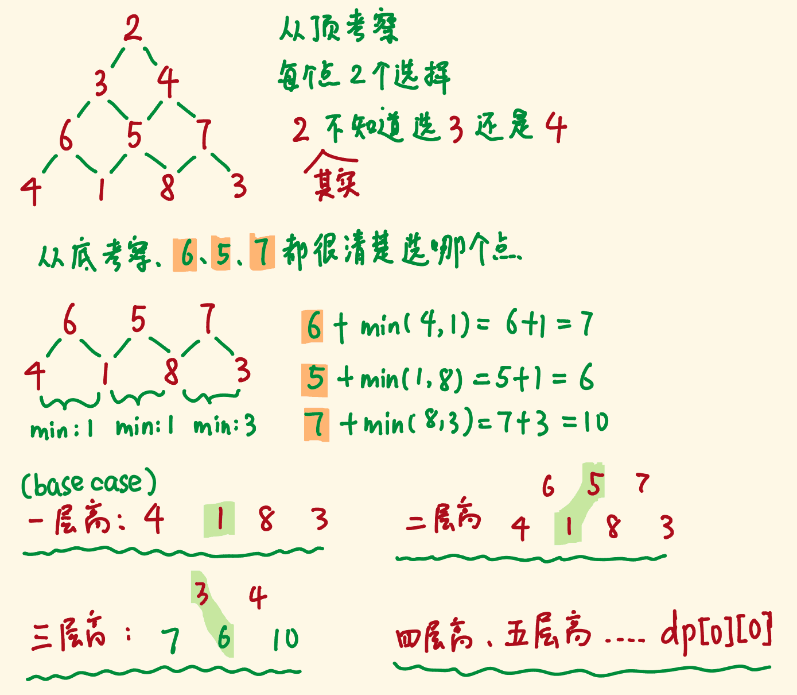

# M120. 三角形最小路径和

给定一个三角形，找出自顶向下的最小路径和。每一步只能移动到下一行中相邻的结点上。

相邻的结点 在这里指的是 下标 与 上一层结点下标 相同或者等于 上一层结点下标 + 1 的两个结点。

例如，给定三角形：
```
[
     [2],
    [3,4],
   [6,5,7],
  [4,1,8,3]
]
```
自顶向下的最小路径和为 11（即，2 + 3 + 5 + 1 = 11）。

说明：如果你可以只使用 O(n) 的额外空间（n 为三角形的总行数）来解决这个问题，那么你的算法会很加分。


## Johninch

[图片来自](https://leetcode-cn.com/problems/triangle/solution/shou-hua-tu-jie-dp-si-lu-120-san-jiao-xing-zui-xia/)


dp[i][j] 表示从点 (i,j) 到底边的最小路径和。

dp[i][j] = min(dp[i+1][j], dp[i+1][j+1]) + triangle[i][j]

从倒数第二层，自底向上递推层次，最终dp[0][0]即为所求：
```js
var minimumTotal = function(triangle) {
    var dp = triangle
    for(var i = dp.length-2; i >= 0; i--) {
        for(var j = 0; j < dp[i].length; j++) {
            dp[i][j] = Math.min(dp[i+1][j], dp[i+1][j+1]) + triangle[i][j];
        }
    }
    return dp[0][0];
};
```
- 时间复杂度：O(n^2)
- 空间复杂度：O(n^2)


*降维的解法没想通。。。。。*


