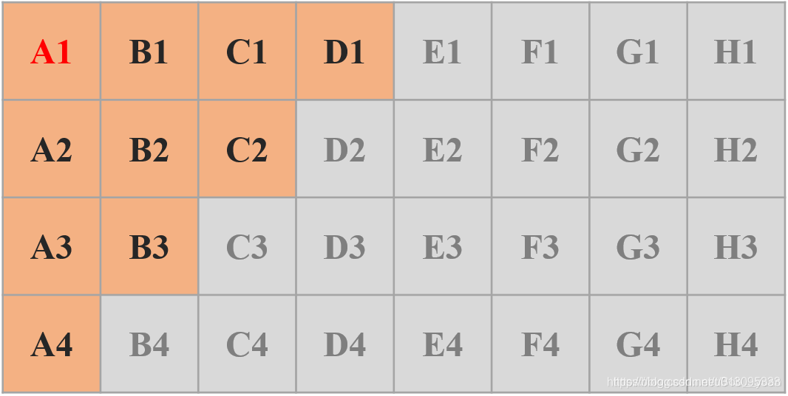

# 赛马

题目：64 匹马，8 个赛道（每次比赛马的时间不计，只对比赛的马进行快慢排名）。(1)最少几场比赛找出最快的马；(2)最少几场比赛找出最快的 4 匹马。

## 解题思路

题意分析：

1. 每次比赛马的时间不计，只对比赛的马进行快慢排名，在一次比赛中 A 马 比 B 马快，那就认为它就是比 B 马快。
2. 只需要找出最快的 4 匹马，不需要知道顺序。

据此，可以有如下淘汰原理：

1. 一匹马 A 在一次比赛中获得名次 n，那他在 64 匹马中最好可能的排名就是 n；
2. 任意一次比赛，只要排名在第五及以后的马，可以直接淘汰；
3. `如果一匹马 A 在一次比赛中获得第四名，那么已知比 A 慢的马可就都可以淘汰了`。

## 步骤推演

- **第一步：淘汰一半，64 进 32，共 8 场比赛（因为只要在某场比赛中排名没进前 4，就可以淘汰了）**；
- **第二步：每组第一名进行比赛，共 1 场比赛，就能得出第一名，和前 10 名，所以是 32 进 10**；

第一步之后淘汰了一半，我们对上边八场比赛的 8 个第一名进行一次比赛，根据上边的淘汰原理 3，后四组都可以直接淘汰了，而且，可以淘汰不止后 16 匹。我们将前四组按照第一名在这一轮比赛中的排名进行排序，得到下图（其中 A1 > B1 > C1 > D1，’>’ 就是快的意思。`那么第一名就是A1，也就是9场比赛就能得到第一名了`。

可以发现，既然同样根据淘汰原理 3，既然 D1 已经比 A1、B1、C1 都慢了，它最好排名就是 64 匹中的第四了，那么 D2、D3、D4 都可以直接淘汰了。同理淘汰 B4、C3、C4。`剩下 10 匹`。

- **第三步：有可能结束 （共 1 场比赛）**。

从上边的图中可以发现，同一列中，靠上的更快，第一行中，靠左的更快，也就是说第一名我们已经知道了，就是 A1，第二只可能是 A2 或者 B1（但已知比 B1 慢的马 B2、B3、C1、C2、D1，比已知比 A2 慢的马 A3、A4 ）。

**剩下的 9 匹马，8 个赛道一次比不出来，那就不让 B1 参加比赛**，剩下的 8 匹马进行一次比赛，`如果 B2、B3、C1、C2、D1 中的任意一匹马，出现在在这一轮比赛中的前三名，那就把第三名踢掉，B1 和前两名一起，加上 A1 就组成了最快的四匹马`，到这里就结束了

也就是总共进行 10 场比赛（这也是为什么选 B1 不参加比赛的原因，因为它已知比它右边、下边、右下边的马都快）。

- **第四步：一定结束（共 1 场比赛）**。
  - 如果上边一步没有结束，那就说明，上边一轮的前三名是 A2、A3、A4，那就让 A4 和 B1 两匹马比一下就行了
    - A4 赢了的话，A 组前四就是总体前四，顺序也确定；
    - B1 赢了的话，A1、A2、A3、B1 是总体前四，但是 B1 位置不确定（想确定的话，刚刚四匹马一起比赛就行了）。

## 结论

总结：9 场比赛可以得第一名，要得出前四名可能 10 场也可能 11 场，如果还要确定前四顺序，那可能是 11 场或者 12 场。

## 参考文献

- [64 匹马，8 个赛道，最少多少次比赛找出最快的 4 匹马，以及对所有马进行排序](https://blog.csdn.net/weichi7549/article/details/107371789/)
