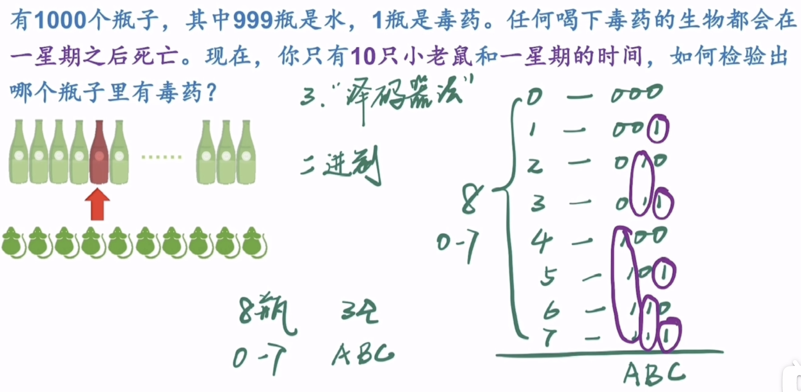

# 毒药和老鼠

题目：1000 瓶毒药里面只有 1 瓶是有毒的，毒发时间为 1 个星期，问需要多少只老鼠才能在 1 个星期后试出那瓶有毒。

## 解题思路

1. 分组法

   - 简单说就是通过将 1000 个瓶子分成比如 100 组，每组 10 个瓶子，让老鼠分别去喝这 100 组，有可能第一只老鼠就中毒死了，也有可能最后一只老鼠才死，所以第一轮最好情况是一次找到，最坏是 100 次找到，平均需要 50 次找到，波动太大。且第一轮只找到哪 10 个瓶子中有毒药，所以还需要再用老鼠来测。。。所以这种方式是不合理的。

2. 二分法
   - 二分法的思路就是将 1000 瓶每次均分为一半，用一只老鼠去喝其中一半的混合水，就能验出哪部分有毒药。依次法，在进行 9 次二分（也就是用了 9 只老鼠）后，还剩最终 2 瓶药水，用最后一只老鼠去喝其中一瓶，一定会得到最终是哪瓶有毒。即 10 只老鼠可以得到结论，因为 2 的 10 次方为 1024，可以刚好 cover 住 1000 瓶。
   - 但这种方法是不符合题意的。。毒发时间是 1 个星期后，而给定时间也刚好是 1 个星期后就要出结果。。二分法却需要每次二分后都等 1 个星期，也就是 10 个星期后才能出结果。
3. 二进制法（译码器法）
   - 正解，下面是详细解读

## 二进制法实现

> 1000 个瓶子太多了，我们简化下题目，来讲解思路。

3 位二进制可以表示 8 个数，那么我们就假定有 8 个瓶子（编号 0~7），使用 3 只老鼠（ABC）去测。



我们让每只老鼠都只喝对应位数上为 1 的瓶子水，即 ABC 三只老鼠分别喝：

```
A: 4 5 6 7
B: 2 3 6 7
C: 1 3 5 7
```

那么 1 个星期后，`某个老鼠死掉了，就说明对应的那一位中数字为 1 的瓶子是毒药，而没死的老鼠对应的位数，数字为 0 的瓶子是毒药`。

这样做交叉判断后就能得出唯一的毒药是哪瓶。

比如 AC 死掉了，B 活着，则说明瓶子编号为 101，即编号为 5 的瓶子是毒药。而且是同时进行验证的，一星期后就能得出结论。

那么回到我们的题目，依次法，3 位二进制编号 8 个数，那么 1000 个瓶子，需要 1024 个数，也就是 2 的 10 次方，10 位二进制来编号（0~999 号），则可以验出。

## 扩展题：两个星期和最少老鼠

扩展题：如果你有两个星期的时间（换句话说你可以做两轮实验），为了从 1000 个瓶子中找出毒药，你最少需要几只老鼠？注意，在第一轮实验中死掉的老鼠，就无法继续参与第二次实验了。

> 三进制：逢三进一，退一还三，用 0、1、2 三个数字表示，从个位往左分别是个位、3 位、9 位，27 位...以此类推。
> 比如 11 的三进制表示是 102

答：7 只老鼠就足够了。事实上，7 只老鼠足以从 3^7 = 2187 个瓶子中找出毒药来（而 3^6 = 729 不够 cover1000 瓶）。

首先，把所有瓶子从 0 到 999 编号，然后全部转换为 7 位三进制数。现在，让第一只老鼠喝掉所有三进制数右起第一位是 2 的瓶子，让第二只老鼠喝掉所有三进制数右起第二位是 2 的瓶子，等等。一星期之后，如果第一只老鼠死了，就知道毒药瓶子的三进制编号中，右起第一位是 2；如果第二只老鼠没死，就知道毒药瓶子的三进制编号中，右起第二位不是 2，只可能是 0 或者 1……也就是说，每只死掉的老鼠都用自己的生命确定出了，**三进制编号中自己负责的那一位是 2；但每只活着的老鼠都只能确定，它所负责的那一位不是 2**。于是，问题就归约到了只剩一个星期时的情况。在第二轮实验里，让每只活着的老鼠继续自己未完成的任务，喝掉它负责的那一位是 1 的所有瓶子。再过一星期，毒药瓶子的三进制编号便能全部揭晓了。

总结：`n 只`小白鼠和 `t 周`的时间可以从`(t+1)^n` 个瓶子中检验出毒药（一瓶）来。
