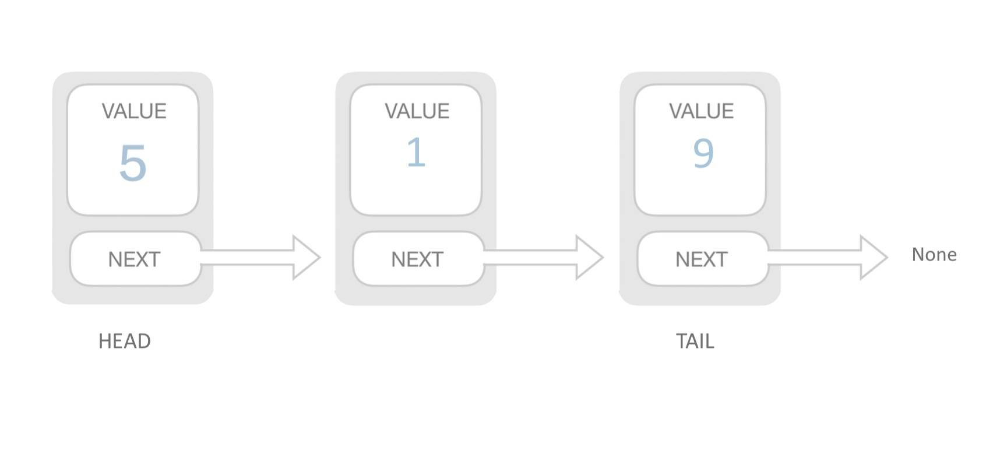

---
{
  "title": "链表概述",
}
---

# 数据结构-链表概述

用一组任意存储的单元来存储线性表的数据元素。一个对象存储着本身的值和下一个元素的地址。

- 需要遍历才能查询到元素，查询慢。
- 插入元素只需断开连接重新赋值，插入快。

链表在开发中也是经常用到的数据结构，React16的 Fiber Node连接起来形成的Fiber Tree, 就是个单链表结构。

## 1、基本应用
> 主要是对链表基本概念和特性的应用，如果基础概念掌握牢靠，此类问题即可迎刃而解

 - [✔️从尾到头打印链表](/Algorithm/Linked-List/print-from-tail-to-head)
 - [✔️删除链表中重复的节点](/Algorithm/Linked-List/delete-repeat-node)
 - [✔️反转链表](/Algorithm/Linked-List/reverse-linked-list)
 - [✔️复杂链表的复制](/Algorithm/Linked-List/copy-complicated-linked-list)

## 2、环类题目
> 环类题目即从判断一个单链表是否存在循环而扩展衍生的问题

 - [✔️链表中环的入口结点](/Algorithm/Linked-List/entry-node-of-loop)
 - [环形链表](/Algorithm/Linked-List/deep-clone)
 - [约瑟夫环](/Algorithm/Linked-List/deep-clone)

## 3、双指针
> 双指针的思想在链表和数组中的题目都经常会用到，主要是利用两个或多个不同位置的指针，通过速度和方向的变换解决问题。

- 两个指针从不同位置出发：一个从始端开始，另一个从末端开始；
- 两个指针以不同速度移动：一个指针快一些，另一个指针慢一些。

> 对于单链表，因为我们只能在一个方向上遍历链表，所以第一种情景可能无法工作。然而，第二种情景，也被称为慢指针和快指针技巧，是非常有用的。

 - [✔️两个链表的第一个公共节点](/Algorithm/Linked-List/find-first-common-node)
 - [✔️链表倒数第k个节点](/Algorithm/Linked-List/find-Kth-to-tail)
 - [相交链表](/Algorithm/Linked-List/deep-clone)

## 4、双向链表
> 双链还有一个引用字段，称为prev字段。有了这个额外的字段，您就能够知道当前结点的前一个结点。

 - [扁平化多级双向链表](/Algorithm/Linked-List/deep-clone)

## 5、未归类

 - [合并两个排序的链表](/Algorithm/Linked-List/deep-clone)
