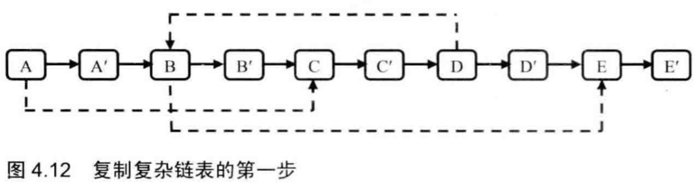
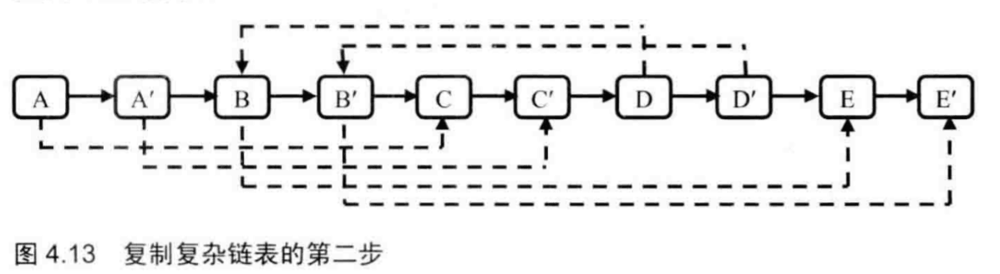
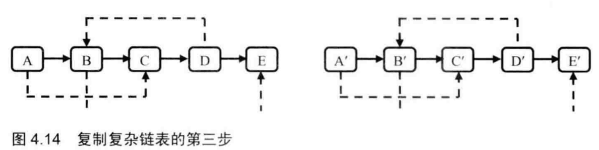

---
{
  "title": "[基本]复杂链表的复制",
}
---

# 复杂链表的复制

## 1、题目描述
输入一个复杂链表（每个节点中有节点值，以及两个指针，一个指向下一个节点，另一个特殊指针指向任意一个节点），返回结果为复制后复杂链表的head。（注意，输出结果中请不要返回参数中的节点引用，否则判题程序会直接返回空）。

## 2、思路
本题有以下三种解法：
- 第一种：先按照next复制，然后依次添加random指针，添加时需要定位random的位置，定位一次需要一次遍历，需要O（n^2）的复杂度。

- 第二种：先按照next复制，然后用一个hashmap保存原节点和复制后节点的对应关系，则用O（n）的空间复杂度使时间复杂度降到了O（n）。

- 第三种（最优方法）：同样先按next复制，但是把复制后的节点放到原节点后面，则可以很容易的添加random，最后按照奇偶位置拆成两个链表，时间复杂度O（n），不需要额外空间。





## 3、代码实现

#### majun:

```javascript
/**
 * // Definition for a Node.
 * function Node(val,next,random) {
 *    this.val = val;
 *    this.next = next;
 *    this.random = random;
 * };
 */
/**
 * @param {Node} head
 * @return {Node}
 */

var copyRandomList = function(head) {
    const map = {};
    function recur(node){
        if(!node) return null
        if(map[node.val]) return map[node.val]
        let res = new Node(node.val);
        map[node.val] = res;
        res.next = recur(node.next);
        res.random = recur(node.random)
        return res
    }
    return recur(head)
};
```