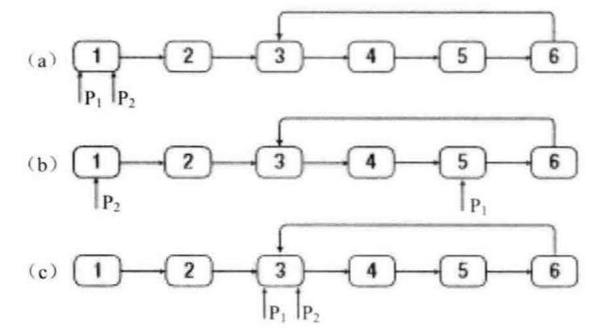

# 链表中环的入口结点

[leetcode - 142. 环形链表 II](https://leetcode-cn.com/problems/linked-list-cycle-ii/)

#### 1、题目描述
给定一个链表，返回链表开始入环的第一个节点。如果链表无环，则返回 null。

为了表示给定链表中的环，我们使用整数 pos 来表示链表尾连接到链表中的位置（索引从 0 开始）。 如果 pos 是 -1，则在该链表中没有环。

说明：不允许修改给定的链表。

示例 1：
```
输入：head = [3,2,0,-4], pos = 1
输出：tail connects to node index 1
解释：链表中有一个环，其尾部连接到第二个节点。
```

#### 2、思路
- 第一步：**确定一个链表是否有环**。这一步就是`快慢指针法`，定义两个指针，同时从链表的头结点出发，快指针一次走两步，慢指针一次走一步。如若有环，两个指针必定相遇，也就是如果快指针反追上了慢指针，说明存在环（这里要注意，两指针相遇的地方一定在环中，但不一定是环的入口），如果快指针走到了链表的末尾（指向了NULL），则说明不存在环。

- 第二步：**找到环的入口点**。这还是可以`利用双指针`来解决，两个指针初始都指向头结点，如果我们可以知道环中的结点个数，假设为n，那么第一个指针先向前走n步，然后两个指针（另一个从头结点开始）同时向前，当两个指针再次相遇时，他们的相遇点正好就是环的入口点。



## Johninch

### 快慢指针法
- 时间复杂度O(n)
- 空间复杂度O(1)
```js
// 环形链表的入口节点
// 方法：分两步
// 阶段一 快慢指针判断是否成环，相遇必定成环，快指针走到链尾指向null则无环；
// 阶段二 如果成环，记录第一次相遇的节点firstMeet，使用两个慢指针(即步频为1的)一个从head，一个从firstMeet出发，相遇时从head出发的指针则为入环点
function detectCycle(head) {
  // 阶段1：快慢指针，速度fast步频2，slow步频1，试图找出第一次相遇的点，判断是否成环
  let fast = head, slow = head, firstMeet = null
  while(slow && fast && fast.next) {
      slow = slow.next
      fast = fast.next.next
      if(slow === fast) {
          // 相遇时，慢指针走的路程就是 相遇点firstMeet
          firstMeet = slow
          break
      }
  }

  if(!firstMeet) {
      // 没有相遇，不成环
      return null
  }

  // 阶段2：用 阶段1中找到的 相遇点firstMeet 来找到环的入口
  // 设定head到入环点为n，假设环路大于n，环内路被分为b与n。
  // 慢指针从入环处开始跑b步，距离入环处就剩下了n。
  // 此时，快指针则是从距离入环处n步远的位置开始跑了2b步，距离入环处也是剩下了n。
  // 慢指针在圈内b的位置，快指针在圈内n+2b（减去圈长n+b也是b的位置），位置相同
  // 所以他们相遇了，距离入环处都是n，这个点就是firstMeet
  // 所以最后，使用两个slow指针，一个从head出发，一个从firstMeet出发，都走n步，相遇，返回从head出发的slow即可
  // 另外，对于环路小于n的情况，则可将多个小环展开视为一个大环，情况是一样的
  while(firstMeet && head) {
      if(firstMeet === head) {
          return head
      }
      firstMeet = firstMeet.next
      head = head.next
  }
  return null
}
```

#### 会不会跨过去
::: warning 会不会跨过去？

注意到：我们在快慢指针的方法中，设定快慢指针的速度分别为2和1，如果成环，那么二者为什么一定会相遇而不是刚好快指针跨过慢指针呢？

这样思考：二者相差速度为1，如果`把慢跑者视作参考系，则意味着慢跑者站着不动，快跑者的速度为1`，而最小间隔是1，因此一定会相遇。

如果速度是其他值呢，比如是2和4呢？

二者相差是2，最小距离为1，所以真的是有可能跨过去的！
:::


### 使用Set缓存
- 时间复杂度O(n)
- 空间复杂度O(n)

判断链表是否成环，设置一个缓存，将每个链表节点都存起来，如果重复出现，就是有环的，否则就没有环：
```js
function detectCycle(head) {
    const cache = new Set()
    while(head) {
        if (cache.has(head)) {
            return true
        } else {
            cache.add(head)
        }
        head = head.next
    }

    return false
}
```


