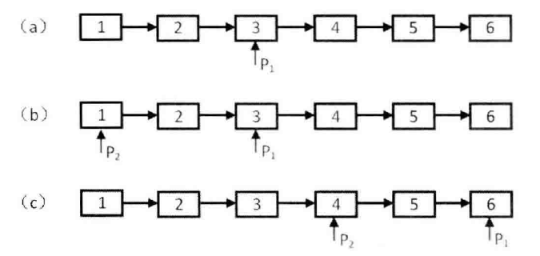

---
{
  "title": "[双指针]链表中倒数第k个结点",
}
---

# 链表中倒数第k个结点

## 1、题目描述
输入一个链表，输出该链表中倒数第k个结点。为了符合习惯，从1开始计数，即链表的尾结点是倒数第1个节点。例如，一个链表有6个结点，从头结点开始，它们的值依次是1,2,3,4,5,6。则这个链表倒数第三个结点是值为4的结点。

## 2、思路
对于单链表来说，没有从后向前的指针，因此一个直观的解法是先进行一次遍历，统计出链表中结点的个数n，第二次再进行一次遍历，找到第`n-k+1`个结点就是我们要找的结点，但是这需要对链表进行两次遍历。

为了实现一次遍历，我们这里采用**双指针解法（快慢指针）**。我们可以定义两个指针，第一个指针从链表的头指针开始先向前走k步，第二个指针保持不动，从第k+1步开始，第二个指针也从头开始前进，两个指针都每次前进一步。这样，两个指针的距离都一直保持在k，当快指针（走在前面的）到达null时，慢指针（走在后面的）正好到达第k个结点。注意：要时刻留意空指针的判断。



## Johninch
```js
// 快慢指针
function findKthFromTail(head, k) {
  if (!head || k <= 0) {
    return null;
  }

  let fast = head,
      slow = head;

  // fast 从链表的头指针开始先向前走k步
  for (let i = 0; i < k; ++i) {
    fast = fast.next;
    if (!fast) {
      return null;
    }
  }

  // 两个指针间隔一直保持在k
  while (fast) {
    slow = slow.next;
    fast = fast.next;
  }

  return slow;
}
```

## Caleb
``` js
function findKthNode(head, k) {
  var fastPointer = head;
  var slowPointer = head;
  var curStep = 0;
  var current = head;
  while(current) {
    if (curStep >= k) {
      slowPointer = current;
    }
    curStep++;
    current = current.next;
  }

  return slowPointer
}
```

