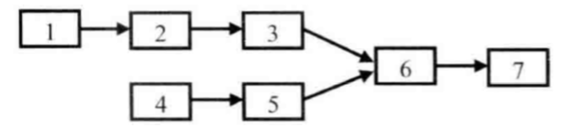

---
{
  "title": "[双指针]两个链表的第一个公共结点",
}
---

# 两个链表的第一个公共结点

## 1、题目描述
输入两个链表，找出它们的第一个公共结点。

## 2、思路
  本题首先可以很直观的想到蛮力法，即对链表1(假设长度为m)的每一个结点，遍历链表2(假设长度为n)，找有没有与其相同的结点，这显然复杂度为O(mn)。

  进一步考虑，我们可以得到以下三种改进的解法：

  方法一：借助辅助栈。我们可以把两个链表的结点依次压入到两个辅助栈中，这样两个链表的尾结点就位于两个栈的栈顶，接下来比较两个栈顶的结点是否相同。如果相同，则把栈顶弹出继续比较下一个，直到找到最后一个相同的结点。此方法也很直观，时间复杂度为O(m+n)，但使用了O(m+n)的空间，相当于用空间换区了时间效率的提升。

  方法二：将两个链表设置成一样长。具体做法是先求出两个链表各自的长度，然后将长的链表的头砍掉，也就是长的链表先走几步，使得剩余的长度与短链表一样长，这样同时向前遍历便可以得到公共结点。时间复杂度为O(m+n)，不需要额外空间。

  方法三：将两个链表拼接起来。 将两个链表进行拼接，一个链表1在前链表2在后，另一个链表2在前链表1在后，则合成的两个链表一样长，然后同时遍历两个链表，就可以找到公共结点，时间复杂度同样为O(m+n)。



## 3、代码实现

## Caleb
``` js
function getFirstCommonNode(head1, head2) {
  if (head1 === null || head2 === null) {
    return null
  }
  var current = head1;
  var stack1 = putNodeIntoStack[head1];
  var stack2 = putNodeIntoStack[head2];
  for(var i=0, len = stack1.length; i<len; i++) {
    var node = current.next;
    if (stack1[i] === stack2[i]) {
      current.next = node;
      current = current.next;
    } else {
      if (i === 0){
        current = null
      }
      break;
    }
  }

}

function putNodeIntoStack(head) {
  var stack = [];
  while(head) {
    stack.unshift(head.val);
    head = head.next
  }

  return stack;
}
```

