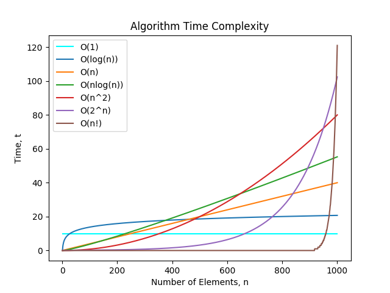
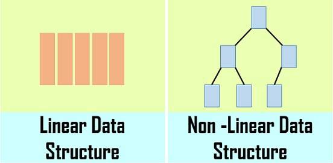

---
{
  "title": "前端算法学习",
}
---

# 前端算法学习

## 时间复杂度和空间复杂度

首先要搞懂时间复杂度和空间复杂度的概念，它们的高低共同决定着一段代码质量的好坏：

#### 1. 时间复杂度

一个算法的时间复杂度反映了程序运行从开始到结束所需要的时间。把算法中基本操作重复执行的次数（频度）作为算法的时间复杂度。

> 没有循环语句，记作O(1)，也称为常数阶。只有一重循环，则算法的基本操作的执行频度与问题规模n呈线性增大关系，记作O(n)，也叫线性阶。

常见的时间复杂度有：
- O(1): Constant Complexity: Constant 常数复杂度
- O(log n): Logarithmic Complexity: 对数复杂度
- O(n): Linear Complexity: 线性时间复杂度
- O(n^2): N square Complexity 平⽅方
- O(n^3): N square Complexity ⽴立⽅方
- O(2^n): Exponential Growth 指数
- O(n!): Factorial 阶乘

#### 2. 空间复杂度

一个程序的空间复杂度是指运行完一个程序所需内存的大小。利用程序的空间复杂度，可以对程序的运行所需要的内存多少有个预先估计。

一个程序执行时除了需要存储空间和存储本身所使用的指令、常数、变量和输入数据外，还需要一些对数据进行操作的工作单元和存储一些为现实计算所需信息的辅助空间。

## 数据结构

> 数据结构即数据元素相互之间存在的一种和多种特定的关系集合。

一般你可以从两个维度来理解它，逻辑结构和存储结构。

#### 1. 逻辑结构

简单的来说逻辑结构就是数据之间的关系，逻辑结构大概统一的可以分成两种：线性结构、非线性结构。

- 线性结构：是一个有序数据元素的集合。 其中数据元素之间的关系是一对一的关系，即除了第一个和最后一个数据元素之外，其它数据元素都是首尾相接的。常用的线性结构有: 栈，队列，链表，线性表。
- 非线性结构：各个数据元素不再保持在一个线性序列中，每个数据元素可能与零个或者多个其他数据元素发生联系。常见的非线性结构有 二维数组，树等。

#### 2. 存储结构

存储结构是逻辑结构用计算机语言的实现。常见的存储结构有顺序存储、链式存储、索引存储以及散列存储。

例如：
- 数组在内存中的位置是连续的，它就属于顺序存储；
- 链表是主动建立数据间的关联关系的，在内存中却不一定是连续的，它属于链式存储；
- 还有顺序和逻辑上都不存在顺序关系，但是你可以通过一定的方式去放问它的哈希表，数据散列存储。

## 目录

#### 链表
  - [:100:排序链表](./Linked-List/sortList.md)
  - [:100:从尾到头打印链表](./Linked-List/print-from-tail-to-head)
  - [:100:反转链表](./Linked-List/reverse-linked-list)
  - [:100:合并两个有序链表](./Linked-List/merge-two-sorted-link)
  - [:100:链表中环的入口结点](./Linked-List/entry-node-of-loop)
  - [:100:两个链表的第一个公共节点](./Linked-List/find-first-common-node)
  - [:100:链表倒数第k个节点](./Linked-List/find-Kth-to-tail)
  - [✔️删除链表中重复的节点](./Linked-List/delete-repeat-node)
  - [复杂链表的复制](./Linked-List/copy-complicated-linked-list)
  - [约瑟夫环](./Linked-List/deep-clone)
  - [相交链表](./Linked-List/deep-clone)

#### 树和二叉树
  - [:100:二叉树的中序遍历](./Tree-and-Binary-Tree/inorder-traversal)
  - [:100:二叉树的前序遍历](./Tree-and-Binary-Tree/preorder-traversal)
  - [:100:二叉树的后序遍历](./Tree-and-Binary-Tree/postorder-traversal)
  - [:100:二叉树的层序遍历](./Tree-and-Binary-Tree/levelOrder-traversal)
  - [:100:重建二叉树](./Tree-and-Binary-Tree/reconstruct-binary-tree)
  - [:100:求二叉树的后序遍历](./Tree-and-Binary-Tree/get-HRD)
  - [:100:对称的二叉树](./Tree-and-Binary-Tree/is-symmetrical)
  - [:100:二叉树的镜像](./Tree-and-Binary-Tree/mirror)
  - [:100:生成二叉搜索树](./Tree-and-Binary-Tree/generate-BST)
  - [:100:验证二叉搜索树](./Tree-and-Binary-Tree/isValidBST)
  - [:100:二叉搜索树的第k个节点](./Tree-and-Binary-Tree/kth-node)
  - [:100:二叉搜索树的后序遍历](./Tree-and-Binary-Tree/verify-squence-of-BST)
  - [:100:二叉树的最大深度](./Tree-and-Binary-Tree/max-depth)
  - [:100:二叉树的最小深度](./Tree-and-Binary-Tree/min-depth)
  - [:100:平衡二叉树](./Tree-and-Binary-Tree/is-balanced)

#### 排序
  - [:100:缺失的第一个正数](./Sort/firstMissingPositive.md)
  - [:100:快速排序](./Sort/fast-sort.md)

#### 正则
  - [:100:重复的子字符串（正则匹配模式）](./Reg/repeatedSubstringPattern.md)
  - [正则表达式匹配](./Reg/isMatch.md)

#### 字符串
  - [:100:反转字符串中的单词iii](./String/revertByWord.md)
  - [:100:计数二进制子串](./String/countBinarySubstrings.md) 

#### 数组
  - [:100:电话号码的字母组合（组合运算）](./Array/letterCombinations.md)
  - [:100:种花问题（筛选运算-贪心）](./Array/canPlaceFlowers.md)
  - [卡牌分组（归类运算-最大公约数）](./Array/hasGroupsSizeX.md)
  - [格雷编码（二进制运算）](./Array/grayCode.md)

#### 栈
  - [:100:棒球比赛](./Stack/calPoints.md)
  - [最大矩阵](./Stack/maximalRectangle.md)
  - [柱状图中最大的矩形](./Stack/largestRectangleArea.md)

#### 队列
  - [:100:设计循环队列](./Queue/MyCircularQueue.md)
  - [任务调度器](./Queue/leastInterval.md)

#### 递归
  - [:100:汉诺塔问题](./Recursion/hanota.md)
  - [:100:复原IP地址](./Recursion/restoreIpAddresses.md)

#### 贪心算法
  - [:100:买卖股票的最佳时机](./Greedy/maxProfit.md)
  - [:100:买卖股票的最佳时机 II](./Greedy/maxProfit2.md)
  - [:100:柠檬水找零](./Greedy/lemonadeChange.md)

#### 动态规划与
  - [:100:不同路径](./DP/uniquePaths.md)
  - [:100:不同路径 II](./DP/uniquePaths2.md)
  - [K 站中转内最便宜的航班](./DP/findCheapestPrice.md)

#### 矩阵
  - [xxx](/Algorithm/Heap/deep-clone)

#### 查找
  - [xxx](/Algorithm/Search/deep-clone)

#### 位运算
  - [xxx](/Algorithm/Bitwise/deep-clone)

#### 回溯法
  - [xxx](/Algorithm/Backtracking/deep-clone)

#### 数学
  - [xxx](/Algorithm/Math/deep-clone)

#### 哈希表
  - [xxx](/Algorithm/Hashtable/deep-clone)

#### 堆
  - [xxx](/Algorithm/Heap/deep-clone)

