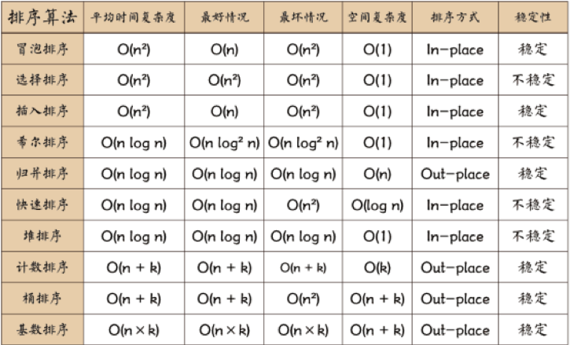

---
{
  "title": "排序",
}
---

# 基础算法-排序

> 选择一个目标值，比目标值小的放左边，比目标值大的放右边，目标值的位置已排好，将左右两侧再进行快排。
- [快速排序](./fast-sort.md)

> 循环数组，比较当前元素和下一个元素，如果当前元素比下一个元素大，向上冒泡。下一次循环继续上面的操作，不循环已经排序好的数。
- 冒泡排序

> 每次排序取一个最大或最小的数字放到前面的有序序列中。
- [选择排序](./selection-sort.md)

> 希尔排序，也称递减增量排序算法，是插入排序的一种更高效的改进版本。但希尔排序是非稳定排序算法。
- [希尔排序](./shell-sort.md)

> 将大序列二分成小序列，将小序列排序后再将排序后的小序列归并成大序列。
- 归并排序

> 将左侧序列看成一个有序序列，每次将一个数字插入该有序序列。插入时，从有序序列最右侧开始比较，若比较的数较大，后移一位。
- 插入排序

> leetcode:
- [缺失的第一个正数](./firstMissingPositive.md)

