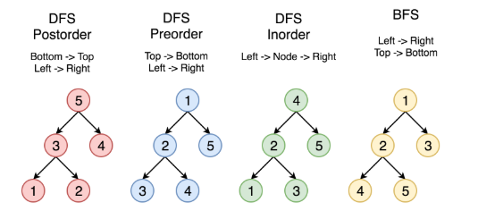

---
{
  "title": "树和二叉树概述",
}
---

# 数据结构-树和二叉树

树是用来模拟具有树状结构性质的数据集合。而二叉树是树最简单、应用最广泛的种类。二叉树是每个节点最多有两个子树的树结构，通常将当前节点称作“根节点”，子树被称作“左子树”和“右子树”。

# 完全二叉树的一些公式

完全二叉树：除了最后一层，所有层的节点数达到最大，与此同时，最后一层的所有节点都在最左侧。（堆使用完全二叉树）

1. 第n层的节点数最多为2<sup>n</sup>个节点；
2. n层二叉树最多有2<sup>0</sup>+...+2<sup>n</sup>=2<sup>n+1</sup>-1个节点；
3. 第一个非叶子节点：length/2；
4. 一个节点的孩子节点：2n、2n+1。

满二叉树：所有层的节点数达到最大。

## 二叉树的构造
二叉树有两种表示形式：链表形式 与 数组形式。
### 链表形式表示
一般情况下，二叉树都通过链表形式存储：
```js
// 二叉树节点
class Node {
    constructor(val) {
        this.val = val;
        this.left = this.right = null;
    }
}
```

### 数组形式表示
对于完全二叉树可以使用「**层序遍历数组**」表示，因为对完全二叉树而言，可以很容易通过数组下标确认相互关系，比如堆排序中使用的最大堆最小堆，就是直接利用数组模拟完全二叉树，进而构造最大（最小）堆，实现排序。

对于一般二叉树也可以使用数组表示，为表述清晰，会增加必要的null值，比如下图：
```
    5
   / \
  1   4
     / \
    3   6

   1
    \
     2
    /
   3
```
用数组表示为：[5,1,4,null,null,3,6] 、 [1,null,2,3]

注：*在leetcode上做题时，一般都是给出数组表示，leetcode的测试用例会自动将其转成链表形式，但如果我们本地需要验证测试用例时，还需要自己手动转换。*

### 基本结构与功能
```js
// 二叉树节点
class Node {
    constructor(val) {
        this.val = val;
        this.left = this.right = null;
    }
    // show() {
    //     console.log(this.data);
    // }
}

class Tree {
    constructor(data = null) {
        this.root = data;
    }

    // 基础方法：插入、遍历、深度
    insert(data) {
        var node = new Node(data, null, null);
        if (!this.root) {
            this.root = node;
            return;
        }
        var current = this.root;
        var parent = null;
        while (current) {
            parent = current;
            if (data < parent.data) {
                current = current.left;
                if (!current) {
                    parent.left = node;
                    return;
                }
            } else {
                current = current.right;
                if (!current) {
                    parent.right = node;
                    return;
                }
            }

        }
    },
    preOrder(node) {
        if (node) {
            node.show();
            this.preOrder(node.left);
            this.preOrder(node.right);
        }
    },
    middleOrder(node) {
        if (node) {
            this.middleOrder(node.left);
            node.show();
            this.middleOrder(node.right);
        }
    },
    laterOrder(node) {
        if (node) {
            this.laterOrder(node.left);
            this.laterOrder(node.right);
            node.show();
        }
    },
    getMin() {
        var current = this.root;
        while (current) {
            if (!current.left) {
                return current;
            }
            current = current.left;
        }
    },
    getMax() {
        var current = this.root;
        while (current) {
            if (!current.right) {
                return current;
            }
            current = current.right;
        }
    },
    getDeep(node, deep) {
        deep = deep || 0;
        if (node == null) {
            return deep;
        }
        deep++;
        var dleft = this.getDeep(node.left, deep);
        var dright = this.getDeep(node.right, deep);
        return Math.max(dleft, dright);
    }

    // 将 层序遍历数组 转换成 链表形式
    static toLinklistMode(data) {
        let toNode = item => {
            if (!item) {
                return null;
            } else {
                return new Node(item);
            }
        };

        let queue = [];
        const root = toNode(data.shift());
        queue.push(root); // 入队列第一个元素

        while (data.length > 0) {
            //当数组里还有项的时候就拿数组的项去填充队列
            let current = queue.shift();

            current.left = toNode(data.shift());
            if (current.left) {
                queue.push(current.left);
            }

            current.right = toNode(data.shift());
            if (current.right) {
                queue.push(current.right);
            }
        }

        return root;
    }

    // 将 链表形式 转换成 层序遍历数组
    static toArrayMode(root) {
        let queue = [];
        let list = [];

        queue.push(root);

        while (queue.length > 0) {
            let current = queue.shift();

            if (current.left) {
                queue.push(current.left);
                list.push(current.left.val);
            } else {
                list.push(null);
            }

            if (current.right) {
                queue.push(current.right);
                list.push(current.right.val);
            } else {
                list.push(null);
            }
        }

        // 我们在深度优先遍历的时候将节点保存下来，如果是null也保存，完全二叉树的性质要求我们不能有null混在值中
        // 拿到这个list之后
        // 第一步是将最后连续的null删掉
        let point = list.length - 1; // 从表最后开始看
        while (list[point] === null) {
            list.pop();
            point--;
        }

        // 之后再检查list中是否还有null，如果没有就是完全二叉树，有就不是
        //  return list.every((item)=>{return item!==null})
        return [root.val].concat(list); // 换成输出这行代码就能输出二叉树的数组表示形式，与前面的constructor方法正好相反
    }
}
```

### 树查找
::: details 树查找
```js
getNode(data, node) {
    if (node) {
        if (data === node.data) {
            return node;
        } else if (data < node.data) {
            return this.getNode(data,node.left);
        } else {
            return this.getNode(data,node.right);
        }
    } else {
        return null;
    }
}
```
:::

### 二分查找

二分查找的条件是必须是有序的线性表。

和线性表的中点值进行比较，如果小就继续在小的序列中查找，如此递归直到找到相同的值。
::: details 二分查找
```js
function binarySearch(target, arr, start, end) {
    if (start > end) {
        return -1;
    }
    var mid = Math.floor((end + start) / 2);
    if (target == arr[mid]) {
        return mid;
    } else if (target < arr[mid]) {
        return binarySearch(target, arr, start, mid - 1);
    } else {
        return binarySearch(target, arr, mid + 1, end);
    }
}
var arr = [0, 1, 1, 1, 1, 1, 4, 6, 7, 8]
console.log(binarySearch(1, arr, 0, arr.length-1));
```
:::

## 经典题目

### 1、二叉树遍历
如何遍历一棵树
有两种通用的遍历树的策略：

1. 深度优先搜索（DFS）
    - 在这个策略中，我们采用深度作为优先级，以便从根开始一直到达某个确定的叶子，然后再返回根到达另一个分支。
    - 深度优先搜索策略又可以根据根节点、左孩子和右孩子的相对顺序被细分为`先序遍历`，`中序遍历`和`后序遍历`。
2. 宽度优先搜索（BFS）
    - `层序遍历`，按照高度顺序一层一层的访问整棵树，高层次的节点将会比低层次的节点先被访问到。

下图中的顶点按照访问的顺序编号，按照 `1-2-3-4-5` 的顺序来比较不同的策略。


> 重点中的重点，最好同时掌握递归和非递归版本，递归版本很容易书写，但是真正考察基本功的是非递归版本。

 - [:100:二叉树的中序遍历](/Roundtable/Algorithm/Tree-and-Binary-Tree/inorder-traversal)
 - [:100:二叉树的前序遍历](/Roundtable/Algorithm/Tree-and-Binary-Tree/preorder-traversal)
 - [:100:二叉树的后序遍历](/Roundtable/Algorithm/Tree-and-Binary-Tree/postorder-traversal)
 - [:100:二叉树的层序遍历](/Roundtable/Algorithm/Tree-and-Binary-Tree/levelOrder-traversal)
 - [:100:重建二叉树](/Roundtable/Algorithm/Tree-and-Binary-Tree/reconstruct-binary-tree)
 - [:100:求二叉树的后序遍历](/Roundtable/Algorithm/Tree-and-Binary-Tree/get-HRD)

### 2、二叉树的对称性

 - [:100:对称的二叉树](/Roundtable/Algorithm/Tree-and-Binary-Tree/is-symmetrical)
 - [:100:二叉树的镜像](/Roundtable/Algorithm/Tree-and-Binary-Tree/mirror)

### 3、二叉搜索树
> 二叉搜索树是特殊的二叉树，考察二叉搜索树的题目一般都是考察二叉搜索树的特性，所以掌握好它的特性很重要。

1. 节点的左子树只包含小于当前节点的数。
2. 节点的右子树只包含大于当前节点的数。
3. 所有左子树和右子树自身必须也是二叉搜索树。

 - [:100:生成二叉搜索树](/Roundtable/Algorithm/Tree-and-Binary-Tree/gennerate-BST)
 - [:100:验证二叉搜索树](/Roundtable/Algorithm/Tree-and-Binary-Tree/isValidBST)
 - [:100:二叉搜索树的第k个节点](/Roundtable/Algorithm/Tree-and-Binary-Tree/kth-node)
 - [:100:二叉搜索树的后序遍历](/Roundtable/Algorithm/Tree-and-Binary-Tree/verify-squence-of-BST)

### 4、二叉树的深度
> 二叉树的深度为根节点到最远叶子节点的最长路径上的节点数。

> 平衡二叉树：左右子树深度之差大于1。

 - [:100:二叉树的最大深度](/Roundtable/Algorithm/Tree-and-Binary-Tree/max-depth)
 - [:100:二叉树的最小深度](/Roundtable/Algorithm/Tree-and-Binary-Tree/min-depth)
 - [:100:平衡二叉树](/Roundtable/Algorithm/Tree-and-Binary-Tree/is-balanced)

