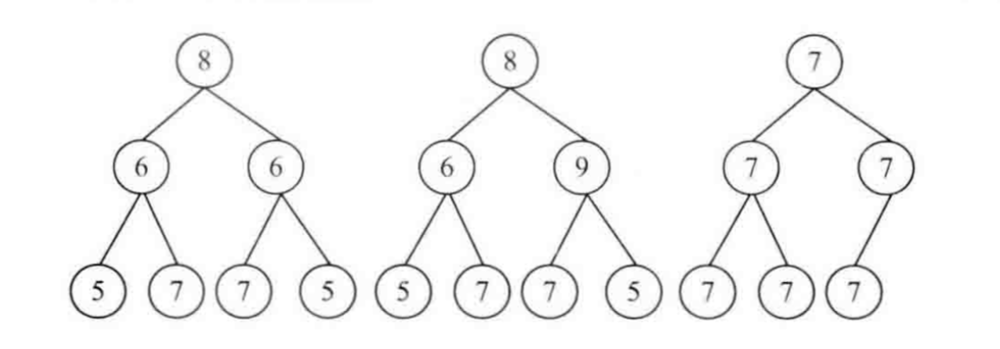

# 对称的二叉树

[leetcode - 101. 对称二叉树](https://leetcode-cn.com/problems/symmetric-tree/)
[leetcode - 100. 相同的树](https://leetcode-cn.com/problems/same-tree/)

## 题目
请实现一个函数，用来判断一颗二叉树是不是对称的。注意，如果一个二叉树同此二叉树的镜像是同样的，定义其为对称的。

## 思路
二叉树的右子树是二叉树左子树的镜像二叉树。

镜像二叉树：两颗二叉树根结点相同，但他们的左右两个子节点交换了位置。


如图，1为对称二叉树，2、3都不是。

两个根结点相等
左子树的右节点和右子树的左节点相同。
右子树的左节点和左子树的右节点相同。
递归所有节点满足以上条件即对称二叉树。

## 代码

### Johninch
```js
const isSymmetric = (root) => {
    if (!root) {
        return true;
    }
    let walk = (left, right) => {
        if (!left && !right) {
            return true;
        }

        if (!left || !right) {
            return false;
        }

        if (left.val !== right.val) {
            return false;
        }

        return walk(left.left, right.right) && walk(left.right, right.left); // 注意，这里是镜像比较的递归，与isSameTree不同
    }

    return walk(root.left, root.right)
}
```
顺便提下，上面的walk，其实就是「判断两颗树是否是相同的树」的变体：
```js
const isSameTree = (left, right) => {
    if (!left && !right) {
        return true;
    }

    if (!left || !right) {
        return false;
    }

    if (left.val !== right.val) {
        return false;
    }

    return isSameTree(left.left, right.left) && isSameTree(left.right, right.right); // 注意这里的递归就是对应位置的比较
}
```

### niannings
```ts
function isSymmetric(tree: IBinaryTree) {
    if (tree.isEmpty()) return true; // 空树
    const L = [tree.root.left];
    const R = [tree.root.right];
    while (L.length) {
        const l = L.shift();
        const r = R.shift();
        if (l === null && r === null) break; // 只有根节点
        if (l === null || r === null || l.value !== r.value) return false; // 一方不平或值不等
        L.push(l.left, r.left);
        R.push(r.right, l.right);
    }
    return true;
}
```

### mtd
```js
function isSymmetrical(root) {
  let isSymmetricalTree = function(left, right) {
    if (!left && !right) {
      return true;
    }

    if (!left || !right) {
      return false;
    }

    if (left.val !== right.val) {
      return false;
    }

    return (
      isSymmetricalTree(left.left, right.right) &&
      isSymmetricalTree(left.right, right.left)
    );
  };

  return isSymmetricalTree(root.left, root.right);
}
```