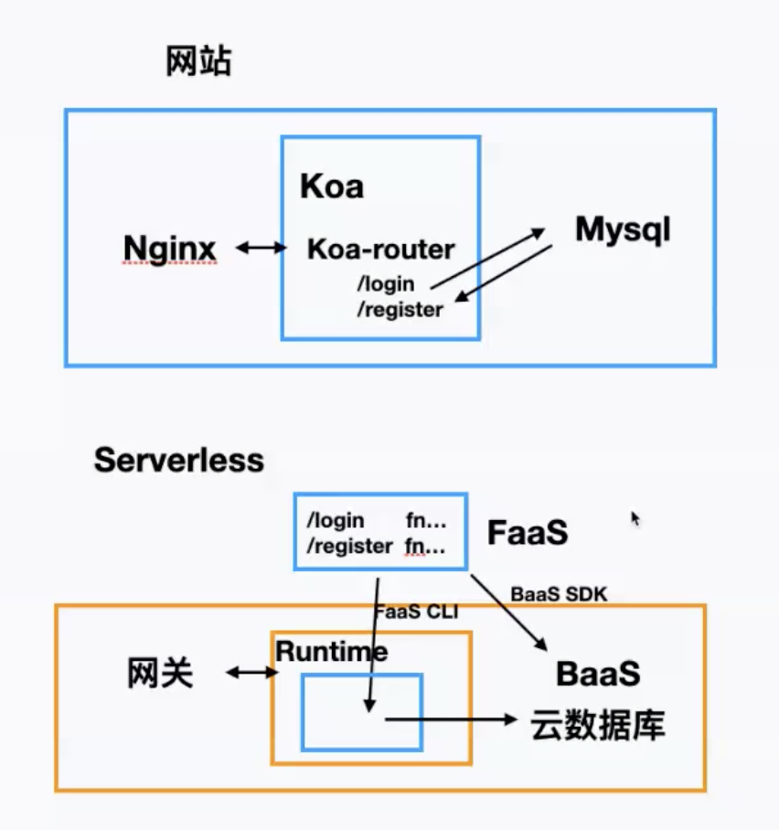

# 12、serverless

## 什么是serverless

一种新的部署方式，serverless = FaaS + BaaS。本质上就是将传统的部署方式切换到云部署上。

### 架构演进
```
Application           Service                   云
单体应用         =》     微服务      =》     Serverless应用
```

**从 Application 到 Service 有进步也有一些问题**：
- 优点：将一个大的单体应用拆成多个微服务之后，系统会更加健壮，而且各自部署和维护更容易些。
- 问题：但是微服务也有自己很大的问题：
    - 比如一个500行的nodejs程序，可能需要被拆成多个部分部署到不同的微服务中去，比较麻烦；
    - 另外，多个微服务之间需要相互配合与依赖，因为是不同的部门，需要其提供一些能力时只能等，很被动；
    - 还有，对于一个单体应用拆微服务比较困难，到底怎么拆成微服务，拆分粒度如何控制，是很玄学的，不好掌握。
- 因此有了继续演进 Serverless。


**一个类比**：
- 无医院医疗：医生只需要思考怎么治病
- 无服务器应用（Serverless）：程序员只需要思考怎么编码


### Serverless 优势

云厂商
- 自动伸缩：当流量小时只需要使用一小部分资源，当流量激增时会自动匹配更多资源，不会出现cover不住的情况
- 按需付费：按调用次数来付费，无需一开始就花费全部成本
- 云架构：不擅长的东西直接外包，直接使用别人提供的服务，效率高


### Serverless 异同

#### 与传统架构的差异：
- IaaS：专门提供场地/物业服务
- PasS：专门提供连锁扩张服务  =》 类似于Severless
    - “如果你的PaaS能够有效地在20毫秒内启动实例并运行半秒，那么就可以称之为Serverless”
- SasS：基础设施 + 软件外包服务


#### 与应用架构的关系：
- 微服务 与 Serverless：比较类似
    - 微服务是模块化的概念，是粗粒度的，需要运维
    - Serverless是函数/代码片段，是细粒度的，若运维的
- 多云（MultiCloud）与 Serverless：差异明显
    - 多云是云原生中的一种架构
    - Serverless是一种开发部署方式


### Serverless 架构

- 架构图
    - 事件流转
    - 层次图
- features
    - event driven
    - 无状态
- 使用形式
    - BaaS
        - LeanCloud
        - Firebase
    - FaaS
        - AWS lambda
        - Aliyun FC
    - FaaS + BaaS
        - 微信小程序


- 编程 = 算法 + 数据结构
- 应用 = 逻辑 + 存储 （Serverless = FaaS + BaaS）
    - FaaS (Function as A Service)
        - Stateless
        - 代码 + 依赖配置
    - BaaS (Backend as A Service)
        - Statefull
        - 提供服务API




