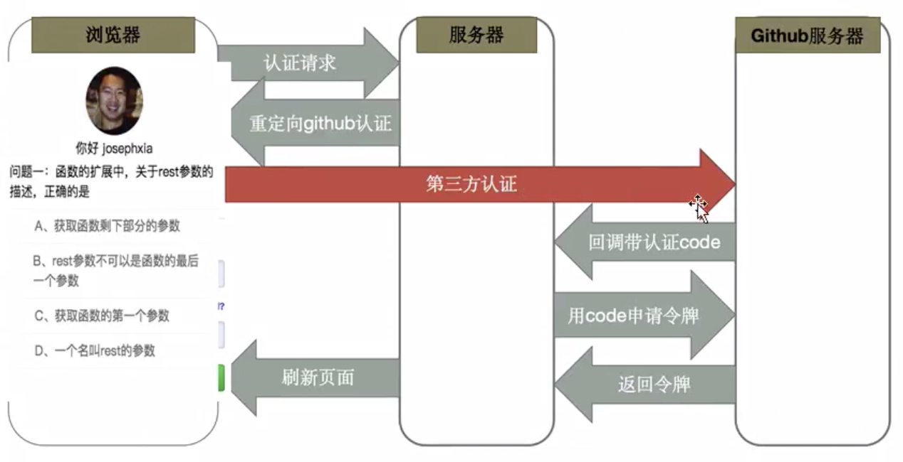

# 6扩展、鉴权（SSO与OAuth）

扩展鉴权知识：单点登录SSO 与 第三方授权登录OAuth

## 单点登录SSO


## 第三方授权登录OAuth

概述：三方登入主要基于OAuth2.0。OAuth协议为用户资源的授权提供了一个安全的、开放而又简易的标准。与以往的授权方式不同之处是OAUTH的授权不会使第三方触及到用户的帐号信息 (如用户名与密码)，即第三方无需使用用户的用户名与密码，就可以申请获得该用户资源的授权，因此OAUTH是安全的。



```js
const Koa = require('koa')
const router = require('koa-router')()
const static = require('koa-static')
const app = new Koa();
const axios = require('axios')
const querystring = require('querystring')

app.use(static(__dirname + '/'));
const config = {
    client_id: '1db455bb0787f56deba9',
    client_secret: 'dd809c8e0df5147248640adc05dea89bba4c4cf1'
}

// 登录服务器
router.get('/github/login', async (ctx) => {
    // 重定向到第三方认证接口，并配置参数
    var path = "https://github.com/login/oauth/authorize";
    path += '?client_id=' + config.client_id;

    // 跳转到第三方授权服务器
    ctx.redirect(path);
})

// 第三方认证服务器，向登录服务器发回调请求，并带回认证code
router.get('/auth/github/callback', async (ctx) => {
    console.log('callback...')
    const code = ctx.query.code;
    const params = {
        client_id: config.client_id,
        client_secret: config.client_secret,
        code: code
    }

    // 登录服务器用code，去第三方认证服务器换取令牌
    let res = await axios.post('https://github.com/login/oauth/access_token', params)
    // 拿到令牌access_token，就代表github确认你是合法的github用户
    const access_token = querystring.parse(res.data).access_token

    // 到此，就算授权成功了，可以进一步取得对应登录用户的信息，比如头像
    res = await axios.get('https://api.github.com/user?access_token=' + access_token)

    ctx.body = `
        <h1>Hello ${res.data.login}</h1>
        
    `

})

app.use(router.routes()); /*启动路由*/
app.use(router.allowedMethods());
app.listen(7001);
```


