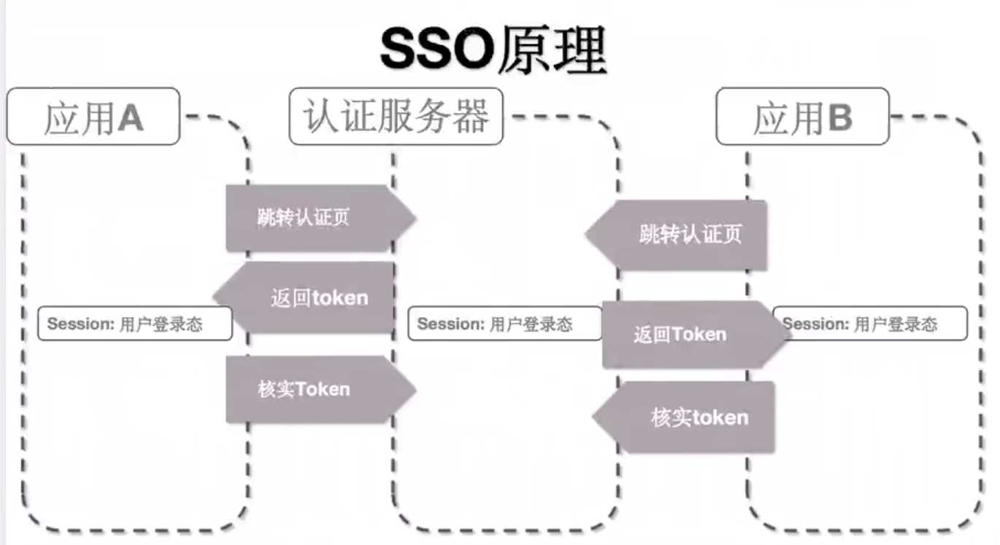

# 6扩展、鉴权（SSO与OAuth）

扩展鉴权知识：单点登录SSO 与 第三方授权登录OAuth

## 单点登录SSO



比如淘宝（`应用A`），和支付宝（`应用B`），是两个不同的应用，但是他们是同一个用户体系，所以阿里会有一个公有的`认证服务器`，**这三者处在不同域**：
- 1、当登录`应用A`时：
    - 不会在应用内进行认证处理，而是会跳转到`认证服务器`，在`认证服务器`里输入用户名密码完成登录认证操作；
    - 成功后，在`认证服务器`内部会存在一个Session用户登录状态（**这个状态在不同域内是不能共享的**），并且`认证服务器`会带着token跳转回`应用A`；
    - 之后`应用A`会再次向`认证服务器`请求，核实token，核实成功后会在`应用A`服务器内存在一个**自己的**Session登录状态，从而完成认证过程。
- 2、当同一个用户再去登录`应用B`时：
    - 同样会跳转到`认证服务器`去，但不同点在于，`认证服务器`之前已经有此用户的Session登录状态，则无需用户输入账号密码来认证了；
    - 接着，`认证服务器`会带着token跳转回`应用B`；
    - `应用B`拿到token后会再次发请求到`认证服务器`，核实token，核实成功后也会在`应用B`的服务器内存在一个**自己的**Session登录状态，完成认证过程。


## 第三方授权登录OAuth

第三方登录主要基于OAuth2.0：
- OAuth协议为用户资源的授权提供了一个安全的、开放而又简易的标准。
- 与以往的授权方式不同之处是，`OAuth的授权不会使第三方触及到用户的帐号信息 (如用户名与密码)`，即第三方无需使用用户的用户名与密码，就可以申请获得该用户资源的授权，因此OAuth是安全的。


**流程（以github为例）**：
- 1、用户点击第三方登录按钮，去登录服务器，重定向到第三方认证接口服务器（github），并配置参数；
- 2、第三方认证服务器，本身设置了回调接口地址，据此，向登录服务器发回调请求，并带回认证code；
- 3、登录服务器拿到code，去第三方认证服务器换取令牌；
- 4、拿到令牌access_token，就代表github确认你是合法的github用户，即认证成功；
- 5、可以进一步通过令牌取得用户信息。


```js
const Koa = require('koa')
const router = require('koa-router')()
const static = require('koa-static')
const app = new Koa();
const axios = require('axios')
const querystring = require('querystring')

app.use(static(__dirname + '/'));
const config = {
    client_id: '1db455bb0787f56deba9',
    client_secret: 'dd809c8e0df5147248640adc05dea89bba4c4cf1'
}

// 登录服务器
router.get('/github/login', async (ctx) => {
    // 重定向到第三方认证接口，并配置参数
    var path = "https://github.com/login/oauth/authorize";
    path += '?client_id=' + config.client_id;

    // 跳转到第三方授权服务器
    ctx.redirect(path);
})

// 第三方认证服务器，向登录服务器发回调请求，并带回认证code
router.get('/auth/github/callback', async (ctx) => {
    console.log('callback...')
    const code = ctx.query.code;
    const params = {
        client_id: config.client_id,
        client_secret: config.client_secret,
        code: code
    }

    // 登录服务器拿到code，去第三方认证服务器换取令牌
    let res = await axios.post('https://github.com/login/oauth/access_token', params)
    // 拿到令牌access_token，就代表github确认你是合法的github用户
    const access_token = querystring.parse(res.data).access_token

    // 到此，就算授权成功了，可以进一步取得对应登录用户的信息，比如头像
    res = await axios.get('https://api.github.com/user?access_token=' + access_token)

    ctx.body = `
        <h1>Hello ${res.data.login}</h1>
        
    `

})

app.use(router.routes()); /*启动路由*/
app.use(router.allowedMethods());
app.listen(7001);
```

## 扫码登录流程

**扫码登录的流程大致如下：**：

- PC端展示一个二维码，等待手机端扫描。
- 手机端打开应用并扫描PC端的二维码。扫描后，手机端会提示“已扫描，请在手机端点击确认”。
- 用户在手机端点击确认登录。
- PC端显示登录成功页面。
在这个过程中，涉及到三个主要的角色：`PC端`、`手机端`和`服务端`。

**具体的步骤包括：**

1. PC端发送生成二维码的请求到服务端，携带设备信息。
2. 服务端生成一个二维码ID，将其与设备信息绑定，并生成二维码图片返回给PC端。
3. 手机端扫描二维码后，得到二维码ID，并提交二维码ID与手机端的身份信息到服务端。
4. 服务端修正二维码状态为已扫码状态。
5. 手机端点击确认登录后，服务端生成Token并返回给PC端，PC端显示已确认状态并登录成功。

