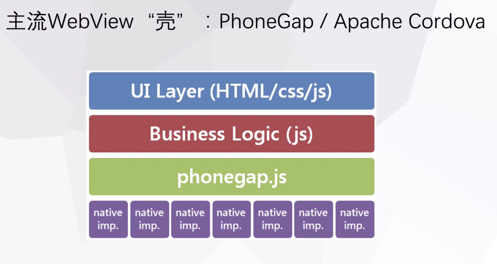
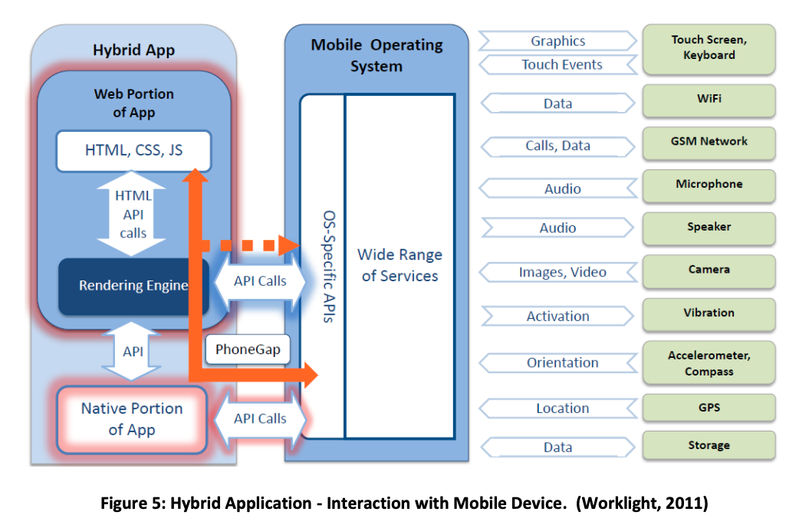
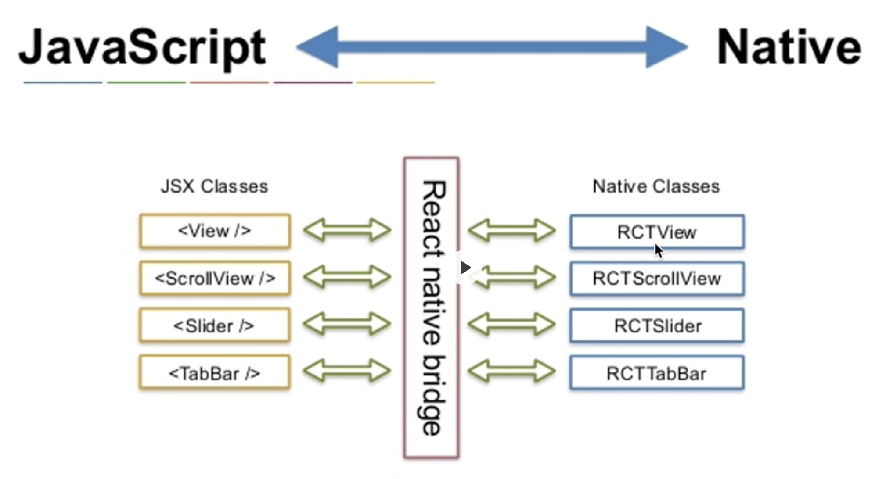
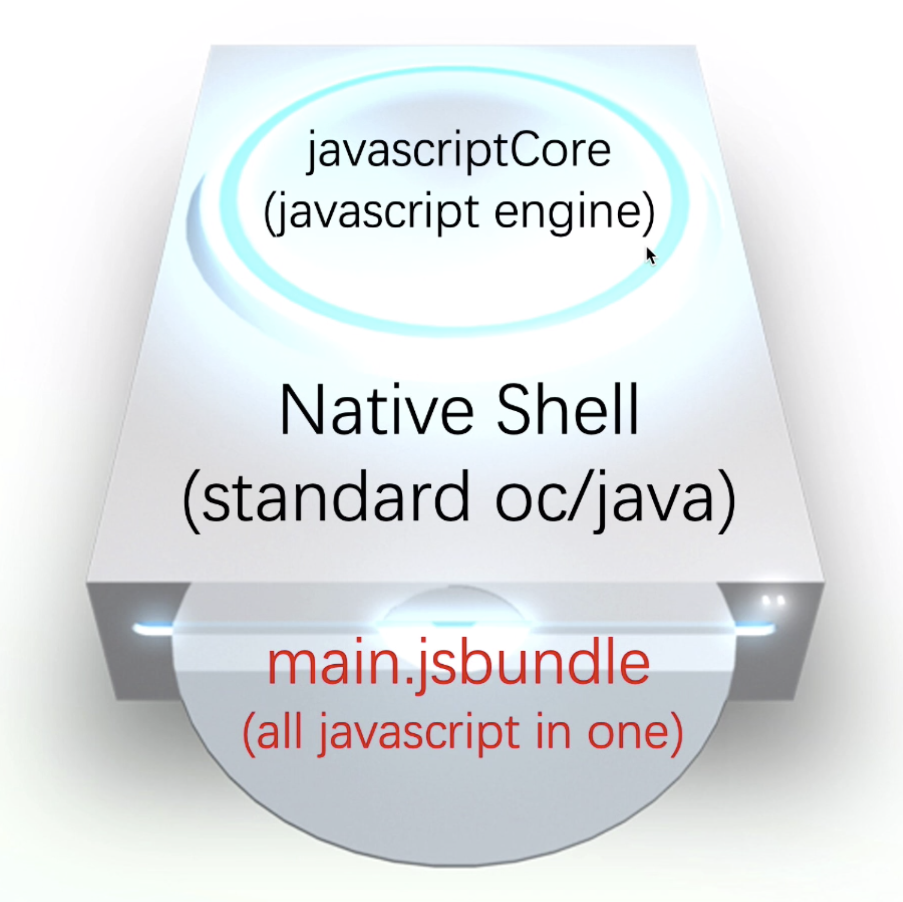

# react-native预习章节

## RN架构和原理介绍

### 原生开发 Native App

分类:   | iOS               | Android
|:----  |:-------------     |:-------|
原生语言: | Objective-C/Swift | Java/Kotlin
IDE:    | Xcode(Mac only)   | Android Studio

### 混合开发 Hybrid App

#### 混合开发架构

通过webview套壳来实现。

#### 混合开发的优势：
1. HTML、CSS、JS开发成本低。比起原生语言，相对易学，且各类资源极为丰富。
2. 天然跨平台。任何平台都离不开浏览器，也就少不了WebView组件。在W3C标准日趋统一（HTML5）的今天，网页应用真正实现了“一次编写，随处运行”。
3. 无审核热更新。JS作为动态解释运行的脚本语言，可以直接通过服务器下发后执行，从而实现绕过审核的热更新。
4. 可扩展。虽然JS本身不具备硬件能力，但可以通过原生桥接的方式扩展，且这些扩展大多免费开源。

#### 混合开发的劣势：

emmmmmm....就是性能不行.......

### 脸书的 React Native

> Learn once, write anywhere.

在将JavaScript和Native之间桥接时，绕过浏览器（no webview），只将核心的JSX用于显示的UI控件抽取出来和原生的控件一一对应起来，

当没有浏览器时，将js世界和native世界连接起来，就需要通过Native Shell（一个标准原生应用，使用标准oc或java编写），可以将其视作一台播放器光驱，将光盘内容也就是jsbundle插入光驱，通过播放器的解码芯片（JavaScriptCore）来完成内容解码，实现内容播放。

- 在开发阶段，React Packager 实时构建 jsbundle（hot reload）。而在发布上线时，就直接将 jsbundle 封装到App里，更新时，hot update via pushy/codepush，将jsbundle进行替换。
- 类比于，特斯拉在没上路时，充电阶段（开发阶段），React Packager就是一个充电桩，jsbundle就是块电池。而在上路时，就携带电池即可无需带着充电桩。当电池没电时，可以直接换块新电池即可。

