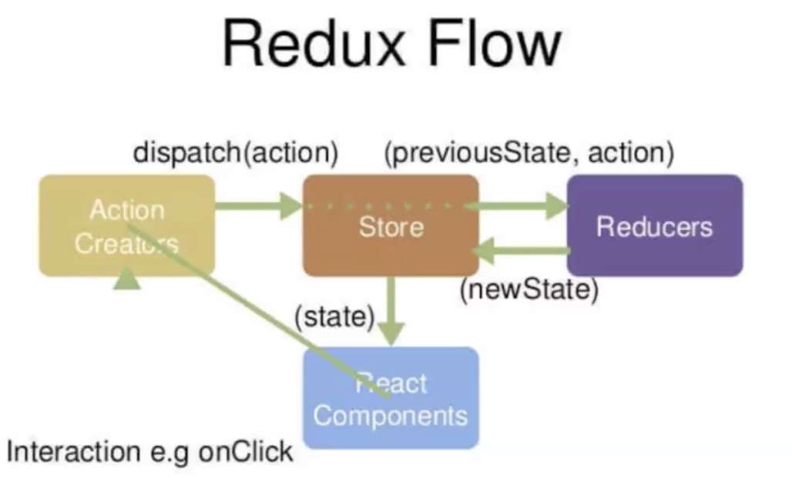

# 2、Redux

## 目标

- Reducer
    - 函数组合compose
- redux
- 常用中间件
    - thunk
    - logger
    - promise
- combineReducers

## Reducer

Reducer 就是一个`纯函数`，**接收旧的 state 和 action，返回新的 state**。
```js
;(previousState, action) => newState
```
之所以将这样的函数称之为 reducer，是因为这种函数与被传⼊ `Array.prototype.reduce(reducer, ?initialValue)` 里的回调函数，属于相同的类型。

**保持 reducer 纯净非常重要**。永远不要在 reducer 里做这些操作：
- 修改传⼊参数;
- 执行有副作用的操作，如 API 请求和路由跳转;
- 调⽤非纯函数，如 Date.now() 或 Math.random()（因为像 Date.now()，结果每次都不一样，是非纯函数）。


::: details 回忆下 reduce
```js
const array1 = [1, 2, 3, 4];
const reducer = (accumulator, currentValue) => accumulator + currentValue;

// 1 + 2 + 3 + 4
console.log(array1.reduce(reducer));
// expected output: 10

// 5 + 1 + 2 + 3 + 4
console.log(array1.reduce(reducer, 5));
// expected output: 15
```
:::


## 函数组合compose 与 柯里化currying

函数式编程有两个重要的方法，即 `函数组合compose` 与 `柯里化currying`。

- [函数式编程指南](https://llh911001.gitbooks.io/mostly-adequate-guide-chinese/content/ch5.html)
- [阮一峰函数式编程入门教程](http://www.ruanyifeng.com/blog/2017/02/fp-tutorial.html)

### compose

思考：有如下函数，聚合成一个函数，并把第一个函数的返回值传递给下⼀个函数，如何处理呢？
```js
function f1(arg) {
    console.log("f1", arg);
    return arg;
}

function f2(arg) {
    console.log("f2", arg);
    return arg;
}

function f3(arg) {
    console.log("f3", arg);
    return arg;
}

// 你当然可以这样，但这太啰嗦了，不利于维护：
f1(f2(f3("lalala")))
```

**组合函数**：如果一个值要经过多个函数，才能变成另外一个值，就可以把所有中间步骤合并成一个函数，这叫做"函数的合成"（compose）。

使用组合函数compose：
- 并不在compose中执行传入的函数，而是
- 返回一个函数，在传入参数时才执行
```js
function f1(arg) {
    console.log("f1", arg);
    return arg;
}

function f2(arg) {
    console.log("f2", arg);
    return arg;
}

function f3(arg) {
    console.log("f3", arg);
    return arg;
}

function compose(...funcs) {
    if (funcs.lenght === 0) {
        return arg => arg
    }
    // 注意这里的reduce中接收的是func，所以要用双箭头，返回一个函数来接收参数
    return funcs.reduce((a, b) => (...args) => a(b(...args)))
    // return funcs.reduce((a, b) => {
    //     console.log(a, b); // f1() f2()

    //     return (...args) => {
    //         console.log("args", ...args); // lalala
    //         return a(b(...args));
    //     };
    // });
}

let res = compose(f1, f2, f3)("lalala")  // 等价于 f1(f2(f3("lalala")))

console.log(res)
```

### 柯里化
**柯里化**（英语：Currying），又译为**卡瑞化**或**加里化**，是把接受多个[参数](https://zh.wikipedia.org/wiki/參數_(程式設計))的[函数](https://zh.wikipedia.org/wiki/函数)变换成接受一个单一参数（最初函数的第一个参数）的函数，并且返回接受余下的参数而且返回结果的新函数的技术。

所谓"`柯里化`"，就是`把一个多参数的函数，转化为单参数函数`。

```js
// 柯里化之前
function add(x, y) {
  return x + y;
}

add(1, 2) // 3

// 柯里化之后
function addX(y) {
  return function (x) {
    return x + y;
  };
}

addX(2)(1) // 3
```
这样调用上述函数：`(foo(3))(4)`，或直接`foo(3)(4)`。

看下面的例子，这里我们定义了一个 `add` 函数，它接受一个参数并返回一个新的函数。调用 `add` 之后，返回的函数就通过闭包的方式记住了 `add` 的第一个参数。一次性地调用它实在是有点繁琐，好在我们可以使用一个特殊的 `curry` 帮助函数（helper function）使这类函数的定义和调用更加容易。

```js
var add = function(x) {
  return function(y) {
    return x + y;
  };
};

var increment = add(1);
var addTen = add(10);

increment(2); // 3

addTen(2); // 12
```

## Redux原理
Redux是JavaScript应⽤的`状态容器`，它保证程序`⾏为⼀致性`且易于测试。（这里需要再强调一下：Redux 和 React 之间没有关系。Redux 支持 React、Angular、Ember、jQuery 甚至纯 JavaScript。但 Redux 与 React 搭配起来最好）。

<!--  -->


**一个形象的比喻，假设有一家公司Redux**：
- `Store`：公司财务部门，统一管钱
    - 从审批部门拿到账单action后，将之前的账目state和账单action都使用Reducers的处理规则处理
    - 从Reducers得到新的账目newState后，给到对应的业务部门React Components
- `React Components`：公司各业务部门
    - 要用钱时，需要向审批部门Action Creators提申请
- `Action Creators`：审批部门
    - 公司各业务部门提申请给审批部门后
    - 审批部门dispatch一个action账单给Store
- `Reducers`：处理钱的规则
    - 定义账目state的修改规则
    - 从Store拿到账单action和原有账目state
    - 处理得到新的账目newState，给回到Store财务部门

**总结一下**：
1. 需要⼀个store来存储数据；
2. store⾥的reducer初始化state并定义state修改规则；
3. 通过dispatch⼀个action来提交对数据的修改；
4. action提交到reducer函数⾥，根据传⼊的action的type，返回新的state；

## 实现自己的Redux

### 基础实现
- store/index.js
```js
import { createStore } from "../InchRedux";

function countReducer(state = 0, action) {
    switch (action.type) {
        case "ADD":
            return state + 1;
        case "MINUS":
            return state - action.payload || 1;
        default:
            return state;
    }
}

const store = createStore(countReducer);

export default store;
```
- ReduxPage.js
```js
import React, { Component } from "react";
import store from "../store/";

export default class ReduxPage extends Component {
    componentDidMount() {
        this.unsubscribe = store.subscribe(() => {
            this.forceUpdate();
        });
    }

    componentWillUnmount() {
        if (this.unsubscribe) {
            this.unsubscribe();
        }
    }

    add = () => {
        store.dispatch({ type: "ADD" });
    };

    render() {
        return (
            <div>
                <h3>ReduxPage</h3>
                <p>{store.getState()}</p>
                <button onClick={this.add}>add</button>
            </div>
        );
    }
}
```

- InchRedux/createStore
```js
export default function createStore(reducer) {
    let currentState
    let currentListeners = []

    // 获取状态
    function getState() {
        return currentState
    }

    // 修改状态
    function dispatch(action) {
        // 更新状态
        currentState = reducer(currentState, action)
        // 通知组件，找到订阅并触发
        currentListeners.forEache(listener => listener())
    }

    // 订阅状态
    function subscribe(listener) {
        currentListeners.push(listener)
        // 返回取消订阅函数
        return () => {
            const index = currentListeners.indexOf(listener)
            currentListeners.splice(index, 1)
        }
    }

    // 解决没有初值的问题，手动执行一次dispatch，使其走到switch default的path
    dispatch({ type: "lsfdlsflsflseifieiiii2ii23i23i" }) // 随便给个不会匹配的type即可

    return {
        getState,
        dispatch,
        subscribe
    }
};
```


### 增加异步action实现

Redux只是个纯粹的状态管理器，默认只⽀持同步action，即action必须是对象（plain object）。要实现`异步action`，比如延迟，⽹络请求，就需要中间件的支持，⽐如使⽤最简单的`redux-thunk`和`redux-logger`。另外对于promise的异步支持，需要使用`redux-promise`。

中间件就是⼀个函数，对 store.dispatch ⽅法进行改造，**在发出 Action 和执⾏ Reducer 这两步之间，添加其他功能**。


#### 如何使用中间件
```js
// import { createStore, applyMiddleware } from "redux";
import { createStore, applyMiddleware } from "../InchRedux";
// import logger from "redux-logger";
import logger from "../InchRedux/logger";
// import thunk from "redux-thunk";
import thunk from "../InchRedux/thunk";
// import promise from "redux-promise";
import promise from "../InchRedux/promise";

function countReducer(state = 0, action) {
    switch (action.type) {
        case "ADD":
            return state + 1;
        case "MINUS":
            console.log(state, action.payload)
            return state - action.payload || 1;
        default:
            return state;
    }
}

const store = createStore(countReducer, applyMiddleware(thunk, promise, logger)); // 注意将logger放到最后

export default store;
```
- ReduxPage.js
```js
    addAsync = () => {
        store.dispatch((dispatch, getState) => {
            setTimeout(() => {
                console.log(getState())
                dispatch({ type: "ADD" })
            }, 1000)
        })
    }
    promiseMinus = () => {
        store.dispatch(
            Promise.resolve({
                type: "MINUS",
                payload: 100
            })
        );
    };
```

### 中间件实现

#### 实现applyMiddleware

- 首先升级下createStore，需要接收第二个参数enhancer，即应用的中间件，对dispatch进行增强：
```js
export default function createStore(reducer, enhancer) {
    if (enhancer) {
        // 增强createStore的dispatch
        return enhancer(createStore)(reducer)
    }

    // ...
}
```
- 核⼼任务是实现函数序列执行，即 applyMiddleware.js：
```js
export default function applyMiddleware(...middlewares) {
    return createStore => reducer => {
        const store = createStore(reducer)
        // 缓存原dispatch
        let dispatch = store.dispatch

        const midApi = {
            getState: store.getState,
            dispatch: action => dispatch(action)
        }
        // 加强dispatch，使用compose将dispatch和中间件函数都执行
        const middlewareChain = middlewares.map(middleware => middleware(midApi))
        dispatch = compose(...middlewareChain)(store.dispatch)

        // 返回store，同时把dispatch加强
        return {
            ...store,
            // 返回加强版的dispatch
            dispatch
        }
    }
};

function compose(...funcs) {
    if (funcs.length === 0) {
        return arg => arg
    }

    return funcs.reduce((a, b) => (...args) => a(b(...args)))
}
```

#### 实现redux-thunk
处理异步：
```js
function thunk({dispatch, getState}) {
    return next => action => {
        if (typeof action === "function") {
            return action(dispatch, getState)
        } else if (typeof action === "object") {
            return next(action)
        }
    }
}
```

#### 实现redux-logger
打印日志：
```js
function logger({dispatch, getState}) {
    return next => action => {
        console.log("**************************************")
        // prev state
        const prevState = getState()
        console.log("prev state", prevState)

        const returnVal = next(action)
        // next state
        const nextState = getState()
        console.log("next state", nextState)

        console.log("**************************************")

        return returnVal
    }
}
```

#### 实现redux-promise
支持promise：
```js
import isPromise from 'is-promise';

export default function promise({ dispatch }) {
    return next => action => {
        return isPromise(action) ? action.then(dispatch) : next(action);
    };
};
```


### combineReducers


#### combineReducers使用
在应用中，不可能只有一个reducer，面对多个reducer，redux提供了`combineReducers`，合并多个reducer，使用方式：
```js
function countReducer(state = 0, action) {
    switch (action.type) {
        case "ADD":
            return state + 1;
        case "MINUS":
            return state - action.payload || 1;
        default:
            return state;
    }
}
function countReducer2(state = {num: 0}, {type, payload}) {
    switch (action.type) {
        case "ADD2":
            return {...state, num: state.num + payload};
        default:
            return state;
    }
}

const store = createStore(
    combineReducers({
        count: countReducer,
        count2: countReducer2
    }),
    applyMiddleware(thunk, promise, logger)
);

export default store;
```
在访问时：
```js
<p>{store.getState().count}</p>
<p>{store.getState().count2.num}</p>
```

#### 实现combineReducers

```js
export default function combineReducers(reducers) {
    return function combination(state = {}, action) {
        let nextState = {}
        let hasChanged = false
        for (let key in reducers) {
            const reducer = reducers[key]
            nextState[key] = reducer(state[key], action)
            hasChanged = hasChanged || nextState[key] !== state[key]
        }

        hasChanged = hasChanged || Object.keys(nextState).length !== Object.keys(state).length

        return hasChanged ? nextState : state
    }
};
```

