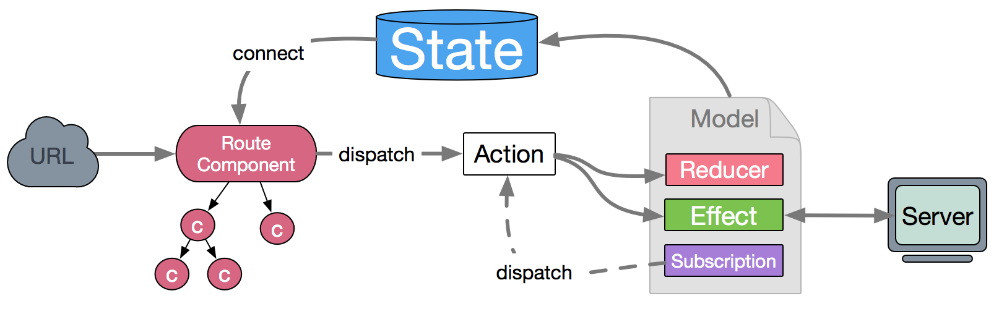

# 6、项目实战2

## 目标

- 掌握企业级应用框架：[umi](https://umijs.org/zh-CN/docs)
- 掌握数据流方案：[dva](https://dvajs.com/)


[Why dva and what's dva](https://github.com/dvajs/dva/issues/1)


## 数据流方案 dva

dva 首先是一个基于 redux 和 redux-saga 的数据流方案，然后为了简化开发体验，dva 还额外内置了 react-router 和 fetch，所以也可以理解为一个轻量级的应用框架。

### dva特性
- 易学易用，仅有 6 个 api，对 redux 用户尤其友好，配合 umi 使用后更是降低为 0 API
- elm 概念，通过 reducers, effects 和 subscriptions 组织 model
- 插件机制，比如 dva-loading 可以自动处理 loading 状态，不用一遍遍地写 showLoading 和 hideLoading
- 支持 HMR(模块热替换)，基于 babel-plugin-dva-hmr 实现 components、routes 和 models 的 HMR。


### dva数据流向

数据的改变发生通常是通过用户交互行为或者浏览器行为（如路由跳转等）触发的，当此类行为会改变数据的时候可以通过 dispatch 发起一个 action，如果是同步行为会直接通过 Reducers 改变 State ，如果是异步行为（副作用）会先触发 Effects 然后流向 Reducers 最终改变 State，所以在 dva 中，数据流向非常清晰简明，并且思路基本跟开源社区保持一致（也是来自于开源社区）。


### dva软件分层
1. Page 负责与用户直接打交道：渲染页面、接受用户的操作输入，侧重于展示型交互性逻辑。
2. Model 负责处理业务逻辑，为 Page 做数据、状态的读写、变换、暂存等。
3. Service 负责与 HTTP 接口对接，进行纯粹的数据读写。


### dva核心API
DVA 是基于 redux、redux-saga 和 react-router 的轻量级前端框架及最佳实践沉淀，**核心api**如下:
- model
    - namespace：model 的命名空间，只能用字符串。
        - 一个大型应用可能包含多个 model，通过 namespace 区分。
    - state 状态
    - subscriptions 订阅
    - effects：用于处理异步操作
        - (例如:与服务端交互)和业务逻辑，也是由 action 触发。但是，它不可以修改 state，要通过触发 action 调用 reducer 实现对 state 的间接操作。
    - reducers：用于修改 state，由 action 触发。
        - reducer 是一个纯函数，它接受当前的 state 及一个 action 对象。action 对象里面可以包含数据体(payload)作为入参，需要返回一个新的 state。
    - action：是 reducers 及 effects 的触发器，一般是一个对象，形如 { type: 'add', payload: todo }，通过 type 属性可以匹配到具体某个 reducer 或者 effect，payload 属性则是数据体，用于传送给reducer 或 effect。

```js
// models/example.js
import { getProductData } from "../services/product";

// {
//  _namespace : {//具体的model}
// }
export default {
  namespace: "example",
  state: {
    data: [],
    pageSize: 10,
    current: 1,
    total: 0
  },

  subscriptions: {
    setup({ dispatch, history }) {
      console.log("example subscriptions");
    }
  },
  effects: {
    *getProductData({ payload }, { call, put }) {
      const res = yield call(getProductData, payload);
      yield put({ type: "productData", payload: res.data });
    }
  },
  // 定义了修改规则
  reducers: {
    productData(state, action) {
      return { ...state, data: action.payload.data };
    }
  }
};
```

### 切换history为browserHistory
```js
// app.js
import dva from "dva";

const createHistory = require("history").createBrowserHistory;

const app = dva({
  history: createHistory()
});

export default app;
```
```js
// index.js

// import dva from "dva";
import app from "./app";
import "./index.css";

// 1. Initialize
// const app = dva();

// 2. Plugins
// app.use({});

// 3. Model
app.model(require("./models/example").default);

// 4. Router
app.router(require("./router").default);

// 5. Start
app.start("#root");
```


### 动态引入

```js
// dynamic/index.js
import dynamic from "dva/dynamic";
import app from "../app";

export const UserPageDynamic = dynamic({
    app,
    models: () => [import("../models/user")],
    component: () => import("../routes/UserPage")
});
```

## 企业级应用框架 umi

umi，中文可发音为乌米，是一个可插拔的企业级 react 应用框架。

什么时候不用 umi? 如果你，
- 需要支持 IE 8 或更低版本的浏览器
- 需要支持 React 16.8.0 以下的 React
- 需要跑在 Node 10 以下的环境中
- 有很强的 webpack 自定义需求和主观意愿
- 需要选择不同的路由方案

umi 可能不适合你。

**umi其实内置了dva**，基本使用：

```
├── package.json
├── .umirc.ts 配置文件，包含 umi 内置功能和插件的配置。也可以在根目录下使用config文件夹配置。
├── .env 环境变量
├── dist 执行 umi build 后，产物默认会存放在这里。
├── mock
├── public 此目录下所有文件会被 copy 到输出路径。
└── src
    ├── .umi
    ├── layouts/index.tsx 约定式路由时的全局布局文件。
    ├── pages 所有路由组件存放在这里。
        ├── index.less
        └── index.tsx
    └── app.ts
```

src/.umi：临时文件目录，比如入口文件、路由等，都会被临时生成到这里。不要提交 .umi 目录到 git 仓库，他们会在 umi dev 和 umi build 时被删除并重新生成。

路由创建：手动创建或者使用命令。建立pages下面的单页面about（umi g page about）；建立文件夹more，默认是js和css（umi g page more/index --typescript --less）

约定式路由：动态路由（umi g page product/[id]）


- .umirc.ts 配置文件
```js
import { defineConfig } from 'umi';

export default defineConfig({
  layout: {},
  nodeModulesTransform: {
    type: 'none',
  },
  routes: [
    {
      path: '/',
      component: '@/pages/layouts/index',
      routes: [
        {
          path: '/',
          component: '@/pages/index',
          redirect: '/welcome',
        },
        {
          path: '/about',
          component: '@/pages/about',
        },
        {
          path: '/more',
          component: '@/pages/more/index',
        },
        {
          path: '/product/:id',
          component: '@/pages/product/_layout',
          routes: [
            {
              path: '/product/:id',
              component: '@/pages/product/[id]',
            },
          ],
        },

        {
          component: '@/pages/_404',
        },
      ],
    },
  ],
});
```
- models/more.js
```js
import { getProductData } from '../services/product';

export default {
  namespace: 'more',

  state: {
    data: [],
    pageSize: 10,
    current: 1,
    total: 0,
  },

  effects: {
    *getProductData({ payload }, { call, put }) {
      //
      const res = yield call(getProductData, payload);
      yield put({ type: 'productData', payload: res.data });
    },
  },

  reducers: {
    productData(state, action) {
      return { ...state, data: action.payload.data };
    },
  },
};
```
