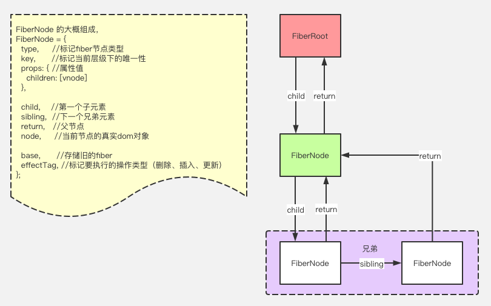

# 8、react16源码解析2

- [React中文网](https://react.docschina.org/)
- [React源码](https://github.com/facebook/react)
- [Debug React](https://github.com/bubucuo/DebugReact)
- [源码指引](https://www.processon.com/view/link/5dd68342e4b001fa2e0c4697)

## 目录

- reconciliation协调
    - 设计动力
    - diffing算法
    - diff策略
    - diff过程
        - 比对两个虚拟dom时会有三种操作:删除、替换和更新
- fiber
    - 为什么需要fiber
    - 什么是fiber
- 实现fiber
    - window.requestIdleCallback(callback[, options])
    - 实现fiber

## reconciliation协调

### 设计动力

在某一时间节点调用 React 的 render() 方法，会创建一棵由 React 元素组成的树。在下一次 state 或 props 更新时，相同的 render() 方法会返回一棵不同的树。React 需要基于这两棵树之间的差别来判断如何有效率的更新 UI 以保证当前 UI 与最新的树保持同步。

这个算法问题有一些通用的解决方案，即生成将一棵树转换成另一棵树的最小操作数。然而，即使在最前沿的算法中，该算法的复杂程度为 **O(n^3)**，其中 n 是树中元素的数量。如果在 React 中使用了该算法，那么展示 *1000* 个元素所需要执行的计算量将在*10亿*的量级范围。这个开销实在是太过高昂。于是 React 在以下**两个假设**的基础之上提出了一套 `O(n)` 的启发式算法:

1. **两个不同类型的元素会产生出不同的树**;
2. **开发者可以通过 key prop 来暗示哪些子元素在不同的渲染下能保持稳定**;

在实践中，我们发现以上假设在几乎所有实用的场景下都成立。另外，我们发现在大部分场景下，**跨层级的DOM移动操作非常少，可以忽略不计**。因此我们可以得出

### diff策略

1. **同级比较，Web UI 中 DOM 节点跨层级的移动操作特别少，可以忽略不计**。
2. **两个不同类型的元素会产生出不同的树**;
3. **开发者可以通过 key prop 来暗示哪些子元素在不同的渲染下能保持稳定**;


### diff过程

diffing算法复杂度O(n)，按照`同层比较，深度优先`的顺序，遍历比较一遍，过程如下：
- 深度优先比较
- 不在同一层级，根本不比较
- 同一层级下：
    - oldVnode不存在时，直接新增
    - newVnode不存在时，直接删除
    - key或type有一者不同，直接替换
    - key和type相同
        - oldVnode和newVnode相同，复用节点
        - oldVnode和newVnode不同，更新节点


*vue是游标比较，react是链式比较*


## fiber

### 什么是fiber

fiber 是 React16 中`新的协调引擎`。它的主要目的是**使 Virtual DOM 可以进行`增量式渲染`**。

fiber 具体是**指组件上将要完成或者已经完成的任务，每个组件可以有一个或者多个**。

一个更新过程可能被打断，所以React Fiber一个更新过程被分为两个阶段(Phase)：第一个阶段 **Reconciliation Phase** 和第二阶段 **Commit Phase**。

### fiber架构

fiber架构是一种`链表结构`，方便暂停和继续，且查找方便，不像原先的组件树结构，只能查找子节点。。。。



当前fiber链表指向child（第一个子节点），child通过return指回父节点，当前fiber不一定只有一个子节点，但他不直接指向其他子节点，而是由它指向的child，通过sibiling指针间接指向其他子节点，并且，sibiling也通过return指回父节点fiber。
```js
// 举个栗子
<div className="border">
    <p>全栈</p>
    <span>Inch</span>
</div>

// 比如外层<div>是一个fiber
// - 它的child指针指向第一个子fiber<p>
//     - <p>也有return指针指回父节点<div>
// - <p>通过sibiling指针指向下一个兄弟fiber<span>
//     - 同理，<span>也有一个return指针指回父节点<div>
```

### requestIdleCallback

window.requestIdleCallback(callback[, options])方法将在浏览器的空闲时段内调用的函数排队。这使开发者能够在主事件循环上执行后台和低优先级工作，而不会影响延迟关键事件，如动画和输入响应。函数一般会按先进先调用的顺序执行，然而，如果回调函数指定了执行超时时间timeout，则有可能为了在超时前执行函数而打乱执行顺序。
- callback：一个在事件循环空闲时即将被调用的函数的引用。函数会接收到一个名为 IdleDeadline 的参数，这个参数可以获取当前空闲时间以及回调是否在超时时间前已经执行的状态。
- options：包括可选的配置参数。具有如下属性：
    - timeout：如果指定了timeout并具有一个正值，并且尚未通过超时毫秒数调用回调，那么回调会在下一次空闲时期被强制执行，尽管这样很可能会对性能造成负面影响。

react中requestIdleCallback的hack在 react/packages/scheduler/src/forks/SchedulerHostConfig.default.js

### 实现fiber

react-dom.js
```js
import { TEXT, PLACEMENT } from './const'

// fiber
    // type：标记当前节点的类型；
    // props：属性；
    // key：标记唯一性；
    // child：第一个子节点；
    // sibling：下一个兄弟节点；
    // return：指向父节点；
    // node：真实的dom节点；
    // base：记录下当前的旧fiber

// 下一个要执行的fiber，数据结构就是fiber
let nextUnitOfWork = null;
// work in progress 正在进行中的，结构类型是fiber
let wipRoot = null;

function render(vnode, container) {
    wipRoot = {
        node: container,
        props: {
            children: [vnode]
        },
        base: null
    }

    nextUnitOfWork = wipRoot
    // // todo
    // // 1.vnode => node
    // const node = createNode(vnode)
    // // 2.container.appendChild(node)
    // container.appendChild(node)
}

// 生成真实dom节点
function createNode(vnode) {
    let node = null
    const { type, props } = vnode

    if (type === TEXT) {
        // 创建文本节点
        node = document.createTextNode("")
    } else if (typeof type === 'string') {
        // 证明是个html标签节点，比如div span
        node = document.createElement(type)
    }
    // else if (typeof type === 'function') {
    //     // 类组件 或者 函数组件
    //     node = type.isReactComponent ? updateClassComponent(vnode) : updateFunctionComponent(vnode)
    // } else {
    //     // 空的Fragment或</>的形式，没有type
    //     node = document.createDocumentFragment()
    // }

    // // 遍历调和子节点
    // reconcileChildren(props.children, node)
    // 添加属性到真实dom上
    updateNode(node, props)

    return node
}

// function reconcileChildren(children, node) {
//     for (let i = 0; i < children.length; i++) {
//         let child = children[i]
//         // child是vnode，那需要把vnode => node，然后插入父节点node中
//         render(child, node)
//     }
// }

// 协调子节点
// 1. 给workInProgress添加一个child节点，就是children的第一个子节点形成的fiber；
// 2. 形成fiber架构，把children里节点遍历下，形成fiber链表状；
function reconcileChildren(workInProgress, children) {
    let prevSibling = null;
    for (let i = 0; i < children.length; i++) {
        let child = children[i];
        // 先只写初次渲染
        let newFiber = {
            type: child.type,
            props: child.props,
            node: null,
            base: null,
            return: workInProgress,
            effectTag: PLACEMENT
        }

        if (i === 0) {
            workInProgress.child = newFiber;
        } else {
            prevSibling.sibling = newFiber;
        }

        prevSibling = newFiber;
    }
}

function updateNode(node, nextVal) {
    Object.keys(nextVal).filter(k => k !== 'children').forEach(k => {
        node[k] = nextVal[k]
    })
}

function updateClassComponent(fiber) {
    // const { type, props } = vnode
    // const cmp = new type(props) // 类组件需要new实例
    // const vvnode = cmp.render()

    // // 返回真实dom节点
    // const node = createNode(vvnode)
    // return node
    const { type, props } = fiber
    let cmp = new type(props)
    let vvnode = cmp.render()
    const children = [vvnode]
    reconcileChildren(fiber, children)
}

function updateFunctionComponent(fiber) {
    // const { type, props } = vnode
    // const vvnode = type(props) // 函数组件直接执行返回虚拟dom

    // const node = createNode(vvnode)
    // return node
    const { type, props } = fiber
    const children = [type(props)]
    reconcileChildren(fiber, children)
}

function updateHostComponent(fiber) {
    if (!fiber.node) {
        fiber.node = createNode(fiber)
    }
    const { children } = fiber.props
    reconcileChildren(fiber, children)
}

function performUnitOfWork(fiber) {
    // step1：执行更新当前fiber
    const { type } = fiber
    if (typeof type === 'function') {
        type.isReactComponent ? updateClassComponent(fiber) : updateFunctionComponent(fiber)
    } else {
        // 原生标签的
        updateHostComponent(fiber)
    }

    // step2：并且返回下一个要执行的fiber
    // 原则就是：先看下有没有子节点
    if (fiber.child) {
        return fiber.child
    }
    // 如果没有子节点，就找兄弟节点
    let nextFiber = fiber
    while (nextFiber) {
        if (nextFiber.sibling) {
            return nextFiber.sibling
        }
        nextFiber = nextFiber.return
    }
}

function workLoop(deadline) {
    while (nextUnitOfWork && deadline.timeRemaining() > 1) {
        // 执行更新当前fiber，并且返回下一个要执行的fiber
        nextUnitOfWork = performUnitOfWork(nextUnitOfWork)
    }
    if (!nextUnitOfWork && wipRoot) {
        // 没有下一个任务了，执行提交
        commitRoot()
    }
    requestIdleCallback(workLoop)
}

function commitRoot() {
    commitWorker(wipRoot.child);
    wipRoot = null;
}

function commitWorker(fiber) {
    if (!fiber) {
        return;
    }

    // parentNode是fiber的离得最近的dom父或祖先节点，因为有些节点是没有真实dom节点的，比如Provider，Consumer，Fragment等等
    let parentNodeFiber = fiber.return
    while (!parentNodeFiber.node) {
        parentNodeFiber = parentNodeFiber.return
    }

    const parentNode = parentNodeFiber.node
    // fiber有node节点
    if (fiber.effectTag === PLACEMENT && fiber.node !== null) {
        parentNode.appendChild(fiber.node);
    }

    commitWorker(fiber.child)
    commitWorker(fiber.sibling)
}

requestIdleCallback(workLoop)

export default { render };
```


