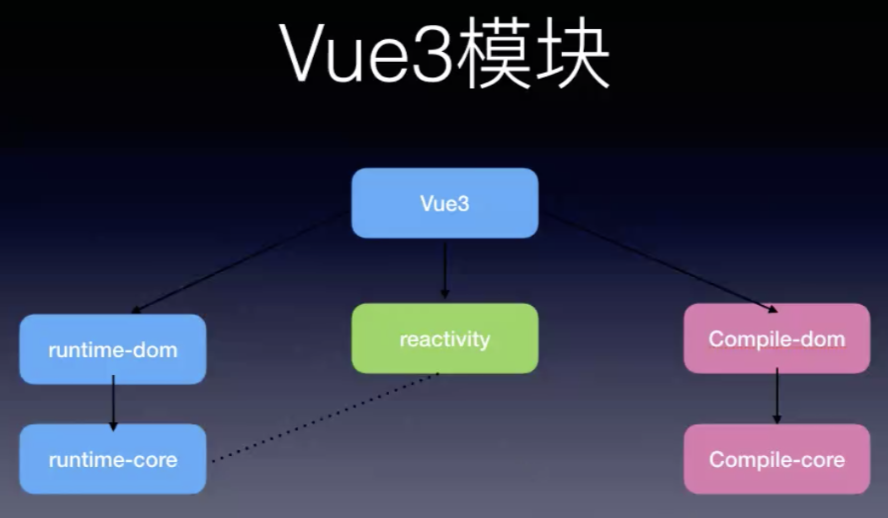
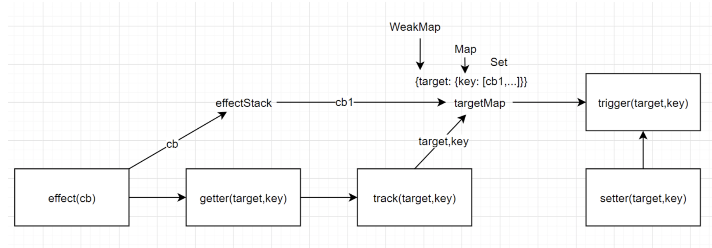

# 10、Vue3初探 + 响应式原理

## 目录

vue3初探+响应式原理剖析
- 环境搭建
- vue3初体验
- Composition API
- 响应式原理剖析
- 展望

体验vue3可以有如下4种方式：
- vue-cli 4.5+ 安装
- [vue-next](https://github.com/vuejs/vue-next)
- [vue-next-webpack](https://github.com/vuejs/vue-next-webpack-preview)
- [vite](https://github.com/vitejs/vite)


### 调试环境搭建
```bash
# 迁出Vue3源码:
git clone https://github.com/vuejs/vue-next.git
# 安装依赖:
yarn --ignore-scripts

# 生成sourcemap文件，package.json
"dev": "node scripts/dev.js --sourcemap"

# 编译:
yarn dev
# 生成结果:
# packages\vue\dist\vue.global.js
# packages\vue\dist\vue.global.js.map

# 调试范例代码:
yarn serve
```

### 源码结构




**Vue3包含三大核心模块**：
- 1、`@vue/reactivity`，独立的响应式模块，可以使用在任何地方如浏览器，node环境下，只要你想将一个数据变成响应式的。
- 2、`runtime`，运行时模块，包含生命周期，composition，vdom等等都在这里。vue运行在环境中时的代码。
- 3、`compile`，编译器，写的 template => render函数的过程，这个也是vue3的重大变化之一。


源码位置是在package文件夹内，实际上源码主要分为两部分，编译器和运行时环境：
- 编译器
    - compiler-core 核心编译逻辑
    - compiler-dom 针对浏览器平台编译逻辑
    - compiler-sfc 针对单文件组件编译逻辑
    - compiler-ssr 针对服务端渲染编译逻辑
- 运行时环境
    - runtime-core 运行时核心
    - runtime-dom 运行时针对浏览器的逻辑
    - runtime-test 浏览器外完成测试环境仿真
- reactivity 响应式逻辑
- template-explorer 模板浏览器
- vue 代码入口，整合编译器和运行时
- server-renderer 服务器端渲染
- share 公用方法


## vue3初探

vue3兼容vue2的大部分语法，可以使用兼容vue2的option语法来写代码：

注意：vue3中不会再有vue.xxx这种静态方法，vue3中使用api，都需要以函数的形式导入，这有利于**利用import的静态分析**做`tree shaking`，使输出的代码体积更小。
```html
  <div id="app">
    <h1 @click="onclick">{{msg}}</h1>
    <comp></comp>
  </div>
  <script src="../dist/vue.global.js"></script>
  <script>
    const {createApp} = Vue

    // 实例创建
    const app = createApp({
      data() {
        // data必须是函数
        return {
          msg: 'hello, vue3'
        }
      },
      methods: {
        onclick() {
          console.log('click me');
        }
      },
    })
    app.component('comp', {
      template:'<div>comp</div>',
    })
    app.mount('#app')
  </script>
```

可以看到vue打包后的输出，就是一个vue变量，所有的属性和方法都挂在了exports上：
```js
// /dist/vue.global.js
var Vue = (function (exports) {
    'use strict';

    // ...

    exports.KeepAlive = KeepAlive;
    exports.compile = compileToFunction;
    exports.computed = computed$1;
    exports.createApp = createApp;
    exports.h = h;
    // ...
    exports.nextTick = nextTick;
    exports.onActivated = onActivated;
    exports.onBeforeMount = onBeforeMount;
    exports.onBeforeUnmount = onBeforeUnmount;
    exports.onBeforeUpdate = onBeforeUpdate;
    exports.onDeactivated = onDeactivated;
    exports.onErrorCaptured = onErrorCaptured;
    exports.onMounted = onMounted;
    exports.onRenderTracked = onRenderTracked;
    exports.onRenderTriggered = onRenderTriggered;
    exports.onUnmounted = onUnmounted;
    exports.onUpdated = onUpdated;
    // ...

  return exports;
}({}));
```


## Composition API

[Composition API](https://vue-composition-api-rfc.netlify.app/zh/api.html)组合API，它是为了实现**基于函数**的**逻辑复用**而产生的。

### Options API vs Composition API


Composition API，顾名思义，其最大优点就是**可以随意组合**，并且利用了import的静态分析做`tree shaking`。

Composition API的实现，使程序成为一些良好解耦的函数，每个逻辑关注点的代码现在都被组合进了一个组合函数。这大大减少了在处理大型组件时不断“跳转”的需要。同时组合函数也可以在编辑器中折叠起来，使组件更容易浏览。

有了Composition API，vue3中再使用vuex的价值就变小了，或者说vue3中vuex的实现变得更简单了。

### 逻辑组合复用的优势
- 传统的复用方式`Mixin`：`来源不明`，且容易`命名冲突`；
- 「逻辑组合API」式的代码复用，相比于Mixin来说，**数据来源清晰**，**不会有命名冲突**，**可维护性大大提高**。
    - 并且，逻辑组合的函数，可以放在任意的地方，抽离成单独的文件，甚至放在npm上供社区使用。

### 使用
- `setup()`：是组件内使用Composition API的入口
    - 它return的对象会作为render函数上下文
    - 调用时刻是初始化属性确定后，beforeCreate之前
    - Vue3 的 Hook 只需要一个「初始化」的过程，也就是 setup，命名很准确。它的关键字就是「只执行一次」。
- **对象响应式**，使用`reactive()`，可以将array，obj，map，set做响应化。
- **单值响应式**，使用`Ref`做包装，可将基本数据类型做响应化。将来访问时，要通过value来访问。
- `onMounted`等生命周期，可以随时随地调用，顺序执行。
- `computed()`返回一个不可变的响应式引用对象，它封装了getter的返回值，它的底层也是使用watchEffect来实现的。
- `watchEffect`只做副作用，而`watch`在观察到值变化后，能拿到newVal和oldVal。
- 在导出时，**不能直接**`...state`，这样会破坏state中数据的响应式，需要使用`...toRefs(state)`，将state中的属性都转成单值响应式。

```html
<!-- 使用示例 -->
<body>
  <div id="app">
    <h1 @click="onclick">{{msg}}</h1>
    <p @click="add">{{count}}</p>
    <p>{{doubleCount}}</p>
  </div>
  <script src="../dist/vue.global.js"></script>
  <script>
    const { createApp, reactive, onMounted, computed, ref, toRefs, watch, watchEffect } = Vue

    // 实例创建
    const app = createApp({
      setup() {
        // 独立的响应式模块reactive
        // 创建响应式对象，代理对象Proxy
        const state = reactive({
          msg: 'hello,vue3'
        })

        function onclick() {
          console.log('click me');
        }

        onMounted(() => {
          console.log('mounted');
        })

        onMounted(() => {
          console.log('mounted2');
        })

        // 单值响应式，使用Ref做包装，将来访问时要通过value访问
        const count = ref(0)

        const doubleCount = computed(() => {
          return count.value * 2
        })

        function add() {
          count.value++
        }

        // watch, watchEffect
        watch(count, (newVal, oldVal) => {
          console.log(`count从${oldVal}变成了${newVal}`);
        })

        watchEffect(() => {
          console.log(`count变化了`, count.value);
        })

        // return的对象会作为render函数上下文
        return { ...toRefs(state), count, doubleCount, onclick, add }
      }
    })

    app.mount('#app')
  </script>
</body>
```

### vue3响应式原理

vue3看起来写法和react非常像，但实现原理是完全不同的。Vue3使用ES6的Proxy特性来解决Vue2中响应式的问题：
::: tip  vue2响应式弊端
- 响应化过程需要`一开始`就递归遍历到底，性能消耗较大
- 对于对象，新加或删除属性无法监听
- 对于数组响应化，需要额外实现
- Map、Set、Class等无法响应式
- 修改语法有限制
:::

::: details Vue2响应式原理回顾
- 1. `对象`响应化：**遍历每个key，定义getter、setter**
- 2. `数组`响应化：**覆盖数组原型方法，额外增加`通知逻辑`**
```js
const originalProto = Array.prototype
const arrayProto = Object.create(originalProto)
;['push', 'pop', 'shift', 'unshift', 'splice', 'reverse', 'sort'].forEach(
    method => {
        arrayProto[method] = function() {
            originalProto[method].apply(this, arguments)
            notifyUpdate()
        }
    }
)

function observe(obj) {
    if (typeof obj !== 'object' || obj == null) {
        return
    }
    // 增加数组类型判断，若是数组则覆盖其原型
    if (Array.isArray(obj)) {
        Object.setPrototypeOf(obj, arrayProto)
    } else {
        const keys = Object.keys(obj)
        for (let i = 0; i < keys.length; i++) {
            const key = keys[i]
            defineReactive(obj, key, obj[key])
        }
    }
}

function defineReactive(obj, key, val) {
    observe(val) // 解决嵌套对象问题

    Object.defineProperty(obj, key, {
        get() {
            return val
        },
        set(newVal) {
            if (newVal !== val) {
                observe(newVal) // 新值是对象的情况 val = newVal
                notifyUpdate()
            }
        }
    })
}

function notifyUpdate() {
    console.log('⻚面更新!')
}
```
:::

#### Proxy优缺点
- 优点：
    - Vue3中不是一开始就递归到底响应化，而是一种`「运行时的代理」`
    - Proxy能劫持一个完整的对象，不像defineProperty需要递归遍历
    - Proxy提供了13种劫持方法
    - Proxy返回的是一个新对象，可以只操作新的对象达到目的
- 缺点：
    - proxy缺点就是兼容性差，ie11都不好支持了（proxy又没法垫片），所以尤大说未来可能会出一个vue3降级版

#### 嵌套对象响应式

- `return isObject(res) ? reactive(res) : res`，proxy代理对象，如果存在嵌套对象的情况，则需要递归做代理。
    - 并且，递归代理只发生在嵌套对象属性**被读到时**，才会执行，所以是一种`「运行时的代理」`，不会像vue2中一开始就递归遍历，为所有属性添加响应式，避免了初始化就执行大量代理这种低效的做法，使运行速度加倍，内存消耗减半（尤大原话）。
- reflect的使用，可以使对于对象的操作更规范友好，比之前直接赋值会更友好。
```js
const isObject = val => val !== null && typeof val === 'object'

function reactive(obj) {
  if (!isObject(obj)) {
    return obj
  }
  // Proxy相当于在对象外层加拦截 http://es6.ruanyifeng.com/#docs/proxy
  // 代理对象，就是响应式对象
  const observed = new Proxy(obj, {
    get(target, key, receiver) {
      // Reflect用于执行对象默认操作，更规范、更友好
      // Proxy和Object的方法Reflect都有对应
      // http://es6.ruanyifeng.com/#docs/reflect
      const res = Reflect.get(target, key, receiver)
      console.log(`获取${key}:${res}`)
      // 依赖收集
      track(target, key)
      return isObject(res) ? reactive(res) : res
    },
    set(target, key, value, receiver) {
      const res = Reflect.set(target, key, value, receiver)
      console.log(`设置${key}:${value}`)
      trigger(target, key)
      return res
    },
    deleteProperty(target, key) {
      const res = Reflect.deleteProperty(target, key)
      console.log(`删除${key}:${res}`)
      trigger(target, key)
      return res
    }
  })
  return observed
}

// 测试代码
const state = reactive({
    foo: 'foo'
})
// 1.获取
state.foo // ok
// 2.设置已存在属性
state.foo = 'fooooooo' // ok
// 3.设置不存在属性
state.dong = 'dong' // ok
// 4.删除属性
delete state.dong // ok
```

#### 避免重复代理
*此部分暂时抄一下笔记，待研究：*
```js
reactive(data) // 已代理过的纯对象
reactive(react) // 代理对象
```
解决方式：将之前代理结果缓存，get时直接使用
```js
const toProxy = new WeakMap() // 形如obj:observed
const toRaw = new WeakMap() // 形如observed:obj
function reactive(obj) {
    //...
    // 查找缓存，避免重复代理
    if (toProxy.has(obj)) {
        return toProxy.get(obj)
    }
    if (toRaw.has(obj)) {
        return obj
    }
    const observed = new Proxy(...)

    // 缓存代理结果
    toProxy.set(obj, observed)
    toRaw.set(observed, obj)
    return observed
}
// 测试效果
console.log(reactive(data) === state)
console.log(reactive(state) === state)
```

#### 依赖收集

`watchEffect`用来设置副作用函数：
```js
// 设置响应函数
watchEffect(() => console.log(state.foo))

// 用户修改关联数据会触发响应函数
state.foo = 'xxx'
```

依赖收集需要实现3个函数:
- `effect`：将回调函数保存起来备用，**立即执行一次回调函数触发它里面一些响应数据的getter**（此时触发getter中的track，track会将effectStack最新一个effect cb收集起来）
- `track`：getter中调用track，把前面存储的回调函数和当前target，key之间建立映射关系
- `trigger`：setter中调用trigger，把target，key对应的响应函数都执行一遍



需要建立**映射关系表（3者关系）**：
- WeakMap的键是对象（target）
- Map的键是字符串（key）
- 与存入的回调函数cb建立关系，cb存在于Set中，Set中可以收集多个cb


```js
// 保存当前活动响应函数作为getter和effect之间桥梁
const effectStack = []

// 这里的effect就是源码的watchEffect
// effect任务:执行fn并将其入栈
function effect(fn) {
    const rxEffect = function() {
        // 1.捕获可能的异常
        try {
            // 2.入栈，用于后续依赖收集
            effectStack.push(rxEffect)
            // 3.运行fn，触发依赖收集
            return fn()
        } finally {
            // 4.执行结束，出栈
            effectStack.pop()
        }
    }
    // 默认执行一次响应函数
    rxEffect()

    // 返回响应函数
    return rxEffect
}


// 需要建立一个target、key、effect函数回调 3者间的映射关系表，结构大致如下:
// {target: {key: [fn1, fn2, ...]}}
let targetMap = new WeakMap()

function track(target, key) {
    // 从栈中取出响应函数
    const effect = effectStack[effectStack.length - 1]
    if (effect) {
        // 获取target对应依赖表Map
        let depsMap = targetMap.get(target)
        if (!depsMap) {
            depsMap = new Map()
            targetMap.set(target, depsMap)
        }
        // 获取key对应的响应函数集Set
        let deps = depsMap.get(key)
        if (!deps) {
            deps = new Set()
            depsMap.set(key, deps)
        }
        // 将响应函数effect，加入到对应集合Set
        if (!deps.has(effect)) {
            deps.add(effect)
        }
    }
}

// 触发target.key对应响应函数
function trigger(target, key) {
    // 获取依赖表 Map
    const depsMap = targetMap.get(target)
    if (depsMap) {
        // 获取响应函数集合 Set
        const deps = depsMap.get(key)
        if (deps) {
            // 执行所有响应函数
            deps.forEach(effect => {
                effect()
            })
        }
    }
}


const state = reactive({
  foo: 'foo',
  bar: { a: 1 }
})

effect(() => {
  console.log('effect:', state.foo) // 定义cb时立即执行一次，触发state.foo的getter，触发track收集当前cb
})

// state.foo
state.foo = 'fooooooo'
```


## Vue3为什么更快

### 为什么更快
1. Proxy取代defineProperty。Proxy是真正意义上的代理器，代理的是整个对象，且只在独到嵌套对象时才递归代理；而defineProperty需要递归代理每个属性，重写getter、setter，且一开始就要递归到底。这在性能上有了很大差距。
2. 静态标记。可以做到真正意义上的按需更新。
    - vue2也有静态标记，但做的比较粗糙，只对静态节点（子树）做了static标记
        - `标记静态子树`的好处:
            - 每次重新渲染，不需要为静态子树创建新节点
            - 虚拟DOM中patch时，可以跳过静态子树
    - vue3中的静态标记，在vue2标记静态子树的基础上，对于动态节点做了非常精细的标记：
        - 对于静态属性，是不用遍历的，不用diff的
        - 对于文本，以及动态属性，动态id，动态class等等只要是动态的属性，都可以按位运算符，生成flag标记，详细标记哪些需要遍历diff
        - 因此，有了vue3的静态标记，在做虚拟DOM的patch时，能够做到精确更新，极大提高了diff性能。

::: tip vue3静态标记演示
vue3模板编译演示：[vue-next-template-explorer](https://vue-next-template-explorer.netlify.app/)
```html
<div>
    <h1>静态节点</h1>
    <h1 id="xx" style="color: red" :class="demo" :name="动态属性">xx<h1>
</div>
```
模板编译后
```js
网站打不开，打开后再补充代码。。。。
```

另外，对于v-if和v-for下的多层嵌套结构，在vue2中，v-if下的所有内容都被认为是动态节点了，所以内部即使有静态节点也不会标记静态子树。
而vue3认为，v-if和v-for生成的片段，内部结构不会变化，用`block`的概念来识别。block内部的动态内容，维护在一个数组里
:::

### Vue3为什么不引入fiber

vue3在提案阶段，干掉两个重要的东西，一个是fiber时间分片（time-slice）、一个是class base api。那为什么干掉时间分片呢？
- 首先，react的fiber用了将近两年才实现，所以实现起来很困难，成本很高。
- 第二，从根本上来说，vue和react的原理就不一样：
    - react是因为整个应用的vdom树过大，diff时间超出了16.7ms导致页面卡顿；
    - vue是响应式和组件相配合，组件级提供响应式，组件内部使用vdom来diff比较。因此相当于vue内部有n个独立的vdom，当组件设计合理，组件内部的vdom比较量就不会过大，所以无需时间分片。
- 另外，vue3做了精细的静态标记，内部diff超过16.7ms的场景基本就不存在了。

这个可以参考[Fiber 解决什么问题（主线程阻塞）](/Question-Bank/react/fiber.html#fiber-%E8%A7%A3%E5%86%B3%E4%BB%80%E4%B9%88%E9%97%AE%E9%A2%98%EF%BC%88%E4%B8%BB%E7%BA%BF%E7%A8%8B%E9%98%BB%E5%A1%9E%EF%BC%89)


