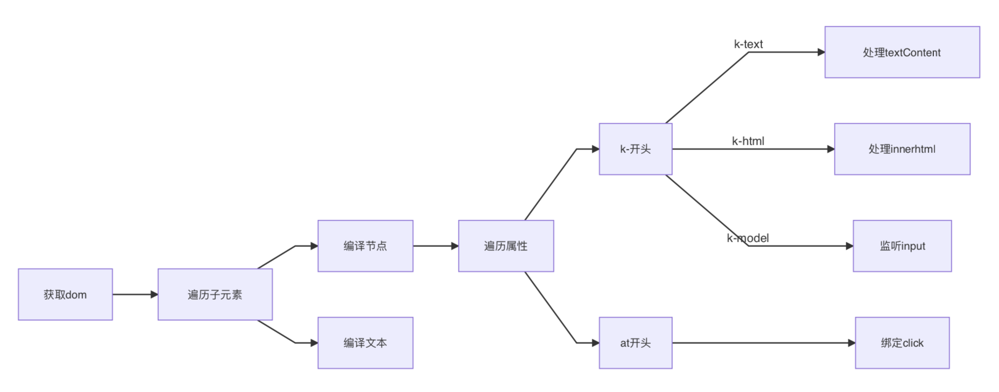
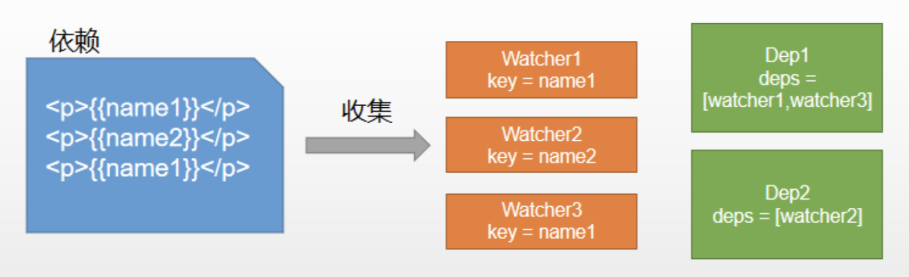

# 3、手写Vue

## 设计思想

vue双向绑定的方法，就是通过defineProperty拦截数据的属性访问，在set方法里调用更新方法，改变视图

但是更新函数需要自己生成，通过编译器compile，得到更新函数updator

页面中有很多状态，每一个状态都有自己的updator，所以updator必须知道和谁相关

因此，需要通过观察者模式，每一个updator都有一个观察者watcher，watcher的职责也很简单，就是维护一个更新函数

Dep是一个数组，会管理多个watcher

## MVVM框架三要素

MVVM框架三要素：`数据响应式`、`模板引擎`、`渲染`

- `数据响应式`：监听数据变化并在视图中更新
    - Object.defineProperty()
    - Proxy
- `模版引擎`：提供描述视图的模版语法
    - 插值：{{}}
    - 指令：v-bind，v-on，v-model，v-for，v-if
- `渲染`：如何将模板转换为html
    - 模板 => vdom => dom


### 数据响应式原理

不同的框架有不同的处理方式：Vue2使用的是数据劫持，在Vue3中使用代理，在Ng里使用脏检查，在React中使用主动setState，不过hooks之后又有变化


#### 结合视图的数据驱动小栗子

```html
<div id="app"></div>
<script>
// Object.defineProperty()
function defineReactive(obj, key, val) { // val作为局部变量，通过内部的函数get被返回了出去
    Object.defineProperty(obj, key, {
        get() {
            console.log('get', key)
            return val // 返回了出去，形成了闭包
        },
        set(newVal) {
            if (val !== newVal) {
                val = newVal // 这里对于形参val的赋值之所以生效，是因为闭包
                console.log('set', key)
                update()
            }
        }
    })
}

const obj = {}

defineReactive(obj, 'foo', new Date().toLocaleTimeString())

function update() {
    app.innerHTML = obj.foo
}

setInterval(() => {
    obj.foo = new Date().toLocaleTimeString()
})

</script>
```

#### 数据响应式中需要处理的几个问题：
- 1. 解决嵌套对象问题：如果val是对象，需要递归，obj.baz.a = 10
- 2. 解决赋值是对象的情况：如果newVal是对象，也要做响应式处理，obj.baz = { a: 20 }
- 3. 解决添加/删除了新属性无法检测的问题：set(obj, key, val)

```js{3,4,13,14,35-38}
// Object.defineProperty()
function defineReactive(obj, key, val) {
    // 解决嵌套对象问题：如果val是对象，需要递归，obj.baz.a = 10
    observe(val)

    Object.defineProperty(obj, key, {
        get() {
            console.log('get', key, val)
            return val
        },
        set(newVal) {
            if (val !== newVal) {
                // 解决赋值是对象的情况：如果newVal是对象，也要做响应式处理，obj.baz = { a: 20 }
                observe(newVal)

                val = newVal
                console.log('set', key, val)
                update()
            }
        }
    })
}

// 遍历指定数据对象每个key，拦截他们
function observe(obj) {
    if(typeof obj !== 'object' || obj === null) {
        return obj
    }

    Object.keys(obj).forEach(key => {
        defineReactive(obj, key, obj[key])
    })
}

// 解决添加/删除了新属性无法检测的问题
function set(obj, key, val) {
    defineReactive(obj, key, val)
}

const obj = {foo: 'foo', bar: 'bar', baz: {a: 1}}

observe(obj)

obj.baz.a = 2 // 对嵌套的对象，需要递归observe
obj.baz = { a: 20 } // 重新赋值的对象，未经过响应式处理，需要observe
obj.qux = 'qux' // 对新添加的属性，未经过响应式处理，需要使用set方法，set(obj, 'qux', 'qux')
```
- 4. vue中数组的关键问题在于，defineProperty无法拦截数组的length，虽然可以对数组索引做响应式定义，但数组的slice等等方法，频繁操作length，而这些副作用无法好的处理
    - defineProperty无法好的处理数组的问题，因此必须有一套新的方案，即重写了数组的7个方法。


## 实现简版Vue（其实是Vue1）

原理分析：
1. new Vue()首先执行初始化，对data执行响应化处理，即 `数据拦截`，这个过程发生在Observer中
    - Observer中会对不同类型做不同处理（我们这里只对对象处理）
2. 同时对模板执行编译，找到其中动态绑定的数据，从data中获取并初始化视图，这个过程发生在 Compile中
    - 真正的Compile会将template编译成渲染函数（我们这里做简化，直接编译成做dom操作的更新函数）
3. 同时定义一个更新函数和Watcher，将来对应数据变化时Watcher会调用更新函数
4. 由于data的某个key在一个视图中可能出现多次，所以每个key都需要一个管家Dep来管理多个Watcher，即 `依赖收集`
    - 一对多的关系
5. 将来data中数据一旦发生变化，会首先找到对应的Dep，通知所有Watcher执行更新函数


涉及类型介绍
    KVue:框架构造函数
    Observer:执行数据响应化(分辨数据是对象还是数组)
    Compile:编译模板，初始化视图，收集依赖(更新函数、watcher创建)
    Watcher:执行更新函数(更新dom)
    Dep:管理多个Watcher，批量更新

### 实现 数据拦截：Observer
```js
function defineReactive(obj, key, val) {
    // 解决嵌套对象问题：如果val是对象，需要递归，obj.baz.a = 10
    observe(val)

    Object.defineProperty(obj, key, {
        get() {
            console.log('get', key, val)
            return val
        },
        set(newVal) {
            if (val !== newVal) {
                // 解决赋值是对象的情况：如果newVal是对象，也要做响应式处理，obj.baz = { a: 20 }
                observe(newVal)

                val = newVal
                console.log('set', key, val)
            }
        }
    })
}

// 遍历指定数据对象每个key，拦截他们
function observe(obj) {
    if(typeof obj !== 'object' || obj === null) {
        return obj
    }
    // 每遇到一个对象，就创建一个Observer实例，去做拦截操作
    new Observer(obj)
}

class Observer {
    constructor(value) {
        this.value = value
        // 根据传入value的类型做不同处理
        // if (typeof value !== 'object') {
        //     // do something
        // } else {
        // }
        // 遍历对象
        this.walk(value)
    }

    walk(obj) {
        Object.keys(obj).forEach(key => {
            defineReactive(obj, key, obj[key])
        })
    }
}

// proxy代理函数：让用户可以直接访问data中的key
function proxy(vm, key) {
    Object.keys(vm[key]).forEach(k => {
        Object.defineProperty(vm, k, {
            get() {
                return vm[key][k]
            },
            set(v) {
                vm[key][k] = v
            }
        })
    })
}

function set(obj, key, val) {
    // 解决添加/删除了新属性无法检测的问题：
    defineReactive(obj, key, val)
}


// 实现InchVue构造函数
class InchVue {
    constructor(options) {
        // 0. 保存options
        this.$options = options
        this.$data = options.data

        // 1. 将data做响应式处理
        observe(this.$data)

        // 2. 为$data做代理
        proxy(this, '$data')
    }
}
```
```html
<body>
    <div id="app">
        <p>{{counter}}</p>
    </div>
    <!-- <script src="../node_modules/vue/dist/vue.js"></script> -->
    <script src="inchVue.js"></script>
    <script>
        const app = new InchVue({
            el: '#app',
            data: {
                counter: 1
            },
        })
        setInterval(() => {
            // app.$data.counter++
            app.counter++ // 做过代理转发后
        }, 1000);
    </script>
</body>
</html>
```

### 实现 模板编译：Compile


```js
// 实现InchVue构造函数
class InchVue {
    constructor(options) {
        // 0. 保存options
        this.$options = options
        this.$data = options.data

        // 1. 将data做响应式处理
        observe(this.$data)

        // 2. 为$data做代理
        proxy(this, '$data')

        // 3. 编译模板
        new Compile('#app', this)
    }
}

class Compile {
    // el：宿主元素，vm：InchVue实例
    constructor(el, vm) {
        this.$el = document.querySelector(el)
        this.$vm = vm

        // 解析模板
        if (this.$el) {
            this.compile(this.$el)
        }
    }

    compile(el) {
        // el是宿主元素
        // 遍历，判断当前遍历元素的类型 el.children只包含elements，el.childNodes包含elements和文本节点
        el.childNodes.forEach(node => {
            if (node.nodeType === 1) {
                // 是element
                // console.log('编译元素', node.nodeName)
                this.compileElement(node)
            } else if (this.isInter(node)) {
                // 文本，{{xxx}}
                // console.log('编译文本', node.textContent, RegExp.$1)
                this.compileText(node)
            }

            // 递归
            if (node.childNodes && node.childNodes.length) {
                this.compile(node)
            }
        })
    }

    // 判断插值表达式
    isInter(node) {
        return node.nodeType === 3 && /\{\{(.*?)\}\}/.test(node.nodeContent)
    }
    // 编译文本
    compileText(node) {
        node.textContent = this.$vm[RegExp.$1] // 到这里，只是编译完成update，初始化了动态数据，但数据不会更新
    }
    // 编译元素：分析指令、@事件
    compileElement(node) {
        // 获取属性并遍历
        const nodeAttrs = node.attributes

        Array.from(nodeAttrs).forEach(attr => {
            // 指令：k-xxx="yyy"
            const attrName = attr.name // k-xxx
            const exp = attr.value // yyy
            if (this.isDirective(attrName)) {
                const dir = attrName.substring(2) /// xxx
                // 指令实际操作方法
                this[dir] && this[dir](node, exp)
            }
        })
    }

    isDirective(attr) {
        return attr.indexOf('k-') === 0
    }

    // k-text 对应操作函数
    text(node, exp) {
        node.textContent = this.$vm[exp]
    }
    // k-html
    html(node, exp) {
        node.innerHTML = this.$vm[exp]
    }
}
```

### 实现 依赖收集

- 视图中会用到data中某key，这称为依赖。
- 在编译节点的过程中，一旦发现是一个动态值，就创建一个watcher实例，这时依赖和实例就一一对应起来了（同一个依赖key可能出现多次，每次都需要收集出来，用一个watcher来维护），再将这1个key对应的多个watcher添加到订阅者列表Dep来管理。
- 此后，一旦数据触发setter，就会通知Dep，进而通知watcher去update视图。
- （简单说就是：data中的每个key都对应一个Dep，每个key可能出现多次，每次出现都对应一个watcher，所以Dep可能含有多个watcher）

```js
new Vue({
    template:
        `<div>
            <p>{{name1}}</p>
            <p>{{name2}}</p>
            <p>{{name1}}</p>
         <div>`,
    data: {
        name1: 'name1',
        name2: 'name2'
    }
});
```


```js
function defineReactive(obj, key, val) {
    // 解决嵌套对象问题：如果val是对象，需要递归，obj.baz.a = 10
    observe(val)

    // 因为dep和obj.key一一对应，所以创建dep的时机应该在这里：
    const dep = new Dep()

    Object.defineProperty(obj, key, {
        get() {
            // console.log('get', key, val)
            // 依赖收集
            Dep.target && dep.addDep(Dep.target)
            return val
        },
        set(newVal) {
            if (val !== newVal) {
                // 解决赋值是对象的情况：如果newVal是对象，也要做响应式处理，obj.baz = { a: 20 }
                observe(newVal)

                val = newVal
                // console.log('set', key, val)

                // 通知更新
                dep.notify()
            }
        }
    })
}

// 遍历指定数据对象每个key，拦截他们
function observe(obj) {
    if(typeof obj !== 'object' || obj === null) {
        return obj
    }
    // 每遇到一个对象，就创建一个Observer实例，去做拦截操作
    new Observer(obj)
}

class Observer {
    constructor(value) {
        this.value = value
        // 实际这里应该根据传入value的类型做不同处理，这里我们只处理对象类型

        // 遍历对象
        this.walk(value)
    }

    walk(obj) {
        Object.keys(obj).forEach(key => {
            defineReactive(obj, key, obj[key])
        })
    }
}

// proxy代理函数：让用户可以直接访问data中的key
function proxy(vm, key) {
    Object.keys(vm[key]).forEach(k => {
        Object.defineProperty(vm, k, {
            get() {
                return vm[key][k]
            },
            set(v) {
                vm[key][k] = v
            }
        })
    })
}

function set(obj, key, val) {
    // 解决添加/删除了新属性无法检测的问题：
    defineReactive(obj, key, val)
}

// 实现InchVue构造函数
class InchVue {
    constructor(options) {
        // 0. 保存options
        this.$options = options
        this.$data = options.data

        // 1. 将data做响应式处理
        observe(this.$data)

        // 2. 为$data做代理
        proxy(this, '$data')

        // 3. 编译模板
        new Compile('#app', this)
    }
}

class Compile {
    // el：宿主元素，vm：InchVue实例
    constructor(el, vm) {
        this.$el = document.querySelector(el)
        this.$vm = vm

        // 解析模板
        if (this.$el) {
            this.compile(this.$el)
        }
    }

    compile(el) {
        // el是宿主元素
        // 遍历，判断当前遍历元素的类型 el.children只包含elements，el.childNodes包含elements和文本节点
        el.childNodes.forEach(node => {
            if (node.nodeType === 1) {
                // 是element
                // console.log('编译元素', node.nodeName)
                this.compileElement(node)
            } else if (this.isInter(node)) {
                // 文本，{{xxx}}
                // console.log('编译文本', node.textContent, RegExp.$1)
                this.compileText(node)
            }

            // 递归
            if (node.childNodes && node.childNodes.length) {
                this.compile(node)
            }
        })
    }

    // 判断插值表达式
    isInter(node) {
        return node.nodeType === 3 && /\{\{(.*?)\}\}/.test(node.nodeContent)
    }
    // 编译文本
    compileText(node) {
        // node.textContent = this.$vm[RegExp.$1] // 到这里，只是编译完成update，初始化了动态数据，但数据不会更新
        this.update(node, RegExp.$1, 'text')
    }
    // 编译元素：分析指令、@事件
    compileElement(node) {
        // 获取属性并遍历
        const nodeAttrs = node.attributes

        Array.from(nodeAttrs).forEach(attr => {
            // 指令：k-xxx="yyy"
            const attrName = attr.name // k-xxx
            const exp = attr.value // yyy
            if (this.isDirective(attrName)) {
                const dir = attrName.substring(2) /// xxx
                // 指令实际操作方法
                this[dir] && this[dir](node, exp)
            }
        })
    }

    isDirective(attr) {
        return attr.indexOf('k-') === 0
    }

    // 每个指令，都对应一个调用高阶update的更新函数，以及一个实际的操作函数
    // 执行text指令对应的更新函数
    text(node, exp) {
        this.update(node, exp, 'text')
    }
    // k-text 对应操作函数
    textUpdater(node, val) {
        node.textContent = val
    }

    // html(node, exp) {
    //     node.innerHTML = this.$vm[exp]
    // }
    html(node, exp) {
        this.update(node, exp, 'html')
    }

    htmlUpdater(node, val) {
        node.innerHTML = val
    }

    // 提取update为高阶函数，初始化和创建更新函数
    update(node, exp, dir) {
        const fn = this[dir+'Updater']
        // 初始化
        fn && fn(node, this.$vm[exp])

        // 更新
        new Watcher(this.$vm, exp, function(val) {
            fn && fn(node, val)
        })
    }

}

// const watchers = []

// watcher: 跟视图中的依赖一对一
class Watcher {
    constructor(vm, key, updaterFn) {
        this.vm = vm
        this.key = key
        this.updaterFn = updaterFn

        // 依赖收集触发
        // watchers.push(this)
        Dep.target = this
        this.vm[this.key] // 触发上面的get
        Dep.target = null
    }

    update() {
        this.updaterFn.call(this.vm, this.vm[this.key])
    }
}

// dep：和某个key对应，管理多个watcher，数据更新时通知他们做更新
class Dep {
    constructor() {
        this.dep = []
    }

    addDep(watcher) {
        this.dep.push(watcher)
    }

    notify() {
        this.dep.forEach(watcher => watcher.update())
    }
}
```

::: danger
其实这里实现的是Vue1版本，没有涉及虚拟dom，都是直接更新dom，那么为什么不需要虚拟dom呢？因为Vue1版本中，对每个视图依赖都对应一个watcher实例，我们清楚的知道该更新谁，该如何更新。

我们的监听粒度非常细，根本不需要虚拟dom。
:::


## 扩展实现
事件处理，v-model处理，实现数组响应式

### 实现数组响应式

- 找到数组原型
- 覆盖那些能够修改数组的更新方法（7个），使其可以通知更新
- 将得到的新的原型，设置到到数组实例原型上


Object.defineProperty()对数组无效，而改变数组的方法只有7个，因此，解决方法就是：替换数组实例的的7个原型方法，让他们在修改数组同事还可以通知更新

```js{1-13,29-37}
// 数组响应式
// 1.替换数组原型中7个方法
const originalProto = Array.prototype
// 备份一份，修改备份
const arrayProto = Object.create(originalProto);
['push', 'pop', 'shift', 'unshift', 'splice', 'reverse', 'sort'].forEach(method => {
    arrayProto[method] = function() {
        // 原始操作
        originalProto[method].apply(this, arguments)
        // 覆盖操作：通知更新
        console.log('数组执行' + method + '操作')
    }
})

// ...

// 遍历指定数据对象每个key，拦截他们
function observe(obj) {
    if(typeof obj !== 'object' || obj === null) {
        return obj
    }
    // 每遇到一个对象，就创建一个Observer实例，去做拦截操作
    new Observer(obj)
}

class Observer {
    constructor(value) {
        this.value = value
        // 这里应该根据传入value的类型做不同处理
        if (Array.isArray(value)) {
            // 覆盖原型，替换7个变更操作
            value.__proto__ = arrayProto
            // 对数组内部元素执行响应式
            for (let i = 0; i < value.length; i++) {
                observe(value[i])
            }
        } else if (typeof value === 'object') {
            // 遍历对象
            this.walk(value)
        }

    }

    walk(obj) {
        Object.keys(obj).forEach(key => {
            defineReactive(obj, key, obj[key])
        })
    }
}


// ...


// 测试
const obj = {arr: [1, 2, 3]};
observe(obj)
obj.arr.push(4) // 输出：‘数组执行push操作’
```

### 完成@xxx事件处理，k-model处理

处理@xxx事件：
```js{15-21,25-27}
    // 编译元素：分析指令、@事件
    compileElement(node) {
        // 获取属性并遍历
        const nodeAttrs = node.attributes

        Array.from(nodeAttrs).forEach(attr => {
            // 指令：k-xxx="yyy"
            const attrName = attr.name // k-xxx
            const exp = attr.value // yyy
            if (this.isDirective(attrName)) {
                const dir = attrName.substring(2) /// xxx
                // 指令实际操作方法
                this[dir] && this[dir](node, exp)
            }
            // 事件处理
            if (this.isEvent(attrName)) {
                // @click="onClick"
                const dir = attrName.substring(1) // click
                // 事件监听
                this.eventHandler(node, exp, dir)
            }
        })
    }

    isEvent(dir) {
        return dir.indexOf('@') === 0
    }
```

k-model：语法糖，value设定，事件监听
```js
    // k-model="xxx"
    model(node, exp) {
        // update方法只完成赋值和更新
        this.update(node, exp, 'model')
        // 还需要做事件监听
        node.addEventListener('input', e => {
            // 将新的值赋值给数据即可
            this.$vm[exp] = e.target.value
        })
    }

    modelUpdater(node, val) {
        // 表单元素赋值
        node.value = val
    }
```

template：
```html{7-10}
    <div id="app">
        <!-- 插值 -->
        <p>{{counter}}</p>
        <!-- 指令 -->
        <p k-text="counter"></p>
        <p k-html="desc"></p>
        <!-- 事件 -->
        <p @click="reset">reset</p>
        <!-- k-model -->
        <input type="text" k-model="desc">
    </div>
    <!-- <script src="../node_modules/vue/dist/vue.js"></script> -->
    <script src="inchVue.js"></script>
    <script>
        const app = new InchVue({
            el: '#app',
            data: {
                counter: 1,
                desc: '<span style="color:red">Amy酱你好呀</span>'
            },
            methods: {
                reset() {
                    console.log('触发点击事件，重置计数')
                    this.counter = 0
                }
            }
        })
        setInterval(() => {
            // app.$data.counter++
            app.counter++ // 做过代理转发后
        }, 1000);
    </script>
```


