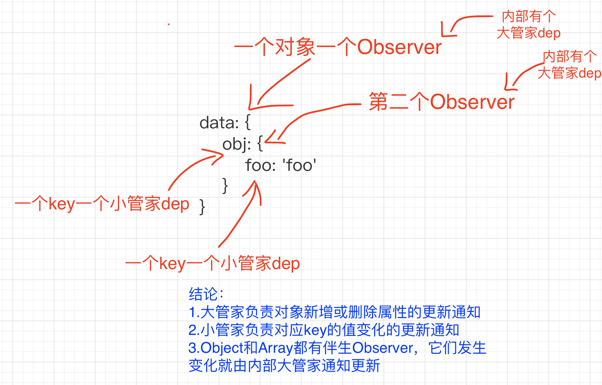
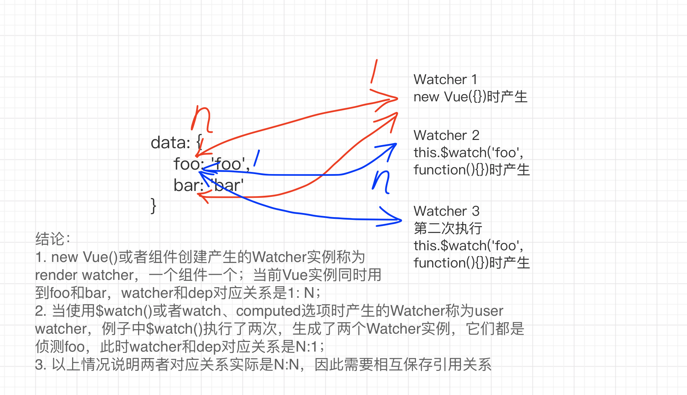
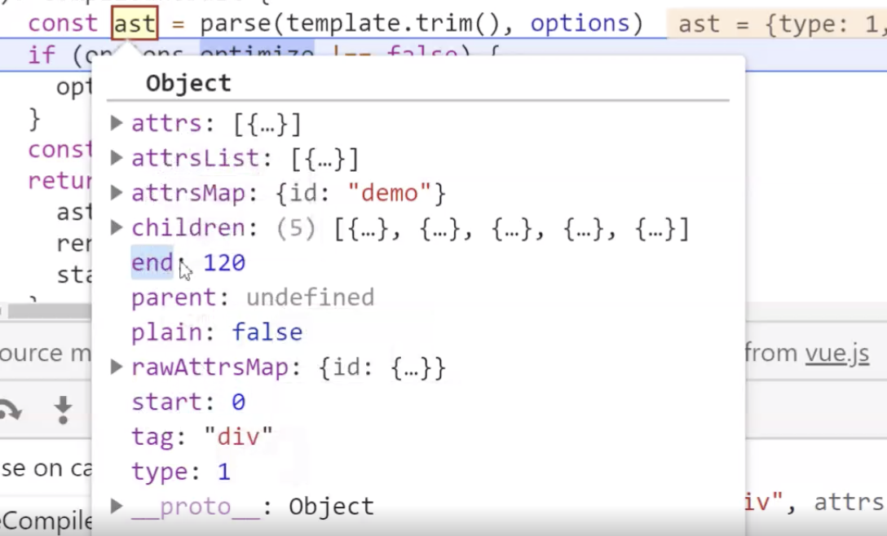
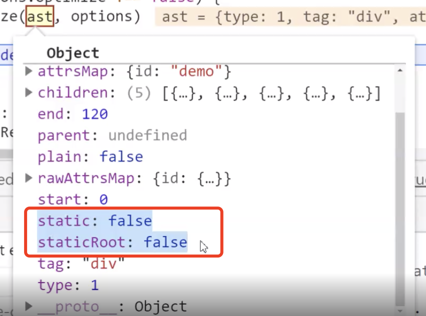

# 456、Vue2源码剖析

## 目录

vue源码剖析1
- 开发调试环境准备
- 入口文件查找
- vue初始化流程
- 响应式原理

vue源码剖析2
- 异步更新策略
- 虚拟DOM和diff算法

vue源码剖析3
- 编译器原理
- 常见指令工作原理
- 组件化机制
- 事件机制
- 双向绑定原理


## 源码目录及环境准备

### 搭建调试环境
- 安装
```bash
git clone https://github.com/vuejs/vue.git
npm install
npm install rollup -g
```
- 修改dev脚本，添加sourcemap
```js
"dev": "rollup -w -c scripts/config.js --sourcemap --environment TARGET:web-full-dev",
```
- 打包
```bash
npm run dev
```

- 引入前面创建的vue.js，samples/commits/index.html
```html
<script src="../../dist/vue.js"></script>
```

### 调试技巧
- 打开指定文件：`cmd+P` 检索文件
- 打断点，单步执行，单步进入函数
- 查看调用栈
- 定位源文件 进入文件中某个函数后，右键 =>`reveal in sidebar`

> 术语解释:
> - runtime:仅包含运行时，不包含编译器
> - common:cjs规范，用于webpack1
> - esm:ES模块，用于webpack2+
> - umd: universal module definition，兼容cjs和amd，用于浏览器


### vue2源码目录结构

::: details
```js
.
├── dist
│   ├── README.md
│   ├── vue.common.dev.js
│   ├── vue.common.js // cjs规范，只能用于webpack1
│   ├── vue.common.prod.js
│   ├── vue.esm.browser.js
│   ├── vue.esm.browser.min.js
│   ├── vue.esm.js // esm规范，用于webpack2+
│   ├── vue.js // umd规范，通用模块定义，兼容cjs和amd，用于浏览器
│   ├── vue.min.js
│   ├── vue.runtime.common.dev.js
│   ├── vue.runtime.common.js
│   ├── vue.runtime.common.prod.js
│   ├── vue.runtime.esm.js
│   ├── vue.runtime.js // 仅包含运行时，不包含编译器
│   └── vue.runtime.min.js
├── examples // 范例，测试代码
│   ├── commits
│   │   ├── app.js
│   │   ├── index.html
│   │   └── mock.js
│   ├── elastic-header
│   │   ├── index.html
│   │   └── style.css
│   ├── firebase
│   │   ├── app.js
│   │   ├── index.html
│   │   └── style.css
│   ├── grid
│   │   ├── grid.js
│   │   ├── index.html
│   │   └── style.css
│   ├── markdown
│   │   ├── index.html
│   │   └── style.css
│   ├── modal
│   │   ├── index.html
│   │   └── style.css
│   ├── move-animations
│   │   └── index.html
│   ├── select2
│   │   └── index.html
│   ├── svg
│   │   ├── index.html
│   │   ├── style.css
│   │   └── svg.js
│   ├── todomvc
│   │   ├── app.js
│   │   ├── index.html
│   │   └── readme.md
│   └── tree
│       ├── index.html
│       └── tree.js
├── flow // flow类型声明
│   ├── compiler.js
│   ├── component.js
│   ├── global-api.js
│   ├── modules.js
│   ├── options.js
│   ├── ssr.js
│   ├── vnode.js
│   └── weex.js
├── package.json
├── packages // 核心代码之外的独立库
│   ├── vue-server-renderer
│   │   ├── README.md
│   │   ├── basic.js
│   │   ├── build.dev.js
│   │   ├── build.prod.js
│   │   ├── client-plugin.d.ts
│   │   ├── client-plugin.js
│   │   ├── index.js
│   │   ├── package.json
│   │   ├── server-plugin.d.ts
│   │   ├── server-plugin.js
│   │   └── types
│   │       ├── index.d.ts
│   │       ├── plugin.d.ts
│   │       └── tsconfig.json
│   ├── vue-template-compiler
│   │   ├── README.md
│   │   ├── browser.js
│   │   ├── build.js
│   │   ├── index.js
│   │   ├── package.json
│   │   └── types
│   │       ├── index.d.ts
│   │       ├── test.ts
│   │       └── tsconfig.json
│   ├── weex-template-compiler
│   │   ├── README.md
│   │   ├── build.js
│   │   ├── index.js
│   │   └── package.json
│   └── weex-vue-framework
│       ├── README.md
│       ├── factory.js
│       ├── index.js
│       └── package.json
├── scripts // 构建脚本
│   ├── alias.js
│   ├── build.js
│   ├── config.js
│   ├── feature-flags.js
│   ├── gen-release-note.js
│   ├── get-weex-version.js
│   ├── git-hooks
│   │   ├── commit-msg
│   │   └── pre-commit
│   ├── release-weex.sh
│   ├── release.sh
│   └── verify-commit-msg.js
├── src // 源码
│   ├── compiler // 编译器相关
│   │   ├── codeframe.js
│   │   ├── codegen
│   │   │   ├── events.js
│   │   │   └── index.js
│   │   ├── create-compiler.js
│   │   ├── directives
│   │   │   ├── bind.js
│   │   │   ├── index.js
│   │   │   ├── model.js
│   │   │   └── on.js
│   │   ├── error-detector.js
│   │   ├── helpers.js
│   │   ├── index.js
│   │   ├── optimizer.js
│   │   ├── parser
│   │   │   ├── entity-decoder.js
│   │   │   ├── filter-parser.js
│   │   │   ├── html-parser.js
│   │   │   ├── index.js
│   │   │   └── text-parser.js
│   │   └── to-function.js
│   ├── core // 核心代码
│   │   ├── components // 通用组件如keep-alive
│   │   │   ├── index.js
│   │   │   └── keep-alive.js
│   │   ├── config.js
│   │   ├── global-api // 全局API
│   │   │   ├── assets.js
│   │   │   ├── extend.js
│   │   │   ├── index.js
│   │   │   ├── mixin.js
│   │   │   └── use.js
│   │   ├── index.js
│   │   ├── instance // 构造函数等
│   │   │   ├── events.js
│   │   │   ├── index.js
│   │   │   ├── init.js
│   │   │   ├── inject.js
│   │   │   ├── lifecycle.js
│   │   │   ├── proxy.js
│   │   │   ├── render-helpers
│   │   │   │   ├── bind-dynamic-keys.js
│   │   │   │   ├── bind-object-listeners.js
│   │   │   │   ├── bind-object-props.js
│   │   │   │   ├── check-keycodes.js
│   │   │   │   ├── index.js
│   │   │   │   ├── render-list.js
│   │   │   │   ├── render-slot.js
│   │   │   │   ├── render-static.js
│   │   │   │   ├── resolve-filter.js
│   │   │   │   ├── resolve-scoped-slots.js
│   │   │   │   └── resolve-slots.js
│   │   │   ├── render.js
│   │   │   └── state.js
│   │   ├── observer // 响应式相关
│   │   │   ├── array.js
│   │   │   ├── dep.js
│   │   │   ├── index.js
│   │   │   ├── scheduler.js
│   │   │   ├── traverse.js
│   │   │   └── watcher.js
│   │   ├── util
│   │   │   ├── debug.js
│   │   │   ├── env.js
│   │   │   ├── error.js
│   │   │   ├── index.js
│   │   │   ├── lang.js
│   │   │   ├── next-tick.js
│   │   │   ├── options.js
│   │   │   ├── perf.js
│   │   │   └── props.js
│   │   └── vdom // 虚拟DOM相关
│   │       ├── create-component.js
│   │       ├── create-element.js
│   │       ├── create-functional-component.js
│   │       ├── helpers
│   │       │   ├── extract-props.js
│   │       │   ├── get-first-component-child.js
│   │       │   ├── index.js
│   │       │   ├── is-async-placeholder.js
│   │       │   ├── merge-hook.js
│   │       │   ├── normalize-children.js
│   │       │   ├── normalize-scoped-slots.js
│   │       │   ├── resolve-async-component.js
│   │       │   └── update-listeners.js
│   │       ├── modules
│   │       │   ├── directives.js
│   │       │   ├── index.js
│   │       │   └── ref.js
│   │       ├── patch.js
│   │       └── vnode.js
│   ├── platforms
│   │   ├── web
│   │   │   ├── compiler
│   │   │   │   ├── directives
│   │   │   │   │   ├── html.js
│   │   │   │   │   ├── index.js
│   │   │   │   │   ├── model.js
│   │   │   │   │   └── text.js
│   │   │   │   ├── index.js
│   │   │   │   ├── modules
│   │   │   │   │   ├── class.js
│   │   │   │   │   ├── index.js
│   │   │   │   │   ├── model.js
│   │   │   │   │   └── style.js
│   │   │   │   ├── options.js
│   │   │   │   └── util.js
│   │   │   ├── entry-compiler.js
│   │   │   ├── entry-runtime-with-compiler.js // 入口文件
│   │   │   ├── entry-runtime.js
│   │   │   ├── entry-server-basic-renderer.js
│   │   │   ├── entry-server-renderer.js
│   │   │   ├── runtime
│   │   │   │   ├── class-util.js
│   │   │   │   ├── components
│   │   │   │   │   ├── index.js
│   │   │   │   │   ├── transition-group.js
│   │   │   │   │   └── transition.js
│   │   │   │   ├── directives
│   │   │   │   │   ├── index.js
│   │   │   │   │   ├── model.js
│   │   │   │   │   └── show.js
│   │   │   │   ├── index.js
│   │   │   │   ├── modules
│   │   │   │   │   ├── attrs.js
│   │   │   │   │   ├── class.js
│   │   │   │   │   ├── dom-props.js
│   │   │   │   │   ├── events.js
│   │   │   │   │   ├── index.js
│   │   │   │   │   ├── style.js
│   │   │   │   │   └── transition.js
│   │   │   │   ├── node-ops.js
│   │   │   │   ├── patch.js
│   │   │   │   └── transition-util.js
│   │   │   ├── server
│   │   │   │   ├── compiler.js
│   │   │   │   ├── directives
│   │   │   │   │   ├── index.js
│   │   │   │   │   ├── model.js
│   │   │   │   │   └── show.js
│   │   │   │   ├── modules
│   │   │   │   │   ├── attrs.js
│   │   │   │   │   ├── class.js
│   │   │   │   │   ├── dom-props.js
│   │   │   │   │   ├── index.js
│   │   │   │   │   └── style.js
│   │   │   │   └── util.js
│   │   │   └── util
│   │   │       ├── attrs.js
│   │   │       ├── class.js
│   │   │       ├── compat.js
│   │   │       ├── element.js
│   │   │       ├── index.js
│   │   │       └── style.js
│   │   └── weex
│   │       ├── compiler
│   │       │   ├── directives
│   │       │   │   ├── index.js
│   │       │   │   └── model.js
│   │       │   ├── index.js
│   │       │   └── modules
│   │       │       ├── append.js
│   │       │       ├── class.js
│   │       │       ├── index.js
│   │       │       ├── props.js
│   │       │       ├── recycle-list
│   │       │       │   ├── component-root.js
│   │       │       │   ├── component.js
│   │       │       │   ├── index.js
│   │       │       │   ├── recycle-list.js
│   │       │       │   ├── text.js
│   │       │       │   ├── v-bind.js
│   │       │       │   ├── v-for.js
│   │       │       │   ├── v-if.js
│   │       │       │   ├── v-on.js
│   │       │       │   └── v-once.js
│   │       │       └── style.js
│   │       ├── entry-compiler.js
│   │       ├── entry-framework.js
│   │       ├── entry-runtime-factory.js
│   │       ├── runtime
│   │       │   ├── components
│   │       │   │   ├── index.js
│   │       │   │   ├── richtext.js
│   │       │   │   ├── transition-group.js
│   │       │   │   └── transition.js
│   │       │   ├── directives
│   │       │   │   └── index.js
│   │       │   ├── index.js
│   │       │   ├── modules
│   │       │   │   ├── attrs.js
│   │       │   │   ├── class.js
│   │       │   │   ├── events.js
│   │       │   │   ├── index.js
│   │       │   │   ├── style.js
│   │       │   │   └── transition.js
│   │       │   ├── node-ops.js
│   │       │   ├── patch.js
│   │       │   ├── recycle-list
│   │       │   │   ├── render-component-template.js
│   │       │   │   └── virtual-component.js
│   │       │   └── text-node.js
│   │       └── util
│   │           ├── element.js
│   │           ├── index.js
│   │           └── parser.js
│   ├── server
│   │   ├── bundle-renderer
│   │   │   ├── create-bundle-renderer.js
│   │   │   ├── create-bundle-runner.js
│   │   │   └── source-map-support.js
│   │   ├── create-basic-renderer.js
│   │   ├── create-renderer.js
│   │   ├── optimizing-compiler
│   │   │   ├── codegen.js
│   │   │   ├── index.js
│   │   │   ├── modules.js
│   │   │   ├── optimizer.js
│   │   │   └── runtime-helpers.js
│   │   ├── render-context.js
│   │   ├── render-stream.js
│   │   ├── render.js
│   │   ├── template-renderer
│   │   │   ├── create-async-file-mapper.js
│   │   │   ├── index.js
│   │   │   ├── parse-template.js
│   │   │   └── template-stream.js
│   │   ├── util.js
│   │   ├── webpack-plugin
│   │   │   ├── client.js
│   │   │   ├── server.js
│   │   │   └── util.js
│   │   └── write.js
│   ├── sfc
│   │   └── parser.js
│   └── shared
│       ├── constants.js
│       └── util.js
├── types // ts类型声明
│   ├── index.d.ts
│   ├── options.d.ts
│   ├── plugin.d.ts
│   ├── test
│   │   ├── augmentation-test.ts
│   │   ├── es-module.ts
│   │   ├── options-test.ts
│   │   ├── plugin-test.ts
│   │   ├── ssr-test.ts
│   │   ├── tsconfig.json
│   │   ├── umd-test.ts
│   │   └── vue-test.ts
│   ├── tsconfig.json
│   ├── typings.json
│   ├── umd.d.ts
│   ├── vnode.d.ts
│   └── vue.d.ts
└── yarn.lock
```
:::


## 初始化流程

流程开始执行：
- 入口文件（platforms/web/entry-runtime-with-compiler）：`扩展$mount方法，解析模板，得到渲染函数`
    - web平台需要扩展核心模块的$mount，之后覆盖原来的$mount
        - 扩展默认$mount方法: 处理render，template或el选项，优先级render > template > el
        - 有render函数直接用
        - 没有render采用template，template可以按多种方式设置，将template编译成render函数
        - 都没有，最后就用el元素内部的内容作为模板，因此不需要调用$mount挂载
- web运行时代码（platforms/web/runtime/index）：`安装__patch__函数，实现$mount`
    - 安装__patch__函数（转换vdom为dom，diff算法），
    - 实现$mount，获取el元素，挂载组件
- 全局api定义（core/index）：`初始化全局API`
    - core/global-api/index：set、delete、nextTick
- Vue构造函数（core/instance/index）：`new Vue() 执行初始化，this._init，并实现众多实例属性和方法`
    - initMixin：实现_init()（core/instance/init.js）
        - 按顺序：
            - options选项合并
            - initLifecycle：$parent、$root
            - initEvents：自定义事件监听
            - initRender：$slots、$createElement
            - callHook(vm, 'beforeCreate')
            - initInjections：获取祖辈注入数据，resolve injections before data/props
            - initState：数据状态初始化，data/props/methods/computed/watch
            - initProvide：给后代提供数据，resolve provid after data/props
            - callHook(vm, 'created')
            - 选项如果有el，自动执行$mount
    - stateMixin
        - $data，$props，$set，$delete，$watch
    - eventsMixin
        - $on，$emit，$once，$off
    - lifecycleMixin
        - _update，$forceUpdate，$destroy
    - renderMixin
        - $nextTick，_render
- $mount()：`执行组件挂载，获取vdom并转换为dom`
    - mountComponent()：挂载组件
        - callHook(vm, 'beforeMount')
        - 实现updateComponent()定义
            - render()：渲染组件，获取vdom
            - _update()：
                - 初始化或更新，初始化时执行的是dom创建操作
                - 将传入vdom转换为dom，替换宿主元素
        - new Watcher(vm, updateComponent, ...rest)，每个组件对应一个watcher，watcher执行updateComponent
        - callHook(vm, 'mounted')

> new Vue() => _init() => $mount() => mountComponent() => updateComponent()/new Watcher() => render() => _update()

## 数据响应式


::: tip Vue利用JS语言特性实现数据响应式，不产生新的API
- Vue一大特点是数据响应式，数据的变化会作用于UI而不用进行DOM操作。
- 原理上来讲，是利用了**JS语言特性**`Object.defineProperty()`，通过定义对象属性setter方法拦截对象属性变更，从而将数值的变化转换为UI的变化。（Vue是利用JS语言特性，不产生新的API，而React是使用了新的API）
- 具体实现是在Vue初始化时，会调用initState，它会初始化data，props等，这里着重关注data初始化。
:::

Vue初始化时，initState是数据初始化起始点。

data的数据响应式（src/core/instance/state.js）：
- `initState()：数据初始化起始点`
    - observe()：new Observer()，返回ob实例，ob对value做响应式
    - Observer：判断value类型，做响应式处理
        - 每个ob对传入value的不同类型，做不同方式的响应式处理
            - 对象：walk()遍历所有key，执行 defineReactive() 数据的拦截访问
                - defineReactive()，每个key生成一个dep（小管家）
            - 数组：处理 observerArray()
        - 如果一个对象，拥有__ob__属性，它就是一个响应式数据
    - Dep：依赖管理，变更通知
        - 每个对象配置一个Observer实例ob，每个实例ob都生成一个ob.dep（方便理解，我们称其为 大管家）
            - const dep = new Dep()，依赖管理列表。比较 两种dep（大管家、小管家）的作用
            ```js
            const app = new Vue({
                el: '#demo',
                data: {
                    obj: {
                        foo: 'foo'
                    }
                }
            })
            // 创建组件实例：会有 2个Observer实例，4个dep，1个watcher
            // 每个对象就有一个Observer实例（data、obj）
            // 每个对象都生成一个大管家dep（data、obj），每个key都生成一个小管家dep（obj、foo）
            // 只有一个组件，所以只有一个watcher实例

            // 大管家ob.dep，未来当前对象动态添加或删除属性，通知视图更新；如果是数组，如果有数据动态加入或移除，通知视图更新。
            // 小管家dep，负责对应key值的变化后，通知视图更新
            ```
            
            - dep依赖收集`dep.depend()`
            - dep通知更新`ob.dep.notify()`
    - Watcher：和组件挂钩或者和用户定义的观察表达式挂钩，数据变更后执行更新
        - dep和watcher间的映射关系（其实是`N对N`的关系）
        - render watcher：组件watcher
        - user watcher：用户定义的表达式watcher
        
    - 对数组的特殊处理（array.js）
        - 覆盖能够改变数组的7个方法：['push', 'pop', 'shift', 'unshift', 'splice', 'reverse', 'sort']
            ```js
            methodsToPatch.forEach(function (method) {
                // cache original method
            const original = arrayProto[method]
                def(arrayMethods, method, function mutator (...args) {
                    // ......
                }
            }
            ```
            ```js
            if (Array.isArray(value)) {
                // 替换数组原型
                protoAugment(value, arrayMethods) // value.__proto__ = arrayMethods this.observeArray(value)
            }
            ```


## 批量异步更新策略

Vue高效的**秘诀**，是一套`批量、异步`的更新策略。
- 异步：只要侦听到数据变化，Vue 将开启一个队列，并缓冲在同一事件循环中发生的所有数据变更。
- 批量：如果同一个 watcher 被多次触发，只会被推入到队列中一次（去重对于避免不必要的计算 和 DOM 操作是非常重要的）。然后，在下一个的事件循环“tick”中，Vue 刷新队列执行实际工作。


.png)
批量异步更新流程：
- dep.notify()：通知更新
- watcher.update()：dep.notify()之后，watcher执行入队操作
- queueWatcher(watcher)
    - watcher入队、去重、启动异步任务
- 如果没有处于pendding状态，就使用nextTick将flushSchedulerQueue入队：`nextTick(flushSchedulerQueue)`
    ```js
    // 即 vue.$nextTick
    export function nextTick (cb?: Function, ctx?: Object) {
        let _resolve

        // 用户传递的回调函数会被放入callbacks数组中，
        // 刷新函数flushSchedulerQueue，会执行callbacks中的所有回调
        callbacks.push(() => {
            if (cb) {
                try {
                    cb.call(ctx)
                } catch (e) {
                    handleError(e, ctx, 'nextTick')
                }
            } else if (_resolve) {
                _resolve(ctx)
            }
        })
        if (!pending) {
            pending = true
            // 如果当前没有在排队，则 启动定时器函数
            timerFunc()
        }
    }
    ```
    - nextTick按照特定异步策略，添加、调用异步任务
        - timeFunc()：异步执行队列刷新
        - flushSchedulerQueue之中，watcher.run()：真正执行更新操作


> watcher.run() => componentUpdate() => render() => update() => patch()


::: tip nextTick中，定时器函数`timerFunc`的`降级规则`
首选`微任务promise` > 微任务MutationObserver > 宏任务setImmediate > `宏任务setTimeout`兜底

异步策略：Vue 在内部对异步队列尝试使用原生的 Promise.then 、 MutationObserver 或 setImmediate ，如果执行环境都不支持，则会采用 setTimeout 代替。

- Q：为什么首选微任务呢？
- A：因为微任务执行是所有页面更新都执行完，之后紧跟着就是浏览器渲染。所以微任务的时刻，是所有页面的更新都做完了，因此我们通常在$nextTick的回调中拿到所有更新。

```js
let timerFunc

if (typeof Promise !== 'undefined' && isNative(Promise)) {
  const p = Promise.resolve()
  timerFunc = () => {
    p.then(flushCallbacks)

    if (isIOS) setTimeout(noop)
  }
  isUsingMicroTask = true
} else if (!isIE && typeof MutationObserver !== 'undefined' && (
  isNative(MutationObserver) ||
  // PhantomJS and iOS 7.x
  MutationObserver.toString() === '[object MutationObserverConstructor]'
)) {
  // Use MutationObserver where native Promise is not available,
  let counter = 1
  const observer = new MutationObserver(flushCallbacks)
  const textNode = document.createTextNode(String(counter))
  observer.observe(textNode, {
    characterData: true
  })
  timerFunc = () => {
    counter = (counter + 1) % 2
    textNode.data = String(counter)
  }
  isUsingMicroTask = true
} else if (typeof setImmediate !== 'undefined' && isNative(setImmediate)) {
  // Fallback to setImmediate.
  timerFunc = () => {
    setImmediate(flushCallbacks)
  }
} else {
  // Fallback to setTimeout.
  timerFunc = () => {
    setTimeout(flushCallbacks, 0)
  }
}
```
:::


::: details 异步更新的栗子
```html
<body>
    <div id="demo">
        <h1>异步更新</h1>
        <p id="p1">{{foo}}</p>
    </div>
    <script>
        // 创建实例
        const app = new Vue({
            el: '#demo',
            data: { foo: 'ready~~' },
            mounted() {
                this.foo = Math.random()
                console.log('1:' + this.foo);
                this.foo = Math.random()
                console.log('2:' + this.foo);
                this.foo = Math.random()
                console.log('3:' + this.foo);
                // 异步行为，此时内容没变
                console.log('p1.innerHTML:' + p1.innerHTML) // p1.innerHTML: ready~~

                this.$nextTick(() => {
                    // 这里才是最新的值
                    console.log('p1.innerHTML:' + p1.innerHTML)  // p1.innerHTML: 与log 3处的随机数相同
                })
            }
        });
    </script>
</body>
1:0.22584343235657278
2:0.9690117592418352
3:0.7130761702093171
p1.innerHTML:ready~~
p1.innerHTML:0.7130761702093171
```
看如下变体1：
```js
// 创建实例
const app = new Vue({
    el: '#demo',
    data: { foo: 'ready~~' },
    mounted() {
        this.$nextTick(() => {
            // 如果在这个位置，下面修改值的行为还没发生，对应key的watcher还没加入微任务队列呢
            // 这里的回调先于watcher进入微任务队列
            console.log('p1.innerHTML:' + p1.innerHTML)  // 最后输出：p1.innerHTML: ready~~
        })

        this.foo = Math.random()
        console.log('1:' + this.foo);
        this.foo = Math.random()
        console.log('2:' + this.foo);
        this.foo = Math.random()
        console.log('3:' + this.foo);
        // 异步行为，此时内容没变
        console.log('p1.innerHTML:' + p1.innerHTML) // 先输出：p1.innerHTML: ready~~
    }
});
1:0.6624923603714348
2:0.9926112119960828
3:0.8354387890388404
p1.innerHTML:ready~~
p1.innerHTML:ready~~ // nextTick输出
```
看如下变体2：
```js
// 创建实例
const app = new Vue({
    el: '#demo',
    data: { foo: 'ready~~' },
    mounted() {
        this.foo = Math.random()
        console.log('1:' + this.foo);
        this.foo = Math.random()
        console.log('2:' + this.foo);
        this.foo = Math.random()
        console.log('3:' + this.foo);
        // 异步行为，此时内容没变
        console.log('p1.innerHTML:' + p1.innerHTML) // p1.innerHTML: ready~~

        // 独立的微任务放入队列
        Promise.resolve().then(() => {
            console.log('promise:' + p1.innerHTML) // promise:0.5098276843865237
        })

        // nextTick里面的回调，会放入flushCallbacks当中，而之前foo的赋值行为，已经使flushSchedulerQueue先入队了
        this.$nextTick(() => {
            console.log('p1.innerHTML:' + p1.innerHTML)  // p1.innerHTML:0.5098276843865237
        })
    }
});
1:0.4309769054173418
2:0.4817518698363221
3:0.5098276843865237
p1.innerHTML:ready~~
p1.innerHTML:0.5098276843865237
promise:0.5098276843865237
```
:::


## 虚拟DOM和diff算法

### snabbdom虚拟dom体验
vue中虚拟dom基于snabbdom实现，安装snabbdom并体验：
```html
<body>
    <div id="app"></div>
    <!--安装并引入snabbdom-->
    <script src="../../node_modules/snabbdom/dist/snabbdom.js"></script>
    <script>
        // 之前编写的响应式函数
        function defineReactive(obj, key, val) {
            Object.defineProperty(obj, key, {
                get() {
                    return val
                },
                set(newVal) {
                    val = newVal // 通知更新
                    update()
                }
            })
        }
        // 导入patch的工厂init，h是产生vnode的工厂
        const { init, h } = snabbdom
        // 获取patch函数
        const patch = init([])
        // 上次vnode，由patch()返回
        let vnode;
        // 更新函数，将数据操作转换为dom操作，返回新vnode
        function update() {
            if (!vnode) {
                // 初始化，没有上次vnode，传入宿主元素和vnode
                vnode = patch(app, render())
            }
            else {
                // 更新，传入新旧vnode对比并做更新
                vnode = patch(vnode, render())

            }
        }
        // 渲染函数，返回vnode描述dom结构
        function render() {
            return h('div', obj.foo)
        }

        // 数据
        const obj = {}
        // 定义响应式
        defineReactive(obj, 'foo', '')
        // 赋一个日期作为初始值
        obj.foo = new Date().toLocaleTimeString()
        // 定时改变数据，更新函数会重新执行
        setInterval(() => {
            obj.foo = new Date().toLocaleTimeString()
        }, 1000);
    </script>
</body>
```


### 虚拟DOM优点和必要性

- 优点：
    - 虚拟DOM轻量、快速：当它们发生变化时通过新旧虚拟DOM比对，可以**得到最小DOM操作量**，**配合异步更新策略**减少刷新频率，从而提升性能。
        `patch(vnode, h('div', obj.foo))`
    - 跨平台：将虚拟dom更新转换为不同运行时特殊操作实现跨平台。
- 必要性：
    - vue1 中有细粒度的数据变化侦测，它是不需要虚拟DOM的，但是细粒度造成了大量开销，这对于大型项目来说是不可接受的。
    - 因此，vue2 选择了中等粒度的解决方案，每一个组件一个watcher实例，这样状态变化时只能通知到组件，再通过引入虚拟DOM去进行diff和渲染更新。

### 整体流程

更新整体流程：

- 执行更新：watcher.run()
    - 组件更新：updateComponent()
        - 计算虚拟dom：_render()得到vnode
            - 更新：_update()，转换vnode为dom
                - 打补丁：patch()，转换实际执行函数，patching，diff
                    - 首先进行`树级别比较patch()`，**同层比较，深度优先**，可能有三种情况：**增删改**。
                        - new VNode不存在就删；
                        - old VNode不存在就增；
                        - 都存在就改，执行diff更新：`递归更新节点patchVnode()`
                            - 执行patchVnode，一定是判断为两个相同的节点，即sameVnode()：key相同、tag相同
                            - *sameVnode(vnode1, vnode2)，如果没有key（即key为undefined），那么tag相同时，key都是undefined也相同，则就是相同节点*
                            - 比较两个VNode，包括三种类型操作：**属性更新、文本更新、子节点更新**
                                - 属性更新：xxxxx
                                - text文本和children子节点是互斥的：
                                    - 1、当**新老节点都无子节点**，只是文本的替换。
                                    - 2、当**新节点有子节点而老节点没有子节点**，先清空老节点的文本内容，然后为其新增子节点。
                                    - 3、当**新节点没有子节点而老节点有子节点**，则移除该节点的所有子节点。
                                    - 4、新老节点**均有children子节点**，则对子节点进行diff操作，调用`updateChildren重排子节点`：
                                        - updateChildren()
                                            - updateChildren主要作用是用一种较高效的方式比对新旧两个VNode的children得出最小操作补丁。
                                            - 执行一个双循环是传统方式
                                            - vue中针对web场景特点做了特别的算法优化：
                                                - 在新老两组VNode节点的首尾都各定义1个游标，则总共4个游标
                                                - 在遍历过程中4个游标都会向中间靠拢。
                                                - 当游标相交或超过时，则循环结束（oldStartIdx > oldEndIdx 或 newStartIdx > newEndIdx）
                                                    - 1、首先假设首尾children有相同（大概率事件），两两对比有4种情况：
                                                        - 老开始和新开始相同，patchVnode它们，游标同时向后移动
                                                        - 同理，老结束和新结束相同，patchVnode它们，游标同时向前移动
                                                        - 交叉：老开始和新结束相同（比如价格倒序），patchVnode之后，老开始游标向后移动1，新结束游标向前移动1；
                                                            - 并且，老的开始节点，要移动到老的队伍最后面。
                                                        - 同理，交叉：老结束和新开始相同，patchVnode之后，老结束游标向前移动1，新开始游标向后移动1；
                                                            - 并且，老的结束节点，要移动到老的队伍最前面。
                                                    - 2、如果没找到，则从旧children中查找跟新children中首个节点相同的节点，找到则patchVnode它们；找不到就创建一个新的节点；
                                                    - 3、若先遍历完新旧其中一个children，循环结束，开始收尾工作：
                                                        - 新children先结束，老children中剩下的批量删除；
                                                        - 老children先结束，新children中剩余的批量增加；


> dep.notify => watcher => updateComponent => render => _update => patch => updateChildren/patchVnode

::: details 如果不加key，更新过程会有什么问题？
```html
<div id="demo">
    <h1>虚拟DOM</h1>
    <div>
        <p v-for="a in arr" :key="a">{{a}}</p>
    </div>
</div>
<script>
    // 创建实例
    const app = new Vue({
        el: '#demo',
        data: { arr: ['A', 'B', 'C', 'D'] },
        mounted() {
            setTimeout(() => {
                this.arr.splice(1, 0, 'E') // ['A', 'E', 'B', 'C', 'D']
            }, 1000);
        }
    });
</script>
```
- 加key时的比较过程：
```
旧：A B C D
新：A E B C D

1、两个开头比较后（两个A相同，patchVnode没变化，游标移动）
旧：B C D
新：E B C D

2、两个开头比较，不相同，比较两个结束（两个D相同，patchVnode没变化，游标移动）
旧：B C
新：E B C

3、两个开头比较，不相同，比较两个结束（两个C相同，patchVnode没变化，游标移动）
旧：B
新：E B

4、两个开头比较，不相同，比较两个结束（两个B相同，patchVnode没变化，游标移动）
旧：
新：E

5、最后，新的队列剩下一个E，收尾工作，创建一个新的E节点，追加到真实dom中
```
- 没有加key时的比较过程（就很无脑，会使用就地复用更新策略，会出错）：
```
旧：A B C D
新：A E B C D

1、两个开头比较后（两个A相同，patchVnode没变化，游标移动）
旧：B C D
新：E B C D

2、两个开头比较后（错把B和E当成sameNode，因为tag相同，key都是undefined，所以patchVnode更新1次，强行将E更新到B上，游标移动）
旧：C D
新：B C D

3、两个开头比较后（错把C和B当成sameNode，因为tag相同，key都是undefined，所以patchVnode更新2次，强行将B更新到C上，游标移动）
旧：D
新：C D

4、两个开头比较后（错把D和C当成sameNode，因为tag相同，key都是undefined，所以patchVnode更新3次，强行将C更新到D上，游标移动）
旧：
新：D

5、最后，新的队列剩下一个D，收尾工作，创建一个新的D节点，追加到真实dom中。
```
**最终，没有加key的比较，也得到了一组新的 A E B C D，但是不加key就会导致错误的复用节点，就地更新策略，多更新了好多次，很无脑。而加了key的则只需要最后创建一个新节点，并追加到真是dom中。**

*另外，不推荐直接使用索引当做key，一般情况下不会有问题，但如果列表经排序，那么索引并不具有唯一性，根本就不知道具体是谁变了。*
:::


### 获取patch，如何跨平台

__patch__是在平台特有代码中指定的 Vue.prototype.__patch__ = inBrowser ? patch : noop

传递平台特有节点操作选项，给工厂函数返回patch
```js
const patch = createPatchFunction({ nodeOps, modules })
```
- modules：属性相关操作
- nodeOps：节点增删改查等操作
- 传递nodeOps和modules是web平台特别实现


## 模板编译

- 模板编译的主要目标是将**模板(template)**转换为**渲染函数(render)**。
- template => render()
```html
<div>
    <h1>title</h1>
    <p>some content</p>
</div>

<script>
// 编译后
render(h) {
    return h('div', [
        h('h1', 'title'),
        h('p', 'some content')
    ])
}
</script>
```


模板编译必要性：Vue 2.0需要用到VNode描述视图以及各种交互，手写显然不切实际，因此用户只需编写类似HTML代码的Vue模板，通过编译器将模板转换为可返回VNode的render函数。
>  ```js
>  (function anonymous() {
>       with(this){return _c('div',{attrs:{"id":"demo"}},[
>           _c('h1',[_v("Vue模板编译")]),
>           _v(" "),_c('p',[_v(_s(foo))]),
>           _v(" "),_c('comp')],1)}
>  })
>  ```
> - 元素节点使用createElement创建，别名_c
> - 文本节点使用createTextVNode创建，别名_v
> - 表达式先使用toString格式化，别名_s
> - 列表节点使用renderList创建，别名_l
> - 插槽使用renderSlot创建，别名_t
> - 其他渲染helpers:src\core\instance\render-helpers\index.js


### 整体流程

- compileToFunctions：指定template或el选项，则会执行编译
    - compile过程总共3个阶段：解析、优化、生成
    - 1、解析parse
        - 解析器将模板解析为抽象语法树AST，基于AST可以做优化或者代码生成工作。
        <!--  -->
        
        - 解析器包含3种：HTML解析器、文本解析器、过滤解析器(Vue3中去掉了)

    - 2、优化optimize
        - 其实在编译的标准流程中，第二步是transform转换，一般情况下编译的第一步解析是无法一步到位达到目标的，都需要这第二步来做进一步处理。这样也是为了编译器的跨平台，因为每个平台都可能需要一些特定的转换器来做特殊处理，所以第二步transform转换就是完成这个作用的。
        - 在vue的optimize优化器中，主要就是做了一件事情：
            - 在AST中找出静态子树并打上标记（静态子树是在AST中永远不变的节点，如纯文本节点）。
            - `标记静态子树`的好处:
                - 每次重新渲染，不需要为静态子树创建新节点
                - 虚拟DOM中patch时，可以跳过静态子树

                <!--  -->
                

    - 3、生成generate
        - 递归遍历AST，生成对应js代码字符串
        - generate方法生成渲染函数代码
        ```js
        _c('div',{attrs:{"id":"demo"}},[
            _c('h1',[_v("Vue模板编译")]),
            _v(" "),_c('p',[_v(_s(foo))]),
            _v(" "),_c('comp')],1)`
        ```

> compileToFunctions/compile => parse => optimize => generate


- 典型指令解析：
    - 解析`v-if`：processIf用于处理v-if解析，genIfConditions用于生成条件语句，最终解析为一个`「三元表达式」`
    - 解析`v-for`：processFor用于处理v-for解析，genFor用于生成相应代码，解析结果：`v-for="item in items" => for:'items' alias:'item'`
    - v-if，v-for这些指令只能在编译器阶段处理，如果我们要**在render函数处理条件或循环只能使用if 和for**：
        ```js
        Vue.component('comp', {
            props: ['foo'],
            render(h) { // 渲染内容跟foo的值挂钩，在render函数中，只能用if语句
                if (this.foo=='foo') {
                    return h('div', 'foo')
                }
                return h('div', 'bar')
            }
        })
        ```


## 组件化机制
- 组件注册声明：Vue.component()
- 组件实例化：自上而下创建，自下而上挂载

### 组件声明
组件声明：Vue.component()
- initAssetRegisters(Vue)，实现3个静态方法：Vue.component Vue.directive Vue.filter
- 以type为component为例，组件声明：
    - Vue.component 组件注册使用extend方法将配置转换为构造函数并添加到components选项：
        - {components: {comp: Ctor}}，下面的definition就是Ctor
        - this.options[type + 's'][id] = definition，未来在_init中options合并之后，每个组件里面都会有该组件注册，所以就形成了所谓的全局组件（其实是在每个组件中都注册了一遍）

### 整体流程

一、组件化过程：
- 1、注册：Vue.component(id, {})
- 2、实例化和挂载
    - _createElement实际执行VNode创建的函数，由于传入tag是非保留标签，因此判定为自定义组件，通过 createComponent去创建
    - 创建组件VNode，保存了上一步处理得到的组件构造函数，props，事件等
- 3、转换为DOM
    - 根组件执行更新函数时，会递归创建子元素和子组件，入口createElm
    - 首次执行_update()时，patch()会通过createEle()创建根元素
    - createComponent，自定义组件创建
        - init hook
            - 实例化（render=>vnode）
            - mount（vnode=>dom）


二、组件实例化：`自上而下创建，自下而上挂载`：父beforeCreate->父created->父beforeMount->子beforeCreate->子created->子beforeMount->子mounted->父mounted


> new Vue() => $mount() => vm._render() => createElement() => createComponent() => vm._update() => patch() => createElm => createComponent()


### 事件处理整体流程

```html
<!--普通事件-->
<p @click="onClick">this is p</p>
<!--自定义事件-->
<comp @myclick="onMyClick"></comp>
```
初始化阶段：
- 原生事件监听
    - 事件也是作为属性处理
    - 整体流程：patch => createElm => invokeCreateHooks => updateDOMListeners
- 自定义事件监听：initEvents
    - 整体流程：patch => createElm => createComponent => hook.init => createComponentInstanceForVnode => _init => initEvents => updateComponentListeners
    - 自定义组件中，事件监听和派发者均是组件实例自己
    - 自定义组件中，自定义事件的监听，一定伴随着原生事件的监听与处理


#### $on\$emit\$once\$off
- $on()监听自定义事件：注意，可以传入数组，一次监听多个。
```js
Vue.prototype.$on = function(
    event: string | Array<string>,
    fn: Function): Component {
        // ...
}
```

#### hookEvent钩子事件

在Vue当中，hooks可以作为一种event，称为hookEvent。
```html
<Table @hook:updated="handleTableUpdated"></Table>
```
源码中的callHook函数，最后会判断：如果标记了「钩子事件」，则额外派发一个自定义事件
```js
if (vm._hasHookEvent) {
    vm.$emit('hook:' + hook)
}
```

使用场景：假设有一个第三方的复杂表格组件，表格进行数据更新的时候渲染事件需要1s，由于渲染时间较长，为了更好的用户体验，希望表格更新时显示一个loading动画。直接修改源码的话，非常不优雅。就可以使用钩子事件来监听子组件生命周期来处理。


### v-model实现原理
```js
with(this){
    return _c('div', {...}, [
        // ...
        domProps: {"value": (foo)},on:{"input":function($event)}
    ])
}
```

略...
