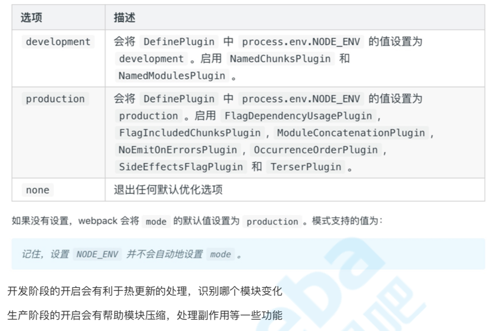

# 1、webpack基础用法

## webpack是什么

前端的工程化涉及：
- 如何使用模块化来组织代码？ esm cmd
- 转义预处理器 less sass postcss 转成 css
- es6+ => es5
- 开启开发服务环境，便于调试；
- 上线前要进行代码压缩，性能优化相关
- 为团队约定代码风格
- 集成单元测试
- 集成CI/CD
- ...

webpack本质就是一个模块打包构建工具，它会从⼊口模块出发，识别出源码中的模块化导⼊语句，递归地找出⼊口⽂件的所有依赖，将⼊口和其所有的依赖打包到⼀个单独的⽂件中

## 安装

不推荐使用全局安装！！！

```bash
# 安装webpack V4+版本时，需要额外安装webpack-cli
npm install webpack webpack-cli -D

# 安装指定版本
npm install webpack@<version> -D

# 检查版本
webpack -v
# 卸载
npm uninstall webpack webpack-cli
```

## 启动webpack执行构建

- 方式1：`npx webpack`
    - 如果直接命令行webapck，因为没有全局安装，则会报错
    - 使用 npx，则会到当前项目下的node_modules中去查找webpack执行
    ```bash
    # npx帮助我们在项⽬目中的node_modules⾥里里查找webpack
    npx webpack -v
    # ./node_modules/.bin/webpack -v
    ```
- 方式2
    - 指定pkg命令脚本


### webpack配置文件

零配置：webpack4号称0配置启动，但其实是个坑，限制太多了，根本不能满足日常的开发需求，还是需要自己动手配置

配置文件叫 webpack.config.js，不写，其也会默认内置。
```js
// 默认配置
const path = require('path');

module.exports = {
    // 必填，webpack执行构建入口
    entry: "./src/index.js",
    output: {
        // 将所有依赖的模块合并输出到main.js
        filename: "main.js",
        // 输出文件的存储路径，必须是绝对路径
        path: path.resolve(__dirname, "./dist")
    }
}
```

指定配置文件读取位置：
```
"dev": "webpack --config ./config/webpack.test.js"
```

## 基础配置
```js
module.exports = {
    entry: "./src/index.js", //打包⼊入⼝口⽂文件 output: "./dist", //输出结构
    mode: "production", //打包环境
    module: {
        rules: [
            //loader模块处理理
            {
                test: /\.css$/,
                use: "style-loader"
            }
        ]
    },
    plugins: [new HtmlWebpackPlugin()] //插件配置 };
}
```

### mode
Mode⽤来指定当前的构建环境：
- production
- development
- none
设置mode可以⾃动触发webpack内置的函数，达到优化的效果



### entry

指定webpack打包⼊口⽂件：Webpack 执行构建的第⼀步将从 Entry 开始，可抽象成输入。有3种指定方式：

- 字符串：只会产出1个打包后的bundle文件，里面包含了index.js的代码片段（chunk）
    ```js
    // 单⼊口 SPA，本质是个字符串
    entry: {
        main: './src/index.js'
    }
    // 相当于简写，打包出 main.js
    entry: "./src/index.js"
    ```
- 数组：也只会生成1个bundle，但里面包含了a.js、b.js的代码片段（chunk）
    ```js
    entry: ["./src/a.js", "./src/b.js"]
    ```
- 对象：
    ```js
    // 多⼊口 entry是个对象
    entry: {
        index: "./src/index.js",
        login: "./src/login.js"
    }
    ```

### output
打包转换后的⽂件输出到磁盘位置：输出结果，在 Webpack 经过⼀系列处理并得出最终想要的代码后输出结果。
```js
output: {
    filename: "bundle.js", // 输出⽂件的名称
    path: path.resolve(__dirname, "dist") // 输出⽂件到磁盘的⽬录，必须是绝对路径
},

// 多⼊口的处理
output: {
    filename: "[name][chunkhash:8].js", // 利用占位符，⽂件名称不要重复
    path: path.resolve(__dirname, "dist") // 输出⽂件到磁盘的⽬录，必须是绝对路径
},
```
filename，是指打包生成的入口文件的名称，而chunkFilename，是入口文件的bundle中引入的其他bundle的名称。
```js
output: {
    path: path.resolve(__dirname, './dist'),
    filename: '[name].js',
    chunkFilename: '[name].chunk,js'
},
```


### module、chunk、bundle3者的关系
- `module` 在开发中的所有的资源(.js、.css、.png)都是module，是webpack打包前的概念。
- `chunk` 是webpack在进行模块的依赖分析的时候，代码分割出来的代码块。一个 chunk 可能包含若干 module。
- `bundle` 最终输出到用户端的chunk，被称之为bundle；
    - 一般一个chunk对应一个bundle
        - 只有在配置了sourcemap时，才会出现一个chunk对应多个bundle的情况。
        - 而在entry指定数组，多个chunk会打包到一个bundle中。

### webpackBootstrap启动函数

打包后的代码是 webpackBootstrap启动函数，实际是一个自执行函数：
- webapckBootstrap函数，定义了 __webpack_require__ ，帮助我们处理模块化语句
- webapckBootstrap函数，接收一个对象，即打包的文件代码

```js
/******/ (function(modules) { // webpackBootstrap
/******/ 	// The module cache
/******/ 	var installedModules = {};
/******/
/******/ 	// The require function
/******/ 	function __webpack_require__(moduleId) {
/******/
/******/ 		// Check if module is in cache
/******/ 		if(installedModules[moduleId]) {
/******/ 			return installedModules[moduleId].exports;
/******/ 		}
/******/ 		// Create a new module (and put it into the cache)
/******/ 		var module = installedModules[moduleId] = {
/******/ 			i: moduleId,
/******/ 			l: false,
/******/ 			exports: {}
/******/ 		};
/******/
/******/ 		// Execute the module function
/******/ 		modules[moduleId].call(module.exports, module, module.exports, __webpack_require__);
/******/
/******/ 		// Flag the module as loaded
/******/ 		module.l = true;
/******/
/******/ 		// Return the exports of the module
/******/ 		return module.exports;
/******/ 	}
/******/
/******/
/******/ 	// expose the modules object (__webpack_modules__)
/******/ 	__webpack_require__.m = modules;
/******/
/******/ 	// expose the module cache
/******/ 	__webpack_require__.c = installedModules;
/******/
/******/ 	// define getter function for harmony exports
/******/ 	__webpack_require__.d = function(exports, name, getter) {
/******/ 		if(!__webpack_require__.o(exports, name)) {
/******/ 			Object.defineProperty(exports, name, { enumerable: true, get: getter });
/******/ 		}
/******/ 	};
/******/
/******/ 	// define __esModule on exports
/******/ 	__webpack_require__.r = function(exports) {
/******/ 		if(typeof Symbol !== 'undefined' && Symbol.toStringTag) {
/******/ 			Object.defineProperty(exports, Symbol.toStringTag, { value: 'Module' });
/******/ 		}
/******/ 		Object.defineProperty(exports, '__esModule', { value: true });
/******/ 	};
/******/
/******/ 	// create a fake namespace object
/******/ 	// mode & 1: value is a module id, require it
/******/ 	// mode & 2: merge all properties of value into the ns
/******/ 	// mode & 4: return value when already ns object
/******/ 	// mode & 8|1: behave like require
/******/ 	__webpack_require__.t = function(value, mode) {
/******/ 		if(mode & 1) value = __webpack_require__(value);
/******/ 		if(mode & 8) return value;
/******/ 		if((mode & 4) && typeof value === 'object' && value && value.__esModule) return value;
/******/ 		var ns = Object.create(null);
/******/ 		__webpack_require__.r(ns);
/******/ 		Object.defineProperty(ns, 'default', { enumerable: true, value: value });
/******/ 		if(mode & 2 && typeof value != 'string') for(var key in value) __webpack_require__.d(ns, key, function(key) { return value[key]; }.bind(null, key));
/******/ 		return ns;
/******/ 	};
/******/
/******/ 	// getDefaultExport function for compatibility with non-harmony modules
/******/ 	__webpack_require__.n = function(module) {
/******/ 		var getter = module && module.__esModule ?
/******/ 			function getDefault() { return module['default']; } :
/******/ 			function getModuleExports() { return module; };
/******/ 		__webpack_require__.d(getter, 'a', getter);
/******/ 		return getter;
/******/ 	};
/******/
/******/ 	// Object.prototype.hasOwnProperty.call
/******/ 	__webpack_require__.o = function(object, property) { return Object.prototype.hasOwnProperty.call(object, property); };
/******/
/******/ 	// __webpack_public_path__
/******/ 	__webpack_require__.p = "";
/******/
/******/
/******/ 	// Load entry module and return exports
/******/ 	return __webpack_require__(__webpack_require__.s = "./src/index.js");
/******/ })
/************************************************************************/
/******/ ({

/***/ "./src/index.js":
/*!**********************!*\
  !*** ./src/index.js ***!
  \**********************/
/*! no static exports found */
/***/ (function(module, exports) {

eval("console.log('lalallal')\n\n//# sourceURL=webpack:///./src/index.js?");

/***/ })

/******/ });
```


### loader

- 在Webpack里，一切皆模块，一个模块对应着一个⽂件。Webpack 会从配置的 Entry 开始递归找出所有依赖的模块。
- webpack默认只支持js、json格式的文件，
- 因此，当webpack处理到不认识的模块时，需要在webpack中的module处进行配置，当检测到是什么格式的模块，就使用什么loader来处理。

loader执行顺序是：自后往前，自下向上

css-loader分析css模块之间的关系，并合成⼀个css，将其转成js字符串放到bundle文件中去，style-loader会从bundle文件中把css的字符串提取出来，在html文件头部创建style标签，将css字符串放进去，从而让浏览器可以解析css。
```js
{
    test: /\.css$/,
    use: [
        {
            loader: "style-loader",
            options: {
                injectType: "singletonStyleTag" // 将所有的style标签合并成⼀个
            },
        },
        "css-loader"
    ]
}
```

### plugin

plugin 可以在webpack运行到某个阶段的时候，帮你做⼀些事情，类似于⽣命周期的概念

扩展插件，在 Webpack 构建流程中的特定时机注⼊入扩展逻辑，来改变构建结果或做你想要的事情。

作⽤于整个构建过程

- HtmlWebpackPlugin：会在打包结束后，⾃动⽣成⼀个html⽂件，并把打包⽣成的js模块引⼊到该html中。
- clean-webpack-plugin


