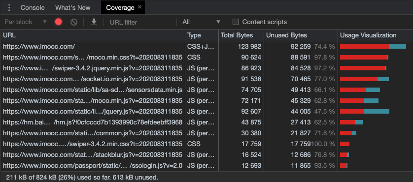
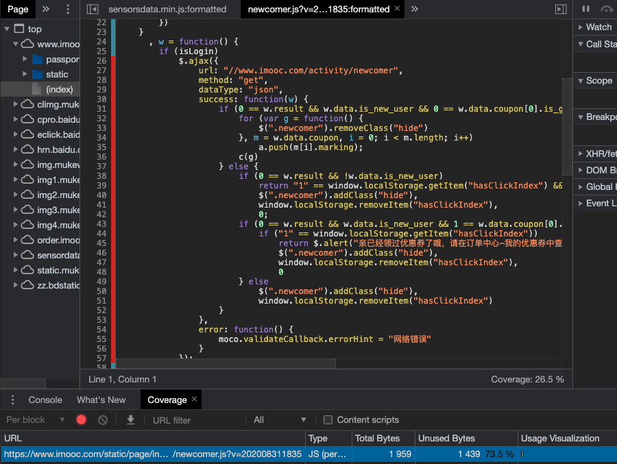

# 3、webpack 实战配置

## WebpackDevServer 开发服务器

提升开发效率的利器：每次改完代码都需要重新打包⼀次，打开浏览器，刷新⼀次，很麻烦。WebpackDevServer 来改善这块的体验。

```bash
npm install webpack-dev-server -D
```

```js
"scripts": {
    "dev:server": "webpack-dev-server"
},
```

```js
devServer: {
    contentBase: "./dist", // 指定静态资源服务目录
    open: true, // 自动打开浏览器窗口
    port: 8081
},
```

```bash
npm run dev:server
```

启动服务后，会发现`dist⽬录没有了`，这是因为 devServer 打包后的模块不会放在 dist ⽬录下，⽽是放到内存中，从⽽提升速度。

### 前后端分离开发模式：本地 mock，解决跨域

联调期间，前后端分离，直接获取数据会跨域，上线后我们使⽤ nginx 转发，开发期间，webpack 就可以搞定这件事。

mock 数据，可以本地通过 express 起一个服务：

```bash
npm i express -D
```

```js
"scripts": {
    "server": "node server.js"
},
```

```js
//server.js
const express = require("express");
const app = express();

app.get("/api/info", (req, res) => {
	res.json({
		name: "john",
		age: 29,
		msg: "mock mock"
	});
});

app.listen("9092");

// node server.js
// http://localhost:9092/api/info
```

```js
// npm i axios -D
// index.js
import axios from "axios";

axios.get("http://localhost:9092/api/info").then(res => {
	console.log(res);
});
// 跨域报错
```

因为前后端 port 不同，会有跨域问题，因此需要配置 proxy：

```js
devServer: {
    contentBase: "./dist", // 指定静态资源服务目录
    open: true, // 自动打开浏览器窗口
    port: 8081,
    proxy: {
        "/api": {
            target: "http://localhost:9092"
        }
    }
},
```

将所有/api 开头的接口访问都转发到http://localhost:9092，因为是devServer访问，所以不会有同源策略限制。

修改 axios 的访问接口，则能正常 mock 数据：

```js
axios.get("/api/info").then(res => {
	console.log(res);
});
```

### HMR（Hot Module Replacement）热模块替换，热更新

```js
devServer: {
    contentBase: "./dist",
    open: true,
    hot: true, // 开启HMR
    hotOnly: true // 开启hotOnly，关闭浏览器自动刷新：无论HMR是否生效，浏览器都不要自动刷新
},
```

指定 hot 的模块是通过 websocket 推送到网页的。

#### HMR 加载样式、HMR 加载 JS

- 开启 CSS 模块 HMR
  - 像上述配置后，就能开启 CSS 的 HMR 了
  - 注意启动 HMR 后，css 抽离会不生效，还有不支持 contenthash，chunkhash
- 开启 JS 模块 HMR（**比较麻烦！！！**）

  - 上述配置后还不能开启 JS 的 HMR，需要在配置文件中引入 webpack 模块
    - `new webpack.HotModuleReplacementPlugin()`
  - 还需要，对需要热更新的模块进行监听回调`module.hot.accept('./number', callback)`

    - callback 中，需要先将对应的模块移除，再重新生成

    ```js
    //counter.js
    function counter() {
    	var div = document.createElement("div");
    	div.setAttribute("id", "counter");
    	div.innerHTML = 1;
    	div.onclick = function() {
    		div.innerHTML = parseInt(div.innerHTML, 10) + 1;
    	};
    	document.body.appendChild(div);
    }

    export default counter;
    ```

    ```js
    //number.js
    function number() {
    	var div = document.createElement("div");
    	div.setAttribute("id", "number");
    	div.innerHTML = 13000;
    	document.body.appendChild(div);
    }

    export default number;
    ```

    ```js
    //index.js
    import counter from "./counter";
    import number from "./number";
    counter();
    number();

    // 是否开启了HMR
    if (module.hot) {
    	// 监听需要开启热更新的模块，比如这里的number模块
    	module.hot.accept("./number", function() {
    		// 先移除number创建的div模块
    		document.body.removeChild(document.getElementById("number"));
    		// 再用number模块创建一个新的div模块
    		number();
    	});
    }
    ```

上面这样很麻烦的配置，是想说明原生实现 HMR 的原理。

当前 Vue、React 的 HMR 实现原理，也是每个模块（即组件）自动生成一个模块 id，监听后对应移除和重新生成。其分别借助 React-Hot-Loader、Vue-Loader 这种成熟的框架生态，来达到一键开启 HMR 的效果。

## ES6+如何使用：babel

### babel-loader @babel/core @babel/preset-env

```bash
npm i babel-loader @babel/core @babel/preset-env -D
```

- 在 Babel7 中 `babel-core` 和 `babel-preset` 被建议使用 `@babel` 开头**声明作用域**，因此应该分别下载 `@babel/core` 和· `@babel/presets`。就类似于 vue-cli 升级后 使用@vue/cli 一样的道理。
- **`@babel/core` 这个库负责「`Parser解析`」，具体的「`Transformer转换`」和「`Generator生成`」步骤则交给各种插件（`plugin`）和预设（`preset`）来完成，即 `@babel/preset-env`，它里面包含了 es，6，7，8 转 es5 的转换规则**
- `babel-loader` 是 webpack 与 `@babel/core` 的通信桥梁，它不会做把 es6 转成 es5 的⼯作，这部分⼯作是需要 @babel/preset-env 来做的。

```js
// Webpack.config.js
{
    test: /\.js$/,
    exclude: /node_modules/,
    use: {
        loader: "babel-loader",
        options: {
            presets: ["@babel/preset-env"]
        }
    }
}
```

### @babel/polyfill

通过上⾯的⼏步还不够，默认的 Babel 只⽀持 let 等⼀些基础的特性转换，Promise 等⼀些还有转换过来，这时候需要借助垫片`@babel/polyfill`，把 es 的新特性都装进来，来弥补低版本浏览器中缺失的特性。

注意是生产依赖-S，不是开发依赖：

```bash
# 注意是 -S
npm install @babel/polyfill -S
```

```js
//index.js 顶部
import "@babel/polyfill"; // 垫片，包含所有ES6+新特性代码
```

**按需加载，减少冗余**：上面直接引入，会发现打包的体积⼤了很多（起码多了 900+kb），这是因为 polyfill 默认会把所有特性注⼊进来，假如我希望，只有我⽤到的 es6+，才会注⼊，没⽤到的不注⼊，从⽽减少打包的体积，该如何配置呢？

```js
// Webpack.config.js
{
    test: /\.js$/,
    exclude: /node_modules/,
    use: {
        loader: "babel-loader",
        options: {
            presets: [
                [
                    "@babel/preset-env",
                    {
                        corejs: 3, // 新版本需要指定核⼼库版本，安装 npm install core-js@3 -S
                        useBuiltIns: "usage" // 按需注⼊，且入口处无需import "@babel/polyfill"了，此前都是用”entry“
                    }
                ]
            ]
        }
    }
}
```

`useBuiltIns` 选项是 babel7 的新功能，这个选项告诉 babel 如何配置 @babel/polyfill。它有 3 个参数可以使⽤:

- 1、`entry`: 需要在 webpack 的⼊口⽂件里 import "@babel/polyfill" 一次。`按需注⼊`，即 babel 会根据你的使⽤情况导⼊垫片，**没有使用的功能不会被导⼊相应的垫片**。（推荐）
- 2、`usage`: **不需要 import，全⾃动检测**，但是要安装 @babel/polyfill 。也是`按需注⼊`。(试验阶段，推荐)
- 3、false: 默认值，即如果你 import "@babel/polyfill" ，它不会排除掉没有使⽤的垫⽚，导致程序（bundle）体积会庞大。(不推荐)

请注意: usage 的行为类似 babel-transform-runtime，不会造成全局污染，因此也会不会对类似 Array.prototype.includes() 进行 polyfill。

为防止 babel 配置在 webpack.config.js 中太长，一般情况下，将 babel 单独的配置移到`.babelrc`文件中单独存在。新建`.babelrc`文件：

```js
// .babelrc
{
    presets: [
        // 一些预设插件
        [
            "@babel/preset-env",
            {
                targets: {
                    edge: "17",
                    firefox: "60",
                    chrome: "67",
                    safari: "11.1"
                },
                corejs: 3, // 新版本需要指定核⼼库版本，安装 npm install core-js@3 -S
                useBuiltIns: "usage" // 按需注⼊，且入口处无需import "@babel/polyfill"了，此前都是用”entry“
            }
        ]
    ]
}

//webpack.config.js
{
    test: /\.js$/,
    exclude: /node_modules/,
    loader: "babel-loader"
}
```

### 扩展：@babel/plugin-transform-runtime

当我们开发的是组件库，⼯具库这些场景的时候，polyfill 就不适合了，因为 polyfill 是注⼊到全局变量 window 下的，会污染全局环境。所以推荐闭包⽅式：`@babel/plugin-transform-runtime`，它不会造成全局污染。

```bash
npm install @babel/plugin-transform-runtime -D
npm install @babel/runtime -S
```

修改配置⽂件：注释掉之前的 presets，添加 plugins

```js
options: {
    presets: [
        [
            "@babel/preset-env",
            {
                useBuiltIns: "usage",
                corejs: 3
            }
        ]
    ],
    plugins: [
        [
            "@babel/plugin-transform-runtime",
            {
                "absoluteRuntime": false,
                "corejs": false,
                "helpers": true,
                "regenerator": true,
                "useESModules": false
            }
        ]
    ]
}
```

## Shimming 垫片的作用

其实我们使用的"@babel/polyfill"，就是一个垫片，来为低版本浏览器提供一些新的 API，本质上垫片就是为了解决一些旧版的兼容问题。

还有的场景，如果发现旧版的第三方库的某个模块中使用了`$`，但是没有主动引入，我们就需要使用 webpack 自己的提供的插件 `webpack.ProvidePlugin`，它会在有问题的模块中帮我们添加 **import \$ from 'jquery'**，从而使该模块中的`$`符号正常执行。

```js
plugins: [
	new webpack.ProvidePlugin({
		$: "jquery",
		_join: ["lodash", "join"]
	})
];
```

垫片还有很多其他场景。

## 配置 React 开发环境

React 开发环境需要在开发依赖，安装 babel 与 react 转换的插件`@babel/preset-react`，帮助转义 jsx。Vue 开发环境直接使用 vue-loader 就能解析.vue 文件、vue 语法。

```bash
npm install react react-dom -S
# 安装babel与react转换的插件
npm install @babel/preset-react -D
```

```js
// .babelrc
{
	presets: [
		// 一些预设插件
		[
			"@babel/preset-env",
			{
				corejs: 3, // 新版本需要指定核⼼库版本，安装 npm install core-js@3 -S
				useBuiltIns: "usage" // 按需注⼊，且入口处无需import "@babel/polyfill"了，此前都是用”entry“
			}
		],
		"@babel/preset-react"
	];
}
```

## Tree Shaking 摇树优化 和 sideEffects 副作用处理

`Tree Shaking`只支持 ESM，因为`Tree Shaking`只支持「静态引入」的方式。

开启`Tree Shaking`的方式如下：

```js
// webpack.config.js
mode: 'development',
optimization: {
    usedExport: true // 哪些导出的模块被使用了，才做打包
},
```

要在 package.json 中增加配置：

```js
"sideEffects": ["@babel/poly-fill"]
```

因为，对于比如 `import "@babel/poly-fill"`，其实没有导出任何东西，它实际上是在 window 全局对象上绑定了很多垫片方法。如果开启了 `tree shaking`，则会将其当成未导出任何内容的模块，将其忽略，不打包进 bundle 中。`"sideEffects": ["@babel/poly-fill"]`就是为了避免这种情况，在打包的时候，就不会处理@babel/poly-fill。

同理，对于 import "./style.css" 这种模块引入样式文件，也会被`tree shaking`去掉，所以，一般情况下，我们也要对样式引入做处理：

```js
"sideEffects": [
    "@babel/poly-fill",
    "*.css"
]
```

另外再说一点：

- 在`development`开发模式下，devtool 使用`'cheap-module-eval-source-map'`，即使开启了`tree shaking`，打包出来的 bundle 也**不会直接**去除未使用的导出，而是做好提示标记。
- 在`production`生产模式下，devtool 使用`'cheap-module-source-map'`，这样就**自动开启**了`tree shaking`，连 optimization: {usedExport: true}都不需要手动配置了。
  - 生产模式下开启`tree shaking`，才会将未使用的导出忽略，并且将打包的代码都压缩。

## Scope Hoisting 作用域提升

略

## Code Splitting 代码分割

Code Splitting 代码分割，本质上与 webpack 是没有关系的一个独立概念，在 webpack 之前，我们也需要自己将代码拆分（举栗 🌰：比如业务代码是 1mb，引入 lodash 是 1mb，打包到一起是 2mb，每当业务代码变更，用户都要加载 2mb，但如果分开打包，业务代码变更后，lodash 包无需重新加载，且一开始并行加载两个包，比一次加载一个打包要快，这就是代码分割的意义）。

webpack 中有一些插件，非常方便实现代码分割。

### webpack 实现代码分割有两种方式

- 1. 对于同步引入的代码，作如下配置后就可以自动进行代码分割：

```js
optimization: {
    splitChunks: {
        chunks: 'all'
    },
    usedExport: true // 哪些导出的模块被使用了，才做打包
},
```

- 2. 对于异步、动态引入（import()）的模块代码，即使不做上述配置，也会进行代码分割
  - 默认情况下，异步代码打包出的 bundle 是递增 id
  - 可以通过魔法注释，来为异步模块命名 `import(/* webpackChunkName:"lodash" */ 'lodash').then(({default: _}) => { ... })`

但其实，无论是同步还是异步的代码分割，SplitChunksPlugin 的配置都会对其影响：

### SplitChunksPlugin

- splitChunks: {}，设置为空对象，其实使用的是一套默认配置，如下：
  ```json
  splitChunks: {
      chunks: "async", // 'all'会对同步、异步代码都做分割，并会根据cacheGroups选项分组；'async'只对异步代码做分割；'initial'只对同步代码做分割
      minSize: 30000, // 某个依赖，至少大于此值，才做代码分割
      minChunks: 1, // 当一个模块，至少被引用了多少次之后，才进行代码分割
      maxAsyncRequests: 5,
      maxInitialRequests: 3, // 入口文件，最多请求的bundle数
      automaticNameDelimiter: '~', // 分割后名称连接符，比如分组+entry键值：vendors~main.js，当cacheGroups里某个组配置了filename时，则直接使用filename命名
      name: true,
      cacheGroups: { // 代码缓存组
          vendors: {
              test: /[\\/]node_modules[\\/]/, // 匹配从node_modules中引入的模块
              // filename: 'vendors.js', // 直接命名
              priority: -10 // 当一个模块符合好几个组的分组要求时，就按优先级来决定打包到哪个组中，-10大于-20，所以模块优先打包在vendors组中
          },
          default: {
              minChunks: 2,
              priority: -20,
              reuseExistingChunk: true, // 如果某个模块之前已经被分割打包，之后再引用时，会忽略，然后直接复用之前的打包
              // filename: 'common.js' // 直接命名
          }
      }
  }
  ```
- chunks: "async"：（默认值是 async）
  - 'all'会对同步、异步代码都做分割，并会根据 cacheGroups 选项分组；
  - 'async'只对异步代码做分割；
  - 'initial'只对同步代码做分割；
- cacheGroups: 缓存组
  - 分组，test 匹配

## 懒加载 Lazy Loading

懒加载其实并不是 webpack 中的概念，而且它也很简单，其实就是使用 动态 import() 和 require.ensure 两个 API 来实现，而且这两个方法的根本实现都是相同的。

这里借此说明一下，webpack 在**有异步懒加载模块的打包结果构成**：包含 3 个主要 bundle 以及若干个异步 bundle：

- runtime.js 或者叫 manifest.js
- main.js 或者叫 app.js
- vendors.js
- 若干异步 bundle.js: 0.js

::: details 精简后还是蛮长的 打包结果代码

- runtime.js 或者叫 manifest.js:

```js
/******/ (function(modules) {
	// webpackBootstrap
	/******/ // install a JSONP callback for chunk loading
	/******/ function webpackJsonpCallback(data) {
		// ...
		/******/
	} // The require function
	/******/
	/******/ /******/ function __webpack_require__(moduleId) {
		/******/
		/******/ // Check if module is in cache
		/******/ if (installedModules[moduleId]) {
			/******/ return installedModules[moduleId].exports;
			/******/
		} // Create a new module (and put it into the cache)
		/******/ /******/ var module = (installedModules[moduleId] = {
			/******/ i: moduleId,
			/******/ l: false,
			/******/ exports: {},
			/******/ hot: hotCreateModule(moduleId),
			/******/ parents:
				((hotCurrentParentsTemp = hotCurrentParents),
				(hotCurrentParents = []),
				hotCurrentParentsTemp),
			/******/ children: []
			/******/
		}); // Execute the module function
		/******/
		/******/ /******/ modules[moduleId].call(
			module.exports,
			module,
			module.exports,
			hotCreateRequire(moduleId)
		); // Flag the module as loaded
		/******/
		/******/ /******/ module.l = true; // Return the exports of the module
		/******/
		/******/ /******/ return module.exports;
		/******/
	} // This file contains only the entry chunk. // The chunk loading function for additional chunks
	/******/
	/******/ /******/ /******/ __webpack_require__.e = function requireEnsure(
		chunkId
	) {
		/******/ var promises = []; // JSONP chunk loading for javascript
		/******/ /******/ var installedChunkData = installedChunks[chunkId];
		/******/ if (installedChunkData !== 0) {
			// 0 means "already installed".
			/******/ // a Promise means "currently loading".
			/******/ if (installedChunkData) {
				/******/ promises.push(installedChunkData[2]);
				/******/
			} else {
				// ...
			}
			/******/
		}
		/******/ return Promise.all(promises);
		/******/
	};
	/******/
	/******/ var jsonpArray = (window["webpackJsonp"] =
		window["webpackJsonp"] || []);
	/******/ var oldJsonpFunction = jsonpArray.push.bind(jsonpArray);
	/******/ jsonpArray.push = webpackJsonpCallback;
	/******/ jsonpArray = jsonpArray.slice();
	/******/ for (var i = 0; i < jsonpArray.length; i++)
		webpackJsonpCallback(jsonpArray[i]);
	/******/ var parentJsonpFunction = oldJsonpFunction;
	/******/
})(
	/************************************************************************/
	/******/ []
);
```

- main.js

```js
(window["webpackJsonp"] = window["webpackJsonp"] || []).push([
	["main"],
	{
		/***/ "./src/index.js":
			/*!**********************!*\
  !*** ./src/index.js ***!
  \**********************/
			/*! no static exports found */
			/*! all exports used */
			/***/ function(module, exports, __webpack_require__) {
				eval(
					"document.addEventListener('click', () => {\n  __webpack_require__.e(/*! import() */ 0).then(__webpack_require__.bind(null, /*! ./click.js */ \"./src/click.js\")).then(({\n    default: func\n  }) => {\n    func();\n  });\n});//# sourceURL=[module]\n//# sourceMappingURL=data:application/json;charset=utf-8;base64,eyJ2ZXJzaW9uIjozLCJmaWxlIjoiLi9zcmMvaW5kZXguanMuanMiLCJzb3VyY2VzIjpbIndlYnBhY2s6Ly8vLi9zcmMvaW5kZXguanM/YjYzNSJdLCJzb3VyY2VzQ29udGVudCI6WyJkb2N1bWVudC5hZGRFdmVudExpc3RlbmVyKCdjbGljaycsICgpID0+e1xuXHRpbXBvcnQoLyogd2VicGFja1ByZWZldGNoOiB0cnVlICovICcuL2NsaWNrLmpzJykudGhlbigoe2RlZmF1bHQ6IGZ1bmN9KSA9PiB7XG5cdFx0ZnVuYygpO1xuXHR9KVxufSk7XG4iXSwibWFwcGluZ3MiOiJBQUFBO0FBQ0EsbUhBQUE7QUFBQTtBQUFBO0FBQ0E7QUFDQTtBQUNBIiwic291cmNlUm9vdCI6IiJ9\n//# sourceURL=webpack-internal:///./src/index.js\n"
				);
				/***/
			}
	},
	[["./src/index.js", "runtime"]],
	[0]
]);
```

- vendors.js

```js
(window["webpackJsonp"] = window["webpackJsonp"] || []).push([
	["vendors~main"],
	{
		/***/ "./node_modules/_lodash@4.17.20@lodash/lodash.js":
			/*!*******************************************************!*\
  !*** ./node_modules/_lodash@4.17.20@lodash/lodash.js ***!
  \*******************************************************/
			/*! no static exports found */
			/*! exports used: default */
			/***/ function(module, exports, __webpack_require__) {
				// ...
				/***/
			}
		// ...
	}
]);
```

- 0.js

```js
(window["webpackJsonp"] = window["webpackJsonp"] || []).push([
	[0],
	{
		/***/ "./src/click.js":
			/*!**********************!*\
  !*** ./src/click.js ***!
  \**********************/
			/*! exports provided: default */
			/*! all exports used */
			/***/ function(module, __webpack_exports__, __webpack_require__) {
				"use strict";
				eval(
					"__webpack_require__.r(__webpack_exports__);\nfunction handleClick() {\n  const element = document.createElement('div');\n  element.innerHTML = 'Dell Lee';\n  document.body.appendChild(element);\n}\n\n/* harmony default export */ __webpack_exports__[\"default\"] = (handleClick);//# sourceURL=[module]\n//# sourceMappingURL=data:application/json;charset=utf-8;base64,eyJ2ZXJzaW9uIjozLCJmaWxlIjoiLi9zcmMvY2xpY2suanMuanMiLCJzb3VyY2VzIjpbIndlYnBhY2s6Ly8vLi9zcmMvY2xpY2suanM/MzcwOCJdLCJzb3VyY2VzQ29udGVudCI6WyJmdW5jdGlvbiBoYW5kbGVDbGljaygpIHtcblx0Y29uc3QgZWxlbWVudCA9IGRvY3VtZW50LmNyZWF0ZUVsZW1lbnQoJ2RpdicpO1xuXHRlbGVtZW50LmlubmVySFRNTCA9ICdEZWxsIExlZSc7XG5cdGRvY3VtZW50LmJvZHkuYXBwZW5kQ2hpbGQoZWxlbWVudCk7XG59XG5cbmV4cG9ydCBkZWZhdWx0IGhhbmRsZUNsaWNrO1xuIl0sIm1hcHBpbmdzIjoiQUFBQTtBQUFBO0FBQ0E7QUFDQTtBQUNBO0FBQ0E7QUFDQTtBQUNBIiwic291cmNlUm9vdCI6IiJ9\n//# sourceURL=webpack-internal:///./src/click.js\n"
				);

				/***/
			}
	}
]);
```

:::

结合上面打包后的代码，分析下打包文件具体原理：

- **manifest.js** 内部是一个 IIFE，称为`webpackBootstrap启动器函数`，这个函数会接受一个空数组（命名为 modules）作为参数。

  - 除**manifest.js**外的所有其他 bundle，都往 window["webpackJsonp"]数组里面 push chunkId 和 含有的 modules。
  - 而**manifest.js**提供 3 个核心方法： - 1、提供全局函数 `webpackJsonpCallback(data)` 来处理全局的 window["webpackJsonp"] 数组。

    - 2、提供 `__webpack_require__(moduleId)`：作用就是加载执行对应的 module，并且缓存起来。

      - 先判断下 installedModules 中是否有缓存，有则直接返回其 module.exports；
      - 没有的话就执行，将 module 输出的内容挂载到 module.exports 对象上，同时缓存到 installedModules 中。
      - 注意：每个 module 只会在最开始依赖到的时候加载一次，如果有继续依赖的 module，则递归执行，且加载过的依赖值也只执行一次。

    - 3、提供 `__webpack_require__.e(chunkId)`，也就是 `requireEnsure(chunkId)` 异步加载模块，返回 promise。
      - 简单地说，是用来 懒加载某个 chunk 的
      - 传入一个 chunkId，先判断该 chunk 是否已被加载，是的话直接返回一个成功的 promise，并让 then 执行函数的 `__webpack_require__` 对应的 module 即可；
      - 否则，会动态创建一个 script 标签去加载对应 chunk，加载成功后会将该 chunk 中所有 module 注入到 webpackJsonp 中

- 参考链接：[webpack 是如何实现动态导入的](https://juejin.im/post/5d26e7d1518825290726f67a)
- 参考链接：[简单易懂的 webpack 打包后 JS 的运行过程](https://juejin.im/post/5a23b130f265da432003101a)
- 参考链接：[看看 webpack 都打出了些什么](https://juejin.im/post/5ad8c96ff265da0ba062b190)

## 打包分析，Preloading，Prefetching

### 打包分析

可以使用`webpack-bundle-analyzer`插件来查看打包情况。

::: tip 为什么 webpack 默认代码拆分是 async

```js
optimization: {
    splitChunks: {
        chunks: 'async' // 默认值
    },
},
```

这是因为，webpack 官方也认为，**对于同步代码分割，其实只能增加个缓存，对于浏览器性能的提升是非常有限的**。`真正可以提升性能的，是提高浏览器代码利用率`，**多写异步加载代码，将异步代码分割出去，只有真正用到时才加载**。

怎样查看代码的使用率呢？可以通过 chrome 控制台的`coverage选项`（cmd+shift+p 输入 coverage 进入）

以慕课网为例，可以看到左下角代码使用率，其中的一些代码（如下图红色部分），在首页加载后并未使用，可以考虑拆分成异步代码分包。

:::

### 结合 webpack 使用 preload、prefetch

比如首页的登录模态框代码，就比较适合异步分包出来。。但是可能会有个问题，当点击登录按钮时，才去加载登录模态框的 js 包，可能会比较慢。这时最佳的解决方案是：`异步分包，并结合prefetch`来使用：

```js
document.addEventListener("click", () => {
	import(/* webpackPrefetch: true */ "./loginModal.js").then(
		({ default: func }) => {
			func();
		}
	);
});
```

prefetch 会等到页面主要代码加载完成空闲后，再加载。而 preload 是和主流代码一起加载的，因此这里应该使用 prefetch。

## PWA 打包配置

使用 WorkBoxPlugin 插件

## TypeScript 打包配置

```js
module.exports = {
	mode: "production",
	entry: "./src/index.tsx",
	module: {
		rules: [
			{
				test: /\.tsx?$/,
				use: "ts-loader",
				exclude: /node_modules/
			}
		]
	},
	output: {
		filename: "bundle.js",
		path: path.resolve(__dirname, "dist")
	}
};
```

ts-loader 需要使用根目录下的 tsconfig.json 配置文件，新建 tsconfig.json，定义打包编译时的选项：

```json
{
	"compilerOptions": {
		"outDir": "./dist", // 输出目录
		"module": "es6", // 模块引入方式
		"target": "es5", // 编译目标
		"allowJs": true
	}
}
```

如果使用第三方库，比如 lodash，想要有依赖库的错误检查类型提示，就还需要安装@types/lodash，那么怎么知道哪些库提供了 ts 支持的 types 呢？可以通过：[DefinitelyTyped](https://github.com/DefinitelyTyped/DefinitelyTyped)

For an NPM package "foo", typings for it will be at "@types/foo". If you can't find your package, look for it on [TypeSearch](https://microsoft.github.io/TypeSearch/).

## ESLint webpack 配置

```bash
# 安装eslint
npm install eslint -D
# 初始化lint配置
npx eslint --init
# 可以使用Airbnb的规范，比较变态，但可以在其基础上做修改
```

安装之后，根目录下会多出一个.eslintrc.js 配置文件：

```js
// .eslintrc.js
module.exports = {
	extends: "airbnb"
};
```

airbnb 的检测校验，只支持 es 代码的校验，对于使用 jsx 语法，react 代码等，就需要扩展 airbnb 的检测支持。需要更换解析器，默认是 ESpree，我们使用 babel-eslint：

```bash
npm install babel-eslint -D
```

```js
// .eslintrc.js
module.exports = {
	extends: "airbnb",
	parser: "babel-eslint", // 更换解析器，默认是ESpree，使用 babel-eslint 替代
	rules: {
		"react/prefer-stateless-function": 0 // 覆盖airbnb的规则，禁用此项规则
	}
};
```

在开发环境下，团队在写代码时，使用 vscode 的插件 ESlint，可以读取项目中的.eslintrc.js 配置，来对代码做 lint 校验提示。而对于使用其他编辑器，没有合适插件的同学，我们就可以将 eslint 与 webpack 打包相结合，来做出提示：

- 1、首先，增加 eslint-loader，在打包编译时先对代码进行校验，再使用 babel-loader 做转换。

```js
{
    test: /\.js$/,
    exclude: /node_modules/,
    use: ["babel-loader", "eslint-loader"]
}
```

- 2、接着，在 devServer 配置中，增加 overlay: true，这样在开发环境中，启动 devServer，编译后，就可以直接在网页中提示出代码 lint 校验了。

```js
devServer: {
	overlay: true;
}
```

- 3、但实际上，使用 eslint-loader 还是会对打包速度造成影响，如果对打包速度影响比较大的话，更推荐的做法，其实是使用 vscode 插件在开发时做好 lint 提示，并结合 husky(哈士奇) 注册在 git hook 中的 pre-commit 钩子函数，执行 lint-staged；
