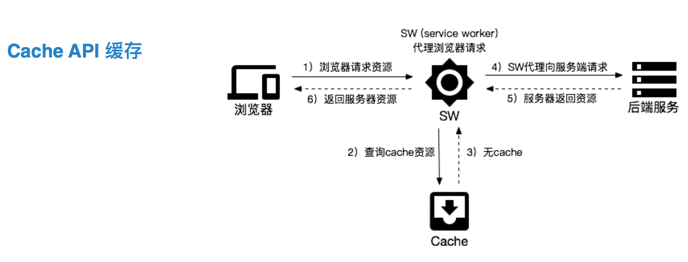
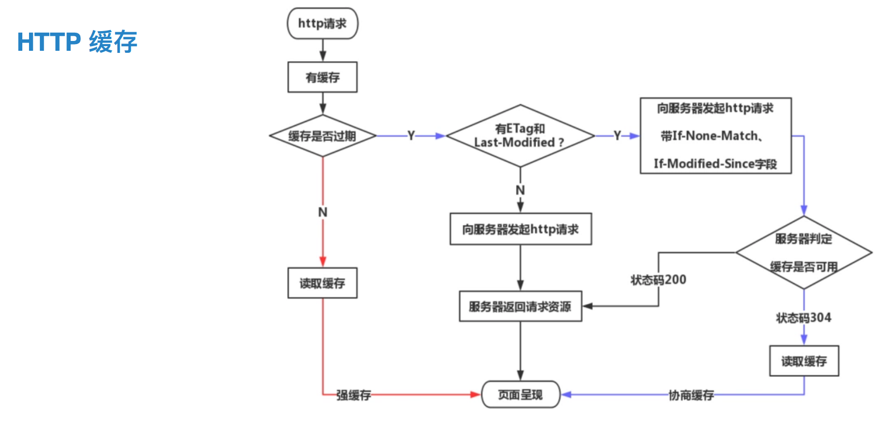

# 技术学院分享：前端性能工程化

## 1.⽹络传输

⽹络层⾯的优化是前端性能优化中⽐较容易忽视的⼀个⽅⾯，它具有⾜够的重要性

-   1.开启 HTTP 2.0
    -   多路复⽤：多个请求复⽤⼀次⽹络连接，实现真正意义的并发。
    -   ⼆进制传输：解析更⾼效、体积更⼩、不易出错
    -   消息头压缩：压缩消息头体积，建⽴“字典”，⽤索引号表示重复的字符串（h1 的传输头体积平均为 500 字节，h2 头体积为 20 字节，收益明显）
    -   服务端推送：在⽤户请求⻚⾯ HTML 时，⼀并把⻚⾯其他资源主动推送过来（不推荐开启，一是 nginx 层的配置和我们前端构建的资源映射关系不太好打通，不易维护，二是我们有成本更小的替代方案——preload 预加载，）
-   2.使⽤ CDN 部署静态资源
-   3.使⽤ DNS 预解析
    -   DNS 解析是⽐较耗时的操作，⼀些⽐较⼩的⽹站域名的解析甚⾄需要 0.5s 之久。
    -   `<link rel="dns-prefetch" href="//example.com">`
-   4.提前建⽴⽹络连接
    -   浏览器在建⽴⽹络连接时，要经过 DNS 解析、TCP 握⼿等过程，在 https 场景下还需要进⾏ TLS 加密信息验证。这些都是相当耗时的操作。我们可以使⽤ preconnet 的 link 标签来提前触发上述操作
    -   `<link rel="preconnect" href="//example.com">`
    -   `<link rel="preconnect" href="//cdn.example.com" crossorigin>`
-   5.域名收敛
    -   域名收敛把⻚⾯资源部署在尽可能少的域名下
    -   域名发散把⻚⾯资源部署在尽可能多的域名下
        -   尽可能进⾏域名收敛：随着时代发展『域名发散』逐渐落后，使⽤ 『域名收敛』配合 H2，可以最⼤化的节省 DNS 解析、TCP 建连等⽹络成本，更好的发挥其多路复⽤的优势，⼤幅提升⻚⾯性能。
-   6.使⽤ brotli 压缩
    -   ⾕歌在 2015 年发布 Brotli 压缩算法，相⽐ gzip，它具有更⾼的压缩⽐和更快的压缩性能
        -   JavaScript 体积⽐ gzip ⼩ 14%，HTML 体积⽐ gzip ⼩ 21%，CSS 体积⽐ gzip ⼩ 17%
-   7.优化 HTTPS
    -   ⽬前整个互联⽹都在⼤⼒推⾏ https，但是 https 的多次握⼿、 TLS 相关算法运算等会造成额外的开销，**导致未经优化的 https 的性能相⽐ http 差距较⼤**。
    -   优化 https 的几个手段：
        -   Session Resume：把 https 中非对称加密的后的结果保存在 Session 中，下一次再连接时就能复用了（TLB 层和 CDN 都默认开启了）
        -   OCSP Stampling（RFC6066 第 8 节）：加速 https 证书认证的过程，由服务端直接返回 OCSP 内容，⽽不需要客户端额外查询（TLB 已经默认开启了，CDN 还未默认开启）
        -   使⽤ TLS 1.3：只需要⼀次往返时间（ 1-RTT ）就可以完成握⼿（1.2 完成握手需要 2 个 RTT，所以粗估，建连由 1.2 升级到 1.3 时，可以节省 100ms）
        -   TCP Fast Open（RFC7413）：⼀个 RTT 的时间内 syn 包发出的同时捎上应⽤层的数据（当前公司基建并不支持这么做）
        -   HSTS：强制客户端（如浏览器）使⽤ HTTPS 与服务器创建连接（http 跳转 https 的时候，利用此可以减少一次 302 请求）

## 2.使⽤缓存加速⻚⾯

前端领域涉及到的缓存种类⽐较多，凡是涉及到数据存储的场景，我们都可以称为缓存

-   **1.DNS 缓存**
    -   浏览器发起 DNS 请求时，首先去浏览器缓存中查找 =》 然后去操作系统缓存中查找（vhost 的文件代理其实就属于这一级） =》 `Local DNS递归查找` DNS 缓存（DNS 缓存，会遍布在整个 DNS 解析的网络上，顺着 3 级域名，2 级域名，1 级域名逐层查找）=》如果最终没有查到，就只能从 root 开始执行迭代查询了（即 DNS 解析）
    -   DNS 解析很耗时，所以做了上述很多层缓存，所以可以尽早开启 dns 缓存，比如之前说的 dns 预解析
    -   除了 DNS 预解析，还有一种场景：一些 3、4 线城市，Local DNS 性能较差，会使用户卡很久，一些审核团队，在登录内部系统时，可以配置 vhost，通过这种 hack 的方式，直接把域名和 ip 写死到操作系统层，就可以跳过 LocalDNS 查询的冗长过程。
-   **2.宿主浏览器缓存**
    -   ⽤户重复请求资源时，会按照⼀定的层次顺序来获取缓存资源。若当前层缓存可⽤则⽴即返回，否则寻找下⼀层缓存
    ```
    => memory cache => cache api => http cache => push cache => server
    ```
    1. 优先级最高的 `Memory缓存`（disk cache 和 memory cache），一般同步 js 更容易生成内存缓存，一步 js 更容易生成磁盘缓存。
    2. 当没有生成内存缓存时，会去找`Cache API缓存`，是有 PWA 生成的缓存
       
    3. 当 cache api 缓存也没有，就会使用`HTTP缓存`（强缓存 和 协商缓存）
       
    4. 最后一层，`Push缓存`，当我们使⽤ H2 的 Server Push 功能时，浏览器会⽣成⼀层 push 缓存。
        - 这个缓存的存在感⽐较弱，当其他形式的宿主缓存都失效时，才会使⽤ push 缓存，是一种兜底缓存方案。
-   **3.运⾏时缓存**
    -   运⾏时缓存是我们的⻚⾯逻辑执⾏过程中可以接触到的缓存，往往与业务场景耦合度较⾼，是⼀个需要因地制宜优化的场景。
    -   Cookie：存放⼀些简单数据（这些数据应该是客户端和服务端都关心的，如果服务端不关心，放在这里就是造成冗余）
    -   LocalStorage：存储具有⼀定体积的数据（只是客户端关心，容量大，是 key-val 形式的，不推荐存储结构化的数据，因为首先其数据量大，再者 json 的序列化和反序列化也比较慢）
    -   DB（特指 indexDB）：适合存储⼤量结构化数据，但 DB 不像前两种是同步的，DB 是一种异步方式
    -   Memory（js 的 memory stack）：存放临时数据（缓存一些昂贵的资源，耗时的运算结果、查找到的 dom 节点等等）

## 3.静态资源加载

1.资源预加载 - 预加载当前⻚⾯的资源 - 我们可以使⽤ link rel preload 来声明当前⻚⾯所需要的核⼼资源，可以是⼀些关键字体、样式、脚本等资源：
`<link rel="preload" href="/assets/font.woff" as="font" type=“font/woff">` - 在不⽀持使⽤ link type preload 的宿主环境中，我们可以通过 JS 编码来提前发起资源请求.

        ```js
        const preloadImg = url => {
            const img = new Image();
            img.src = url;
        }
        ```
    - 预加载下级⻚⾯的资源
        - 我们可以使⽤ link rel prefetch 来声明跳转后的⻚⾯所需要的核⼼资源。
        - 当⽤户停留在当前⻚⾯时，浏览器会在合适的空闲时机提前加载跳转后所需的资源，提升⽤户后续浏览的体验。

-   `<link rel="prefetch" href="/library.js" as="script">` - 使⽤ link prerender 来发起对⼆级⻚⾯的提前请求和⻚⾯渲染： - `<link rel="prerender" href=“https://eden.bytedance.net”>`

从资源加载的⻆度考虑静态资源的优化，从⽹络请
求时机、⽂件体积、加载⽅式等⽅⾯来进⾏优化

4.代码运⾏时
针对宿主环境中实际执⾏的运⾏时代码的
相关优化

5.服务接⼝
针对服务端接⼝，进⾏专项优化，缩短 API 请
求的时间消耗
