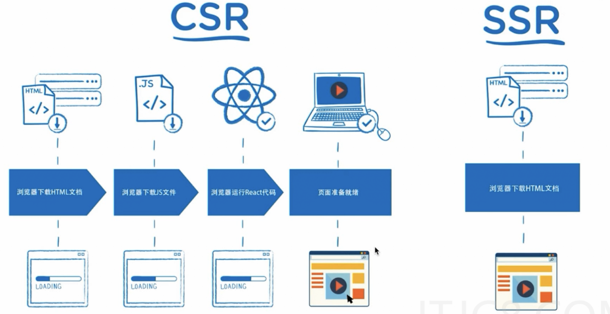
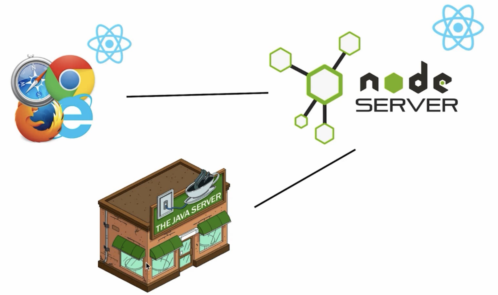
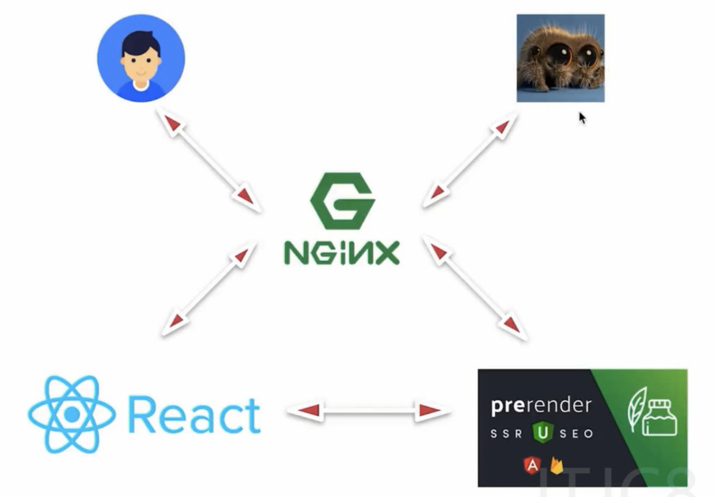

# 慕课实战：React服务器渲染原理解析与实践

## 课程笔记

### 课程简介

- SSR简介
- 搭建React SSR框架，解决CSR的问题
- 在框架中如何实现同构
- 框架中路由机制的实现
- 框架与Redux的融合
- 框架作为中间层的只能处理
- 细节调优
- 样式相关的webpack配置
- 框架SEO特性优化
- 扩展：预渲染技术

### 第一章 服务器端渲染基础

#### 什么是服务端渲染SSR
- 创建服务器，比如用express
- 启动服务器
- 服务器直接通过 res.send(`<html><title>SSR</title></html>`) 返回显示内容
    - 即显示内容在服务器直接生成了，浏览器直接显示

#### 什么是客户端渲染CSR
- 即服务端返回只有一个页面架子，一个div id="root"的标签，页面中具体内容都是没有的
- 通过引用bundle.js文件，加载页面内容

#### React客户端渲染的优劣势
- CSR优势：前后端分离，各自负责自己的事情，提升团队开发效率：
    - 「前端」 --Ajax--> 「后端」
    - 「前端」 <--JSON-- 「后端」
- CSR劣势：首屏等待时间较长（TTFP）、SEO（搜索引擎优化）支持不好
    - CSR要经过 HTML下载、JS文件下载、运行JS代码（比如React代码）、React会渲染页面；而SSR从服务器直接下载HTML文档并渲染
    
    - 只有SSR服务端渲染的页面才可能在搜索引擎中有好的排名，因为搜索引擎爬虫可以拿到html中的内容
    - 而CSR客户端渲染的html中只有一个root，没有内容，所以react和vue的CSR页面是不可能有好的SEO支持的

### 第二章 React中的服务端渲染

#### 在服务器端编写React组件

CSR流程是：
- 浏览器发送请求
- 服务器返回HTML
- 浏览器发送bundle.js请求
- 服务器返回bundle.js
- 浏览器执行bundle.js中的React代码

SSR流程是：
- 浏览器发送请求
- 服务器运行React代码生成页面
- 服务器返回页面

因此，react代码相当于后端代码的一部分


#### 服务器端Webpack的配置

webpack-node-externals，此模块用于SSR中，使webpack选择性打包。
```js
// webpack.server.js
const path = require('path');
const nodeExternals = require('webpack-node-externals')

module.exports = {
    target: 'node',
    mode: 'development',
    entry: './src/index.js'
    output: {
        filename: 'bundle.js',
        path: path.resolve(__dirname, 'build')
    },
    externals: [nodeExternals()],
    module: {
        rules: [{
            test: /\.js?$/,
            loader: 'babel-loader',
            exclude: /node_modules/,
            options: {
                presets: ['react', 'stage-0', ['env', {
                    targets: {
                        browsers: ['last 2 versions']
                    }
                }]]
            }
        }]
    }
}
```

#### 实现服务器端组件渲染
```js
import express from 'express'
import Home from './containers/Home'
import React from 'react' // 因为<Home /> 是jsx，所以要引入react
import { renderToString } from 'react-dom/server' // 直接res.send(Home)是不能渲染的，客户端用render，服务器端就要用renderToString转成字符串

const app = express()

// app.get('/', (req, res) => {
//     res.send(renderToString(<Home />))
// })

const content = renderToString(<Home />)

app.get('/', (req, res) => {
    res.send(`
        <html>
            <head>
                <title>ssr</title>
            </head>
            <body>
                ${content}
            </body>
        </html>
    `)
})

var server = app.listen(3000)
```

#### 建立在虚拟DOM上的服务器端渲染

SSR的基础是因为虚拟DOM，有了虚拟DOM，服务器才能把VDOM的js对象转成字符串返回给浏览器，如果没有虚拟DOM，只有真实DOM的话，那服务器端是没有真实DOM的，所以不能再服务器端渲染。

SSR有什么劣势呢？
- 客户端渲染，react代码在浏览器上执行，消耗的是用户浏览器的性能；而服务器端渲染，react代码在服务器上执行，消耗的是服务器端的性能，可能原来CSR只要一台服务器，但SSR可能要用十台服务器，给公司增加了非常大的成本。
- 所以没有必要的情况下是不建议用服务端渲染的。

#### Webpack的自动打包与服务器自动重启

```json
"dev:build": "webpack --config webpack.server.js --watch"
```
加了`--watch`之后，webpack会监听入口文件和所有引入的依赖文件，一旦变化就重新build。

但是虽然动态build了，但是没有重启，新的内容就无法实时显示在页面上，所以还需要使用`nodemon`（node monitor）。
```js
npm install nodemon -g
```
```json
"dev:start": "nodemon --watch build --exec node \"./build/bundle.js\""
```
因此，只要源代码改变，就会监听生成新的bundle文件，而只要build目录下的文件变了，比如bundle变了，nodemon就会监听到build文件夹的变化，并且重新执行bundle.js。这样就能实现实时生效页面代码的效果（这里的两步需要启动两个控制台窗口，并且还需要手动刷新页面，还不够完美）。

#### 使用 npm-run-all 提升开发效率

能不能不用分开控制台执行两条命令呢，可以使用npm-run-all插件来实现：
```json
"dev": "npm-run-all --parallel dev:**"
```

### 第三章 同构的概念梳理

#### 什么是同构

renderToString方法，对于组件中的事件，是不会渲染出来的，所以就要用到「同构」技术。即服务器端先把组件渲染出来，然后在浏览器端，相同的代码再执行一遍（添加上事件）

同构：一套React代码，在服务器端执行一次，在客户端再执行一次。

#### 在浏览器上执行一段js代码

```js
// server.js
import express from 'express'
import Home from './containers/Home'
import React from 'react' // 因为<Home /> 是jsx，所以要引入react
import { renderToString } from 'react-dom/server' // 直接res.send(Home)是不能渲染的，客户端用render，服务器端就要用renderToString转成字符串

const app = express()
app.use(express.static('public')) // 通过express.static中间件添加静态资源访问路由，对于所有静态资源，比如js文件，json文件，都去public目录中去查找

const content = renderToString(<Home />)

app.get('/', (req, res) => {
    res.send(`
        <html>
            <head>
                <title>ssr</title>
            </head>
            <body>
                <div id="root">${content}</div>
                <script src='/index.js'></script>  // 引用一个js文件，如果不用express.static，则因为没有index.js文件的路由会报错
            </body>
        </html>
    `)
})

var server = app.listen(3000)
```

#### 让React代码在浏览器上运行
```js
// webpack.client.js
const path = require('path');

module.exports = {
    mode: 'development',
    entry: './src/client/index.js'
    output: {
        filename: 'index.js',
        path: path.resolve(__dirname, 'build')
    },
    module: {
        rules: [{
            test: /\.js?$/,
            loader: 'babel-loader',
            exclude: /node_modules/,
            options: {
                presets: ['react', 'stage-0', ['env', {
                    targets: {
                        browsers: ['last 2 versions']
                    }
                }]]
            }
        }]
    }
}
```
打包时也应该把client端的代码也打包：
```json
"dev": "npm-run-all --parallel dev:**"
"dev:start": "nodemon --watch build --exec node \"./build/bundle.js\"",
"dev:build:server": "webpack --config webpack.server.js --watch",
"dev:build:client": "webpack --config webpack.client.js --watch"
```

```js
// client/index.js
import React from "react";
import ReactDOM from "react-dom";

import Home from "../containers/Home";

// 同构，不能使用 ReactDOM.render，而应该使用 ReactDOM.hydrate渲染
ReactDOM.hydrate(<Home />, document.getElementById('root'))
```

这样，相同的代码在客户端也运行了一遍，事件就被添加上了，js中的react代码接管了页面操作。

#### 工程代码优化整理

1. 通过`webpack-merge`和添加`webpack.base.js`文件来优化webpack配置文件，提取相同部分。
2. 目录结构优化，区分server目录和client目录


### 第四章 在SSR框架中引入路由机制

#### 服务器端渲染中的路由

- 服务器端返回HTML
- 发送HTML给浏览器
- 浏览器接收到内容展示
- 浏览器加载JS文件
- JS中的React代码在浏览器端执行
- JS中的React代码接管页面操作
- JS代码拿到浏览器上的地址
- JS代码根据地址返回不同的路由地址

- StaticRouter
- BrowserRouter

```js
// Routes.js
import React from 'react'
import { Route } from 'react-router-dom'
import Home from './containers/Home'
import Login from './containers/Login'

export default (
    <div>
        <Route path='/' exact component={Home} />
        <Route path='/login' exact component={Login} />
    </div>
)
```
首先让路由在客户端跑一遍：
```js
// client/index.js
import React from "react";
import ReactDOM from "react-dom";
import { BrowserRouter } from 'react-router-dom'
import Routes from '../Routes'

const App = () => {
    return (
        <BrowserRouter>
            {Routes}
        </BrowserRouter>
    )
}

ReactDOM.hydrate(<App />, document.getElementById('root'))
```

路由要统一，所以也要在服务器端也跑一次：
```js
// server.js
import express from 'express'
import React from 'react' // 因为<Home /> 是jsx，所以要引入react
import { renderToString } from 'react-dom/server' // 直接res.send(Home)是不能渲染的，客户端用render，服务器端就要用renderToString转成字符串
import { StaticRouter } from 'react-router-dom'
import Home from './containers/Home'
import Routes from '../Routes'

const app = express()
app.use(express.static('public')) // 通过express.static中间件添加静态资源访问路由，对于所有静态资源，比如js文件，json文件，都去public目录中去查找

app.get('/', (req, res) => {
    const content = renderToString((
        <StaticRouter location={req.path} context={{}}>
            {Routes}
        </StaticRouter>
    ))

    res.send(`
        <html>
            <head>
                <title>ssr</title>
            </head>
            <body>
                <div id="root">${content}</div>
                <script src='/index.js'></script>  // 引用一个js文件，如果不用express.static，则因为没有index.js文件的路由会报错
            </body>
        </html>
    `)
})

var server = app.listen(3000)
```
1. 使用`<StaticRouter context={{}}>`时，必须传一个context的对象，做服务端渲染时，获取数据的。
2. StaticRouter是服务器端路由，不像客户端路由BrowserRouter可以感知到浏览器当前路径url变化，因此需要拿到用户请求的req（`location={req.path}`），传递给它当前请求的路径是什么。


#### 多页面路由跳转

添加一个login页面，需要将路由匹配改为*号：
```js
app.get('/', (req, res) => {}
// 更改为：
app.get('*', (req, res) => {}
```

#### 使用Link标签串联起整个路由流程

- 服务器端渲染，只发生在第一次进入页面的时候，之后的路由跳转，不再加载任何东西。
- 即之后点击link标签跳转路由，不是服务器端的跳转，而是浏览器端的路由跳转。浏览器加载bundle.js文件后，JS中的React代码接管页面操作，与服务端渲染就没有关系了。
- 即只有第一次访问的页面是服务端渲染，之后的页面都是react的路由机制。

### 第五章 SSR框架与Redux的结合

#### 中间层是什么

中间层就是node-server

三者的职责分工明确：
- 浏览器负责执行js，node-server负责拼接页面，java-server负责做计算和数据操作以提升性能。
- 「浏览器 + React」 ---- 「Node Server + React」---- 「Java Server或其他负责计算的服务器」



#### 在同构的项目中引入Redux

需要再client路由和server路由中均创建store和传给组件

```js
// store/index.js
import { createStore, applyMiddleware } from 'redux';
import thunk from 'redux-thunk';

const reducer = (state = {name: 'inch'}, action) => {
    return state;
}

const store = createStore(reducer, applyMiddleware(thunk));

export default store;
```
::: danger
！！！如果直接导出这个store，它是个`单例`，则服务器上只有这个一个store，所有用户使用的是相同的这个store，被所有用户共享。
:::

改为导出一个创建store的方法，每次生成自己的store。
```js
// store/index.js
import { createStore, applyMiddleware } from 'redux';
import thunk from 'redux-thunk';

const reducer = (state = {name: 'inch'}, action) => {
    return state;
}

const getStore = () => {
    return createStore(reducer, applyMiddleware(thunk));
}

export default getStore;
```

```js
// client/index.js
import React from "react";
import ReactDOM from "react-dom";
import { BrowserRouter } from 'react-router-dom'
import Routes from '../Routes'
import getStore from '../store'
import { Provider } from 'react-redux'

const App = () => {
    return (
        <Provider store={getStore()}>
            <BrowserRouter>
                {Routes}
            </BrowserRouter>
        </Provider>
    )
}

ReactDOM.hydrate(<App />, document.getElementById('root'))
```

```js
// server.js
import express from 'express'
import React from 'react' // 因为<Home /> 是jsx，所以要引入react
import { renderToString } from 'react-dom/server' // 直接res.send(Home)是不能渲染的，客户端用render，服务器端就要用renderToString转成字符串
import { StaticRouter } from 'react-router-dom'
import Home from './containers/Home'
import Routes from '../Routes'
import getStore from '../store'
import { Provider } from 'react-redux'

const app = express()
app.use(express.static('public')) // 通过express.static中间件添加静态资源访问路由，对于所有静态资源，比如js文件，json文件，都去public目录中去查找

app.get('*', (req, res) => {
    const content = renderToString((
        <Provider store={getStore()}>
            <StaticRouter location={req.path} context={{}}>
                {Routes}
            </StaticRouter>
        </Provider>
    ))

    res.send(`
        <html>
            <head>
                <title>ssr</title>
            </head>
            <body>
                <div id="root">${content}</div>
                <script src='/index.js'></script>  // 引用一个js文件，如果不用express.static，则因为没有index.js文件的路由会报错
            </body>
        </html>
    `)
})

var server = app.listen(3000)
```

#### 构建 Redux 代码结构

（这部分数据获取，只是在客户端完成的，componentDidMount在服务器端是不执行的，所以本部分没有完成SSR）

```js
// reducer.js
const defaultState = {
    newsList: []
}

export default (state = defaultState, action) => {
    switch(action.type) {
        case 'change_home_list':
            const newState = {
                ...state,
                newsList: action.list
            }
            return newState
        default:
            return state;
    }
}
```

```js
// actions.js
import axios from 'axios';

const changeList = (list) => ({
    type: 'change_home_list',
    list
})

export const getHomeList = () => {
    return (dispatch) => {
        return axios.get('http://47.95.113.63/ssr/api/news.json?secret=abcd')
            .then((res) => {
                const list = res.data.data;
                dispatch(changeList(list))
            })
    }
}
```


```js
// Home
import React, { Component } from 'react';
import Header from '../../components/Header';
import { connect } from 'react-redux';
import { getHomeList } from './store/actions';

class Home extends Component {
    render() {
        return (
            <div>
                <Header />
                <div>This is {this.props.name}</div>
                {
                    this.props.list.map((item) => {
                        return <div key={item.id}>{item.title}</div>
                    })
                }
                <button onClick={() => {alert('click1')}}>
                    click
                </button>
            </div>
        )
    }

    // componentDidMount在服务器端是不执行的
    componentDidMount() {
        this.props.getHomeList();
    }
}

const mapStateToProps = state => ({
    list: state.home.newsList,
    name: state.home.name
})

const mapDispatchToProps = dispatch => ({
    getHomeList() {
        dispatch(getHomeList())
    }
})

export default connect(mapStateToProps, mapDispatchToProps)(Home);
```

```js
// store/index.js
import { createStore, applyMiddleware, combineReducers } from 'redux';
import thunk from 'redux-thunk';
import { reducer as homeReducer } from '../containers/Home/store'

const reducer = combineReducers({
    home: homeReducer
})

const getStore = () => {
    return createStore(reducer, applyMiddleware(thunk));
}

export default getStore;
```

#### 上阶段流程回顾及问题分析

上阶段其实只是实现了「部分服务端渲染，和完整的客户端渲染」。客户端获取到了数据，而服务端渲染是没有获取到数据列表的，具体流程如下：
- （服务端渲染）
    - 1、服务器接收到请求，这个时候store是空的；
    - 2、服务器端执行Home组件代码，不会执行componentDidMount，所以列表内容获取不到；
- （客户端渲染）
    - 3、客户端代码运行，这时候store依然是空的；
    - 4、Home组件代码在客户端重新执行一次，客户端componentDidMount会执行获取到数据；
    - 5、数据获取到，store中的列表数据被更新，触发重新render；
    - 6、客户端渲染出store中list数据对应的列表；


接下来要解决的问题，就是解决「服务器端也能获取数据的问题」

#### 异步数据服务器渲染：loadData方法及路由重构

- 第一步：添加loadData方法
```js
// Home
import React, { Component } from 'react';
import Header from '../../components/Header';
import { connect } from 'react-redux';
import { getHomeList } from './store/actions';

class Home extends Component {
    render() {
        return (
            <div>
                <Header />
                <div>This is {this.props.name}</div>
                {
                    this.props.list.map((item) => {
                        return <div key={item.id}>{item.title}</div>
                    })
                }
                <button onClick={() => {alert('click1')}}>
                    click
                </button>
            </div>
        )
    }

    // componentDidMount在服务器端是不执行的
    componentDidMount() {
        this.props.getHomeList();
    }
}

// 给Home组件添加静态方法
Home.loadData = () => {
    // 这个函数，负责在服务器端渲染之前，把这个路由需要的数据提前加载好
}

const mapStateToProps = state => ({
    list: state.home.newsList,
    name: state.home.name
})

const mapDispatchToProps = dispatch => ({
    getHomeList() {
        dispatch(getHomeList())
    }
})

export default connect(mapStateToProps, mapDispatchToProps)(Home);
```

- 第二步：改造路由
```js
// Routes.js
import React from 'react'
import { Route } from 'react-router-dom'
import Home from './containers/Home'
import Login from './containers/Login'

export default [
  {
    path: '/',
    component: Home,
    key: 'home',
    exact: true,
    loadData: Home.loadData
  }, {
    path: '/login',
    component: Login,
    key: 'login',
    exact: true
  },
]
```

```js
// server.js
import routes from '../Routes';
import { StaticRouter, Route, matchPath } from 'react-router-dom';
// ...

// 由于路由改造成了数组列表，下面的路由渲染需要map出来
app.get('*', (req, res) => {
    const store = getStore();

    // 如果在这里，我能够拿到异步数据，并填充到store之中
    // store里面到底填充什么，我们不知道，我们需要结合当前用户请求地址，和路由，做出判断
    // 如果用户访问 / 路径，我们就拿home组件的异步数据
    // 如果用户访问login路径，我们就拿login组件的异步数据

    // 根据路由的路径，来往store里面加数据，使用matchPath
    const matchRoutes = [];
    routes.some(route => {
        const match = matchPath(req.path, route);
        if (match) {
            matchRoutes.push(route)
        };
    });

    // 让matchRoutes里面所有的组件，对应的loadData方法执行一次

    const content = renderToString((
        <Provider store={store}>
            <StaticRouter location={req.path} context={{}}>
                {routes.map(route => (
                    <Route {...route} />
                ))}
            </StaticRouter>
        </Provider>
    ))

    // ...
})
// ...
```

#### 多级路由匹配问题处理，服务器端渲染获取数据

```js
// 给Home组件添加静态方法
Home.loadData = (store) => {
    // 这个函数，负责在服务器端渲染之前，把这个路由需要的数据提前加载好
    return store.dispatch(getHomeList())
}
```

- 如果是多级路由，使用`matchPath`方法有问题，因为只能匹配一层，应该使用`matchRoutes`方法；
- 另外，对应的loadData方法执行一次，因为请求是异步的，所以并不能立刻得到更新后的store，因此需要用到promise。

```js
// server.js
import routes from '../Routes';
import { StaticRouter, Route } from 'react-router-dom';
import { matchRoutes } from 'react-router-config';
// ...

// 由于路由改造成了数组列表，下面的路由渲染需要map出来
app.get('*', (req, res) => {
    const store = getStore();

    // 根据路由的路径，来往store里面加数据，使用 matchRoutes
    const matchedRoutes = matchRoutes(routes, req.path);

    // 让matchRoutes里面所有的组件，对应的loadData方法执行一次
    const promises = []

    matchedRoutes.forEach(item => {
        if (item.route.loadData) {
            promises.push(item.route.loadData(store));
        }
    })

    Promise.all(promises).then(() => {
        console.log(store.getState()) // 此时，store已经在异步请求后变化了，可以拿到数据变化

        const content = renderToString((
            <Provider store={getStore()}>
                <StaticRouter location={req.path} context={{}}>
                    {Routes}
                </StaticRouter>
            </Provider>
        ))

        res.send(`
            <html>
                <head>
                    <title>ssr</title>
                </head>
                <body>
                    <div id="root">${content}</div>
                    <script src='/index.js'></script>  // 引用一个js文件，如果不用express.static，则因为没有index.js文件的路由会报错
                </body>
            </html>
        `)
    })
})

// ...
```

现在已经实现了SSR端数据获取和渲染，流程总结：
- 1、当用户请求一个网页，此时创建一个空的store；
- 2、然后使用matchRoutes匹配当前路由项，并执行匹配到的路由的loadData方法
- 3、使用Promise.all控制，所有的loadData数据获取到之后，再拼接html的内容
- 4、res.send(content)返回给用户；


#### 数据的注水和脱水

::: danger 「页面闪烁：双端渲染不一致」
上面的实现有个问题在于：SSR端渲染完成后，CSR端又重新渲染了一遍，而`CSR端的store一开始是空的`，需要在didMount中调用接口拿到，所以CSR端一开始渲染的数据是空的，与SSR端不一致，所以`「双端渲染不一致」`。
等到CSR端的didMount中loadData成功后，再次渲染，所以会有**页面闪烁一次**的现象。
:::

解决方法是：**「注水」「脱水」**

需要在SSR端获取到数据后，将数据**挂在HTML中（或者window.context下）**，而在CSR端就不要再去请求数据了（即componentDidMount中无须调用loadData了），而是从HTML中的变量中直接去取。

- `数据的注水`：SSR端获取到的数据，**挂在HTML中（或者window.context下）**；
- `数据的脱水`：CSR端不在componentDidMount中去调loadData了，而是直接从HTML中的变量中去取。

```js
    // 数据注水：
    // window.context = {
    //     state: ${JSON.stringify(store.getState())}
    // }
    res.send(`
        <html>
            <head>
                <title>ssr</title>
            </head>
            <body>
                <div id="root">${content}</div>
                <script>
                    window.context = {
                        state: ${JSON.stringify(store.getState())}
                    }
                </script>
                <script src='/index.js'></script>  // 引用一个js文件，如果不用express.static，则因为没有index.js文件的路由会报错
            </body>
        </html>
    `)

```

```js
// store/index.js
import { createStore, applyMiddleware, combineReducers } from 'redux';
import thunk from 'redux-thunk';
import { reducer as homeReducer } from '../containers/Home/store'

const reducer = combineReducers({
    home: homeReducer
})

export const getStore = () => {
    return createStore(reducer, applyMiddleware(thunk));
}

// 改为提供两个方法
export const getClientStore = () => {
    const defaultState = window.context.state; // 将 defaultState 作为 reducer的默认值
    return createStore(reducer, defaultState, applyMiddleware(thunk));
}
```

```js
// client/index.js
import React from "react";
import ReactDOM from "react-dom";
import { BrowserRouter } from 'react-router-dom'
import Routes from '../Routes'
import { getClientStore } from '../store'
import { Provider } from 'react-redux'

const App = () => {
    return (
        <Provider store={getClientStore()}>
            <BrowserRouter>
                {Routes}
            </BrowserRouter>
        </Provider>
    )
}

ReactDOM.hydrate(<App />, document.getElementById('root'))
```

::: danger didMount中的loadData还不能直接注释掉！
如果直接在「脱水」而把componentDidMount中的loadData注释掉，那么如果用户先访问的是非SSR页面，比如login页面（login页面没有loadData方法，所以window.context中的state是空的），之后再切到首页时，因为window.context中的state是空的，而componentDidMount中的loadData注释掉了，所以首页的数据也就拿不到了。因此didMount中的loadData还不能直接注释掉！

（因为我们的服务端渲染，指的只是`访问的第一个页面是SSR的`，其他页面是CSR的）
:::

解决方法就是，**条件执行**：
```js
class Home extends Component {
    // ...

    // 折中方案：条件执行
    componentDidMount() {
        if (!this.props.list.length) {
            this.props.getHomeList();
        }
    }
}
```


至此，SSR的主要难点已经学习完，之后的章节是一些边角问题的学习和项目优化。


### 第六章 使用Node作为数据获取中间层

当前代码的三层结构代码：
- 客户端代码：public/index.js
- node中间层代码：build/bundle.js
- java服务器：axios访问的地址

当客户端即CSR端在didMount中去调取loadData时，没有通过中间层做中转，而是直接向java server发送接口请求。而这不符合职责分离，应该是浏览器只跟中间层打交道，由中间层去javaserver获取数据。

本章的目标就是这个，将node server变成一个代理服务器即可。

#### 使用proxy代理，让中间层承担数据获取职责

使用 `express-http-proxy` 中间件，负责代理转发。

```js
// server.js
import express from 'express'
import proxy from 'express-http-proxy';

const app = express()
app.use(express.static('public')) // 通过express.static中间件添加静态资源访问路由，对于所有静态资源，比如js文件，json文件，都去public目录中去查找

// 这段儿 express-http-proxy 上有，当发现是/api开始的路由时，则代理到java server地址去
// 比如请求地址是 http://47.95.113.63/ssr/api/news.json?secret=abcd
// req.url 是 news.json
// proxyReqPathResolver 返回 ：/ssr/api/news.json
// http://47.95.113.63 + proxyReqPathResolver()
app.use('/api', proxy('http://47.95.113.63', {
    proxyReqPathResolver: function (req) {
        return '/ssr/api' + req.url
    }
}));

app.get('*', (req, res) => {
// ...
```

```js
// actions.js
import axios from 'axios';

// ...
export const getHomeList = () => {
    return (dispatch) => {
        // http://47.95.113.63/ssr/api/news.json?secret=abcd
        return axios.get('/api/news.json?secret=abcd')
            .then((res) => {
                const list = res.data.data;
                dispatch(changeList(list))
            })
    }
}
```


#### 服务器端请求和客户端请求的不同处理

::: danger proxy代理有问题
上一节的代理其实有问题，因为服务端的渲染根本不能完成，页面会一直加载中。

因为`axios.get('/api/news.json?secret=abcd')`这段代码
- 在客户端运行时：
    - `/api/news.json 等价于 http://localhost:3000/api/news.json`
- 在服务端运行时：
    - `/api/news.json 等价于 服务器根目录下/api/news.json`

而服务器根目录是找不到这个接口的。

因此需要提供一个环境变量来判断是哪里调用
:::

```js
{
    // componentDidMount在服务器端是不执行的，只在客户端执行
    componentDidMount() {
        // 传环境变量 false，表示是客户端调用
        this.props.getHomeList(false);
    }
}

// 给Home组件添加静态方法
Home.loadData = (store) => {
    // 这个函数，负责在服务器端渲染之前，把这个路由需要的数据提前加载好
    // 传环境变量 true，表示是server端调用
    return store.dispatch(getHomeList(true))
}

```

```js
// actions.js
import axios from 'axios';

// ...
export const getHomeList = (isServer) => {
    let url = ''
    if (isServer) {
        url = 'http://47.95.113.63/ssr/api/news.json?secret=abcd'
    } else {
        url = '/api/news.json?secret=abcd'
    }
    return (dispatch) => {
        return axios.get(url)
            .then((res) => {
                const list = res.data.data;
                dispatch(changeList(list))
            })
    }
}
```


#### axios中的instance使用
```js
// client/request.js
import axios from 'axios'

const instance = axios.create({
    baseURL: 'http://47.95.113.63/'
})

export default instance;
```

```js
// server/request.js
import axios from 'axios'

const instance = axios.create({
    baseURL: '/'
})

export default instance;
```

```js
// actions.js
import clientAxios from '../../../client/request';
import serverAxios from '../../../server/request';

// ...
export const getHomeList = (isServer) => {
    let request = isServer ? serverAxios : clientAxios;

    return (dispatch) => {
        return request.get('/api/news.json?secret=abcd')
            .then((res) => {
                const list = res.data.data;
                dispatch(changeList(list))
            })
    }
}
```


### 第七章 细节问题处理

#### 借助context实现404页面
```js
// NotFound.js
import React, { Component } from 'react'

class NotFound extends Component {
    componentWillMount() {
        const { staticContext } = this.props
        staticContext && (staticContext.NOT_FOUND = true)
    }
    render() {
        return <div>404, sorry, page not found</div>
    }
}
```

```js
// server/utils.js
// ...
const render = (store, routes, req, context) => {
    // 增加context的传递
    const content = renderToString((
        <Provider store={getStore()}>
            <StaticRouter location={req.path} context={context}>
                {Routes}
            </StaticRouter>
        </Provider>
    ))

    return `<html>...</html>`
}
// ...
```


```js
// server.js
// ...
Promise.all(promises).then(() => {
    const context = {};
    const html = render(store, routes, req, context);
    // context 对象传入render函数中，如果是404组件，则会给context添加一个NOT_FOUND标志

    if (context.NOT_FOUND) {
        res.status(404) // 需要主动设置返回状态码，否则依然返回200
        res.send(html)
    } else {
        res.send(html)
    }
})
// ...
```

#### 实现服务器端301重定向

在未登录，进入translation页面时，当前只做到客户端重定向回首页，而服务器端并没有重定向回首页，查看源代码，发现服务器端还是在translation页面。这是为什么呢？

```js
// Translation.js
import React, { Component } from 'react'
import { connect } from 'react-redux'
import { getTranslationList } from './store/actions'
import { Redirect } from 'react-router-dom'

class Translation extends Component {
    getList() {
        const { list } = this.props
        return list.map(item => <div key={item.id}>{item.title}</div>)
    }

    render() {
        return this.props.login ? (
            <div>
                {this.getList()}
            </div>
        ) : <Redirect to='/' />
    }

    componentDidMount() {
        if (!this.props.list.length) {
            this.props.getTranslationList()
        }
    }
}

Translation.loadData = (store) => {
    return store.dispatch(getTranslationList())
}

// ...
```
- Translation组件中，判断为登录时，会通过`react-router-dom`导出的 `Redirect方法`做重定向。
- 而`Redirect`**只能做客户端重定向，不能做服务端重定向**。

```js
// server/utils.js
import { renderRoutes } from 'react-router-config'
// ...
const render = (store, routes, req, context) => {
    // 增加context的传递
    const content = renderToString((
        <Provider store={getStore()}>
            <StaticRouter location={req.path} context={context}>
                {renderRoutes(routes)}
            </StaticRouter>
        </Provider>
    ))

    return `<html>...</html>`
}
// ...
```

当使用`react-router-config`来定义路由表的时候，`使用renderRoutes与StaticRouter相结合`，如果发现组件内部出现了`Redirect方法`时，它会自动操作context添加重定向信息。

```json
// context对象上会有重定向信息，
{
    action: 'REPLACE',
    location: { pathname: '/', search: '', hash: '', state: undefined },
    url: '/'
}
```
有'REPLACE'操作，把当前页面替换成url: '/'。据此，我们就可以做服务端重定向了：
```js
// server.js
// ...
Promise.all(promises).then(() => {
    const context = {};
    const html = render(store, routes, req, context);
    // context 对象传入render函数中，如果是404组件，则会给context添加一个NOT_FOUND标志
    // 如果识别组件中有 Redirect方法，则给context添加重定向信息

    if (context.action === 'REPLACE') {
        res.redirect(301, context.url) // 服务端主动重定向
    } else if (context.NOT_FOUND) {
        res.status(404) // 需要主动设置返回状态码，否则依然返回200
        res.send(html)
    } else {
        res.send(html)
    }
})
// ...
```

#### 数据请求失败情况下promise的处理

如果promises中某个请求出错了，Promise.all也没有catch，页面就不会有返回，而是一直转圈加载。

```js
// server.js
// ...

Promise.all(promises).then(() => {
    const content = {};
    const html = render(store, routes, req, context);
    // context 对象传入render函数中，如果是404组件，则会给context添加一个NOT_FOUND标志
    // 如果识别组件中有 Redirect方法，则给context添加重定向信息

    if (context.action === 'REPLACE') {
        res.redirect(301, context.url) // 服务端主动重定向
    } else if (context.NOT_FOUND) {
        res.status(404) // 需要主动设置返回状态码，否则依然返回200
        res.send(html)
    } else {
        res.send(html)
    }
})
// ...
```

- 假设一个页面总共要加载 A，B，C，D四个组件，这四个组件都需要服务器端加载数据（即都有loadData方法）
- promises = [A, B, C, D]
- 假设当A组件加载数据错误时，B，C，D组件有几种情况：
    - 1. B，C，D组件数据已经加载完成了
        - 在这种情况下，在Promise.all().catch()中也执行渲染，则只有A组件没有渲染，其他都能正确渲染
    - 2. 假设网速慢，B，C，D接口慢，则B，C，D组件数据没有加载完成，而A组件已经加载报错了
        - 在这种情况下，即使在Promise.all().catch()中也执行渲染，也是不行的
        - 因为A, B, C, D 4个组件的store都是空的，则依然会渲染空页面


需要对promises内的promise做进一步的处理：
```js
// 由于路由改造成了数组列表，下面的路由渲染需要map出来
app.get('*', (req, res) => {
    const store = getStore();

    // 根据路由的路径，来往store里面加数据，使用 matchRoutes
    const matchedRoutes = matchRoutes(routes, req.path);

    // 让matchRoutes里面所有的组件，对应的loadData方法执行一次
    const promises = []

    matchedRoutes.forEach(item => {
        if (item.route.loadData) {
            // promises.push(item.route.loadData(store));
            // 包装一层promise
            const promise = new Promise((resolve, reject) => {
                item.route.loadData(store).then(resolve).catch(resolve)
            })
            promises.push(promise);
        }
    })

// ...
```
这样无论item.route.loadData是否成功，都会把能加载到的数据都注入store中，并且resolve包装层的promise，所以Promise.all(promises)肯定会走到then函数中。


### 第八章 处理SSR框架中的CSS样式

#### 如何支持CSS样式修饰

js文件中直接引入css文件肯定会直接报错，所以需要webpack配置编译：
```js
// webpack.client.js

module.exports = {
    // ...
    module: {
        rules: [{
            test: /\.css?$/, // 在webpack中，loader处理顺序是从下到上，从右往左的
            use: ['style-loader', {
                loader: 'css-loader',
                options: {
                    importLoaders: 1,
                    modules: true, // 支持模块化css
                    localIdentName: '[name]_[local]_[hash:base64:5]'
                }
            }]
        }]
    }
}
```

- 会报*window is not defined*，因为`style-loader`需要往浏览器中window上挂载一些样式，注入style标签，而在服务器端渲染时，没有window，所以使用`style-loader`肯定会报错。
- `isomorphic-style-loader` 是服务端渲染的时候使用的`style-loader`，使用方式基本是一样的。

```js
// webpack.server.js
const nodeExternals = require('webpack-node-externals')

module.exports = {
    // ...
    externals: [nodeExternals()],
    module: {
        rules: [{
            test: /\.css?$/, // 在服务端使用isomorphic-style-loader替代style-loader
            use: ['isomorphic-style-loader', {
                loader: 'css-loader',
                options: {
                    importLoaders: 1,
                    modules: true, // 支持模块化css
                    localIdentName: '[name]_[local]_[hash:base64:5]'
                }
            }]
        }]
    }
}
```

#### 如何实现CSS样式的服务器端渲染

上节课的实现会导致页面加载后样式抖动，这说明服务端渲染样式是不生效的，为了找原因我们先比较下`isomorphic-style-loader` 和 `style-loader`：

- `isomorphic-style-loader`：
    - 关闭网页的js运行，查看源代码，可以看到标签上已经有了类名，这说明`isomorphic-style-loader`已经解析了样式，会在服务器渲染页面时把class的名字添加到html字符串里面。
    - 即`isomorphic-style-loader`只会解析class的名字。
    - 所以样式不能正常显示。
- `style-loader`：
    - `style-loader`也会做相同的事情，在浏览器渲染时把class的名字添加到对应标签上，但是，它还会去向DOM中注入style标签，引入对应样式代码。
    - 即`style-loader`不但会解析class的名字，还会向DOM的head中注入style标签引入样式代码。
    - 所以样式可以正常显示。

在做服务端渲染时，引入的styles模块里包含`_getCss()`、`_getContent()`、`_insertCss()`方法。其中，`_getCss()`就能获得css样式代码内容。

在服务端的组件逻辑中，通过**_getCss给context注入样式代码**：
```js
// Home
// ...
import styles from './styles.css'; // 支持css模块化

class Home extends Component {
    componentWillMount() {
        // staticContext在客户端是undefined，在服务端是对象
        // 只在服务端的`isomorphic-style-loader`才有styles._getCss()方法，因此要加条件判断
        // 只在服务端执行
        if (this.props.staticContext) {
            // _getCss() 方法可以得到插入DOM的style样式代码，将其注入到context中
            this.props.staticContext.css = styles._getCss()
        }
    }

    getList() {
        // ...
    }

    render() {
        return (
            // ...
        )
    }
}

// ...
```

```js
export const render = (store, routes, req, context) => {
    const content = renderToString((
        <Provider store={getStore()}>
            <StaticRouter location={req.path} context={context}>
                {renderRoutes(routes)}
            </StaticRouter>
        </Provider>
    ))

    // 从context上获取css样式字符串，插入到服务端渲染的html字符串中
    const cssStr = context.css ? context.css : ''

    res.send(`
        <html>
            <head>
                <title>ssr</title>
                <style>${cssStr}</style>
            </head>
            <body>
                <div id="root">${content}</div>
                <script src='/index.js'></script>  // 引用一个js文件，如果不用express.static，则因为没有index.js文件的路由会报错
            </body>
        </html>
    `)
})
```


#### 多组件中的样式如何整合

服务端渲染多级路由表组件时，staticContext.css被后面的组件替换为自己对应的样式，所以先渲染的组件的样式被覆盖，无法显示样式。

解决方法：将context.css改为数组，每个组件都push自己对应的样式都staticContext.css之中：
```js
class Header extends Component {
    componentWillMount() {
        if (this.props.staticContext) {
            this.props.staticContext.css.push(styles._getCss())
        }
    }

    render() {
        // ...
    }
}
```

context.css 改为数组：
```js
// server.js
// ...

Promise.all(promises).then(() => {
    const context = {css: []}; // 改为数组
    const html = render(store, routes, req, context);
    // context 对象传入render函数中，如果是404组件，则会给context添加一个NOT_FOUND标志
    // 如果识别组件中有 Redirect方法，则给context添加重定向信息

    if (context.action === 'REPLACE') {
        res.redirect(301, context.url) // 服务端主动重定向
    } else if (context.NOT_FOUND) {
        res.status(404) // 需要主动设置返回状态码，否则依然返回200
        res.send(html)
    } else {
        res.send(html)
    }
})
// ...
```

如果有多个样式，则拼接（注意用换行符来连接）：
```js
export const render = (store, routes, req, context) => {
    const content = renderToString((
        <Provider store={getStore()}>
            <StaticRouter location={req.path} context={context}>
                {renderRoutes(routes)}
            </StaticRouter>
        </Provider>
    ))

    // 如果有多个样式，则拼接（注意用换行符来连接）
    const cssStr = context.css.length ? context.css.join('\n') : ''

    res.send(`
        <html>
            <head>
                <title>ssr</title>
                <style>${cssStr}</style>
            </head>
            <body>
                <div id="root">${content}</div>
                <script src='/index.js'></script>  // 引用一个js文件，如果不用express.static，则因为没有index.js文件的路由会报错
            </body>
        </html>
    `)
})
```

#### loadData方法潜在问题修正

之前的loadData的实现方式中，有一个潜在问题（不够直观）：
- 在Home组件上挂载静态方法loadData
- 导出Home组件时，并不是直接导出，而是通过connect包裹的组件（比如命名为ExportHome）
- 而ExportHome上按理说是没有loadData方法的，之所以没报错，是因为connect检测到Home组件上有静态方法时，就帮我们自动将其挂载到ExportHome上了
- 而为了逻辑清晰直观，我们应该在ExportHome上手动挂载loadData方法
```js
// Home
import React, { Component } from 'react';
import Header from '../../components/Header';
import { connect } from 'react-redux';
import { getHomeList } from './store/actions';

class Home extends Component {
    render() {
        // ...
    }

    // componentDidMount在服务器端是不执行的
    componentDidMount() {
        this.props.getHomeList();
    }
}

// 不直接给Home组件添加静态方法
// Home.loadData = () => {
//     // ...
// }

const mapStateToProps = state => ({
    list: state.home.newsList,
    name: state.home.name
})

const mapDispatchToProps = dispatch => ({
    getHomeList() {
        dispatch(getHomeList())
    }
})

const ExportHome = connect(mapStateToProps, mapDispatchToProps)(Home)

// 给真正导出的组件添加静态方法
ExportHome.loadData = () => {
    // ...
}

export default ExportHome;
```

#### 使用高阶组件精简代码

现有的方式，对于每个组件都需要重复写：
```js
componentWillMount() {
    if (this.props.staticContext) {
        this.props.staticContext.css.push(styles._getCss())
    }
}
```
可以使用高阶组件来优化：
```js
// withStyle.js   之所以小写是因为它只是一个方法，不是一个组件
import React, { Component } from 'react';

// 这个函数，是生成高阶组件的函数
export default (DecoratedComponent, styles) => {
    // 返回的这个组件，叫做高阶组件
    return class NewComponent extends Component {
        componentWillMount() {
            if (this.props.staticContext) {
                this.props.staticContext.css.push(styles._getCss())
            }
        }

        render() {
            return <DecoratedComponent {...this.props} />
        }
    }
}
```

以Header为例，使用高阶组件导出Header组件：
```js
// ...
import styles from './styles.css'
import withStyle from '../../../withStyle'

class Header extends Component {
    render() {
        // ...
    }
}

const mapState = (state) => ({
    login: state.header.login
})

const mapDispatch = (dispatch) => ({
    handleLogin() {
        dispatch(actions.login())
    },
    handleLogout() {
        dispatch(actions.logout())
    }
})

export default connect(mapState, mapDispatch)(withStyle(Header, styles))
```


### 第九章 SEO技巧的融入

#### 什么是SEO？为什么服务端渲染对SEO更加友好？

通过一些技术手段，使网站在搜索引擎搜索结果中尽量排名靠前。而排名是否靠前，取决于百度和谷歌是否认为你的网站有价值，而一个网站的价值就需要搜索引擎通过爬取网站内容来判断和评级。

绝大部分搜索引擎，是不认识js渲染（即CSR端渲染）出来的内容的。右键点击查看源代码时，发现只有个根节点，没有内容。因此要做SSR服务器端渲染。


#### Title和Description的真正作用

「`基于全文索引的搜索引擎`」：其实搜索引擎在匹配网站时，不会仅仅根据TDK来匹配，而是通过全文匹配来分析是否和所搜索的关键词契合。

所以TDK对SEO来说，作用可以说是非常有限了。但TDK又是非常重要的，那TDK的真正作用是什么呢？

::: tip TDK的真正价值
其实TDK真正有价值的地方在于，搜索出来的`词条展示形式`，标题、缩略图、简介等等是否更有吸引力，提升转化率。
:::


#### 如何做好SEO

一个网站，基本是由3部分组成的：文字、链接、多媒体。

- 文字优化：（提升原创性）对于文字，搜索引擎会非常看重原创性，如果是重复内容，SEO就不会太好；
- 链接优化：
    - （提升内部链接相关性）对于内部链接，搜索引擎会非常看重链接与跳转的内容是否相关；
    - （提升外部链接的分布）对于外部链接，如果很多其他网站都有外链到我的网站，说明我的网站重要，这个搜索引擎非常看重；
- 多媒体优化：
    - 提升多媒体内容的丰富度，还有比如图片清晰度等。


#### React-Helmet的使用

定制每个页面独立的TDK：[github: react-helmet](https://github.com/nfl/react-helmet)


#### 课程总结


#### 使用预渲染解决SEO问题的新思路

- Q：什么是预渲染`prerender`？
- A：即由预渲染服务器判断访问者是用户还是爬虫，如果是用户则直接使用普通的react网站即可，如果是爬虫则将当前react网站渲染完的全部内容，保存并返回给爬虫去访问。

[github: prerender](https://github.com/prerender/prerender)

- Q：如何区分访问者的角色呢？
- A：通过架设一台nginx访问拦截服务，来拿到访问者的用户信息，从而转发到不同的服务器。



- Q：prerender的原理是什么？原理[prerender.io](https://prerender.io/)
- A：当访问prerender服务器时，这个服务器会自动生成一个小的浏览器，这个小浏览器会再去访问网站地址，就可以查看网站的元素和内容，拿到后再保存内容返回给爬虫。这个过程耗时是比较长的。


- 适用场景：当网站仅仅是为了SEO好一些，对首屏时间不是很在意时，推荐使用prerender这种技术，不建议使用复杂的SSR同构技术。

