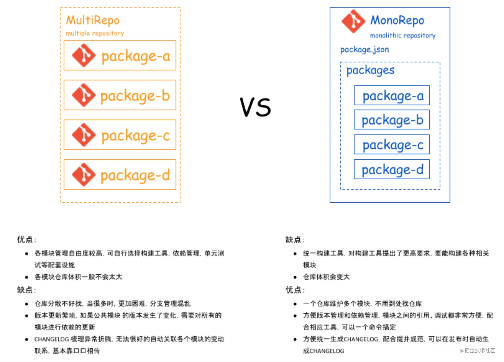

# 包管理方案

## MultiRepo VS MonoRepo



Monorepo 的全称是 monolithic repository，即单体式仓库，与之对应的是 MultiRepo(multiple repository)，这里的“单”和“多”是指每个仓库中所管理的模块数量。

- MultiRepo 是比较传统的做法，即每一个 package 都单独用一个仓库（repo）来进行管理。
- MonoRepo 指在一个项目仓库 (repo) 中管理多个模块/包 (package)。

前者允许多元化发展（各项目可以有自己的构建工具、依赖管理策略、单元测试方法），后者希望集中管理，减少项目间的差异带来的沟通成本。虽然拆分子仓库、拆分子 npm 包是进行项目隔离的天然方案，但当仓库内容出现关联时，没有任何一种调试方式比源码放在一起更高效。

MultiRepo（多 Git Repo，多 npm）导致复用要关心版本号，调试需要 npm link，这并不是理想的开发环境。而几乎我们熟知的仓库都采用了 MonoRepo，可以看到这些项目的第一级目录的内容以脚手架为主，主要内容都在 packages 目录中、分多个 package 进行管理。

```
├── packages
|   ├── pkg1
|   |   ├── package.json
|   ├── pkg2
|   |   ├── package.json
├── package.json
```

因此 MonoRepo 是更加流行更加合理的方式，目前最常见的 MonoRepo 解决方案是 `Lerna` 和 `yarn 的 workspaces 特性` 的 monorepo 工作流；

- lerna 和 yarn-workspace 并不是只能选其一，大多 MonoRepo 即会使用 lerna 又会在 package.json 声明 workspaces。
- 由于 yarn 和 lerna 在功能上有较多的重叠,我们采用 yarn 官方推荐的做法：**用 yarn 来处理依赖问题，用 lerna 来处理发布问题**。
- 这样的话，无论你的包管理器是 npm 还是 yarn，都能发挥 MonoRepo 的优势；要是包管理是 yarn ，lerna 就会把依赖安装交给 yarn 处理。

## yarn 的 workspaces 特性

### 简介

Yarn Workspaces（工作区）是 Yarn 提供的 MonoRepo 的依赖管理机制，从 Yarn 1.0 开始默认支持，用于在代码仓库的根目录下管理多个 package 的依赖。

- 开发多个互相依赖的 package 时，workspace 会自动对 package 的引用设置软链接（symlink），比 yarn link 更加方便，且链接仅局限在当前 workspace 中，不会对整个系统造成影响
- 所有 package 的依赖会安装在最根目录的 node_modules 下，节省磁盘空间，且给了 yarn 更大的依赖优化空间
- 所有 package 使用同一个 yarn.lock，更少造成冲突且易于审查

### 如何使用 yarn workspaces 特性

```json
{
	"name": "mono-demo",
	"version": "1.0.0",
	"private": true, // 根目录一般是项目的脚手架，无需发布，"private": true会确保根目录不被发布出去。
	"workspaces": ["packages/*"]
	// 声明workspace中package的路径。值是一个字符串数组，支持Glob通配符。
	// 其中"packages/*"是社区的常见写法，也可以枚举所有package： "workspaces": ["package-a", "package-b"]。
}
```

```json
// 命令
- yarn workspace <workspace_name> <command> // 在指定的package中运行指定的命令。
- yarn workspaces run <command> // 在所有package中运行指定的命令，若某个package中没有对应的命令则会报错。
- yarn workspaces info [--json]  // 查看项目中的workspace依赖树。
- yarn <add|remove> <package> -W // -W: --ignore-workspace-root-check ，允许依赖被安装在workspace的根目录
```

使用 Learn 管理的项目的目录结构和 yarn workspace 类似。
Lerna 的依赖管理是也基于 yarn/npm，但是安装依赖的方式和 yarn workspace 有些差异：

- Yarn workspace 只会在根目录安装一个 node_modules，这有利于提升依赖的安装效率和不同 package 间的版本复用。
- 而 Lerna 默认会进到每一个 package 中运行 yarn/npm install，并在每个 package 中创建一个 node_modules（npm 的 workspaces 特性）。

## 介绍

[Lerna](https://github.com/lerna/lerna#getting-started) 是一个工具，它优化了使用 git 和 npm **管理`多包`存储库**的工作流。

```bash
npm i lerna -g
```

## 常用命令

- `lerna init`: 初始化
  执行成功后，目录下将会生成这样的目录结构。

```
- packages(目录，之后还有进入分别npm init 每个子pkg)
- lerna.json(配置文件)
- package.json(工程描述文件)
```

```json
// package.json
{
  "name": "root",
  "private": true, // 私有的，不会被发布，是管理整个项目，与要发布到npm的包解耦
  "devDependencies": {
    "lerna": "^3.15.0"
  }
}

// lerna.json
{
  "packages": [
    "packages/*"
  ],
  "version": "0.0.0"
}
```

- `lerna bootstrap`: 安装各 packages 依赖，默认是 npm i，如果指定 yarn 的 workspaces，则会用 yarn install；
- `lerna publish`: 发布（要确保已经使用 git 链接到远程仓库）
- `lerna create < name > [loc]`: 创建一个包，name 包名，loc 位置可选

## 工作模式

两种工作模式：

- `Fixed/Locked` (default) mode：lerna 是把工程当作一个整体来对待。每次发布 packages，都是全量发布，无论是否修改。
- `Independent` mode：
  - lerna 会配合 Git，检查文件变动，只发布有改动的 package。
  - lerna init --independent 初始化项目。
  - lerna.json 文件里面"version": "independent"。
  - 每次 publish 时，您都将得到一个提示符，提示每个已更改的包，以指定是补丁、次要更改、主要更改还是自定义更改。

## lerna 最佳实践

为了能够使 lerna 发挥最大的作用，根据这段时间使用 lerna 的经验，总结出一个最佳实践。下面是一些特性。

- 采用 Independent 模式
- 根据 Git 提交信息，自动生成 changelog
- eslint 规则检查
- prettier 自动格式化代码
- 提交代码，代码检查 hook
- 遵循 semver 版本规范

```json
// package.json
{
	"name": "root",
	"private": true,
	"scripts": {
		"c": "git-cz"
	},
	"config": {
		"commitizen": {
			"path": "./node_modules/cz-lerna-changelog"
		}
	},
	"husky": {
		"hooks": {
			"pre-commit": "lint-staged",
			"commit-msg": "commitlint -E HUSKY_GIT_PARAMS"
		}
	},
	"lint-staged": {
		"*.ts": ["eslint --fix", "git add"]
	},
	"devDependencies": {
		"@commitlint/cli": "^8.1.0",
		"@commitlint/config-conventional": "^8.1.0",
		"commitizen": "^3.1.1",
		"cz-lerna-changelog": "^2.0.2",
		"husky": "^3.0.0",
		"lerna": "^3.15.0",
		"lint-staged": "^9.2.0"
	}
}
```

```json
// lerna.json
{
	"packages": ["packages/*"],
	"command": {
		// "bootstrap": {
		// 	"hoist": true
		// },
		"version": {
			"conventionalCommits": true
		}
	},
	"ignoreChanges": ["**/*.md"],
	"version": "0.0.1-alpha.1"
}
```

::: danger

在 lerna 中的`lerna bootstrap --hoist` 命令，使用 --hoist 来把每个 package 下的依赖包都提升到工程根目录，来降低安装以及管理的成本。如果直接在 lerna.json 中配置 command.bootstrap.hoist = true，则就省去了每次加 --hoist 参数。

在最佳实践中，不要再使用`lerna bootstrap --hoist`，会报错，直接使用 yarn workspaces 来替代就可以了。

:::

## 参考文章

- [lerna+yarn workspace+monorepo 项目的最佳实践](https://juejin.cn/post/6844903918279852046)
- [lerna 管理前端模块最佳实践](https://juejin.cn/post/6844903568751722509)
- [基于 Lerna 管理 packages 的 Monorepo 项目最佳实践](https://juejin.cn/post/6844903911095025678)
- [Yarn Workspace 使用指南](https://juejin.cn/post/6974967455114362888)
