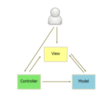
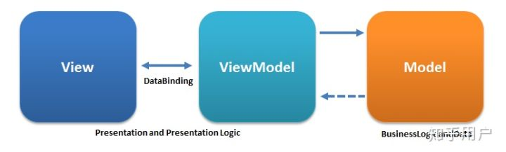
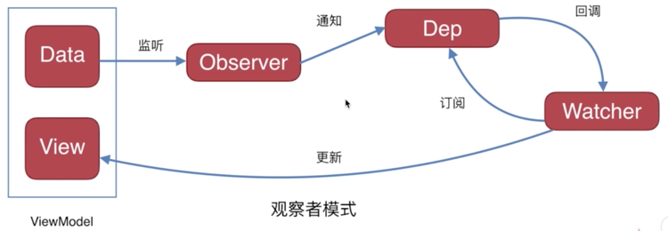

# MVVM框架基础

## 从 MVC 说起
以backbone.js为例：
1. 用户可以向 View 发送指令（DOM 事件），再由 View 直接要求 Model 改变状态。
2. 用户也可以直接向 Controller 发送指令（改变 URL 触发 hashChange 事件），再由 Controller 发送给 View。
3. Controller 非常薄，只起到路由的作用，而 View 非常厚，业务逻辑都部署在 View。所以，Backbone 索性取消了 Controller，只保留一个 Router（路由器） 。



> *mvc最早是一个后端开发的概念，字面上的意思是Model模型，也就是数据；View展示的内容  ；Controler控制器控制mv的内容呈现。在还没有进行前后端分离的时候，前端界面统一由后端进行渲染，JSP就是一个标准的ModelAndView,在后端进行渲染时，通过JSP的特殊标签进行数据注入，而后得到对应的html页面，十分类似es6的字符串模板。jsp在后端渲染时后端会解析这些标签，利用数据填充这些标签标记的位置，然后生成string格式的html文本，然后返回给浏览器。这其中，控制器C所做的事情就是根据请求的资源，控制当前使用哪一个ModelAndView。*

## MVVM 定义及原理

MVVM（Model-View-ViewModel）是一种设计思想。Model 层代表数据模型，也可以在Model中定义数据修改和操作的业务逻辑；View 代表UI视图，它负责将数据模型转化成 UI 展现出来；ViewModel 是一个同步View 和 Model的对象。

- MVVM的`本质`是指**双向数据绑定**，即 View 与 Model 之间的双向通信，由 ViewModel 作桥接。
- 在MVVM架构下，`View`和`Model`之间并没有直接的联系，而是通过一个绑定器`ViewModel对象`进行交互，`Model`和`ViewModel`之间的交互是双向的，因此View 数据的变化会同步到Model中，而Model 数据的变化也会立即反应到View上。
- ViewModel通过双向数据绑定把View层和Model层连接了起来，而View和Model之间的同步工作完全是自动的，无需人为干涉，因此开发者只需关注业务逻辑，不需要手动操作DOM, 不需要关注数据状态的同步问题，复杂的数据状态维护完全由 MVVM 来统一管理（这就是数据驱动的意义）。
- View 非常薄，不部署任何业务逻辑，称为"被动视图"（Passive View），即没有任何主动性，而ViewModel非常厚，所有逻辑都部署在那里。



Vue、Angular都是MVVM的框架，但React不是。

### 双向绑定原理

双向绑定需要实现数据监听，Angluar 早期的脏检查机制开创了 mvvm 先河，但监听效率较低，后来几乎所有框架都改为了 数据劫持(getter/setter) 实现监听。
以 Vue 的双向绑定实现为例：以`「数据劫持」结合「发布订阅模式」`的方式：
- "正向绑定M->V"：通过`Object.defineProperty()`来为数据添加`getter/setter`，在数据变动时，劫持改变，并发布给订阅者，触发相应的监听回调，更新View；
- "反向绑定V->M"：通过绑定input或change事件，框架内部自动执行完成。

双向绑定具体实现原理，请戳传送门：[]()

### 双向绑定 VS 单向绑定
*一般只有UI表单控件才存在双向数据绑定，非UI表单控件只有单向数据绑定。*

- 关系：**双向绑定** = **单向绑定** + `UI事件监听`。
- 双向绑定：通过 ViewModel 实现 Model -> View 及 View -> Model的状态同步；
- 单向绑定：没有 View -> Model 这一步，需要手动绑定UI事件监听（添加onChange事件）。

**优缺点**：在表单交互较多的情况下，单向数据绑定的优点是数据更易于跟踪管理和维护，缺点是代码量较多比较啰嗦；而双向绑定正好相反，代码简洁开发方便，不过容易造成数据流混乱。

### 观察者模式（发布订阅）

观察者模式，即发布订阅模式：


- Pub：`Observer(观察者`,其实背后就是**defineProperty**)，它监听到Data的变化(触发object.**defineProperty**下的set函数)，通知`Dep(订阅者列表)`；
- Sub：`Dep(订阅者列表)`会根据`Watcher(订阅者)`对其的订阅来判断是否需要调用**update**回调函数，如果需要便会自动执行**update**回调函数，告知Watcher去**更新View**。

### Vue响应式原理

#### Object.defineProperty
Vue2 的响应式原理是使用Object.defineProperty追踪依赖，当属性被访问或改变时通知变化。

::: tip Vue如何监听对象和数组
Object.defineProperty() 只能对属性进行数据劫持，不能对整个对象进行劫持，同理无法对数组进行劫持。因此，**vue要监听对象和数组，是通过「`遍历数组`」和「`递归遍历对象`」**。
:::

::: details object.defineProperty使用
##### 1. object.defineProperty 描述符
描述符必须是**数据描述符**和**存取描述符**这两种形式之一；不能同时是两者。
- **数据描述符**和**存取描述符**均具有以下可选键值：
    - `configurable`：当且仅当该属性的 configurable 为 true 时，该属性描述符才能够被改变，同时该属性也能从对应的对象上被删除。默认为 false。
    - `enumerable`：当且仅当该属性的 enumerable 为 true 时，该属性才能够出现在对象的枚举属性中。默认为 false。
- **数据描述符**可选键值：
    - `value`：该属性对应的值。可以是任何有效的 JavaScript 值（数值，对象，函数等）。默认为 undefined。
    - `writable`：当且仅当该属性的 writable 为 true 时，value 才能被赋值运算符改变。默认为 false。
- **存取描述符**可选键值：
    - `get`：一个给属性提供 getter 的方法，如果没有 getter 则为 undefined。该方法返回值被用作属性值。默认为 undefined。
    - `set`：一个给属性提供 setter 的方法，如果没有 setter 则为 undefined。该方法将接受唯一参数，并将该参数的新值分配给该属性。默认为 undefined。

##### 2. 使用 object.defineProperty
```js
// 1. 隐式 使用 __proto__
var obj1 = {};
var descriptor = Object.create(null); // 没有继承的属性
// 默认没有 enumerable，没有 configurable，没有 writable
descriptor.value = 'static';
Object.defineProperty(obj1, 'key', descriptor);
console.log(obj1); // 对象obj2拥有了属性key，值为static

// 2. 显式
var obj2 = {};
Object.defineProperty(obj2, 'key', {
    enumerable: true,
    configurable: false,
    writable: false,
    value: 'static',
});
console.log(obj2); // 对象obj2拥有了属性key，值为static

// 3. 在对象中添加一个属性与存取描述符的示例
var value = 10;
Object.defineProperty(obj3, "key", {
    get : function(){
        return value;
    },
    set : function(newValue){
        value = newValue;
    },
    enumerable : true,
    configurable : true
});

obj3.key = 38;  // 对象obj3拥有了属性key，值为38
```

##### 3. object.defineProperty（ES5）与 reflect.defineProperty（ES6）的区别
object上的方法都将慢慢迁移到reflect上。
1. 将Object对象的一些明显属于语言内部的方法（比如Object.defineProperty），放到Reflect对象上。现阶段，某些方法同时在Object和Reflect对象上部署，未来的新方法将只部署在Reflect对象上。
2. 修改某些Object方法的返回结果，让其变得更合理。比如，Object.defineProperty(obj, name, desc)在无法定义属性时，会抛出一个错误，而Reflect.defineProperty(obj, name, desc)则会返回false。
3. 让Object操作都变成函数行为。某些Object操作是命令式，比如name in obj和delete obj[name]，而Reflect.has(obj, name)和Reflect.deleteProperty(obj, name)让它们变成了函数行为。

:::

#### :tada: Vue中数据劫持的明显缺点（两点）：
1. 不能检测到**添加**或**删除**的属性。
    - `object.defineProperty`对于添加的新属性我们并没有监听，而删除属性并不被get和set拦截，所以也检测不到。
2. 数组方面的变动，如**根据索引改变元素**，以及**直接改变数组长度**，不能被检测到。例如`vm.items[indexOfItem] = newValue`，`vm.items.length = newLength`。
    - 其实`object.defineProperty`本身是可以监听和响应数组`arr[index] = val`的变动的，但 尤大 说，出于从 性能代价和用户体验收益权衡，并没有实现这个功能。

::: details Vue提供了解决方法：
1. 由于 性能的考量，Vue **不能检测以下两种`数组`的变动**:
    - 利用索引直接设置一个数组项时，例如：`vm.items[index] = newValue`，解决方式：
    ```js
    // Vue.set
    Vue.set(vm.items, index, newValue)
    // 等价于 (vm.$set 实例方法是全局方法 Vue.set 的一个别名)
    vm.$set(vm.items, index, newValue)
    
    // 或 Array.prototype.splice
    vm.items.splice(index, 1, newValue)
    ```
    - 修改数组的长度时，例如：`vm.items.length = newLength`，解决方式：`vm.items.splice(newLength)`
2. 由于 JS 的限制，Vue **不能检测`对象属性`的添加或删除**，对于已经创建的实例，Vue 不允许动态添加根级别的响应式属性：
- 解决方式：
    - 单个属性添加：
    ```js
    // 可以使用 方法向嵌套对象添加响应式属性。
    Vue.set(obj, propertyName, value)
    vm.$set(obj, propertyName, value)
    ```
    - 赋值多个新属性：应该`用两个对象的属性创建一个新的对象`，新的内存地址会促使重新添加监听。
    ```js
    // 不要像下面这样：
    vm.profile = Object.assign(vm.profile, { age: 27 });

    // 正确的做法：使用合并对象创建一个新对象，新的内存地址会促使重新添加监听
    vm.profile = Object.assign({}, vm.profile, { age: 27 });
    ```
    - 单个属性删除：
    ```js
    Vue.delete(obj, key)
    vm.$delete(obj, key)
    ```
::: details 上述$set的原理
- 对于数组，调用splice方法触发响应式；
- 对于对象，通过调用`defineReactive`方法进行响应式处理（ defineReactive 方法就是 Vue 在初始化对象时，给对象属性采用 Object.defineProperty 动态添加 getter 和 setter 的功能所调用的方法）。
:::
参考链接：[记一次思否问答的问题思考：Vue为什么不能检测数组变动](https://segmentfault.com/a/1190000015783546)
:::

#### 使用 Proxy 代替 Object.defineProperty

参考链接：[摒弃 Object.defineProperty，基于 Proxy 的观察者机制探索](https://juejin.im/post/5bf3e632e51d452baa5f7375)

Q：为什么要用Proxy代替Object.defineProperty？
1. Object.defineProperty只能劫持对象的属性，因此需要对每个对象的每个属性进行遍历。Vue里，是通过递归遍历 data对象来实现对数据的监控的，如果属性值也是对象，那么就需要深度遍历。而Proxy能劫持一个完整的对象，不管是对操作性还是性能都是一个很大的提升。
2. 出于性能的考虑，Vue中Object.defineProperty无法监控到数组索引改变元素，或是数组长度改变，不能实时响应，虽然Vue提供了特殊处理的8种hack数组方法（push、pop、shift、unshift、splice、sort、reverse）来改变和监听数组，但是还是有很大局限性。 而Proxy本身提供了13种劫持操作，可以解决上述问题。


Q：为什么vue2.x不使用Proxy呢？
- Proxy属性在vue2.x之前就有了，为什么vue2.x不使用Proxy呢？一个很重要的原因就是：Proxy是es6提供的新特性，**兼容性不好**，最主要的是这个属性无法用polyfill来兼容。

## React只是一个视图库

React既不是MVC，也不是MVVM。按照Facebook的说法，React只相当于MVC中的`V`，是**一个UI视图库**。

### 为什么React不是MVVM呢？

- 首先要明白，MVVM最显著的特征就是`「双向绑定」`。而React没有这个，它是`单向数据绑定`的。
- React本身只是一个函数 **UI = render(data)**，最多算一个从 `M->V` 的`单向数据流库`，其没有ViewModel这个东西，`没有所谓的状态管理`，而只是`数据到视图的驱动`。

### 那React+Redux或React+Mobx之后是MVVM么？

个人认为也不是的。
*这里的叙述原因还要斟酌*
- Q：在使用了Redux之后，Redux的store作为Model层，React作为View层，看起来是更改View层的数据就会改动到Model层的数据，那这样是不是就完成了双向的绑定呢？
- A：其实，React(View层)中的数据 和 Redux(Model层)中的store里的数据，实际上并没有直接联系。
    - store里的数据更改都是通过dispatch action来实现的，即，在View层向一个输入框输入，如果不进行dispatch action，Model层中的store里的数据是不会变化的，因此可以说是导致Model层中数据变化的本质是dispatch.action导致的变化，和View层并没有直接意义上的联系，不对输入框进行输入也是可以通过dispatch action来改变store里的值从而改变输入框的值。
    - Redux也就是一种单向数据流的思想，所有的数据都在Redux下的store里，store里的数据有变化时再将数据传到View层中的React里进行重新渲染显示出新的数据。

## Vue是MVVM，但不完全遵循其规则

### Vue的MVVM模式对应关系
- new Vue() 创建的实例 vm就是ViewModel；
- el所指定的区域（包括template、style），就是vm所控制的View；
- data状态对象以及props属性，就是vm所控制的View区域所映射的数据Model。
```html
<div id="app">
    <h1>{{msg}}</h1>
</div>

<script>
// new Vue() 创建的实例 vm就是ViewModel
const vm = new Vue({
    el: '#app', // el所指定的区域，就是vm所控制的View
    data: { // data状态对象，就是vm所控制的View区域所映射的数据Model
        msg: 'Hello, vue.'
    }
})
</script>
```

### Vue没有完全遵循MVVM设计规则
`严格的MVVM要求View不能和Model直接通信`，而Vue在组件提供了`$refs这个属性`，`让Model可以直接操作View`，违反了这一规定。

> Vue官方设计 $refs 主要是提供给 js 程序访问的，并不建议在模板中过度依赖使用它。因为`这意味着在实例之外去访问实例状态`，违背了 Vue 数据驱动的思想。

Vue的设计虽然没有完全遵循MVVM但也受到了它的启发。因此在文档中经常会使用 vm (ViewModel 的缩写) 这个变量名表示 Vue 实例。


## React VS Vue

有许多相似之处，它们都有：
- 使用 Virtual DOM；
- 提供了响应式 (Reactive) 和组件化 (Composable) 的视图组件；
- 将注意力集中保持在核心库，而将其他功能如路由和全局状态管理交给相关的库；

不同之处：
- React 比 Vue 更好的地方，数据流向更清晰，有更丰富的生态系统。
- Vue 比 React 更好的地方，门槛低，代码更少更易用。
- :tada:**「数据驱动视图」的原理不同，造成工作方式不同：**
    - React的工作逻辑是：state只能通过setState改变，而state变化就会执行render，即是一个单向数据流的M->V的视图库。*（如果要添加V->M反向绑定，就需要手动添加onChange事件绑定handler改变setState，重新触发render）*。React的state存在于一个个组件中，并不能叫做VM，react没有VM这个东西。
    - Vue的工作逻辑是：通过数据劫持和发布订阅结合，实现双向绑定。Vue中不存在类似setState这种唯一改变状态变量途径的方法，而是通过vm自动为数据Model添加监听，在数据改变时调用订阅的监听回调改变View，触发render；另一方面（vue比react多做的事），在例如表单的场景下，又能通过v-model自动完成View层的事件绑定，触发数据Model的变化。即是一个双向数据绑定的MVVM库。
    - 总得来说：React没有VM而只有组件内的状态state，只能通过唯一的setState途径去改变state，每次setState的动作会触发批处理rerender；Vue没有提供唯一动作(setState)改变状态，Vue实例就是VM，VM通过数据劫持和发布订阅，感知Model的改变后再触发视图更新rerender，而所谓的双向绑定中的反向绑定，只是在表单或自定义组件上使用v-model，来自动完成View层事件监听而已。


## MVVM的优缺点
### 优点
- 分离视图（View）和模型（Model）,降低代码耦合，提高视图或者逻辑的重用性: 
    - 比如视图（View）可以独立于Model变化和修改，一个ViewModel可以绑定不同的"View"上，当View变化的时候Model不可以不变，当Model变化的时候View也可以不变。你可以把一些视图逻辑放在一个ViewModel里面，让很多view重用这段视图逻辑。
- 提高可测试性: 
    - ViewModel的存在可以帮助开发者更好地编写测试代码。
- 自动更新dom: 
    - 利用双向绑定,数据更新后视图自动更新,让开发者从繁琐的手动dom中解放。

### 缺点
- Bug很难被调试：
    - 因为使用双向绑定的模式，当你看到界面异常了，有可能是你View的代码有Bug，也可能是Model的代码有问题。数据绑定使得一个位置的Bug被快速传递到别的位置，要定位原始出问题的地方就变得不那么容易了。另外，数据绑定的声明是指令式地写在View的模版当中的，这些内容是没办法去打断点debug的
- 长期持有内存：
    - 一个大的模块中model也会很大，虽然使用方便了也很容易保证了数据的一致性，当时长期持有，不释放内存就造成了花费更多的内存
- 大型ViewModel的构建和维护成本：
    - 对于大型的图形应用程序，视图状态较多，ViewModel的构建和维护的成本都会比较高。

