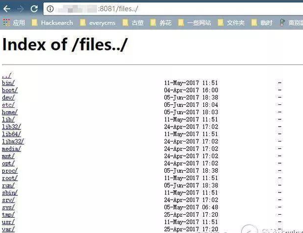

# Nginx 相关问题

> Nginx相关问题记录

----
## 1、Nginx目录穿越漏洞

常见于 Nginx 做反向代理的情况，动态的部分被 proxy_pass 传递给后端端口，而静态文件需要 Nginx 来处理。

假设静态文件存储在 /home/目录下，而该目录在 url 中名字为 files ，那么就需要用 alias 设置目录的别名：

```json
location /files { alias /home/; }
```
此时，访问http://example.com/files/readme.txt， 就可以获取/home/readme.txt文件。

但我们注意到，url上/files没有加后缀/，而alias设置的/home/是有后缀/的，这个/就导致我们可以从/home/目录穿越到他的上层目录：



进而我们获得了一个任意文件下载漏洞。

> 如何解决这个漏洞？

只需要保证 location 和 alias 的值```都有```后缀/ 或```都没有```这个后缀。

## 2、Nginx超时时间设置

### 问题描述

某些大数据量接口在loading一段时间后提示当前请求异常(此错误提示是前端代码给出的提示)，浏览器network中查看对应接口，显示接口status为failed，爆红，没有response体，且接口时间未1min或多一点。

运维同学查日志后发现 nginx报了499 错误，

> 499 是 nginx 扩展的 4xx 错误，目的只是用于记录，并没有实际的响应。
>> 看一下 nginx 源码 ngx_http_request.h 对 499 的定义：

    /*
    * HTTP does not define the code for the case when a client closed
    * the connection while we are processing its request so we introduce
    * own code to log such situation when a client has closed the connection
    * before we even try to send the HTTP header to it
    */
    # define NGX_HTTP_CLIENT_CLOSED_REQUEST     499
> nginx 499 代表客户端请求还未返回时，客户端主动断开连接。

### 问题解决时间线

1. 因为表述为 **客户端主动断开连接**，所以团队小伙伴都以为是浏览器主动断开了连接，猜测是不是浏览器有默认超时时间。查阅相关资料后发现Chrome的默认浏览器超时时间至少是5分钟，结合问题中描述的1min，因此判断不是浏览器主动断开连接；

2. 后端同学通过 postman主动调接口，通过html结构的形式，返回 `504 gateway time-out`：
    
    网关超时，且通过postman而不是浏览器，进一步说明和浏览器没有关系，不是前端的锅，汗！

3. 查阅资料：
    nginx 499 是客户端主动断开了连接。这里的客户端概念，**是对请求连接过程中的下游服务而言的**，例如`浏览器与 nginx 之间的连接，浏览器为客户端`；`nginx 与其分发的服务而言，nginx 是客户端`；php 处理程序中发起的 curl 请求而言，php-fpm 可视为客户端。

    这里说客户端不一定是浏览器，有可能是nginx，因此从nginx的超时时间设置入手：

    nginx 作为反向代理时，nginx 将请求分发至对应的处理服务器时，有两对超时参数的设置：`proxy_send_timeout` 和 `proxy_read_timeout` ; `fastcgi_send_timeout` 和 `fastcgi_read_timeout`。两对参数分别对应的是 ngx_http_proxy_module 和 ngx_http_fastcgi_module 模块的参数。两对参数默认的超时时间都是 60 s。在 nginx 出现 499 的情况下，可以结合请求断开前的耗时和这两对设定的时间进行对比，看一下是不是在 proxy_pass 或者 fastcgi_pass 处理时，设置的超时时间短了。

    因此尝试设置为5分钟：
    
    但还是同样报错...

4. host绑定IP，绕过安全waf，确定问题所在：
    运维同学建议host绑定IP，发现请求没问题了，为什么这样呢？

    因为前端到服务器之间，除了通过nginx转发，在此之前还要经过安全waf，`waf = web application firewall`，即是安全部门在前端到应用前面加一个防火墙，统一实施安全策略，之后再到nginx服务器，再到后端`（ 浏览器 => 安全waf => nginx服务器 => 后端服务）`：
    

    通过host绑定对应ip，绕过了安全waf，直接打到nginx服务器，就没有任何问题，因此确定是需要在waf层的nginx设置对应超时时间，解决问题。


参考链接：[nginx 499 产生的原因](https://www.jianshu.com/p/88fb291fc1ec)
