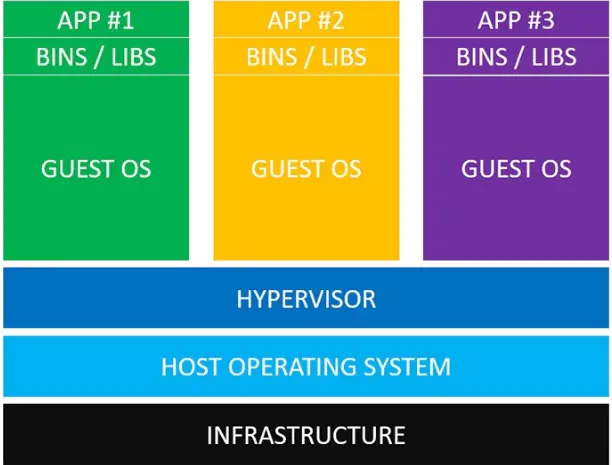
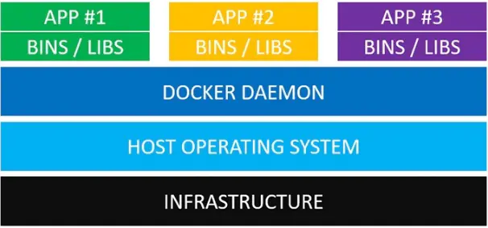
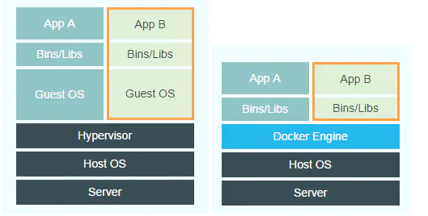

# Docker vs VM

- 虚拟机技术开启了云计算时代；而 Docker，作为下一代虚拟化技术，正在改变我们开发、测试、部署应用的方式；
- Docker 比虚拟机`更节省内存`，`启动更快`(虚拟机需要数分钟启动，而 Docker 容器只需要 50 毫秒)；
- 首先需要明确一点，Docker 容器不是虚拟机，那么 docker 容器与虚拟机有什么区别呢？

## 理解虚拟机 VM（virtual machine）

使用虚拟机运行多个相互隔离的应用：

_请从下往上看：_

- `应用`。安装依赖之后，就可以在各个从操作系统分别运行应用了，这样各个应用就是相互隔离的。
- `依赖库`。每一个从操作系统都需要安装许多依赖。如果你的的应用需要连接 PostgreSQL 的话，则需要安装 libpq-dev；如果你使用 Ruby 的话，应该需要安装 gems；如果使用其他编程语言，比如 Python 或者 Node.js，都会需要安装对应的依赖库。
- `**从**操作系统`（Guest Operating System）。假设你需要运行 3 个相互隔离的应用，则需要使用 Hypervisor 启动 3 个从操作系统，也就是 3 个虚拟机。这些虚拟机都非常大，也许有 700MB，这就意味着它们将占用 2.1GB 的磁盘空间。更糟糕的是，它们还会消耗很多 CPU 和内存。
- `虚拟机管理系统`（**Hypervisor**）。利用 Hypervisor，可以在主操作系统之上运行多个不同的从操作系统。类型 1 的 Hypervisor 有支持 MacOS 的 HyperKit，支持 Windows 的 Hyper-V 以及支持 Linux 的 KVM。类型 2 的 Hypervisor 有 VirtualBox 和 VMWare。
- `**主**操作系统`（Host Operating System）。你的个人电脑之上，运行的可能是 MacOS，Windows 或者某个 Linux 发行版。
- `基础设施`（Infrastructure）。它可以是你的个人电脑，数据中心的服务器，或者是云主机。

## 理解 docker

_请从下往上看：_

- `应用`。应用的源代码与它的依赖都打包在 Docker 镜像中，不同的应用需要不同的 Docker 镜像。不同的应用运行在不同的 Docker 容器中，它们是相互隔离的。
- `依赖库`。对于 Docker，应用的所有依赖都打包在 Docker 镜像中，Docker 容器是基于 Docker 镜像创建的。
- `Docker守护进程`（**Docker Daemon**）。Docker 守护进程取代了 Hypervisor，它是运行在操作系统之上的后台进程，负责管理 Docker 容器。
- `主操作系统`（Host Operating System）。所有主流的 Linux 发行版都可以运行 Docker。对于 MacOS 和 Windows，也有一些办法"运行"Docker。

**注意**：相比于 VM，docker 少了 `从操作系统`，并且 `Docker Daemon 替代了 Hypervisor`。

## 对比 虚拟机 与 Docker

- Docker Daemon 可以直接与 主操作系统 进行通信，为各个 Docker 容器分配资源；
- 由于没有臃肿的 从操作系统，Docker 可以节省大量的磁盘空间以及其他系统资源；
- 它还可以将容器与主操作系统隔离，并将各个容器互相隔离。虚拟机启动需要数分钟，而 Docker 容器可以在数毫秒内启动；

但是，并不能完全否定虚拟机的，二者的使用场景是不同的：

- 虚拟机更擅长于`彻底隔离整个运行环境`。对于隔离要求较高的环境如混合用户环境，就可以使用服务器虚拟化技术。例如，云服务提供商通常采用虚拟机技术隔离不同的用户。
- Docker 通常用于`隔离不同的应用`，例如前端，后端以及数据库。当主机上的 Docker 实例属于单一用户的情况下，在保证安全的同时可以充分发挥 Docker 的技术优势。

## 类比场景

**服务器**好比运输码头：拥有场地和各种设备（服务器硬件资源）。

**服务器虚拟化**好比作码头上的仓库：拥有独立的空间堆放各种货物或集装箱 (仓库之间完全独立，独立的应用系统和操作系统）。

**Docker**比作集装箱：各种货物的打包 (将各种应用程序和他们所依赖的运行环境打包成标准的容器,容器之间隔离)。

Docker 有着小巧、迁移部署快速、运行高效等特点，但隔离性比服务器虚拟化差：不同的集装箱属于不同的运单（Docker 上运行不同的应用实例），相互独立（隔离）。但由同一个库管人员管理（主机操作系统内核），因此通过库管人员可以看到所有集装箱的相关信息（因为共享操作系统内核，因此相关信息会共享）。

服务器虚拟化就好比在码头上（物理主机及虚拟化层），建立了多个独立的“小码头”—仓库（虚拟机）。其拥有完全独立（隔离）的空间，属于不同的客户（虚拟机所有者）。每个仓库有各自的库管人员（当前虚拟机的操作系统内核），无法管理其它仓库。不存在信息共享的情况

[【Docker&VM】docker 容器与虚拟机有什么区别？](https://www.jianshu.com/p/50f48eb25215)
