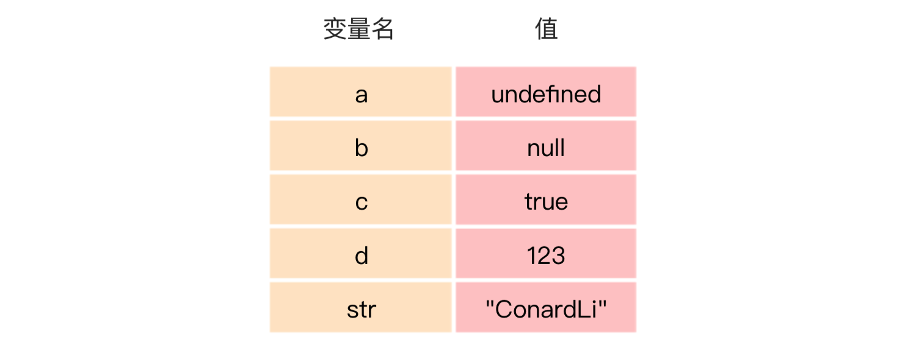
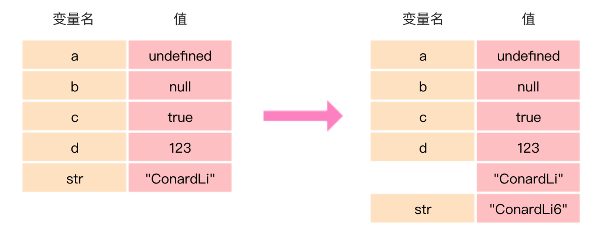
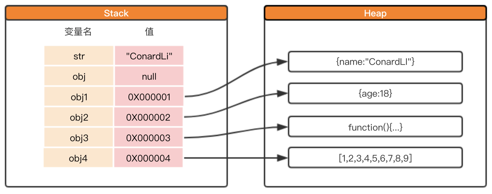
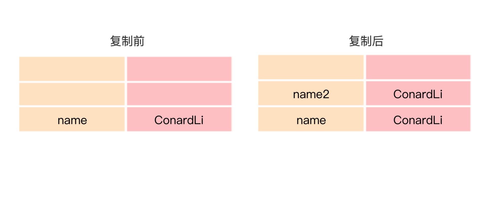
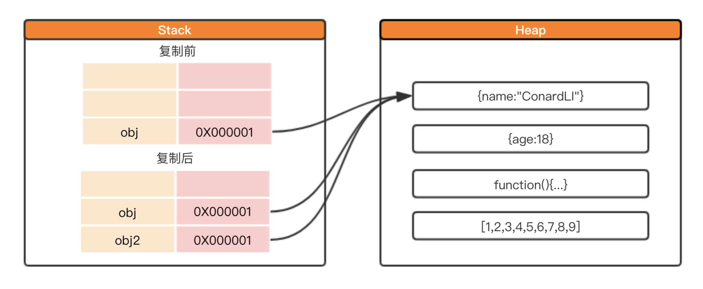

---
{
    "title": "JS专题-变量与类型-(1)JS数据类型",
}
---

> 本文是在 ConardLi的“[【JS 进阶】你真的掌握变量和类型了吗](https://juejin.im/post/5cec1bcff265da1b8f1aa08f)”文章上的总结和扩展，集中记述了js中的变量和数据类型的相关知识点及应用场景，共分为5部分。

> 本文为“JS专题-变量与类型”的第一篇，1）JS数据类型，主要关注JS中变量在内存中的具体存储形式。

<!-- more -->

# JavaScript数据类型

## 数据类型分类

[ECMAScript标准](http://www.ecma-international.org/ecma-262/9.0/index.html)规定了`7`种数据类型，其把这`7`种数据类型又分为两种：原始类型 和 对象类型。
- 原始类型
    - Null：只包含一个值：null
    - Undefined：只包含一个值：undefined
    - Boolean：包含两个值：true和false
    - Number：整数或浮点数，还有一些特殊值（-Infinity、+Infinity、NaN）
    - String：一串表示文本值的字符序列
    - Symbol：一种实例是唯一且不可改变的数据类型
(在es10中加入了第七种原始类型BigInt，现已被最新Chrome支持)

- 对象类型（引用类型）
    - Object：除了常用的Object，Array、Date、RegExp、Function等都属于特殊的对象

## 为什么区分原始类型和对象类型

1. 首先搞明白原始类型的特性 —— `不可变性`

    在ES标准中，原始类型被定义为`primitive values`，即原始值，代表值本身是不可被改变的。
    以字符串为例：在调用操作字符串的方法时，没有任何方法是可以直接改变字符串的。

    ```js
        var str = 'ConardLi';

        str.slice(1);
        str.substr(1);
        str.trim(1);
        str.toLowerCase(1);
        str[0] = 1;

        console.log(str);  // ConardLi
    ```
    这些方法都在原字符串的基础上产生了一个新字符串，而非直接去改变str，这就印证了字符串的不可变性。

2. 内存空间 —— `栈内存`与`堆内存`
    ```js
        var str = 'ConardLi';

        str += '6'

        console.log(str);  // ConardLi6
    ```
    > 上面的str值改变了，这违背了原始值的不可变性吗？
    并没有! 这在内存原理上是有根据的，在js中，变量在内存中需要空间来存储，`内存空间被分为两种，栈内存与堆内存`。

    2.1 栈内存（原始类型）
    - 存储的值大小固定
    - 空间较小
    - 可以直接操作其保存的变量，运行效率高
    - 由系统自动分配存储空间

    js中的原始类型的值被直接存储在栈中，在变量定义时，栈就为其分配好了内存空间。由于栈中的内存空间的大小是固定的，那么注定了存储在栈中的变量就是不可变的。

    

    执行 `str += '6'`的操作，实际上是在栈中`又开辟了一块内存空间`用于存储'ConardLi6'，然后将变量str指向这块空间，所以这`并不违背不可变性`的特点。

    

    2.2 堆内存（引用类型）
    - 存储的值大小不定，可动态调整
    - 空间较大，运行效率低
    - 无法直接操作其内部存储，使用引用地址读取
    - 通过代码进行分配空间和释放
    - 如果程序员没有主动通过代码释放，则由操作系统自动回收

    习惯于把对象称为引用类型，引用类型的`值实际存储在堆内存`中，它在`栈中只存储了一个固定长度的地址`，这个地址指向堆内存中的值。

    ```js
    var obj1 = {name:"ConardLi"}
    var obj2 = {age:18}
    var obj3 = function(){...}
    var obj4 = [1,2,3,4,5,6,7,8,9]
    ```
    

    当然，引用类型就不再具有不可变性了，可以轻易改变它。

    以数组为例，它的很多方法都是`变异方法`，都可以改变它自身。
    - `pop()` 删除数组最后一个元素，如果数组为空，则不改变数组，返回undefined，改变原数组，返回被删除的元素
    - `push()` 向数组末尾添加一个或多个元素，改变原数组，返回新数组的长度
    - `shift()` 把数组的第一个元素删除，若空数组，不进行任何操作，返回undefined,改变原数组，返回第一个元素的值
    - `unshift()` 向数组的开头添加一个或多个元素，改变原数组，返回新数组的长度
    - `reverse()` 颠倒数组中元素的顺序，改变原数组，返回该数组
    - `sort()` 对数组元素进行排序，改变原数组，返回该数组
    - `splice()` 从数组中添加/删除项目，改变原数组，返回被删除的元素

## `比较`原始类型与引用类型
复制、比较、值传递和引用传递

### 复制
关于复制，原始类型和引用类型的表现是不一样的：
- 原始类型的复制
```js
var name = 'ConardLi';
var name2 = name;
name2 = 'code秘密花园';
console.log(name); // ConardLi;
```

内存中有一个变量name，值为ConardLi。我们从变量name复制出一个变量name2，此时在内存中`创建了一个块新的空间`用于存储ConardLi，虽然两者值是相同的，但是`两者指向的内存空间完全不同`，这两个变量参与任何操作都互不影响。

- 引用类型的复制
```js
var obj = {name:'ConardLi'};
var obj2 = obj;
obj2.name = 'code秘密花园';
console.log(obj.name); // code秘密花园
```

当我们复制引用类型的变量时，`实际上复制的是栈中存储的地址`，所以复制出来的obj2实际上和obj`指向的堆中同一个对象`。因此，我们改变其中任何一个变量的值，另一个变量都会受到影响，`这就是为什么会有深拷贝和浅拷贝`的原因。

### 比较
- `对于原始类型，比较时会直接比较它们的值`，如果值相等，即返回true。
- `对于引用类型，比较时会比较它们的引用地址`，虽然两个变量在堆中存储的对象具有的属性值都是相等的，但是它们被存储在了不同的存储空间，因此比较值为false。


### 值传递和引用传递

- 参数是原始类型
```js
let name = 'ConardLi';
function changeValue(name) {
    name = 'code秘密花园';
}
changeValue(name);
console.log(name); // 'ConardLi'
```
是`值传递`：函数参数仅仅是被传入变量复制给了的一个局部变量，改变这个局部变量不会对外部变量产生影响。

- 参数是引用类型
```js
let obj = {};
function changeValue(obj) {
    obj.name = 'ConardLi';
    obj = {name:'code秘密花园'};
}
changeValue(obj);
console.log(obj.name); // ConardLi
```
同样的，当函数参数是引用类型时，我们同样将参数复制了一个副本到局部变量，只不过复制的这个副本是指向堆内存中的地址而已，我们在函数内部对对象的属性进行操作，实际上和外部变量指向堆内存中的值相同，但是这并不代表着引用传递，依然是`值传递`
::: tip
明确一点，ECMAScript中所有的函数的参数都是**按值传递**的。
:::
