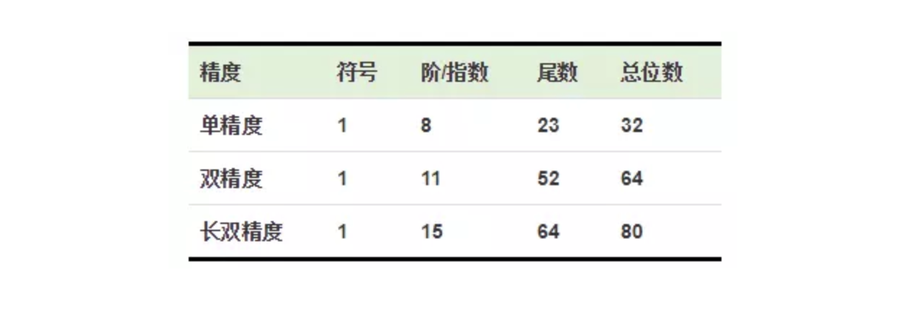
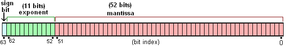

> 本文是在 ConardLi的“[【JS 进阶】你真的掌握变量和类型了吗](https://juejin.im/post/5cec1bcff265da1b8f1aa08f)”文章上的总结和扩展，集中记述了js中的变量和数据类型的相关知识点及应用场景，共分为5部分。

> 本文为“JS专题-变量与类型”的第2篇，2）JS 3种疑难基础类型，主要关注null/undefined，Symbol，Number三种疑难基础JS类型。

<!-- more -->

## 分不清的`null`和`undefined`

在原始类型中，有两个类型Null和Undefined，他们都有且仅有一个值，null和undefined

- `null`
    - 表示被赋值过的对象，刻意把一个对象赋值为null，故意表示其为空，不应有值。
    - 所以对象的某个属性值为null是正常的，null转换为数值时值为`0`。
- `undefined`
    - 表示“缺少值”，即此处应有一个值，但还没有定义，
    - 如果一个对象的某个属性值为undefined，这是不正常的，如obj.name=undefined，我们不应该这样写，应该直接delete obj.name。
    - undefined 转为数值时为`NaN`(非数字值的特殊值)
    - 典型用法是：变量被声明了，但没有赋值时，就等于undefined；调用函数时，应该提供的参数没有提供，该参数等于undefined；对象没有赋值的属性，该属性的值为undefined；函数没有返回值时，默认返回undefined。

> JavaScript是一门动态类型语言，成员除了表示存在的空值外，还有可能根本就不存在（因为存不存在只在运行期才知道），这就是undefined的意义所在。对于JAVA这种强类型语言，如果有"undefined"这种情况，就会直接编译失败，所以在它不需要一个这样的类型。

## 不太熟的`Symbol`类型

Symbol类型是ES6中新加入的一种原始类型。

### Symbol的特性

1. 独一无二

    直接使用Symbol()创建新的symbol变量，可选用一个字符串用于描述。当参数为对象时，将调用对象的toString()方法。

    ```js
    var sym1 = Symbol();  // Symbol() 
    var sym2 = Symbol('ConardLi');  // Symbol(ConardLi)
    var sym3 = Symbol('ConardLi');  // Symbol(ConardLi)
    console.log(sym2 === sym3);  // false

    var sym4 = Symbol({name:'ConardLi'}); // Symbol([object Object])
    ```

    用两个相同的字符串创建两个Symbol变量，它们是不相等的，独一无二的。

    如果我们想创造两个相等的Symbol变量，可以使用`Symbol.for(key)`。
    > 使用给定的key搜索现有的symbol，如果找到则返回该symbol。否则将使用给定的key在全局symbol注册表中创建一个新的symbol。

    ```js
    var sym1 = Symbol.for('ConardLi');
    var sym2 = Symbol.for('ConardLi');
    console.log(sym1 === sym2); // true
    ```

2. 原始类型

    注意是使用Symbol()函数创建symbol变量，并非使用构造函数，使用new操作符会直接报错。
    ```js
    new Symbol(); // Uncaught TypeError: Symbol is not a constructor
    ```
    可以使用typeof运算符判断一个Symbol类型:
    ```js
    typeof Symbol() === 'symbol'
    typeof Symbol('ConardLi') === 'symbol'
    ```

3. 不可枚举

- 当使用Symbol作为对象属性时，可以保证对象不会出现重名属性，调用`for...in`不能将其枚举出来，另外调用`Object.getOwnPropertyNames`、`Object.keys()`也不能获取Symbol属性。

- 可以调用`Object.getOwnPropertySymbols()`用于专门获取Symbol属性。

    ```js
    var obj = {
        name: 'ConardLi',
        [Symbol('name2')]: 'code秘密花园'
    }
    Object.getOwnPropertyNames(obj); // ["name"]
    Object.keys(obj); // ["name"]
    for (var i in obj) {
        console.log(i); // name
    }
    Object.getOwnPropertySymbols(obj) // [Symbol(name)]
    ```

### Symbol的应用场景

- 应用一：防止XSS

    JSON中不能存储Symbol类型的变量，这就是防止XSS的一种手段

- 应用二：私有属性
    在类中模拟私有属性，控制变量读写：
    ```js
    const privateField = Symbol();
    class myClass {
        constructor() {
            this[privateField] = 'ConardLi';
        }
        getField() {
            return this[privateField];
        }
        setField(val) {
            this[privateField] = val;
        }
    }
    ```

- 应用三：防止属性污染

    在某些情况下，我们可能要为对象添加一个属性，此时就有可能造成属性覆盖，用Symbol作为对象属性可以保证永远不会出现同名属性。


## 不老实的`Number`类型（取值精度与大数问题）

小数精度计算不精确的问题：比如0.1+0.2!==0.3

### 1. 为什么会出现 `精度丢失`？

计算机中所有的数据都是`以二进制存储`的，所以在计算时计算机要把数据先转换成`二进制`进行计算，然后再把计算结果转换成`十进制`。在计算0.1+0.2时，二进制计算发生了精度丢失，导致再转换成十进制后和预计的结果不符。

### 2. 小数的`二进制`大多数都是`无限循环`的，JS是`怎么来存储`他们的呢？

- ECMAScript中的Number类型遵循`IEEE 754`标准。使用`64位固定长度`来表示。不单单是JS，很多语言的数字类型都遵循这个标准，例如JAVA,所以很多语言同样有着上面同样的问题。

    

- IEEE754标准 包含一组实数的二进制表示法。它有三部分组成：符号位、指数位、尾数位。JS使用的是`64位双精度浮点数编码`，所以它的`符号位`占`1位`，`指数位`占`11位`，`尾数位`占`52位`。

- `符号位`就是标识正负的，`1`表示`负`，`0`表示`正`；`指数位`存储科学计数法的指数；`尾数位`存储科学计数法后的`有效数字`；

    

    以`0.1`为例：它的二进制为：`0.0001100110011001100...`，为了节省存储空间，在计算机中它是以科学计数法表示的，也就是 1.100110011001100... X 2<sup>-4</sup>

所以我们 **通常看到的二进制，其实是计算机实际存储的尾数位。**

### 3. JS中的`toString(2)`

- 由于尾数位只能存储52个数字，这就能解释toString(2)的执行结果了:由于限制，有效数字第53位及以后的数字是不能存储的，它遵循，如果是1就向前一位进1，如果是0就舍弃的原则。

- 0.1的二进制科学计数法第53位是1，0.2有着同样的问题，其实正是由于这样的存储，在这里有了精度丢失，导致了0.1+0.2!=0.3。

- 事实上有着同样精度问题的计算还有很多，我们无法把他们都记下来，所以当程序中有数字计算时，我们最好用工具库来帮助我们解决:
    - [number-precision](https://github.com/nefe/number-precision)
    - [mathjs](https://github.com/josdejong/mathjs/)

### 4. JS能表示的`最大数字`

- 由与IEEE 754双精度64位规范的限制：64位浮点数的指数部分的长度是11个二进制位，意味着指数部分的最大值是2047（2的11次方减1）。也就是说，64位浮点数的指数部分的值最大为2047，分出一半表示负数。

- 则 JS 能够表示的数值范围为 2<sup>1024</sup> 到 2<sup>-1023</sup> 之间（`不含两个端点`），超出这个范围的数无法表示。

- 如果一个数大于等于2的1024次方，那么就会发生“正向溢出”，即 JS 无法表示这么大的数，这时就会返回Infinity。
    ```js
    Math.pow(2, 1024) // Infinity
    ```
- 如果一个数小于等于2的-1075次方（指数部分最小值-1023，再加上小数部分的52位），那么就会发生为“负向溢出”，即 JS 无法表示这么小的数，这时会直接返回0。
    ```js
    Math.pow(2, -1075) // 0
    ```
- JS 提供Number对象的`MAX_VALUE`和`MIN_VALUE`属性，
    ```js
    Number.MAX_VALUE // 1.7976931348623157e+308
    Number.MIN_VALUE // 5e-324
    Math.pow(2, -1074) // 5e-324
    ```
    尾数位能表达的最大数字即尾数位都为 1的情况，所以JS 能表示的`最大数字`即为 1.111...X 2<sup>1023</sup>这个结果转换成十进制是1.7976931348623157e+308,这个结果即为`Number.MAX_VALUE`。

### 5. `最大安全整数`

- JS 能够准确表示的整数范围在 -2<sup>53</sup> 到 2<sup>53</sup> 之间（`不含两个端点`），超过这个范围，无法精确表示这个值。

    ```js
    Math.pow(2, 53) // 9007199254740992
    9007199254740992  // 9007199254740992

    // 超出2的53次方之后，这个数就不精确了
    9007199254740993  // 9007199254740992
    Math.pow(2, 53) === Math.pow(2, 53) + 1 // true
    ```

- JS 中`Number.MAX_SAFE_INTEGER`表示最大安全整数，计算结果是9007199254740991，即在这个数范围内不会出现精度丢失（小数除外）,这个数实际上是1.111...X 2<sup>52</sup>。

- ES6 引入了 `Number.MAX_SAFE_INTEGER` 和 `Number.MIN_SAFE_INTEGER` 这两个常量，用来表示这个范围的上下限（JS能够精确表示的极限）:

    ```js
    Number.MAX_SAFE_INTEGER === Math.pow(2, 53) - 1 // true
    Number.MAX_SAFE_INTEGER === 9007199254740991 // true
    
    Number.MIN_SAFE_INTEGER === -Number.MAX_SAFE_INTEGER // true
    Number.MIN_SAFE_INTEGER === -9007199254740991 // true
    ```

- 官方也考虑到了这个问题，bigInt类型在es10中被提出，现在Chrome中已经可以使用，使用bigInt可以操作超过最大安全数字的数字。但我们同样可以用工具库来帮助我们解决:
    - [node-bignum)](https://github.com/justmoon/node-bignum)
    - [node-bigint](https://github.com/substack/node-bigint)

