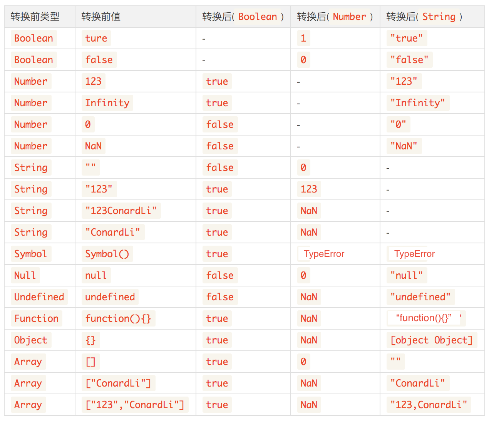

> 本文是在 ConardLi的“[【JS 进阶】你真的掌握变量和类型了吗](https://juejin.im/post/5cec1bcff265da1b8f1aa08f)”文章上的总结和扩展，集中记述了js中的变量和数据类型的相关知识点及应用场景，共分为5部分。

> 本文为“JS专题-变量与类型”的第4篇，4）JS的类型转换，由于JavaScript是`弱类型`的语言，所以类型转换发生非常频繁，前一章的装箱和拆箱其实就是一种类型转换。类型转换分为两种，隐式转换即程序自动进行的类型转换，强制转换即我们手动进行的类型转换。强制转换规则比较正常，在前一篇包装类型中已有描述，本文主要关注`让人头疼的可能发生隐式类型转换`的几个场景，以及如何转换：

<!-- more -->

# JS的类型转换

由于JavaScript是`弱类型`的语言，所以类型转换发生非常频繁，前一章的装箱和拆箱其实就是一种类型转换。类型转换分为两种，隐式转换即程序自动进行的类型转换，强制转换即我们手动进行的类型转换。强制转换规则比较正常，在前一篇包装类型中已有描述，本文主要关注`让人头疼的可能发生隐式类型转换`的几个场景，以及如何转换：

## 隐式类型转换的场景
- if语句和逻辑语句
- 数学运算符
- Native调用(如console.log、alert)

## 类型转换规则

各种类型间互转所符合的隐式类型转换规则如下表：



### if语句和逻辑语句

在if语句和逻辑语句中，如果只有单个变量，会先将变量转换为Boolean值，只有下面`6种`情况会转换成false，`null、undefined、''、NaN、0、false`。


### 数学运算符

- 在对各种`非Number`类型运用除加法之外的数学运算符`(- * / % > < )`时，会先将`非Number`类型转换为`Number`类型:

```js
1 - true // 0
1 - null //  1
1 * undefined //  NaN
2 * ['5'] //  10
```

- 注意：`+是个例外`，它既可以是算术加号，又可以是字符串连接符号，具体的要看它的操作数：
    1. 当一侧为String类型，会优先将另一侧转换为字符串类型进行`拼接`。
    2. 当一侧为Number类型，另一侧为原始类型，则将原始类型转换为Number类型`相加`。
    3. 当一侧为Number类型，另一侧为引用类型，将引用类型和Number类型转换成字符串后`拼接`。

```js
123 + '123' // 123123   （规则1）
123 + null  // 123    （规则2）
123 + true // 124    （规则2）
123 + {}  // 123[object Object]    （规则3）
```

- 注意：`{}更是个例外`，{}在+号前，系统判断其为代码块，不参加运算；{}在+号后，被当做对象处理：

```js
123 + {} // 123[object Object]
{} + 123 // 123 
123 - {} // NaN
{} - 123 // -123
```

## ==

使用`==`时，若两侧类型相同，则比较结果和`===`相同，否则会发生隐式转换，使用==时发生的转换可以分为几种不同的情况（只考虑两侧类型不同）：

1. NaN

`NaN`和其他任何类型比较永远返回false(包括和他自己)。
```js
NaN == NaN // false
```

2. Boolean

Boolean和其他任何类型比较，`Boolean首先被转换为Number类型`。
    **注意：**undefined、null和Boolean比较，虽然undefined、null和false都很容易被想象成假值，但是他们比较结果是false，原因是false首先被转换成0：
```js
true == 1  // true 
true == '2'  // false
true == ['1']  // true
true == ['2']  // false

undefined == false // false
null == false // false
```

3. null和undefined

`null == undefined`比较结果是true，除此之外，null、undefined和其他任何结果的比较值都为false。
```js
null == undefined // true
null == '' // false
null == 0 // false
null == false // false
undefined == '' // false
undefined == 0 // false
undefined == false // false
```

4. String和Number

String和Number比较，先将String转换为Number类型。
```js
123 == '123' // true
'' == 0 // true
```

5. 原始类型和引用类型

当原始类型和引用类型做比较时，引用类型会依照`ToPrimitive`规则转换为原始类型:
```js
'[object Object]' == {} // true
'1,2,3' == [1, 2, 3] // true
```
**注意：**
```js
[] == ![] // true
```
复制代码!的优先级高于==，![]首先会被转换为false，然后根据上面第二点，false转换成Number类型0，左侧[]转换为0，两侧比较相等。
```js
[null] == false // true
[undefined] == false // true
```
复制代码根据数组的ToPrimitive规则，数组元素为null或undefined时，该元素被当做空字符串处理，所以[null]、[undefined]都会被转换为0

::: warning
既然 == 有这么多坑，请务必使用 === 来判断值相等
:::

## `!`非逻辑

逻辑非（!）操作符首先通过`Boolean()`函数将它的操作值转换为布尔值，`然后求反`。

## 有意思的面试题

#### 一道经典的面试题，如何让：`a == 1 && a == 2 && a == 3`。
根据`拆箱转换`，以及`==的隐式转换`，写出答案：
```js
const a = {
   value:[3,2,1],
   valueOf: function () {return this.value.pop(); },
}
```

#### 如何判断两个对象相等
转换为字符串判断
```js
JSON.stringify(obj) === JSON.stringify(obj2); // true
```
