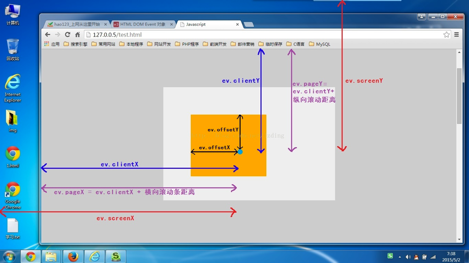

# BOM基础（五大对象）

## Window对象
- window对象是js中的顶级对象，所有定义在全局作用域中的变量、函数都会变成window对象的属性和方法。
- 在调用的时候可以省略window。
- window.open()与window.close()

## Location对象

### 属性

封装当前窗口正在打开的url的对象，location可获得url中各个部分。

- `location.hash`：设置或返回从井号 (#) 开始的 URL（锚）。
- `location.host`：设置或返回主机名和当前 URL 的端口号。
- `location.hostname`：设置或返回当前 URL 的主机名。
- `location.port`：设置或返回当前 URL 的端口号。
- `location.protocol`：设置或返回当前 URL 的协议。
- `location.pathname`：设置或返回当前 URL 的路径部分，`从域名后的/到?前`。
- `location.search`：设置或返回`从问号 (?) 开始`的 URL（查询部分）。
- 跳转: location="url"；location.href="url"；location.assign("url"); 以下效果一样：
    - `window.location` = "http://www.cnblogs.com";
    - `location.href`="http://www.cnblogs.com";
    - `location.assign`("http://www.cnblogs.com");
- 跳转: 禁止后退 `location.replace`("url")。
- 刷新: `location.reload`([force])，`force是可选参数`，默认为 false，从客户端缓存里取当前页。
 	   当设置为 true，则以 GET 方式，从服务端取最新的页面，相当于客户端点击 F5("刷新")。

### 重定向 href与replace的区别
- location.href='http://www.xxx.com/'，会在浏览器的历史浏览记录，即history对象中增加一条新的记录。
- location.replace('http://www.xxx.com/')，相当于用replace中的url`替换`了现有的页面url，并把`history中的url也替换为重定向后的url`。因此是`后退不了`的。

## History对象

保存当前窗口打开过的url的历史记录栈。

- 前进一页：history.go(1)；
- 后退一页：history.go(-1)；
- 刷新：history.go(0)；
- 前进一页：history.forward();
- 后退一页：history.back();

### H5中 History 新增API

- `history.pushState()`      ：添加新的状态到历史状态栈
- `history.replaceState()`   ：用新的状态代替当前状态
- `history.state `           ：返回当前状态对象

传送门：[前端路由-history模式](./router.html#history模式)

## Navigator对象

封装浏览器配置信息的对象。

- `navigator.userAgent`: 描述浏 **览器名称** 和 **版本号** 的字符串。
- `navigator.geolocation`: 只读属性返回一个 Geolocation 对象，通过这个对象可以访问到设备的位置信息:
    - Geolocation.getCurrentPosition()：确定设备的位置并返回一个携带位置信息的 Position 对象。
- `navigator.cookieEnabled`: 识别浏览器是否启用了cookie，如果启用，返回true，否则返回false。
- `navigator.plugins`: 保存了浏览器安装的所有插件的信息。

## Screen对象

Screen对象包含有关客户端显示屏幕的信息。获取screen.XXX属性。

### 图解 ev.clientX，ev.screenX，ev.pageX，ev.offsetX

- `clientX` 是目标点距离`浏览器视口左边界`中的位置；
- `screenX` 是目标点距离`显示器左边界`的位置；
- `pageX` 是目标点距离`页面左边界`中的位置（`clienX+横向滚动条距离`）；
- `offsetX` 是目标点距离`当前dom左边沿`的位置；

