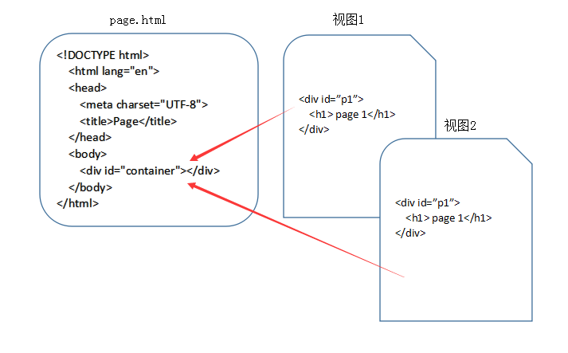

# 前端路由模式

## 什么是 SPA
SPA (single page web application) 译为单页Web应用。
简单的说 SPA 就是一个WEB项目只有一个 HTML 页面，一旦页面加载完成，SPA 不会跳转到其他页面，而是利用 JS 动态的变换 HTML 的内容，从而来模拟多个视图间跳转。



在 SPA 的应用设计中，一个应用只有一个HTML文件，在HTML文件中包含一个占位符（即图中的 container），占位符对应的内容由每个视图来决定，对于 `SPA 来说，页面的切换就是视图之间的切换`。

## SPA 优缺点

### 优点
- 用户体验好、快，内容的改变不需要重新加载整个页面，避免了不必要的跳转和重复渲染；
- 对服务器压力小；
- 前后端职责分离，架构清晰；
### 缺点
- **首次加载耗时多**：为实现单页 Web 应用功能及显示效果，需要在加载页面的时候将 JavaScript、CSS 统一加载，部分页面按需加载；
- **需要管理前进后退路由**：由于单页应用在一个页面中显示所有的内容，所以不能使用浏览器的前进后退功能，所有的页面切换需要自己建立堆栈管理；
- **SEO 难度较大**：由于所有的内容都在一个页面中动态替换显示，所以在 SEO 上其有着天然的弱势。

## 前端路由

### 为什么会有「前端路由」
Ajax异步获取数据，从而促使了Spa发展，动态改变html，无需刷新页面而更新，提升了WEB交互体验，但因为SPA中页面本身的 url不会变化，这导致了两个问题：
- SPA **无法记住用户的操作记录**，无论是`刷新`、`前进`还是`后退`，都无法展示用户真实的期望内容。
- SPA 中虽然由于业务的不同会有多种页面展示形式，但`对 SEO 不友好`，**只有一个 url，不方便搜索引擎进行收录**。

### 『前端路由』是什么

简单的说，就是在保证只有一个 HTML 页面，且与用户交互时不刷新和跳转页面的同时，`为 SPA 中的每个视图展示形式匹配一个特殊的 url`。`在刷新、前进、后退和SEO时均通过这个特殊的 url 来实现`。

::: tip 实现两点
因此，前端路由需要**实现两点**：
1. 能改变 url 但不让浏览器向服务器发送请求。
2. 可以监听到 url 的变化。
:::

hash、history模式都可以实现上述两点。

## hash模式

这里的 hash 就是指 url 后的 # 号以及后面的字符。比如说 "www.baidu.com/#XXXX" 中的"#XXXX"。[传送门]

### hash模式原理

由于 `hash 值的变化不会导致浏览器向服务器发送请求`，而且 hash 的改变会`触发 hashchange 事件`，因此符合「前端路由」的实现条件。在H5的history模式出现之前，都是用hash模式的。

### 基于hash方式「实现简单前端路由」

::: details 代码
```js
class HashRouter{
    constructor(){
        //用于存储不同hash值对应的回调函数
        this.routers = {};
        window.addEventListener('hashchange',this.load.bind(this),false)
    }
    //用于注册每个视图
    register(hash,callback = function(){}){
        this.routers[hash] = callback;
    }
    //用于注册首页
    registerIndex(callback = function(){}){
        this.routers['index'] = callback;
    }
    //用于处理视图未找到的情况
    registerNotFound(callback = function(){}){
        this.routers['404'] = callback;
    }
    //用于处理异常情况
    registerError(callback = function(){}){
        this.routers['error'] = callback;
    }
    //用于调用不同视图的回调函数
    load(){
        let hash = location.hash.slice(1),
            handler;
        //没有hash 默认为首页
        if(!hash){
            handler = this.routers.index;
        }
        //未找到对应hash值
        else if(!this.routers.hasOwnProperty(hash)){
            handler = this.routers['404'] || function(){};
        }
        else{
            handler = this.routers[hash]
        }
        //执行注册的回调函数
        try{
            handler.apply(this);
        }catch(e){
            console.error(e);
            (this.routers['error'] || function(){}).call(this,e);
        }
    }
}
```
演示一下：
```html
<body>
    <div id="nav">
        <a href="#/page1">page1</a>
        <a href="#/page2">page2</a>
        <a href="#/page3">page3</a>
        <a href="#/page4">page4</a>
        <a href="#/page5">page5</a>
    </div>
    <div id="container"></div>
    <script>
        let router = new HashRouter();
        let container = document.getElementById('container');

        //注册首页回调函数
        router.registerIndex(() => container.innerHTML = '我是首页');

        //注册其他视图回到函数
        router.register('/page1',() => container.innerHTML = '我是page1');
        router.register('/page2',() => container.innerHTML = '我是page2');
        router.register('/page3',() => container.innerHTML = '我是page3');
        router.register('/page4',() => {throw new Error('抛出一个异常')});

        //加载视图
        router.load();
        //注册未找到对应hash值时的回调
        router.registerNotFound(() => container.innerHTML = '页面未找到');
        //注册出现异常时的回调
        router.registerError((e) => {
            container.innerHTML = '页面异常，错误消息：<br>' + e.message);
        })
    </script>
</body>
```
:::


## history模式

传送门 [H5中 History 新增API](./bom-base.html#h5%E4%B8%AD-history-%E6%96%B0%E5%A2%9Eapi)

### histroy模式原理

1. 由于 **history.pushState()** 和 **history.replaceState()** `可以改变 url 同时，不会刷新页面`，所以在 HTML5 中的 histroy 具备了实现前端路由的能力：
    - **参数**
        history.pushState() 和 history.replaceState() 均接收三个参数（state, title, url）：
        - state：合法的 JS 对象，可以用在 `popstate事件`中，[传送门：window.onpopstate](https://developer.mozilla.org/zh-CN/docs/Web/API/Window/onpopstate) ；
        - title：现在大多浏览器忽略这个参数，可以直接用 null 代替；
        - url：任意有效的 URL，用于更新浏览器的地址栏；
    - **history.pushState() 和 history.replaceState() 的区别**
        - history.pushState() 在保留现有历史记录的同时，将 url 加入到历史记录中。
        - history.replaceState() 会将历史记录中的当前页面历史替换为 url。

2. 关于如何监听，因为history 的改变并不会触发任何事件，所以我们无法直接监听 history 的改变而做出相应的改变。但我们可以：`拦截所有可能触发 history 改变的情况，变相监听 history 的改变`。对于SPA的 history 模式，只有四种方式能改变url：
    1. 点击浏览器的前进或后退按钮；
    2. 点击 a 标签；
    3. 在 JS 代码中触发 history.pushState 函数；
    4. 在 JS 代码中触发 history.replaceState 函数；


### 关键问题：history模式为什么需要后端支持？
需要注意的是，history 在修改 url 后，虽然页面并不会刷新，但如果我们**手动刷新**，或**通过 url 直接进入应用**的时候，服务端是无法识别这个 url 的。

因为我们是**单页应用，只有一个 html 文件，服务端在处理其他路径的 url 的时候，就会出现404的情况**。

所以，如果要应用 history 模式，**需要在服务端增加一个覆盖所有情况的候选资源**：`如果 URL 匹配不到任何静态资源，则应该返回单页应用的 html 文件`。

### 基于history方式「实现简单前端路由」

::: details 代码
```js
class HistoryRouter{
    constructor(){
        //用于存储不同path值对应的回调函数
        this.routers = {};
        this.listenPopState();
        this.listenLink();
    }
    //监听 popstate 用于处理前进后退时调用对应的回调函数
    listenPopState(){
        window.addEventListener('popstate',(e)=>{
            let state = e.state || {},
                path = state.path || '';
            this.dealPathHandler(path)
        },false)
    }
    //全局监听A链接，阻止A链接的默认事件，获取A链接的href属性，并调用 history.pushState 方法
    listenLink(){
        window.addEventListener('click',(e)=>{
            let dom = e.target;
            if(dom.tagName.toUpperCase() === 'A' && dom.getAttribute('href')){
                e.preventDefault()
                this.assign(dom.getAttribute('href'));
            }
        },false)
    }
    // load 方法，用于首次进入页面时 根据 location.pathname 调用对应的回调函数
    load(){
        let path = location.pathname;
        this.dealPathHandler(path)
    }
    //用于注册每个视图
    register(path,callback = function(){}){
        this.routers[path] = callback;
    }
    //用于注册首页
    registerIndex(callback = function(){}){
        this.routers['/'] = callback;
    }
    //用于处理视图未找到的情况
    registerNotFound(callback = function(){}){
        this.routers['404'] = callback;
    }
    //用于处理异常情况
    registerError(callback = function(){}){
        this.routers['error'] = callback;
    }
    // 跳转到path
    // 定义 assign 方法，用于通过 JS 触发 history.pushState 函数
    assign(path){
        history.pushState({path},null,path);
        this.dealPathHandler(path)
    }
    // 替换为path
    // 定义 replace 方法，用于通过 JS 触发 history.replaceState 函数
    replace(path){
        history.replaceState({path},null,path);
        this.dealPathHandler(path)
    }
    //通用处理 path 调用回调函数
    dealPathHandler(path){
        let handler;
        //没有对应path
        if(!this.routers.hasOwnProperty(path)){
            handler = this.routers['404'] || function(){};
        }
        //有对应path
        else{
            handler = this.routers[path];
        }
        try{
            handler.call(this)
        }catch(e){
            console.error(e);
            (this.routers['error'] || function(){}).call(this,e);
        }
    }
}
```
演示一下：
```html
<body>
    <div id="nav">
        <a href="/page1">page1</a>
        <a href="/page2">page2</a>
        <a href="/page3">page3</a>
        <a href="/page4">page4</a>
        <a href="/page5">page5</a>
        <button id="btn">page2</button>
    </div>
    <div id="container"></div>
    <script>
        let router = new HistoryRouter();
        let container = document.getElementById('container');

        //注册首页回调函数
        router.registerIndex(() => container.innerHTML = '我是首页');

        //注册其他视图回到函数
        router.register('/page1', () => container.innerHTML = '我是page1');
        router.register('/page2', () => container.innerHTML = '我是page2');
        router.register('/page3', () => container.innerHTML = '我是page3');
        router.register('/page4', () => {
            throw new Error('抛出一个异常')
        });

        document.getElementById('btn').onclick = () => router.assign('/page2')


        //注册未找到对应path值时的回调
        router.registerNotFound(() => container.innerHTML = '页面未找到');
        //注册出现异常时的回调
        router.registerError((e) => container.innerHTML = '页面异常，错误消息：<br>' + e.message);
        //加载页面
        router.load();
    </script>
</body>
```
:::

## hash、history 如何抉择（二者优缺点）

1. hash 模式相比于 history 模式的优点：
    - 无需服务端配合处理非单页的url地址；
    - 兼容性更好，可以兼容到IE8；
2. hash 模式相比于 history 模式的缺点：
    - 更丑；
    - 会导致锚点功能失效；
    - 相同 hash 值不会触发动作将记录加入到历史栈中，而 pushState 则可以。

综上所述，当我们不需要兼容老版本IE浏览器，并且可以控制服务端覆盖所有情况的候选资源时，我们可以愉快的使用 history 模式了。反之，很遗憾，只能使用丑陋的 hash 模式~


## 参考链接

本文参考链接[「前端进阶」彻底弄懂前端路由-云中桥](https://juejin.im/post/5d2d19ccf265da1b7f29b05f)
