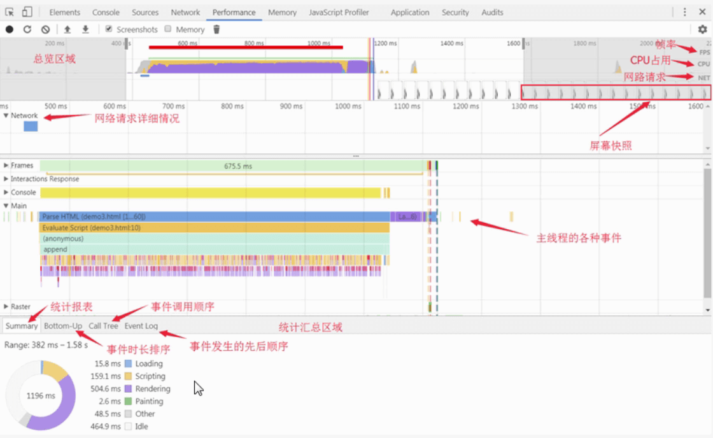
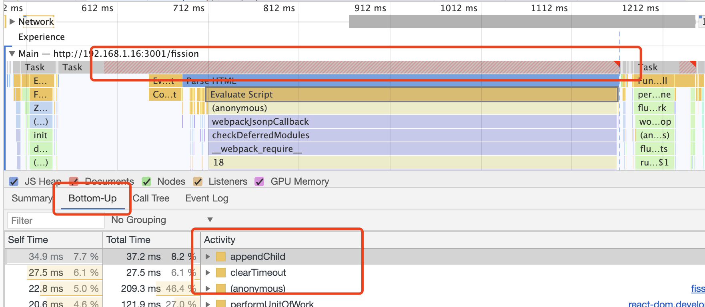

# web 性能检测指标及手段

## 性能检测指标

### FCP 首次内容绘制

首次内容绘制，`FCP`（First Contentful Paint），这个指标用于记录页面首次绘制文本、图片、非空白 Canvas 或 SVG 的时间。

### TTI 可交互时间

[Time to Interactive (TTI)，可交互时间](https://web.dev/interactive/?utm_source=lighthouse&utm_medium=cli)。

`TTI` measure when the page is ready for user input. TTI occurs when the user is fully able to interact with the page.

- 可以对 TTI 产生特别大影响的一项改进是推迟或删除不必要的 JavaScript 工作。
  - 减少主线程工作
  - 减少 JavaScript 执行时间
- 请考虑通过代码拆分 和应用 PRPL 模式来减少 JavaScript 有效负载。

#### 页面加载性能之 PRPL 模式。

`PRPL` 是一种让网页加载变得可交互、更快速的模式，包含以下四个:

- Push (或者 preload): 给用户推送最重要的资源
- Render: 尽快的渲染最初始的路由
- Pre-cache: 提前缓存剩余的资源
- Lazy load: 懒加载其他路由或者次要资源

### LCP 最大内容绘画

[Largest Contentful Paint（LCP），最大内容绘画](https://blog.csdn.net/wuchen092832/article/details/107888000)。

- `LCP` 指标代表的是视窗 最大可见图片 或者 文本块 的渲染时间。LCP 用于记录视窗内最大的元素绘制的时间，该时间会随着页面渲染变化而变化，因为页面中的最大元素在渲染过程中可能会发生改变，另外该指标会在用户第一次交互后停止记录。
- LCP 比 FCP 更能体现一个页面的性能好坏程度，例如当页面出现骨架屏或者 Loading 动画时 FCP 其实已经被记录下来了，但是此时用户希望看到的内容其实并未呈现，我们更想知道的是页面主要的内容是何时呈现出来的。
- 官方推荐的时间区间，在 2.5 秒内表示体验优秀。

改善 LCP，可从如下方面考虑：

- 较慢的服务器响应时间
- 渲染阻塞的 js 和 css
- 较慢的资源加载时间
- 客户端渲染

### TBT 总阻止时间

[Total Blocking Time (TBT)，总阻止时间](https://web.dev/lighthouse-total-blocking-time/?utm_source=lighthouse&utm_medium=cli)。

- 定义
  - TBT measures the total amount of time that a page is blocked from responding to user input, such as mouse clicks, screen taps, or keyboard presses. The sum is calculated by adding the blocking portion of **all long tasks** between **First Contentful Paint（FCP）** and **Time to Interactive（TTI）**. _Any task that executes for more than 50 ms is a long task_. The amount of time after 50 ms is the blocking portion. For example, if Lighthouse detects a 70 ms long task, the blocking portion would be 20 ms.
- 即：**累加从 FCP 到 TTI 之间的所有长任务的阻塞部分**。

改善 `TBT`，就要减少 `长任务 Long Task`：

- **减少 不必要的 JS 加载，解析或执行**。在“性能”面板中分析代码时，您可能会发现主线程正在执行实际上不需要加载页面的工作。通过代码拆分，删除未使用的代码 或 有效地加载第三方 JavaScript 来减少 JavaScript 有效负载，可以提高您的 TBT 得分。
- 这部分可以结合 Coverage 面板，将一开始用不到的代码，异步按需加载。

### FID 首次输入延迟

First Input Delay（`FID`），首次输入延迟，记录在 FCP 和 TTI 之间用户首次与页面交互时响应的延迟。

- 这个指标其实挺好理解，就是看用户交互事件触发到页面响应中间耗时多少，如果其中有长任务发生的话那么势必会造成响应时间变长。
- Google 推荐响应用户交互在 100ms 以内
- **不过！！！FID 是*一种现场指标*，不能在实验室环境中进行仿真。为了测量响应延迟，需要真实的用户交互。**，为了帮助预测 FID，建议使用总阻止时间（TBT）来替代。虽然他们衡量不同的事物，但是 TBT 的改善通常对应 FID 的改善。

### CLS 累计位移偏移

Cumulative Layout Shift（`CLS`），累计位移偏移，记录了页面上非预期的位移波动。

- 大家想必遇到过这类情况：页面渲染过程中突然插入一张巨大的图片或者说点击了某个按钮突然动态插入了一块内容等等相当影响用户体验的网站。
- 这个指标就是为这种情况而生的，计算方式为：位移影响的面积\*位移距离。
- CLS 推荐值为低于 0.1，越低说明页面跳来跳去的情况就越少，用户体验越好。

## 三大核心指标

上述列出了 6 种指标：FCP、TTI、LCP、TBT、FID、CLS，Google 在今年（2020）五月提出了网站用户体验的三大核心指标，分别为：`LCP、FID、CLS`，所以我们重点关注这 3 种即可。

- LCP 代表了页面的速度指标（加载速度），LCP 能体现的东西更多一些。一是指标实时更新，数据更精确，二是代表着页面最大元素的渲染时间，通常来说页面中最大元素的快速载入能让用户感觉性能还挺好。
- FID 代表了页面的交互体验指标（交互反馈快慢），毕竟没有一个用户希望触发交互以后页面的反馈很迟缓，交互响应的快会让用户觉得网页挺流畅。不过 FID 是实验室指标，可以用 TBT 来替代衡量。
- CLS 代表了页面的稳定指标（是不是稳定），尤其在手机上这个指标更为重要。因为手机屏幕挺小，CLS 值一大的话会让用户觉得页面体验做的很差。

## 网站性能检测方式

### Lighthouse

谷歌出品的``lighthouse`

```bash
# 全局安装
npm install -g lighthouse

# 启动分析目标网站
lighthouse https://www.tigeresop.com/

# 去到本地文件夹中查看性能分析结果
open ./
# www.baidu.com_2020-09-11_15-11-36.report.html
```

### PageSpeed

在谷歌浏览器中安装 `PageSpeed Insights` 插件，并在 Chrome 的扩展器中启动网页速度分析的功能。在 Analyze 之后，PageSpeed 会依次列出性能优化建议。

### Chrome: Performace



对于可能存在掉帧和卡顿的节点，主线程 Main 会在右上角带着**一个红色的三角**，点击这个三角模块可以查看到对应的耗时原因以及对应的执行函数



- [狙杀页面卡顿 —— Performance 工具指北](https://zhuanlan.zhihu.com/p/41017888)

### Chrome: Coverage

可以通过 chrome 控制台的`coverage选项`（cmd+shift+p 输入 coverage 进入）查看代码的使用率。

[传送门](../../../../../FullStackDeveloper/webpack/3_product_training.html#%E6%89%93%E5%8C%85%E5%88%86%E6%9E%90)
