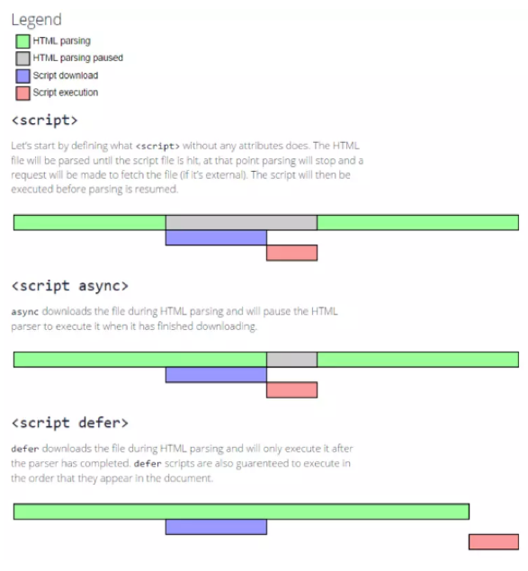

# 提升页面性能的方法（6 点）

## 资源压缩合并

- 开启 gzip 压缩（一般是由 nginx、apache、tomcat 等 web 服务器开启，且需要浏览器支持，开启后的请求都是基于 gzip 压缩格式的，效率高达 70%左右），详见（`前端必备nginx知识`）；
- 减少 HTTP 请求；

## 善用浏览器缓存（强缓存、协商缓存）

### 缓存命中流程

浏览器缓存包含两种类型，即`强缓存（200 from cache，也叫本地缓存）`和`协商缓存（304）`，两种命中缓存过程如下：

- 浏览器在第一次请求发生后，再次请求时，会先获取该资源缓存的 header 信息，判断是否命中强缓存（cache-control 和 expires 信息），若命中直接从缓存中获取资源信息，包括缓存 header 信息；本次请求根本就不会与服务器进行通信；
- 如果没有命中强缓存，浏览器会发送请求到服务器，请求会携带第一次请求返回的有关缓存的 header 字段信息（Last-Modified/If-Modified-Since 和 Etag/If-None-Match），由服务器根据请求中的相关 header 信息来比对结果是否命中协商缓存；若命中，则服务器返回新的响应 header 信息更新缓存中的对应 header 信息，但是并不返回资源内容，它会告知浏览器可以直接从缓存获取；否则返回最新的资源内容

### 缓存具体原理


#### 一、强缓存：浏览器如果判断本地缓存未过期，就直接使用，无需发起 http 请求

- Expires: Thu, 21 Jan 2017 23:00:00 GMT （http1.0）。如果发送请求的时间在 expires 之前，那么本地缓存始终有效。
- Cache-Control: max-age=600(注: 十分钟)/ no-cache/ no-store/ public/ private（http1.1）
  - max-age：用来控制强缓存，是一个相对值，相对于第一次请求的时间点的过期时间，如果当前请求时间在过期时间之前，就能命中强缓存;
  - no-cache：不使用强缓存。需要使用协商缓存，先与服务器确认返回的响应是否被更改
  - no-store：直接禁止浏览器缓存数据，每次用户请求该资源，都会向服务器发送一个请求，每次都会下载完整的资源。
  - public：可以被所有的用户缓存，包括终端用户和 CDN 等中间代理服务器。
  - private：只能被终端用户的浏览器缓存，不允许 CDN 等中继缓存服务器对其缓存。

**注意**：如果`cache-control（http1.1规范）`与`expires（http1.0规范）`同时存在的话，`cache-control的优先级高于expires`。expires 使用的时间是服务器时间，由于服务端与客户端很可能不同步，因此 http1.1 后不推荐再使用 expire，而 cache-control 的 max-age 是客户端时间，所以没有这个问题。

#### 二、协商缓存：浏览器向服务端发起 http 请求，服务端告诉浏览器文件未改变，让浏览器使用本地缓存

协商缓存都是由服务器来确定缓存资源是否可用的，所以客户端与服务器端要通过某种标识来进行通信，从而让服务器判断请求资源是否可以缓存访问。

这主要涉及到下面两组 header 字段，这两组搭档都是成对出现的，即第一次请求的响应头带上某个字段（Last-Modified 或者 Etag），则后续请求则会带上对应的请求字段（If-Modified-Since 或者 If-None-Match），若响应头没有 Last-Modified 或者 Etag 字段，则请求头也不会有对应的字段。

- `Last-Modified / If-Modified-Since（http1.0）`，二者的值都是 GMT 格式的时间字符串，具体过程：
  - 浏览器第一次跟服务器请求一个资源，服务器在返回这个资源的同时，在 respone 的 header 加上 Last-Modified 的字段，这个字段表示这个资源在服务器上的最后修改时间；
  - 浏览器再次跟服务器请求这个资源时，在 request 的 header 上加上 If-Modified-Since 的字段，这个字段的值就是上一次请求时返回的 Last-Modified 的值；
  - 服务器再次收到资源请求时，根据浏览器传过来 If-Modified-Since 和资源在服务器上的最后修改时间判断资源是否有变化，如果没有变化则返回 304 Not Modified，但是不会返回资源内容；如果有变化，就正常返回资源内容。当服务器返回 304 Not Modified 的响应时，response header 中不会再添加 Last-Modified 的 header，因为既然资源没有变化，那么 Last-Modified 也就不会改变。
  - 浏览器收到 304 的响应后，就会从缓存中加载资源；
  - 如果协商缓存没有命中，浏览器直接从服务器加载资源时，Last-Modified 的 Header 在重新加载的时候会被更新，下次请求时，If-Modified-Since 会启用上次返回的 Last-Modified 值。
- `Etag / If-None-Match（http1.1）`，这两个值是由服务器生成的每个资源的唯一标识字符串，只要资源有变化，这个值就会改变：
  - 其判断过程与 Last-Modified/If-Modified-Since 类似，`与Last-Modified不一样的是，当服务器返回304 Not Modified的响应时，由于ETag重新生成过，response header中还会把这个ETag返回，即使这个ETag跟之前的没有变化`。
  - **注意**：If-Modified-Since 与 If-None-Match 是**浏览器发向服务器端**的字段。
- _既生 Last-Modified 何生 Etag?_，HTTP1.1 中 Etag 的出现主要是为了解决几个 Last-Modified 比较难解决的问题：
  - 1、一些文件也许会周期性的更改，但是他的内容并不改变(仅仅改变的修改时间)，这个时候我们并不希望客户端认为这个文件被修改了，而重新 GET；
  - 2、某些文件修改非常频繁，比如在秒以下的时间内进行修改，(比方说 1s 内修改了 N 次)，If-Modified-Since 能检查到的粒度是秒（s）级的，这种修改无法判断(或者说 UNIX 记录 MTIME 只能精确到秒)；
  - 3、某些服务器不能精确的得到文件的最后修改时间。
  - 这时，利用 Etag 能够更加准确的控制缓存，因为 Etag 是服务器自动生成或者由开发者生成的对应资源在服务器端的唯一标识符。
  - 如果 ETag 和 Last-Modified 都有，则必须一次性都发给服务器，没有优先级，但服务端会优先检查 E-tag。
  - 最后，如果服务器输出了 ETag，没有必要再输出 Last-Modified。有 ETag 就够了。

### 强缓存如何重新加载浏览器缓存里面已经缓存过的资源？

> 使用强缓存时，浏览器不会发送请求到服务端，根据设置的缓存时间浏览器一直从缓存中获取资源，在这期间若资源产生了变化，浏览器就在缓存期内就一直得不到最新的资源，那么如何防止这种事情发生呢？

通过更新页面中引用的资源路径，让浏览器主动放弃缓存，加载新资源。这样每次文件改变后就会生成新的 query 值，这样 query 值不同，也就是页面引用的资源路径不同了，之前缓存过的资源就被浏览器忽略了，因为资源请求的路径变了。


- **注意**：对于协商缓存，使用 Ctrl + F5 或 cmd + R 强制刷新可以使得缓存无效。
- **注意**：对于强缓存，在未过期时，必须更新资源路径才能发起新的请求（更改了路径相当于是另一个资源了，这也是前端工程化中常用到的技巧）。

## 非核心代码异步加载（script：async、defer）

针对于 `<script>标签加载js代码资源` 而进行优化。

### 异步加载代码的方式

- 监听 onload 事件，动态脚本加载 document.createElement(‘script’)
- setTimeout 延迟加载 js 代码
- async 异步执行
- defer 延迟执行

### async 和 defer 的区别

```html
<script src="./async.js" charset="utf-8" async></script>
<script src="./defer.js" charset="utf-8" defer></script>
```

1. 没有 async 或 defer：
   ```html
   <script src="script.js"></script>
   ```
   浏览器会立即加载并执行指定的脚本，“立即”指的是在渲染该 script 标签下面的文档元素之前，也就是说不等待后续载入的文档元素，读到就加载并执行。
2. 只有 async 属性：
   ```html
   <script async src="script.js"></script>
   ```
   - 有 async，该 js 代码资源与 html 的解析是`并行加载`的，即异步 download；
   - async 异步下载完毕后就会立即执行，`执行过程是阻塞html解析的`；
   - `不确保执行顺序`，如果是多个，执行顺序和加载顺序无关。
3. 只有 defer 属性：
   ```html
   <script defer src="myscript.js"></script>
   ```
   - 有 defer，该 js 代码资源与 html 的解析是`并行加载`的，即异步 download；
   - defer 虽然(可能)先加载，但却是在 HTML 解析完之后，在 DOMContentLoaded 事件流触发之前，才会`延迟执行`。
   - `确保执行顺序`，如果是多个，按照加载的顺序依次执行。



#### 扩展：onload 和 DOMContentLoaded 比较：

- DOMContentLoaded 事件触发时，仅当 DOM 加载完成，不包括样式表，图片(譬如如果有 async 加载的脚本就不一定完成)；
- onload 事件触发时，页面上所有的 DOM，样式表，脚本，图片都已经加载完成了。

## 静态资源预加载（link：preload、prefetch）

针对于 `<link>标签加载静态资源` 而进行优化。

### preload

给`<link>`标签，指定 rel=preload 能够让你在你的 HTML 页面中`<head>`元素内部书写一些声明式的资源获取请求，可以指明哪些资源是在页面加载完成后立刻需要的。

**场景**：试想我们网站使用了一种特殊字体，我们在 css 里面定义了字体的 url。那么直到浏览器开始解析 CSS 了才会识别出来需要加载这个资源。如果我们提前让浏览器下载好这个资源呢？那么执行 CSS 的时候就可以直接用了。就像这样：

```html
<link
	rel="preload"
	href="fonts/cicle_fina-webfont.woff"
	as="font"
	type="font/woff"
	crossorigin="anonymous"
/>
```

- rel="preolad"声明这是一个 preload；
- href 指明资源的位置；
- as 指明资源类型（这是为了让浏览器精确设置优先级，设置正确的 CSP、Accept 头部）；
- crossorigin 指明使用的跨域设置；
- 添加 preload 声明之后，浏览器初次加载的资源变多了，但 preload 并不会阻塞 onload 事件的触发；
- 响应式预加载：link 标签还可以接收一个 media 属性，进行简单的媒体查询。例如这样：
  ```html
  <link
  	rel="preload"
  	href="bg-image-narrow.png"
  	as="image"
  	media="(max-width: 600px)"
  />
  <link
  	rel="preload"
  	href="bg-image-wide.png"
  	as="image"
  	media="(min-width: 601px)"
  />
  ```

### prefetch

给/`<link>`标签，指定 rel=prefetch 是对浏览器的暗示，暗示将来可能需要某些资源，但由浏览器代理决定是否加载以及什么时候加载这些资源。

**场景**：用户正在登录页面，登录成功之后会跳转到首页。我是否可以在登录页面就去请求首页的资源呢？就像这样：

```html
<link rel="prefetch" href="main.js" />
```

### preload 和 prefetch 的区别

> So，什么时候用 preload 什么时候用 prefetch?

prefetch 跟 preload 不同在于：`用户从A页面进入B页面，preload的内容会失效，而prefetch的内容可以在B页面使用`。


## 使用 CDN

本部分可直接传送门到[nginx 静态资源相关知识](/Question-Bank/work-practices/deploy.md#四、nginx静态资源相关知识)

## DNS 预解析

在 head 中添加如下 link 标签并指定 `rel="dns-prefetch"`便可以开启浏览器的 dns 预解析：

```html
<link rel="dns-prefetch" href="//host_name_to_prefetch.com" />
```

- 在 http 协议下，高级浏览器中 a 标签的 dns 预解析是默认打开的；
- 但在 https 协议下，很多浏览器中 a 标签的 dns 预解析是默认关闭的，通过如下 meta 标签可以`强制打开a标签的dns预解析`。
  ```html
  <meta http-equiv="x-dns-prefetch-control" content="on" />
  ```

### DNS 优化：域名发散与域名收敛

- **域名发散**：

  - 由于浏览器的限制，每个浏览器，允许对每个域名的连接数一般是有并发上限的。
    - （另外，为什么浏览器要做并发限制呢？）
      - 究其根本原因，在以前，服务器的负载能力差，稍微流量大一点服务器就容易就崩溃。 所以为了保护服务器不被强暴到崩溃，浏览器要对 max connections（最大并发数）进行限制。如果每个用户的最大并发数不限制的话，服务器的负载能力会大幅下降。
      - 还有就是 防止 DDOS 攻击。最基本的 DoS 攻击就是利用合理的服务请求来占用过多的服务资源，从而使合法用户无法得到服务的响应。
  - PC 时代为了突破浏览器的域名并发限制，http 静态资源采用`多域名部署`。将静态资源分布在几个不同域，保证资源最完美地分域名存储，以提供最大并行度，让客户端加载静态资源更为迅速。
  - 目的是充分利用现代浏览器的多线程并发下载能力。

- **域名收敛**：
  - 域名收敛的意思就是建议将静态资源只放在一个域名下面，而非发散情况下的多个域名下。
  - 不同情况区别对待，域名发散是 PC 时代的产物，而在移动端的 http 请求耗时中，DNS 解析占据了大部分时间。
  - 虽然域名发散可以突破浏览器的域名并发限制，但域名收敛可以

## 避免 JS 运行时间过长而掉帧（JS 持续占用主线程）

- 屏幕的刷新频率一般是每秒 60 次（60 FPS）。这就意味着，每过 16.7ms，浏览器就会将截止上次刷新后的元素变动应用到屏幕上，也就是渲染管线中的 layout 过程，这个过程非常耗费性能。
- 同时，渲染线程和 JS 线程是互斥的，也就是说，这 16.7ms 会被二者瓜分，所以屏幕的刷新频率决定了每帧之间留给 JS 执行的时间“并不多”。如果 JS 执行占用时间过长会就导致无法及时渲染，即出现所谓的“掉帧”。

**浏览器在一帧内可能会做执行下列任务，而且它们的执行顺序基本是固定的:**

1. 处理用户输入事件
2. Javascript 执行
3. 调用 rAF （requestAnimationFrame）
4. 布局 Layout
5. 绘制 Paint
6. \*如果浏览器处理完上述的任务(布局和绘制之后)，还有盈余时间，浏览器就会调用 requestIdleCallback 的回调。

#### 方案一：利用 requestAnimationFrame（rAF）

- 利用 requestAnimationFrame（rAF）实现时间分片，把任务拆成一个个持续时间更短的小任务，分散到各个帧中执行。

- rAF 最大的优势是**由系统来决定回调函数的执行时机**。
  - 如果屏幕刷新率是 60Hz,那么回调函数就每 16.7ms 被执行一次，如果刷新率是 75Hz，那么这个时间间隔就变成了 1000/75=13.3ms，换句话说就是，**rAF 的步伐跟着系统的刷新步伐走**。它能`保证回调函数在屏幕每一次的刷新间隔中只被执行一次`，这样就不会引起丢帧现象。

```js
document.body.innerHTML = "";

let step = 0;
function subtask() {
	if (step === 1e9) {
		return;
	}
	window.requestAnimationFrame(function() {
		for (var i = 0; i < 1e8; i++) {
			step++;
			1 + 1;
		}
		subtask();
	});
}
subtask();
```

上栗使用 requestAnimationFrame 来进行分批渲染：将 10 亿次循环分成 10 个 1 亿次循环，1 亿次之后 js 线程让出主线程，让渲染线程得以渲染。

#### 方案二：利用 requestIdleCallback（Idle）

- requestIdleCallback 会在**浏览器`空闲`的时候执行**注册的回调函数，避免在主线程“拥挤”的时候执行某些代码。
  - 如果一帧中**没有盈余时间**怎么办？
  - 它支持你通过`第二个参数，设定一个超时时间`，**保证在超时后，即使仍然没有空闲时间也必须执行回调**。回调函数会接收一个 IdleDeadline 类型的参数，你可以通过 .didTimeout 来查看是否是超时执行，还可以通过执行 .timeRemaining() 方法来查看剩余的空闲时间。

```js
window.requestIdleCallback(
	deadline => {
		if (deadline.timeRemaining() > 100) {
			// 一些可以等浏览器空闲了再去做的事
			// ……
		}
	},
	{ timeout: 5000 }
);
```

_Fiber 就是用了这种原理_

## 参考链接

- [性能优化是个很大的专题：看下这个文章专题](https://alienzhou.github.io/fe-performance-journey/#%E5%89%8D%E7%AB%AF%E9%9C%80%E8%A6%81%E6%80%A7%E8%83%BD%E4%BC%98%E5%8C%96%E4%B9%88%EF%BC%9F)
- [「前端进阶」高性能渲染十万条数据(时间分片)](https://juejin.im/post/5d76f469f265da039a28aff7#heading-5)
