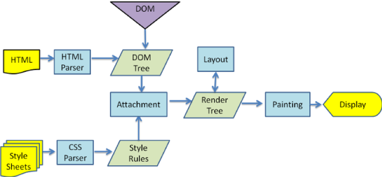

# 浏览器渲染机制

## DOCTYPE

### 定义及作用
- `DTD`(document type definition，`文档类型定义`)是一系列的语法规则，用来定义XML或(X)HTML的文件类型。浏览器会使用DTD来判断文档类型，决定使用何种协议来解析，以及切换浏览器模式。
- `DOCTYPE是用来声明DTD的`，即`声明文档类型`。
- 主要的用途有：对文档的合法性进行验证；决定浏览器的呈现模式。

### 常用的 DOCTYPE 声明

HTML 5：
```html
<!DOCTYPE html>
```

HTML 4.01 Strict：
该 DTD 包含所有 HTML 元素和属性，但不包括展示性的和弃用的元素（比如 font）。
```html
<!DOCTYPE HTML PUBLIC "-//W3C//DTD HTML 4.01//EN""http://www.w3.org/TR/html4/strict.dtd">
```

HTML 4.01 Transitional：
该 DTD 包含所有 HTML 元素和属性，包括展示性的和弃用的元素（比如 font）。
```html
<!DOCTYPE HTML PUBLIC "-//W3C//DTD HTML 4.01 Transitional//EN" "http://www.w3.org/TR/html4/loose.dtd">
```

### 严格模式有什么主要限制
- 变量必须声明才能使用；
- arguments参数不会自动反映函数参数的变化；
- 不能使用arguments.caller或.callee；
- 禁止this指向全局对象；
- 不能使用前缀0表示八进制数；

### 不同浏览器内核
- IE：trident内核
- Firefox：gecko内核
- Safari：webkit内核
- Chrome：Blink（基于webkit）内核

## 浏览器渲染过程（6步）
Firefox、Chrome和Safari是基于两种渲染引擎构建的，Firefox使用Geoko——Mozilla自主研发的渲染引擎，Safari和Chrome都使用webkit。尽管Webkit与Gecko使用略微不同的术语，这个过程还是基本相同的：



1. `DOM tree`：浏览器会将HTML解析成一个DOM树，DOM 树的构建过程是一个深度遍历过程：当前节点的所有子节点都构建好后才会去构建当前节点的下一个兄弟节点。
2. `CSS规则树`：将CSS解析成 CSS Rule Tree 。
3. `Render tree`：根据DOM树和CSSOM来构造 Render Tree。注意：Render Tree 渲染树并不等同于 DOM 树，因为一些像Header或display:none的东西就没必要放在渲染树中了。
4. `Layout（Reflow）`：有了Render Tree，浏览器已经能知道网页中有哪些节点、各个节点的CSS定义以及他们的从属关系。这一步操作称之为layout/reflow，顾名思义就是计算出每个节点在屏幕中的尺寸和位置。
5. `Paint`：再下来这一步就是绘制，即遍历render树，绘制页面像素信息。
6. `Composite 并显示`：最终，浏览器将各层的信息发送给GPU，进而将各层合成（composite）并显示在屏幕上。

**注意**：上述这个过程是逐步完成的，为了更好的用户体验，渲染引擎将会`尽可能早的将内容呈现到屏幕上`，并不会等到所有的html都解析完成之后再去构建和布局render树。它是`解析完一部分内容就显示一部分内容，同时，可能还在通过网络下载其余内容`。

## 重排reflow 与 重绘repaint

### 1、reflow（重排/回流）：

#### 定义
各个DOM元素都有自己的盒子模型，这些都需要浏览器根据各种样式来计算并根据计算结果将元素放到应该的位置上。当浏览器发现某个部分发生了点变化影响了布局，需要倒回去重新渲染，那么这个回退的过程叫 reflow。
- reflow 会从`<html>`这个 root frame 开始递归往下，依次计算所有的结点几何尺寸和位置。
- reflow 几乎是无法避免的。现在界面上流行的一些效果，比如树状目录的折叠、展开（实质上是元素的显 示与隐藏）等，都将引起浏览器的 reflow。鼠标滑过、点击……只要这些行为引起了页面上某些元素的占位面积、定位方式、边距等属性的变化，都会引起它内部、周围甚至整个页面的重新渲染。通常我们都无法预估浏览器到底会 reflow 哪一部分的代码，它们都彼此相互影响着。

#### 触发reflow的情况
1. 页面初始化渲染时；
2. dom结构改变：操作dom节点结构时、移动dom位置时；
3. `resize窗口`时有可能；
4. 改变字体大小时；
5. render tree变化：修改某些影响布局的css样式时（比如增减padding）；
6. `最复杂的一种：获取某些属性时`。很多浏览器会对回流做优化，会等到数量足够时做一次`批处理`回流，但是，除了render树的直接变化，当获取一些属性时，浏览器为了获得正确的值也会触发回流，这样`使得浏览器批处理优化无效`，包括：
    - offset(Top/Left/Width/Height)
    - scroll(Top/Left/Width/Height)
    - cilent(Top/Left/Width/Height)
    - width，height
    - 调用了getComputedStyle()或者IE的currentStyle([js如何设置获取盒模型对应的宽和高](/Question-Bank/css/box-sizing&margin-collapse&BFC.md#js如何设置获取盒模型对应的宽和高))

### 2、repaint（重绘）：

#### 定义
改变某个元素的背景色、文字颜色、边框颜色等等但不影响它周围或内部布局的属性时，屏幕的一部分要重画，但是元素的几何尺寸没有变。这个过程就叫做repaint。
- 重排一定伴随着重绘，重绘却可以单独出现。
- 注意：
    - (1) `display:none 的节点不会被加入Render Tree`，而visibility: hidden 则会，所以，如果某个节点最开始是不显示的，设为display:none是更优的。
    - (2) `display:none 会触发 reflow，而 visibility:hidden 只会触发 repaint，因为没有发现位置变化`。
    - (3) 有些情况下，比如修改了元素的样式，浏览器并不会立刻reflow 或 repaint 一次，而是会把这样的操作积攒一批，然后做一次 reflow，这又叫异步 reflow 或增量异步reflow。但是在有些情况下，比如resize 窗口，改变了页面默认的字体等。对于这些操作，浏览器会马上进行 reflow。

#### 减少 reflow & repaint
`重排和重绘是不可避免的`，我们只能说将它们对性能的影响减到最小，既然我们知道什么情况会触发它们，那就从这些方面入手：

1. 让需要改变的元素进行`“离线处理”`，处理完后一起更新；
2. 避免循环操作dom，创建一个`documentFragment`或div，在它上面应用所有DOM操作，最后再把它添加到window.document，触发一次重排和重绘
（[使用documentfragment](/Lets-Read/one/read-3-1.md#使用-documentfragment)）；
3. `使用display: none`，触发两次重排和重绘（由于display: none的元素不在渲染树中，对隐藏的元素操作不会引发其他元素的重排，可以先隐藏它，操作完成后再显示。这样只在隐藏和显示时触发2次重排）；
4. `将需要多次重排的元素的position属性设为absolute或fixed`（设为float没有完全脱离文档流，这个很微妙），这样元素就脱离了文档流，它的变化不会影响到其他元素的布局，不会导致一个完整重排；
5. 减少逐项更改样式，最好`一次性更改style`，或者将样式定义为class并一次性更新；
6. `避免多次读取offset等属性。无法避免则将它们缓存到变量`；
7. `不要用table布局`，table中某个元素一旦触发重排就会导致table里所有的其它元素重排。在适合用table的场合，可以设置table-layout为auto或fixed，这样可以让table一行一行的渲染，这种做法也是为了限制重排的影响范围（一般我们可以通过ul li的布局替代之）。

总之，在以后的开发中我们要尽量避免大量、频繁的操作DOM元素，因为DOM操作的代价实在是太昂贵了（这也是Virtual DOM应运而生的原因）。在书写HTML时要避免不必要的层级，书写CSS时避免嵌套过深、规则过于复杂，尤其是后代选择器，匹配选择器也会耗费更多的CPU。


