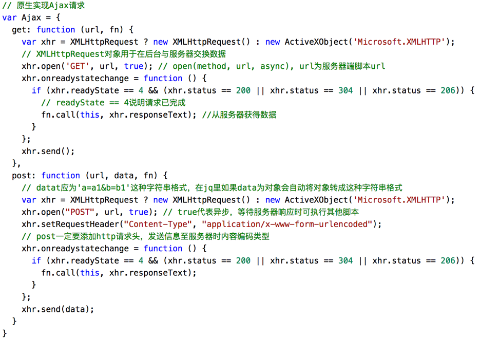
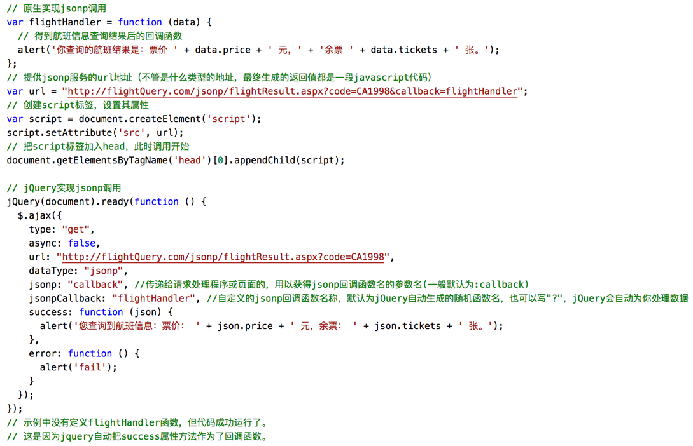
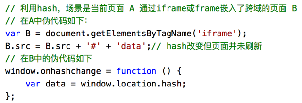
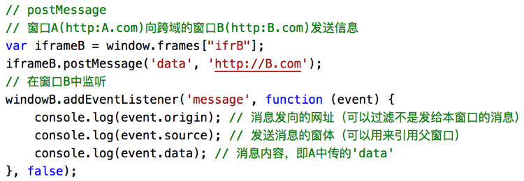
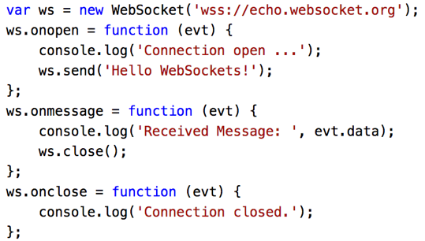

# 跨域通信与同源策略

## 什么是同源策略及限制？
- 只要`协议、域名、端口`有任何一个不同，都被当作是不同的源，即属于不同的域。不是同一个源的文档，不能获取和操作另一个源的文档。
- 注意：http与https也视作不同协议，www.A.com与news.A.com属于子域不同，域名与其对应IP也算不同域名，这都是跨域。
- 限制主要表现在：Cookie、localStorage和IndexDB无法读取；Dom无法获得；Ajax请求不能发送。

## 前后端通信方式
- Ajax：同源下的通信方式
- WebSocket：不受同源策略的限制
- CORS：支持同源也支持不同源通信，也是当前最常用的跨域通信策略
- fetch：Ajax的替代方案，语法简洁语义化，基于标准Promise实现，链式调用，支持async/await
    ```js
    fetch('/some/url', {
        method: 'GET'
    }).then(function(res) {
        // do something
    }).catch(function(err) {
        // error 处理，等价于then的第二个参数，但更直观好用
    })
    ```
#### Ajax与fetch区别

- fetch只对网络请求报错，对400，500都当做成功的请求，需要封装去处理。
- fetch默认在服务端不会发送或接收任何 cookies，如果想要在同域中自动发送cookie，加上`credentials`的`same-origin`选项：
```js
fetch(url, {
  credentials: 'same-origin'
})
// same-origin值使得fetch处理Cookie与XMLHttpRequest类似。 否则，Cookie将不会被发送，导致这些请求不保留认证会话。
```
- fetch没有办法原生监测请求的进度，而XHR可以。

#### 如何创建Ajax？

考察点：XHR对象的工作流程、兼容性处理、事件的触发条件、事件的触发顺序

 

## 常用跨域策略（8种）
现在常用主流方式是 CORS 及 使用代理，当然 JSONP 也是经典的方法。
### 1、CORS（跨域资源共享）
- 支持跨域ajax的通信标准。原理是`浏览器在识别ajax发送了跨域请求的时候，会将其拦截并在http头中加一个origin字段，允许跨域通信`。
- 整个CORS通信过程，都是浏览器自动完成，不需要用户参与。对于开发者来说，CORS通信与同源的AJAX通信没有差别，代码完全一样。浏览器一旦发现AJAX请求跨源，就会自动添加一些附加的头信息，有时还会多出一次附加的请求，但用户不会有感觉。因此，实现CORS通信的关键是服务器。只要服务器实现了CORS接口，就可以跨源通信。

详情跳转传送门：[CORS 跨域资源共享](/Roundtable/Question-Bank/communication/cors)

### 2、服务端代理
- 通过nginx反向代理或者nodejs代理请求，原理就是`服务端是不受浏览器的同源策略限制的`，因此可通过服务端先请求好资源，再从服务端拿来用。
- 在开发环境下可以使用webpack 的 `http-proxy-middleware`中间件，在`devServer配置proxy: config.dev.proxyTable`实现代理跨域。

### 3、JSONP
- JSONP：`利用script标签的异步加载来实现`。所有网站的js的地址和网站域名是不一致的，跨源了但是不影响js的加载。
- JSONP的要点是：**允许客户端传一个callback参数给服务器，然后服务器返回数据时会用这个`callback参数作为函数名，包裹住JSON数据`，返回客户端，客户端执行返回函数**。
- 凡是拥有“src”属性的标签都拥有跨域的能力，如`<script>,,<iframe>`等。
- Jsonp只能发`get请求`。



### 4、Hash
利用的原理是“`hash的变动不会触发页面刷新`”。
具体做法：
1. 主页面A中嵌入iframeB，两个来自不同域；
2. 在主页面A中，将想要传递给B的字段，作为hash，将它与B的url连接起来，然后将B的src设置为连接后的url；
3. 在iframeB中，就可以通过获取自己url的hash值，从而得到主页面传递的值。在iframeB中，通过监听window.onhashchange事件来获取A页面传来的字段。



::: details 补充小知识点：怎么避免自己的页面被iframe嵌套（3种）
1. 在head中设置meta属性 `X-Frame-Options`：
    ```html
    <meta http-equiv="X-Frame-Options" content="SAMEORIGIN / DENY ">
    ```
    - `DENY`：表示该页面不允许在 frame 中展示，即便是在相同域名的页面中嵌套也不允许。
    - `SAMEORIGIN`：表示该页面可以在相同域名页面的 frame 中展示。
    - 另外还有一个选项，ALLOW-FROM uri：表示该页面可以在指定来源的 frame 中展示。
2. 使用JS代码控制
前端检测 top 窗口是否就是 self ：
```js
try {
　　top.location.hostname;
　　if (top.location.hostname != window.location.hostname) {
　　　　top.location.href =window.location.href;
　　}
} catch(e) {
　　top.location.href = window.location.href;
}
```
3. 服务器中设置拦截
配置 nginx 发送 X-Frame-Options 响应头，把下面这行添加到 'http', 'server' 或者 'location' 的配置中:
```
add_header X-Frame-Options SAMEORIGIN
```
:::

### 5、postMessage
HTML5规范中的新方法`window.postMessage()`可以用于安全跨域通信。



### 6、WebSocket
- HTTP 协议有一个缺陷，即通信只能由客户端发起。这对于服务器有连续状态变化的场景，就只能使用低效的“轮询”。
- WebSocket是一种服务器推送技术，支持双向通信，可向客户端推送信息，实时性更强。`没有同源限制，即允许跨域`。协议标识符是`ws`（如果加密，则为wss）。



### 7、document.domain
- 适用于：主域相同子域不同的页面。
- 方法：将这两个页面的document.domain设置为相同的父域名，即可实现不同子域名之间的跨域通信

### 8、window.name
window对象有个name属性，该属性有个特征：即在一个窗口的生命周期内，窗口载入的所有的页面都是共享一个window.name的，每个页面对window.name都有读写的权限，window.name是持久存在一个窗口载入过的所有页面中的。

