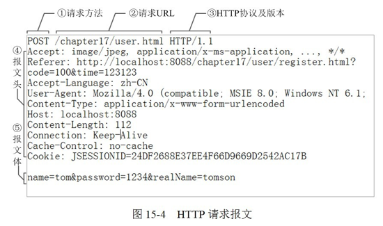
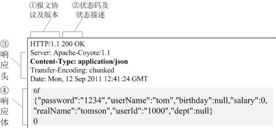

# HTTP 协议

特点：简单快速，灵活，**无连接**，**无状态**

*无状态的意思是其数据包的发送、传输和接收都是相互独立的，无记忆的。无连接的意思是指通信双方都不长久的维持对方的任何信息。*

## HTTP 协议报文组成

### 1. 请求报文组成
- 请求行：http方法、页面url地址、协议/版本；
- 请求头：key-value；
- 空行：分隔符CRLF；
- 请求体；

::: details 常用请求头与响应头
**常用请求头**：
- Accept：代表发送端（客户端）希望接受的数据类型，可以为一个或多个MIME类型的值
- Content-Type：代表发送端（客户端|服务器）发送的实体数据的数据类型
	- application/x-www-form-urlencoded
	- application/json
	- multipart/form-data
	- text/xml
- Cookie：包含sessionId
- Referer：表示这个请求是从哪个URL过来的
- Cache-Control：no-cache
- Connection：keep-alive
- Host：初始URL中的主机和端口
- User-Agent：浏览器类型

**常用响应头**：
- Cache-Control：max-age=3600
- ETag
- Location：
- Set-Cookie：服务端可以设置客户端的Cookie
:::

### 2. 响应报文组成
- 响应行：协议/版本、状态码；
- 响应头：key-value；
- 空行：分隔符CRLF；
- 响应体；

## HTTP 方法
- GET：获取资源
- POST：传输资源
- PUT：更新资源
- DELETE：删除资源
- HEAD：获取报文首部（报文头）

### GET与POST的区别（关注前5点）
1. **GET在浏览器回退时是不会重复提交的，而POST会再次提交请求**；
2. **GET请求会被浏览器主动缓存，而POST不会，除非手动设置**；
3. **GET请求参数会被完整保留在浏览器历史记录中，而POST中的参数不会被保留**；
3. **GET参数通过URL传递，POST放在Request body中**；
5. **GET请求在URL中传参是有长度限制的(一般为2kb)，而POST没有限制**；
6. **get会产生一个tcp数据包，而post产生两个，先发headers响应100 continue，再发data响应200**；
6. GET产生的URL地址可以被收藏，而POST不可以；
7. GET参数直接放在URL中，不能传递敏感信息；
8. GET只能进行url编码，而POST支持多种编码方式。

## HTTP 状态码及常用端口

### 状态码
- 1xx：指示信息
- 2xx：成功
	- 200 OK：客户端请求成功
    - 204 No content：表示请求成功，但响应报文不含实体的主体部分
	- 206 Partial Content：客户端发送带Range头的Get请求，服务器会按照Range截取对应数据返回，通常用于video标签或audio标签请求一个大的视音频文件时，返回range部分
- 3xx：重定向
	- 301 Moved Permanently：永久重定向，所请求的页面已经永久转移至新url
	- 302 Found：临时性重定向，所请求的页面已经临时转移至新的url
		- 303和307是HTTP1.1新加的，它们是对HTTP1.0中的302状态码的细化
		- 303，POST重定向为GET
		- 307，不会把POST转为GET
	- 304 Not Modified：客户端存在缓存并且此缓存未被更改可继续使用
- 4xx：客户端错误
	- 400 Bad Request：客户端请求有语法错误，不能被服务器所理解
    - 401 unauthorized：表示发送的请求缺少身份认证信息
	- 403 Forbidden：对被请求页面的访问被禁止
	- 404 Not Found：请求资源不存在
- 5xx：服务器错误
	- 500 Internal Server Error：服务器错误
	- 503 Server Unavailable：服务器不可用，临时过载宕机，导致请求未完成

#### ajax302重定向跨域问题

**ajax发起的接口请求** 和 **浏览器直接发起的页面访问请求** 有一定区别：
- 浏览器可以通过返回的http状态进行相应的操作，如访问一个页面，此页面3xx重定向时，浏览器可以**获取到重定向后的url，然后把地址栏的url替换，完成重定向动作**。
- ajax的目的就是无刷新的，所以对于服务器端进行了3xx重定向时，ajax会获取到重定向状态值3xx和重定向url，然后再此发送一个新请求去请求重定向url。

因此，如果这个后端接口重定向给的url是另外一个域名的地址，那么此时就会出现**跨域问题**。

**解决方式是**：ajax在第一次得到相应处理后，`主动通过js`做一次`location.href跳转`。**目的是让浏览器去请求重定向的接口而不是ajax**。

### 常用端口
- http 80
- https 443
- DNS 53
- FTP 20 21
- SMTP 25
- POP3 110

## 长连接（持久连接或连接重用）

### 概念
- `http1.1`版本才支持的传输模式；
- HTTP协议采用“请求-应答”模式，分为`普通模式`和`keep-alive`模式这两种模式;
- 当使用`普通模式`时，每个请求/应答，客户端和服务器都要新建一个连接，完成之后立即断开（`HTTP协议为无连接的协议`）。
- 当使用`Keep-alive`模式时（又称`持久连接或连接重用`），keep-alive功能使客户端到服务器端的连接持续有效，当出现对服务器的后继请求时，keep-alive功能`避免了重新建立连接`。
- 注意： keep-alive不会永远保持，它有一个持续时间，一般在服务器中配置（如apache），另外长连接需要客户端和服务器都支持时才有效。

### 从两个层面定义
#### 先看tcp/ip层面的定义：
- 长连接：一个tcp/ip连接上可以连续发送多个数据包，在tcp连接保持期间，如果没有数据包发送，需要双方发检测包以维持此连接，一般需要自己做在线维持（类似于心跳包）
- 短连接：通信双方有数据交互时，就建立一个tcp连接，数据发送完成后，则断开此tcp连接
#### 在http层面的定义：
- `http1.0中，默认使用的是短连接`，也就是说，浏览器每进行一次http操作，就建立一次连接，任务结束就中断连接，譬如每一个静态资源请求时都是一个单独的连接
- `http1.1起，默认使用长连接`，使用长连接会有这一行`Connection: keep-alive`，在长连接的情况下，当一个网页打开完成后，客户端和服务端之间用于传输http的tcp连接不会关闭，如果客户端再次访问这个服务器的页面，会继续使用这一条已经建立的连接

### 什么是管线化
- 持久连接时，某个连接上消息的传递类似于：`请求1-》响应1-》请求2-》响应2-》请求3-》响应3`；
- 持久连接时，管线化是指某个连接上的消息传递类似于：`请求1-》请求2-》请求3-》响应1-》响应2-》响应3`(即打包一次发送多个请求，一次返回多个响应)；
- 管线化是在持久连接的情况下完成的，仅http1.1支持；
- 只有GET和HEAD请求可以进行管线化；
- 管线化不会影响响应到来的顺序；
- 很多代理程序对管线化支持并不好，因此Chrome和FF默认并未开启管线化支持。初次创建连接时不应启动管线机制，因为对方服务器可能不支持。

## HTTP 2.0
http2.0不是https，它相当于是http的下一代规范（譬如https的请求可以是http2.0规范的）。
### http2.0与http1.1的显著不同点：
- http1.1是**一对一**的：`一个tcp/ip请求只能请求一个资源`，由于tcp/ip本身有并发数限制，所以当资源一多，速度就显著慢下来;
- http2.0是**一对多**的：`一个tcp/ip请求可以请求多个资源`，也就是说，只要一次tcp/ip请求，就可以请求若干个资源，分割成更小的帧请求，速度明显提升。

所以，如果http2.0全面应用，很多http1.1中的优化方案就无需用到了（譬如打包成精灵图，静态资源多域名拆分等）。

### http2.0特性
- `多路复用`（即一个tcp/ip连接可以请求多个资源）；
- `首部压缩`（http头部压缩，减少体积）；
- `服务器端推送server push`（服务端可以对客户端的一个请求发出多个响应，可以主动通知客户端）；
- 二进制分帧（在应用层跟传送层之间增加了一个二进制分帧层，改进传输性能，实现低延迟和高吞吐量）；
- 请求优先级（如果流被赋予了优先级，它就会基于这个优先级来处理，由服务器决定需要多少资源来处理该请求）。

## https
- https其实就是身披SSL协议这层外壳的http。https并非是应用层的一种新协议，只是https通信接口部分用 SSL(Secure Socket Layer) 和TLS(Transport Layer Security)协议代替而已。因此https又叫 `HTTP over SSL`, HTTP over TLS。
- https是http的安全版本，譬如一些支付等操作基本都是基于https的，因为http请求的安全系数太低了;
- 简单来看，https与http的**区别**就是：`在请求前，会建立ssl链接，确保接下来的通信都是加密的，无法被轻易截取分析`。
- 一般来说，如果要将网站升级成https，需要后端支持（后端需要申请证书等），然后https的开销也比http要大（因为需要额外建立安全链接以及加密等），所以一般来说http2.0配合https的体验更佳（因为http2.0更快了）。

### http和https的区别
1. https协议需要到CA  （Certificate Authority，证书颁发机构）申请证书，一般免费证书较少，因而需要一定费用。(原来网易官网是http，而网易邮箱是https。)
2. http是超文本传输协议，信息是明文传输，https则是具有安全性的ssl加密传输协议。
3. http和https使用的是完全不同的连接方式，用的端口也不一样，前者是80，后者是443。
4. http的连接很简单，是无状态的。Https协议是由SSL+Http协议构建的可进行加密传输、身份认证的网络协议，比http协议安全。(无状态的意思是其数据包的发送、传输和接收都是相互独立的。无连接的意思是指通信双方都不长久的维持对方的任何信息。)

### CA证书有哪些加密算法

非对称加密 | 对称加密 | 单向加密
|:-----------|:-------------|:-------|
RSA（加解密用一对公私钥，比如git） |         AES（加解密用一个密钥）  |   MD5
非对称加密是客户端用来向服务端传对称加密的密钥的   |    对称加密是用来双方传数据的		 |   略

#### 对称加密和不对称加密的区别
- 「对称加密」加密与解密使用的是同样的密钥，所以速度快，但由于需要将密钥在网络传输，所以安全性不高。
- 「非对称加密」使用了一对密钥（公钥与私钥），所以安全性高，但加密与解密速度慢。

#### CA证书在客户端还是在服务端
服务器端的CA证书包含了非对称加密的公钥和私钥，将只包含公钥的证书发送给客户端。

#### HTTPS采用对称加密+非对称加密的混合方式
- HTTPS只在**证书验证**阶段使用`「非对称加密」`，在之后的**内容传输**阶段使用`「对称加密」`。
- **那为什么一开始用不对称，后面用对称加密呢？**这正是因为二者特点所决定的：
	- 非对称加密的加解密效率是非常低的，对于大量数据交互来说这是无法接受的。
	- 对称加密使用同样的密钥，并需要将密钥在网络传输，不安全。
- 解决方式就是：
	- 客户端，https将**对称加密的密钥**使用`「非对称加密」`的**公钥**进行加密，然后发送出去；
	- 服务端使用`「非对称加密」`的**私钥**进行解密，得到**对称加密的密钥**，然后双方可以使用对称加密来进行信息传输。
	

### https的请求流程
- 客户端发起 HTTPS 请求，服务端返回证书（返回到客户端的证书只有公钥，没有私钥）；
- 客户端对证书进行验证，验证通过后本地生成用于改造对称加密算法的随机数；
- 再通过证书中的公钥（`「非对称加密」`）对随机数进行加密得到`随机数密钥`（也就是对称加密密钥），传输到服务端；
- 服务端接收后，通过私钥解密（`「非对称解密」`）得到`随机数密钥`；
- 之后的数据交互就可以通过`随机数密钥`（也就是对称加密密钥）执行`「对称加密算法」`了。

