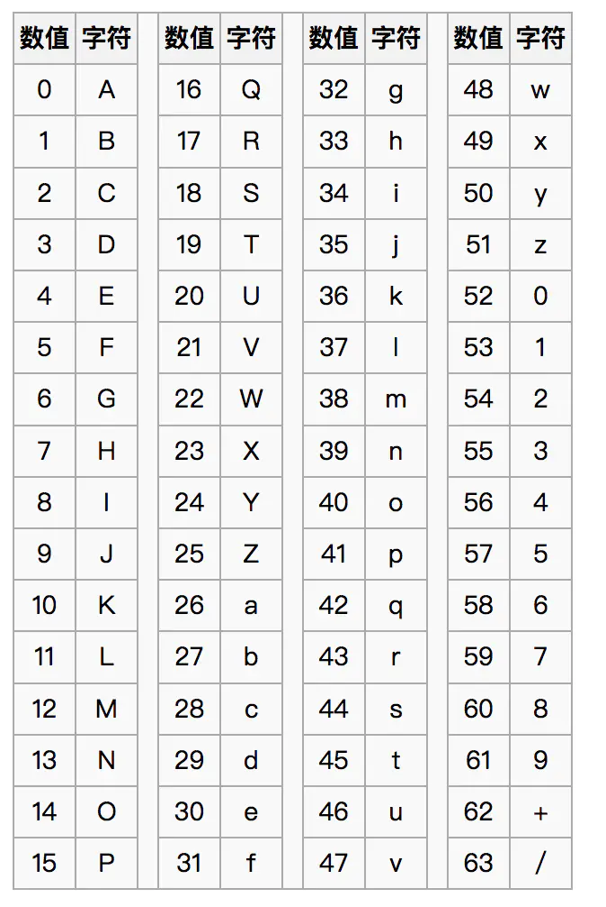
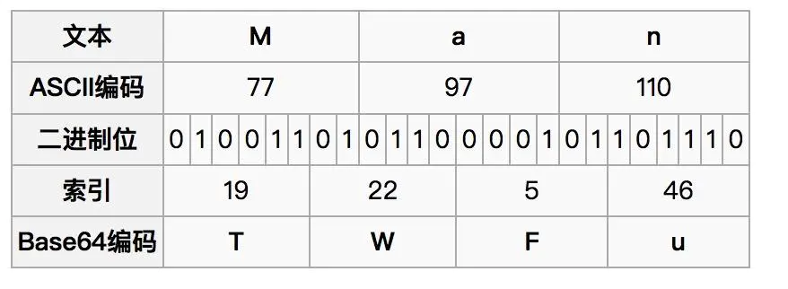

# 文件预览

## Blob、File、FileReader

- 从input onchange中返回的图片对象其实就是一个File对象。
- 而Blob对象是一个用来包装二进制文件的容器，File继承于Blob。
- FileReader用来读取file或blob的文件数据。


### Blob

一个 Blob对象表示一个不可变的，原始数据的类似文件对象。Blob表示的数据不一定是一个JavaScript原生格式。

创建blob对象：
```js
var aBlob = new Blob( array, options );
// array 是一个由ArrayBuffer, ArrayBufferView, Blob, DOMString 等对象构成的 Array，或者其他类似对象的混合体，它将会被放进 Blob。
```

### File

File 接口基于Blob，继承 blob功能并将其扩展为支持用户系统上的文件。通常情况下，File 对象是来自用户在一个`<input>`元素上选择文件后返回的 `FileList对象`，也可以是来自由拖放操作生成的`DataTransfer对象`，继承于Blob。


### FileReader
`FileReader`**用来读取file或blob文件数据**，基于文件大小不同，读取的过程为`异步`。
```js
let render = new FileReader()

render.onload = () => {
    let src = render.result
}

render.readAsDataURL(file)
```
FileReader读取文件方法：
- `readAsDataURL(file)`：**将文件读取为`Data URLs`**
- `readAsBinaryString(file)`：将文件读取为二进制编码
- `readAsBinaryArray(file)`：将文件读取为二进制数组
- `readAsText(file[, encoding])`：按照格式将文件读取为文本，encode默认为UTF-8

## `Blob Url` 和 `Data URLs（base64）`

- `Blob Url`只能在浏览器中通过`URL.createObjectURL(blob)`创建，当不使用的时候，需要URL.revokeObjectURL(blobURL)来进行释放。
    - 可以简单理解为对应浏览器`内存文件中的软链接`。该链接`只能存在于浏览器`单一实例或对应`会话中`（例如：页面的生命周期）
    - `blobURL = URL.createObjectURL(blob)`
    ```
    例如
    blob:http://localhost:8000/xxxxxxxx
    ```
- `Data URLs`可以获取文件的`base64编码`。
    ```
    data:[<mediatype>][;base64],<data>
    ```
    - mediatype是个 MIME 类型的字符串，例如 "image/jpeg" 表示 JPEG 图像文件。如果被省略，则默认值为 text/plain;charset=US-ASCII
    - 可以通过FileReader.readAsDataURL获取
        ```js
        const reader = new FileReader();
        reader.addEventListener("load", e => {
            const dataURL = e.target.result;
        })
        reader.readAsDataURL(blob);
        ```

## 图片预览实现

### 获取图片地址的两种方法
两种方法都可以：
- 通过`URL.createObjectURL(blob)`可以获取当前文件的一个`blob内存url`。
- 通过`FileReader.readAsDataURL(file)`可以获取一段`data:base64的字符串`。

::: details 它们的区别
1. 执行时机
    - `createObjectURL`是**同步执行**（立即的）
    - `FileReader.readAsDataURL`是**异步执行**（过一段时间）
2. 内存使用
    - `createObjectURL`返回一段带hash的url，并且一直**存储在内存中**，直到document触发了unload事件（例如：document close）或者执行revokeObjectURL来释放。
    - `FileReader.readAsDataURL`则返回包含很多字符的base64，并会比blob url**消耗更多内存**，但是在不用的时候会自动从内存中清除（通过垃圾回收机制）
3. 兼容性
    - `createObjectURL`IE10往上
    - `FileReader.readAsDataURL`IE10往上
:::

### 方式1-blobUrl：URL.createObjectURL(blob)
```js
var file = document.getElementById('file')
var img = document.getElementById('img')

file.addEventListener('change', function(){
    var obj = file.files[0]
    var src = window.URL.createObjectURL(obj)
    img.setAttribute('src', src);
})
```

### 方式2-base64：FileReader.readAsDataURL(file) 
```js
var file = document.getElementById('file')
var img = document.getElementById('img')

file.addEventListener('change', function(){
    var obj = file.files[0]
    var reader = new FileReader();
    reader.readAsDataURL(obj);
    reader.onloadend = function() {
        img.setAttribute('src', reader.result);
    }
})
```

## base64

### 作用
Base64编码主要用在：
- 应用于`传输、存储和表示二进制`等领域：
    - 因为在参数传输的过程中经常遇到的一种情况：使用全英文的没问题，但一旦涉及到中文就会出现乱码情况。
    - 网络上传输的字符并不全是可打印的字符，比如二进制文件、图片等。Base64的出现就是为了解决此问题，它是`基于64个可打印的字符来表示二进制的数据的一种方法`。
- 还可以`用来加密`，但是这种加密比较简单，只是一眼看上去不知道什么内容罢了，当然也可以对Base64的字符序列进行定制来进行加密。

### 特点
- 大多数的编码，都是由字符转化成二进制的过程，而从二进制转成字符的过程称为解码。但**Base64恰好相反**，由二进制转到字符称为编码，由字符到二进制称为解码。
- 可以将任意的二进制数据进行Base64编码。
- 所有的数据都能被编码为只用`65`个字符就能表示的文本文件。
- 对文件或字符串进行Base64编码后将比原始大小增加33%。
- 不够安全，但却被很多加密算法作为编码方式。
- 能够逆运算。

**base64索引表:**




### 编码原理


以上图编码**Man**为例：
- 1）将所有`字符`转化为`ASCII码`；
- 2）将`ASCII码`转化为`8位二进制`（即1字节，1byte = 8bit）；
- 3）**3个byte**一组(不足3个在后边补0)**共24位**，再拆分**成4组**，**每组6位**；
- 4）统一在6位二进制前补两个0**凑足8位**；
- 5）将`补0后的二进制`转为`十进制`；
- 6）从Base64编码表获取十进制对应的`Base64编码`；

```
Man     base64编码结果:    TWFu
A       base64编码结果:    QQ==
BC      base64编码结果:    QKM=
```
**注意：**`=`并不在64个索引表字符中，这是因为对于转换结果，必须是4个索引字符一组，如果转换结果不足4个字符，则在末尾需要用填充字符`=`来补。
　　

## 参考链接
- [少侠，留步，图片预览术](https://juejin.im/post/5b890c386fb9a019c771713a#heading-11)
- [H5拍照上传填坑汇总](https://juejin.im/post/5bd705abf265da0a8d36dbdc#heading-10)
- [base64编码原理和过程](https://www.jianshu.com/p/bd4ac318d359)
