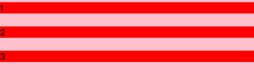

# 盒模型 & 外边距重叠 & BFC

## 盒模型基本概念：标准模型 + IE模型

1. box-sizing: `content-box`（`默认值`，`标准盒模型`）：
 
    - 浏览器默认值为【标准盒模型】。 width 与 height 只包括内容的宽和高， 不包括边框，内边距，外边距。
    - 这意味着：内边距, 边框和外边距都在这个盒子的外部。

2. box-sizing: `border-box` （`IE盒模型`，也叫Quirks`怪异模型`）：
  
    - width 与 height 包括内边距与边框，不包括外边距。这是IE Quirks mode使用的盒模型 。
    - 这意味着，当你设置一个元素为 box-sizing: border-box; 时，此元素的内边距和边框不再会增加它的宽度。这个时候内边距和边框将会包括在盒子中。

## JS如何设置获取盒模型对应的宽和高
1. dom.style.width/height 只能取到内联样式的宽高，取不到样式表和外联样式写的宽高；
2. dom.currentStyle.width/height 拿到最终渲染后的dom的实际宽高，但只有IE支持；
3. `window.getComputedStyle(dom)`.width/height拿到最终渲染后的dom的实际宽高，兼容多浏览器；
4. `dom.getBoundingClientRect()`.width/height/top/left/bottom/right 取到dom渲染后相对于viewport边界的宽高和绝对位置。

## 外边距重叠 margin-collapse

### 根据盒模型解释边距重叠margin-collapse

外边距重叠指的是，当两个垂直外边距相遇时，它们将形成一个外边距。
- 水平margin永远不会重合；
- 设置了overflow属性(visible除外)的元素和它的子元素之间的margin不会重叠；
- 设置了绝对定位（position:absolute）的盒模型，垂直margin不会被重叠，和子元素之间也不重叠；
- 设置了display:inline-block的元素，垂直margin不会重叠，和子元素之间也不重叠；
- 根元素(如html)与body的margin不会重叠。

### 边距重叠三种情况

1. `父子元素边距重叠`，父div的margin-top:30px，子div的margin-top: 10px，取最大值原则，二者重叠后的margin-top: 30px
2. `兄弟元素边距重叠`，上div的margin-bottom: 30px，下div的margin-top: 10px，取最大值原则，上下div的margin间隙为30px
3. `空元素的边距重叠`，一个空div既有margin-top: 10px，也有margin-bottom: 30px，取最大值原则，那么空div的margin上下重合为margin 30px

### 边距重叠的计算规则
1. 两个相邻的外边距`都是正数时`，折叠结果是它们两者之间`较大的值`。
2. 两个相邻的外边距`都是负数时`，折叠结果是两者`绝对值的较大值`。
3. 两个外边距`一正一负时`，折叠结果是两者的`相加的和`。

## BFC(块级格式化上下文)——边距重叠解决方案

### FC（格式上下文）
- `FC即格式上下文，它定义框内部元素的渲染规则`。不同类型的框参与的FC类型不同，块级框对应BFC，行内框对应IFC。相比BFC规则来说，IFC可能更加抽象，但总的来说，它就是行内元素自身如何显示以及在框内如何摆放的渲染规则。
- **注意**：并不是说所有的框都会产生FC，而是符合特定条件才会产生，只有产生了对应的FC后才会应用对应渲染规则。

### BFC是什么：
- 简单来说，BFC 就是一种属性，这种属性会影响着元素的定位以及与其兄弟元素之间的相互作用。
- 具有BFC的元素`可以看作是隔离了的独立容器`，容器里面的元素不会在布局上影响到外面的元素，并且 BFC 具有普通容器没有的一些特性，例如可以包含浮动元素，比如`清除浮动的方法（如 overflow方法）就是触发了浮动元素的父元素为 BFC ，使得它可以包含浮动元素，从而防止出现高度塌陷的问题`。

### BFC原理：
1. 元素的垂直方向的边距margin会发生重叠；
2. `BFC区域不会与浮动元素的box重叠`；
3. `BFC是一个隔离的独立容器，内部与外部的元素是不会相互影响的`；
4. 内部box在垂直方向，一个接一个的放置；
5. `计算BFC高度的时候，浮动元素也会参与计算（不会浮动坍塌）`；

### 如何创建BFC：
1. 浮动元素，float 除 none 以外的值；
2. 绝对定位元素，position 为 absolute 或 fixed；
3. display 为以下其中之一的值 （inline-blocks，flex，inline-flex，table，table-cells，table-captions...)；
4. overflow 除了 visible 以外的值（hidden，auto，scroll）；

### BFC的使用场景(3种)：

#### 场景1：两个或多个块级盒子的垂直相邻边界会重合

**场景**：上下兄弟元素在垂直方向发生外边距重叠，如图1：

**解决**：两个或多个块级盒子的垂直相邻边界会重合，则上述2的上下边距都会与1和3发生重叠，想要避免边距重叠问题，就要引入BFC：当给2增加一个父元素，设置overflow:hidden从而创建BFC以后就可以解决这个问题，`原理是：BFC的内部元素不会影响以外的元素`。

#### 场景2：文档流会在超出左侧浮动区块的区域向左填充

**场景**：向左填充浮动区块以外的区域(灰色部分)，如图1：

**解决**：`原理是：BFC区域不会与浮动元素的box重叠`。

#### 场景3：浮动元素不会参与父元素高度计算（高度塌陷）

**场景**：当子元素是浮动元素时，其不参与父元素的高度计算，如图1：

**解决**：`原理是：BFC元素的子元素即使是浮动的其也会参与高度计算（清除浮动的原理）`。

