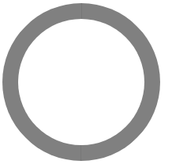
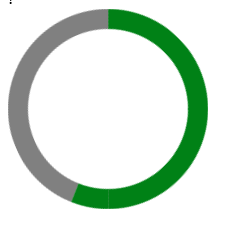

# 用css3写一个环形进度条

## DOM结构
```html
  <body>
    <div class="rect-box">
      <div class="rect left">
        <div class="circle"></div>
      </div>
      <div class="rect right">
        <div class="circle"></div>
      </div>
    </div>
  </body>
```

## 绘制静态图
```css{12,25,26}
      .rect-box {
        width: 200px;
        height: 200px;
        box-sizing: border-box;
        position: relative;
      }
      .rect {
        width: 100px;
        height: 200px;
        box-sizing: border-box;
        position: absolute;
        overflow: hidden;
        top: 0;
      }
      .left {
        left: 0;
      }
      .right {
        right: 0;
      }
      .rect .circle {
        width: 200px;
        height: 200px;
        border: 20px solid black;
        transform: rotate(45deg);
        border-radius: 50%;
        box-sizing: border-box;
        position: absolute;
        top: 0;
        z-index: 3;
      }
      .right .circle {
        border-top: 20px solid grey;
        border-right: 20px solid grey;
        right: 0;
        /* animation: right 5s linear infinite; */
      }
      .left .circle {
        border-bottom: 20px solid grey;
        border-left: 20px solid grey;
        left: 0;
        /* animation: left 5s linear infinite; */
      }
```


注意：
- 实际是一个大200宽高的正方形，包着两个半边矩形rect，rect要设置`overflow：hidden`；
- left rect要设置`下边和左边`border；right rect要设置`上边和右边`border；
- circle旋转`transform: rotate(45deg)`后，再设置`border-radius: 50%`即可组成圆环；

## 加动画
```css{36,42,43}
      .rect-box {
        width: 200px;
        height: 200px;
        box-sizing: border-box;
        position: relative;
      }
      .rect {
        width: 100px;
        height: 200px;
        box-sizing: border-box;
        position: absolute;
        overflow: hidden;
        top: 0;
      }
      .left {
        left: 0;
      }
      .right {
        right: 0;
      }
      .rect .circle {
        width: 200px;
        height: 200px;
        border: 20px solid black;
        transform: rotate(45deg);
        border-radius: 50%;
        box-sizing: border-box;
        position: absolute;
        top: 0;
        z-index: 3;
      }
      .right .circle {
        border-top: 20px solid grey;
        border-right: 20px solid grey;
        right: 0;
        animation: right 5s linear infinite;
      }
      .left .circle {
        border-bottom: 20px solid grey;
        border-left: 20px solid grey;
        left: 0;
        animation: left 5s linear infinite;
        /* 5秒一圈 */
      }
      @keyframes right {
        0% {
          border-left: 20px solid green;
          border-bottom: 20px solid green;
          transform: rotate(45deg);
        }
        50% {
          border-left: 20px solid green;
          border-bottom: 20px solid green;
          transform: rotate(225deg);
        }
        100% {
          border-left: 20px solid green;
          border-bottom: 20px solid green;
          transform: rotate(225deg);
          /* 45+180 */
        }
      }
      @keyframes left {
        0% {
          border-top: 20px solid green;
          border-right: 20px solid green;
          transform: rotate(45deg);
        }
        50% {
          border-top: 20px solid green;
          border-right: 20px solid green;
          transform: rotate(45deg);
        }
        100% {
          border-top: 20px solid green;
          border-right: 20px solid green;
          transform: rotate(225deg);
        }
      }

```


注意：
- animation: right 5s linear infinite，`一圈是5s`；
- keyframe的step设置，那么right的`50%`应该就要到达`终点rotate(225deg)`，而left的`50%`还在`起点rotate(45deg)`;
- 另外，还可以设置渐变色