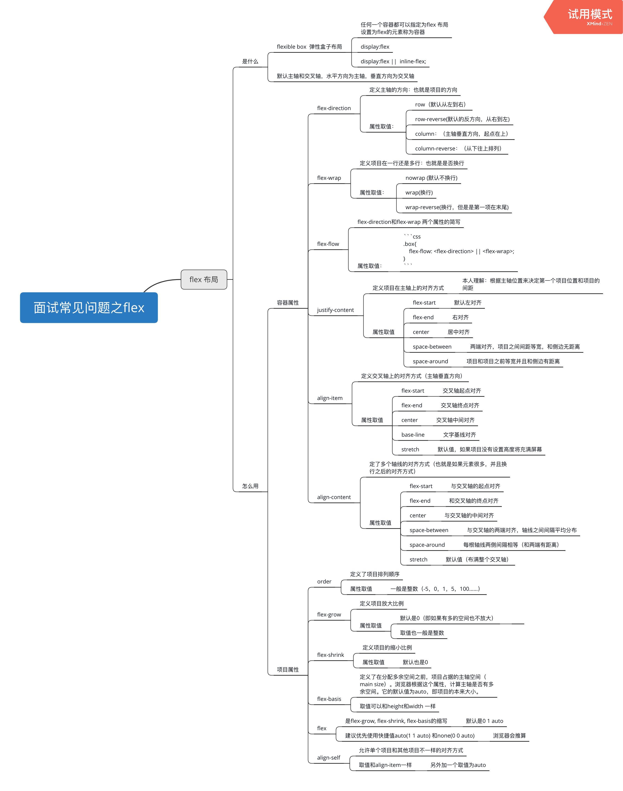
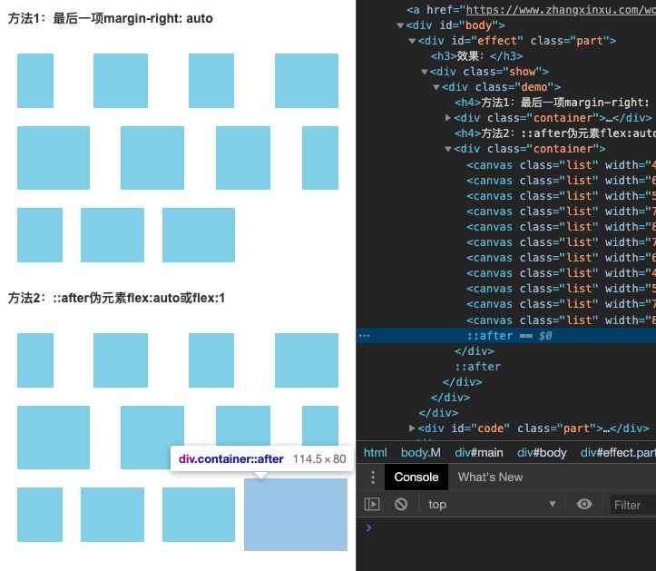

# flex布局知识点整理



### 最后一行左对齐布局

[张鑫旭：让CSS flex布局最后一行列表左对齐的N种方法](https://www.zhangxinxu.com/wordpress/2019/08/css-flex-last-align/)

justify-content属性可以控制列表的水平对齐方式，例如space-between值可以实现两端对齐。

但是，如果最后一行的列表的个数不满，则就会出现最后一行没有完全垂直对齐的问题。


#### 案例：每一行列数是固定的
- 方法一：模拟space-between和间隙

不使用justify-content:space-between声明在模拟两端对齐效果。中间的gap间隙我们使用margin进行控制。
```css
.container {
    display: flex;
    flex-wrap: wrap;
}
.list {
    width: 24%; height: 100px;
    background-color: skyblue;
    margin-top: 15px;
}
.list:not(:nth-child(4n)) {
    margin-right: calc(4% / 3);
}
```

- 方法二：根据个数最后一个元素动态margin

由于每一列的数目都是固定的，因此，我们可以计算出不同个数列表应当多大的margin值才能保证完全左对齐。

例如，假设每行4个元素，结果最后一行只有3个元素，则最后一个元素的margin-right大小是“列表宽度+间隙大小”的话，那最后3个元素也是可以完美左对齐的。

[伪类匹配列表数目实现微信群头像CSS布局的技巧](https://www.zhangxinxu.com/wordpress/2019/03/nth-last-child-css-layout/)
```css
.container {
    display: flex;
    /* 两端对齐 */
    justify-content: space-between;
    flex-wrap: wrap;
}
.list {
    width: 24%; height: 100px;
    background-color: skyblue;
    margin-top: 15px;
}
/* 如果最后一行是3个元素 */
.list:last-child:nth-child(4n - 1) {
    margin-right: calc(24% + 4% / 3);
}
/* 如果最后一行是2个元素 */
.list:last-child:nth-child(4n - 2) {
    margin-right: calc(48% + 8% / 3);
}
```


#### 案例：子元素宽度不固定，最后一行左对齐
```css
.container {
    display: flex;
    justify-content: space-between;
    flex-wrap: wrap;
    width: 500px;
    max-width: 100%;
}
.list {
    background-color: skyblue;
    margin: 10px;
}
/* 方法1 */
.container:nth-of-type(1) > :last-child {
    margin-right: auto;
}
/* 方法2 */
.container:nth-of-type(2)::after {
    content: '';
    flex: auto;    /* 或者flex: 1 */
}
```




#### 案例：每一行列数不固定

使用**足够的空白标签进行填充占位**，具体的占位数量是由最多列数的个数决定的，例如这个布局最多7列，那我们可以使用7个空白标签进行填充占位，最多10列，那我们需要使用10个空白标签。

实现的关键就是占位的`<i>`元素宽度和margin大小设置得和.list列表元素一样即可，其他样式都不需要写：
```html
<style>
.container {
    display: flex;
    justify-content: space-between;
    flex-wrap: wrap;
    margin-right: -10px;
}
.list {
    width: 100px; height:100px;
    background-color: skyblue;
    margin: 15px 10px 0 0;
}
.container > i {
    width: 100px;
    margin-right: 10px;
}
</style>

<div class="container">
    <div class="list"></div>
    <div class="list"></div>
    <div class="list"></div>
    <div class="list"></div>
    <div class="list"></div>
    <div class="list"></div>
    <div class="list"></div>
    <i></i><i></i><i></i><i></i><i></i><i></i>
</div>
```

#### 使用Grid布局

最后一行需要左对齐的布局更适合使用CSS grid布局实现，但是，repeat()函数兼容性有些要求，IE浏览器并不支持。如果项目需要兼容IE，则此方法需要斟酌。

Grid布局天然有gap间隙，且天然格子对齐排布，因此，实现最后一行左对齐可以认为是天生的效果。
```css
.container {
    display: grid;
    justify-content: space-between;
    grid-template-columns: repeat(auto-fill, 100px);
    grid-gap: 10px;
}
.list {
    width: 100px; height:100px;
    background-color: skyblue;
    margin-top: 5px;
}
```


