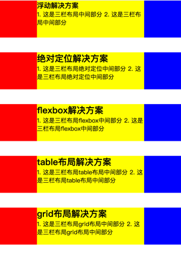

# 多种方式实现三栏布局

> 假设高度已知，请写出三栏布局，其中左栏、右栏宽度各为300px，中间自适应.

## 高度已知时，有哪些方式

#### （1）浮动：
- 缺点：脱离文档流，需要清除浮动，清除不好会导致很多问题；
- 优点：兼容性比较好
#### （2）绝对定位
- 缺点：脱离文档流，导致子元素也必须脱离文档流，因此可使用性较差
- 优点：快捷，不容易出问题
#### （3）flex弹性
- 优点：CSS3中出现，解决了上述两种布局的问题，是较为完美的布局，移动端基本都是flex布局
#### （4）table表格
- 优点：兼容性非常好
- 缺点：比较麻烦；当其中一块的高度超出时，其他同级块的高度也要跟随其变高(非预期的)
#### （5）grid网格
- 优点：比较新出的布局方式，CSS支持的栅格布局，无需再用框架模拟栅格；完成复杂布局的代码量非常少

## 高度未知时，哪些方式还适用

只有`flex弹性布局`与`table表格布局`是在高度超出后其他块的高度也跟随变高，所以适用；

其他布局方案在不改变的情况下是不再适用的：
- 浮动布局是因为中间自适应块的内容在向左浮动的时候，遇到左浮动的块儿被挡住了，当高度超出左边浮动块儿时，就浮动到左边。想要阻止浮动到左边，需要创建BFC；
- 绝对定位无内容撑开时，按照设定min-height；有内容撑开超出最小高度时被内容撑开；
- grid网格布局可设定grid-template-rows: auto使网格高度都跟随内容撑高

## 代码附录：

