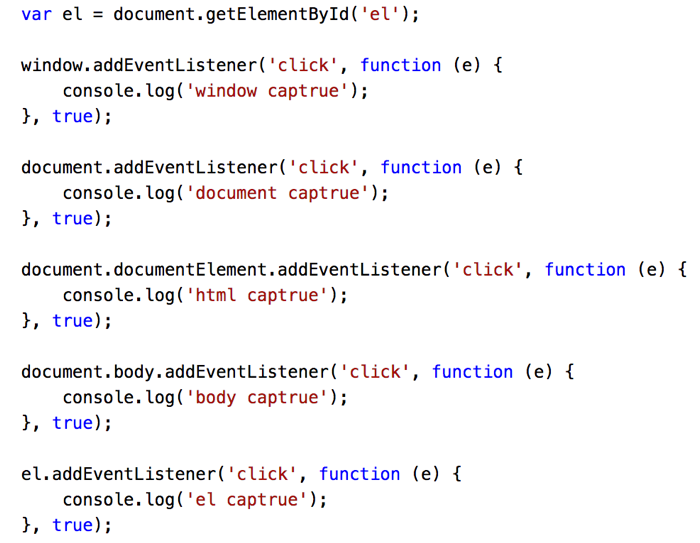
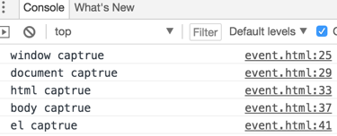
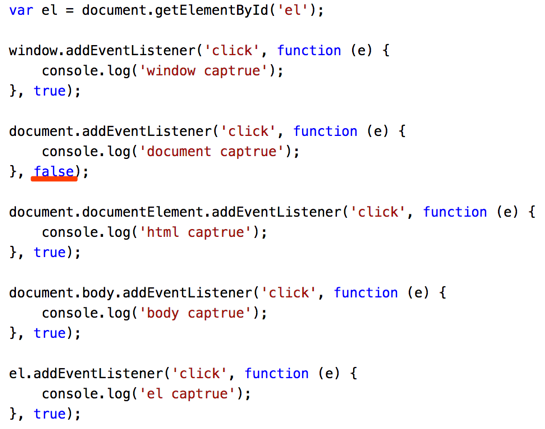
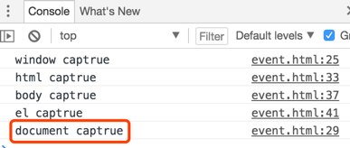

# DOM事件基本概念

## 基本概念：DOM事件的级别
- DOM0：element.onclick = function() {}
- DOM2：element.addEventListener(‘click’, function(){}, false)
- DOM3：element.addEventListener(‘keyup’,function(){}, false)

## DOM事件模型：捕获和冒泡
- `DOM事件流：事件流描述的是从页面中接收事件的顺序`。
- `DOM2级`事件规定的事件流包括 3个阶段：`事件捕获阶段`，`处于目标阶段`和`事件冒泡阶段`。事件捕获为捕获事件提供了机会，然后是实际的目标接收到事件，最后的冒泡阶段对事件作出响应。
- 描述DOM事件捕获的具体流程:
    > window =》document =》html =》body =》… =》目标元素
    >>（document.documentElement返回文档对象（document）的根元素，如 `<html>` 元素）

### 捕获与冒泡演示
- 均在事件捕获阶段触发，因此点击el元素后控制台输出为：




- 将其中比如document元素改为冒泡模式：




> 因此，这对应了DOM2级事件流三个阶段：事件捕获阶段，处于目标阶段和事件冒泡阶段。

## Event对象的常见应用
- event.preventDefault() 阻止默认事件
- event.stopPropagation() 阻止事件冒泡
- event.stopImmediatePropagation() 事件响应优先级（在当前响应函数中使用该方法可以阻止其他响应函数）；
- `event.currentTarget 事件代理中绑定事件的元素`
- `event.target 返回触发事件的目标元素`

## 自定义事件与自定义触发事件
 ```js
var eve = new Event('test'); // new CustomEvent('test)

el.addEventListener('test', function() {
    console.log('test dispatch');
})

setTimeout(function() {
    el.dispatchEvent(eve);
}, 1000)
 ```
- 自定义事件名是test，触发通过el.dispatchEvent(eve);
- 通过Event只能指定事件名，不能增加数据参数;
- CustomEvent相比于Event唯一的区别是，还可以增加数据参数;

## 事件代理是怎么运作的
- 事件代理利用两个js事件特性：事件冒泡、目标元素。
- 使用事件代理的话我们可以把事件处理器添加到一个祖先元素上，等待事件从它的子级元素里冒泡上来，并且可以很方便地判断出这个事件是从哪个元素开始的。
```js
var liList = document.getElementById("list");

liList.addEventListener('click', function(e) {
  if (e.target && e.target.tagName.toLowrCase() === 'li') {
    //需要执行的代码
  }
}, false);
```

