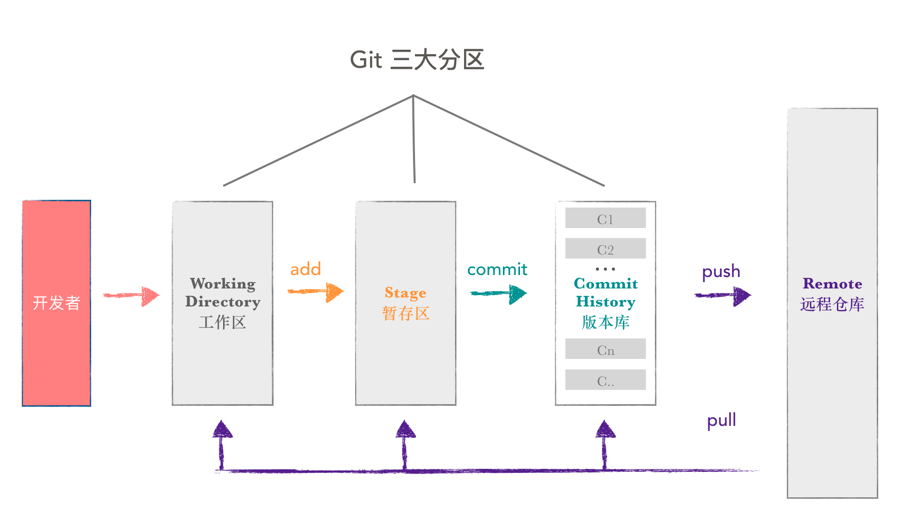

# git基础

## git分区




## git基本操作

### git fetch 和git pull 的差别

`git pull = git fetch + git merge`

#### git fetch
`git fetch`相当于是从远程获取最新到本地，不会自动merge，如下指令：
```
git fetch orgin master //将远程仓库的master分支下载到本地当前branch中
git log -p master  ..origin/master //比较本地的master分支和origin/master分支的差别
git merge origin/master //进行合并
```
也可以用以下指令：
```
git fetch origin master:tmp //从远程仓库master分支获取最新，在本地建立tmp分支  例如git fetch origin esop/withdraw:esop/withdraw-zyc
git diff tmp //將當前分支和tmp進行對比
git merge tmp //合并tmp分支到当前分支
```

#### git pull
`git pull` 相当于是从远程获取最新版本并merge到本地。
```
git pull origin master
```
在实际使用中，git fetch更安全一些

传送门：[详解git pull和git fetch的区别](https://blog.csdn.net/weixin_41975655/article/details/82887273)


