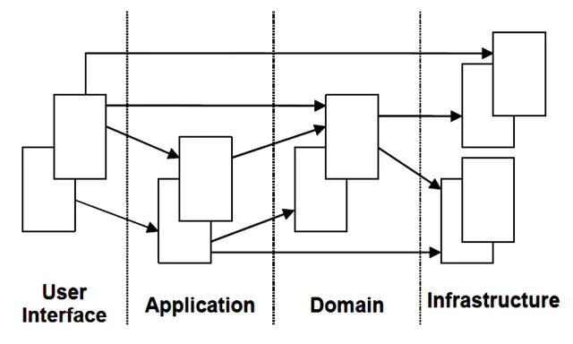

# BFF 中间层

## 什么是 BFF

`BFF（Backend For Frontend）`，即`服务于前端的后端`，简单来说就是**完全面向 UI 展示而设计的服务端 API 接口**，作为前后端之间的适配层，核心是解决数据的聚合与编排。

BFF 其实并不是一个新的概念，其实一直都存在。**服务端接口设计**可概括地分为两类：`面向 UI` or `通用服务`。传统的起到 BFF 作用的 API 是存在于服务端的，这些 API 接口就是 面向 UI 设计的，由服务端同学维护，主要逻辑就是对多个领域接口数据的聚合与编排（当然也有一些不规范的 API 会夹杂后端的业务逻辑）。

## 为什么需要 BFF

为什么需要 BFF，或者说为什么需要把 BFF 单独拆出来呢？

如果 UI（前端/客户端，统称为`端上`）直接调用底层服务（领域服务或基础服务），会造成领域服务或基础服务无法稳定，经常需要跟随 UI 变动。所以每个端必须有 自己对应的 BFF 层。

BFF 存在的`目的`，大致有两点：

1. 提升研发效率，快速响应端上迭代。
2. 隔离 UI 与后端，让后端服务更稳定，更下沉。

::: tip 拓展：应用服务与领域服务

**服务是行为的抽象，通过服务来描述行为**。根据 DDD（Domain-Driven Design，领域驱动架构）的经典分层架构，应用服务属于应用层，领域服务属于领域层。

- 应用层（Application）：负责展现层与领域层之间的协调，协调业务对象来执行特定的应用程序任务。它不包含业务逻辑。
- 领域层（Domain）：负责表达业务概念，业务状态信息以及业务规则，是业务软件的核心。

举个 🌰：比如手机购物，「购物车结算场景」就是一个**应用行为**，而这个应用行为又主要包括「金额计算」、「支付」、「生成订单」，这些子环节就可以理解为一个个**领域行为**。

**可以简单理解为，BFF 中间层就是一个应用层服务。**

应用层通过应用服务接口来暴露系统的全部功能。在应用服务的实现中，它负责编排和转发，它将要实现的功能**委托给一个或多个领域对象**来实现，它本身只负责处理业务用例的执行顺序以及结果的拼装。通过这样一种方式，它隐藏了领域层的复杂性及其内部实现机制。

应用层作为展现层与领域层的桥梁。展现层使用 `VO（视图模型）`进行界面展示，与应用层通过 `DTO（数据传输对象）`进行数据交互，从而达到展现层与 `DO（领域对象）`解耦的目的。

:::

## BFF 应该由谁维护

### 从业务特性角度看

- 端上是业务方（需求方），其对 BFF 层的变动需求，要比服务端多得多，所以将接口的聚合编排从服务端解耦出来，需求和提供完全由端上来完成，就省去了很大部分的协作沟通成本，并且，对于专注于服务下沉的服务端来说，是完全无感的。本着 `“谁用谁维护，谁爽谁负责”` 的原则，这一层应该由端上维护。
- 有同学认为，BFF 层的维护方需要清楚知道服务端具体有哪些能力，哪些领域接口字段，而服务端同学比端上更了解，所以应该由服务端同学维护。这一点上，其实无论端上同学还是服务端同学作为维护者，都会遇到这个问题。领域能力的服务端，必须要将自己的接口字段清楚地提供给 BFF 的维护者，后端同学作为 BFF 维护者，并不比端上同学维护更占优势。

### 从语言特性角度看

- BFF 属于典型的无状态 IO 密集型模块，非常适合吞吐能力巨大的 node.js 开发，用 强类型语言（Java，Go）开发也不会带来什么额外的性能优势。而前端使用的 JavaScript，可以天然上手写 nodejs，语言层面几乎没有学习成本。
- BFF 由于基本上就是做各种对象到对象的翻译，不太会出现难以排查的错误，就算有这样的错误，强类型语言（Java，Go）对避免这种错误也没什么帮助。
- 综上，前端使用 nodejs 维护 BFF 是业界流行的方式。

### 从社会工程学角度看

- 端上接管 BFF 层后，服务端可以安心做微服务化，云服务化，与业务解耦，更专注于基础设施建设、性能方向。
- BFF 层由端上同学维护后，对端上的研发能力提出了更高的要求。由于 UI 层面和 gateway 层面 的技术差异，对于端上同学有一定学习运用成本，这个是要特别关注的。

### 总结

后端开发服务中台，提供通用的领域能力，可以同时给多个业务线提供服务，避免了大公司每个业务线自行开发自己服务的弊端。而端上到后端的适配层是非常 dirty 的一层代码，经常要加入各种特殊处理。由端上同学进行收口开发，可以极大地提升研发效率。

后端向云和基础服务下沉，更好地专注于性能、底层开发优化，而不用疲于应付快速变化的业务逻辑；而前端收口业务开发，供需自理，加快业务迭代效率，是近几年逐渐流行的研发模式。

## 业务场景

BFF 就是各种端（Browser、APP、miniprogram）和后端各种微服务 API 之间的一层胶水代码。这层代码主要的业务场景也比较集中，大多数是请求转发、数据组织、接口适配、鉴权和 SSR。

在「产品需求花样多迭代快」、「多部门合作频繁」等业务场景下，采用大前端的开发模式，会提升业务的迭代效率。

1. 前端和后端都使用 JavasScript，技术栈是统一的。从写代码，到编译、打包、脚手架、组件化、包管理，再到 CI/CD，采用同一套都不是问题。
2. Client Side JavaScript 和 Server Side JavaScript 本身就有很多可复用的代码，例如现在行业里有很多同构代码的 CSR 和 SSR 解决方案。
3. 优化研发组织结构。大前端的开发模式，让接口定义、接口联调、环境模拟等，原来需要两种不同技术能力栈的工程师互相协作的模式，变为同一种技术能力栈的工程师独立完成的模式，让沟通和推动的成本降到最低。

不过对于 nodejs 实现的 BFF 提供业务接口，调用下游领域接口的时需要发送 TCP 请求，而后端提供业务接口调用下游领域接口，一般是走进程通信（时延可忽略不计）而不是网络通信，所以使用 nodejs 的 BFF 会多一跳，不可避免地会增加延时（实测约 50ms）。不过这个延时在某些不是大数据量 toC 的场景下，其实是完全可以接受的。并且，在 BFF 会做些预渲染，SSR 的优化功能，因此 BFF 就不只是一个数据聚合的胶水层那么简单，可以取得额外的收益。

## 搭建 BFF 需要注意的陷阱

### 需要勤治理

正常情况下，新加一个 BFF 层接口，考虑到成本大概率不会新建一个工程，而是在业务组原有的 repo 下新加接口逻辑，长期下去，这个 BFF 项目会愈来愈大，不仅占用服务器资源，前端页面下线后旧的接口不删，时间长了不敢删，互相调用等现象，因此 BFF 层需要非常严格的管控，应该做到一套 BFF 接口与一个前端项目对应，前端项目下线后需要及时将对应的 BFF 接口下线，做到 BFF 层用完即走。总结如下：

- BFF 层接口与特定的前端项目强绑定，禁止相互调用；
- BFF 层接口及时下线，用完即走，严格控制整个 BFF 项目的接口数；
- 公用 SDK、函数更新修改的时候注意影响面；

### 中间层需要基建

BFF 层往往是由前端完成，因此大概率会使用 Node.js 做后端服务框架，而大部分公司 Node.js 基建缺乏，BFF 层与领域服务层一样需要中间件、性能监控、弹性扩容、日志分析等基建，但是却很难适用在 Node.js 框架中，但是如今 Node.js 生态愈来愈繁荣，开源的基建设施也越来越完善，这个问题不再成为不敢用 Node.js 的理由，总的来说，不建议 BFF 层裸奔上线，等基础设施相对完善后，小步慢跑逐步覆盖，稳字当头。

### 前端需要服务端技能

BFF 层是距离用户第二近的一层（最近的是页面层），而 BFF 层与平常的后端服务没有很大的差别，因此前端需要掌握部分服务端的技能，如数据库、负载均衡、缓存等，甚至还需要掌握一些运维知识，如虚拟机、Docker、k8s 等。当然不要求非常熟悉，但是如果完全不了解，那还是不要轻易上 BFF 层。

## 参考链接

- [DDD 理论学习系列（8）-- 应用服务&领域服务](https://www.jianshu.com/p/435939737f5d)
- [BFF 为什么不用 Go，而是 nodeJS？ - imjens 的回答 - 知乎](https://www.zhihu.com/question/354546765/answer/905162989)
- [聊聊我理解的前端 BFF 层](https://www.yuque.com/huajinbo/lxhzqg/yrqmtr#vDgjL)
