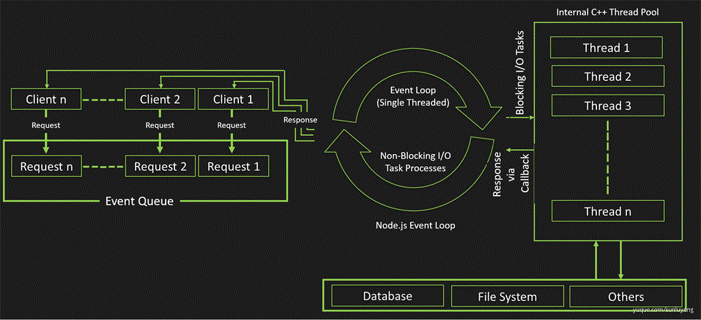

# nodejs 基础

## nodejs 饭店故事

[nodejs 饭店故事 - Node.js : 我只需要一个店小二](https://mp.weixin.qq.com/s?__biz=MzAxOTc0NzExNg==&mid=2665513044&idx=1&sn=9b8526e9d641b970ee5ddac02dae3c57&scene=21#wechat_redirect)

从计算机视角看「nodejs 饭店故事」：

- 店小二：线程
- 顾客：http 请求
- 第一类工作(迎客，找座，下单)：在服务器端的代码，能够快速执行
- 后厨做菜，客人吃饭：耗时的 I/O 操作
- 后厨大喊一声：上菜，这是一个长时间的 I/O 操作完成后所发出的事件
- 客人说：结账，另外一个长时间的 I/O 操作完成后所发出的事件
- 第二类工作(上菜，结账，送客)：同样是能快速执行的代码，但是他们需要等待那些耗时的 I/O 操作完成才能开始，确切的来说，收到了系统发出的事件以后才开始执行。在 Node.js 中实际上是在回调函数中来执行的

1. 下面是 Node.js 服务模式的伪代码：

```js
迎客();
找座();
下单();
后厨处理("做菜完成事件"，function(){
    上菜处理();
    客人吃饭("吃饭完成事件"，function(){
        结账处理();
        送客();
    });
});
```

Node.js 使用的 JavaScript 作为服务器端的编程语言，这种回调的方式对于 javascript 程序员来说，是非常自然的事情，同时从代码的角度来讲，也显得非常清晰。

另外 Node.js 使用 Chrome 的 V8 引擎来执行 javascript，效率非常高。

2. 需要引起注意的是，不能写成如下这样：

```js
迎客();
找座();
下单();
后厨处理("做菜完成事件"，function(){
    上菜处理()；
});

客人吃饭("吃饭完成事件"，function(){
    结账处理();
});

送客();
```

因为 Node.js 执行"后厨处理()"函数时，只是安插了一个匿名的回调函数在那里，并不会等待（非阻塞 I/O），反而马上 会执行“客人吃饭()"函数，所以上述的写法会引起逻辑上的错误：**还没上菜就开始吃饭了**！

所以写惯了”顺序阻塞 I/O“的我们需要改变一下思维方式，进入到`事件驱动的世界`中来。

3. 如果某个操作例如“上菜处理” 是个**CPU 密集型的计算任务**，Node.js 那个唯一的线程就会忙于执行这个计算任务而被阻塞住，就无法响应其他的请求了，带来的后果很严重，整个服务器都无法响应了！这个时候，需要考虑把这样的代码进行异步处理，也变成 node.js 所擅长的事件驱动的方式。

## 什么是 nodejs

### 定义

- Node.js 是一个运行时，可以类比于浏览器，只不过运行在服务端；
- 这个运行时的方言是 ES，之所以不是 JS，是因为不包含 Window、BOM、DOM 等 web API，而是增加了 Stream、global、Buffer、net 等等 nodejs API；
- Node.js 是靠 Chrome V8 引擎运行 ES 的（V8 只实现了 ECMAScript 的数据类型、对象和方法）。

对应到 Java 我们可以理解 Node.js 是 JDK，装上就能在服务端跑 JavaScript 代码了。

接下来介绍 Node 最核心的两个特性：`事件驱动`、`非阻塞 I/O`：

### 非阻塞 I/O

来理解几个概念：

- 阻塞 IO(blocking I/O)
- 非阻塞 IO(non-blocking I/O)
- 同步 IO(synchronous I/O)
- 异步 IO(synchronous I/O)

::: danger 这里肯定有人想问，异步 I/O 和非阻塞 I/O 不是一回事吗？？

异步 I/O 和非阻塞 I/O`根本不是同一回事`，曾经笔者一直天真的以为非阻塞 I/O 就是异步 I/O T_T(直到看见朴灵大神的深入浅出 Node.js)。

:::

::: tip 响水壶的栗子 🌰
老张爱喝茶，废话不说，煮开水。出场人物：老张，水壶两把（普通水壶，简称水壶；会响的水壶，简称响水壶）。

- 1、老张把水壶放到火上，立等水开。（`同步阻塞`）老张觉得自己有点傻
- 2、老张把水壶放到火上，去客厅看电视，时不时去厨房看看水开没有。（`同步非阻塞`）老张还是觉得自己有点傻，于是变高端了，买了把会响笛的那种水壶。水开之后，能大声发出嘀~~~~的噪音。
- 3、老张把响水壶放到火上，立等水开。（`异步阻塞`）老张觉得这样傻等意义不大
- 4、老张把响水壶放到火上，去客厅看电视，水壶响之前不再去看它了，响了再去拿壶。（`异步非阻塞`）老张觉得自己聪明了。

所谓`同步异步`，只是对于水壶而言。普通水壶，同步；响水壶，异步。虽然都能干活，但响水壶可以在自己完工之后，提示老张水开了。这是普通水壶所不能及的。同步只能让调用者去轮询自己（情况 2 中），造成老张效率的低下。

所谓`阻塞非阻塞`，仅仅对于老张而言。立等的老张，阻塞；看电视的老张，非阻塞。情况 1 和情况 3 中老张就是阻塞的，媳妇喊他都不知道。虽然 3 中响水壶是异步的，可对于立等的老张没有太大的意义。所以一般异步是配合非阻塞使用的，这样才能发挥异步的效用。
:::

### 事件驱动

进程如何获知异步 I/O 调用完成，触发回调函数呢？这就要靠 Event Loop 实现，也就是事件驱动。



请求 - 响应模型：

1. 在 `Node.js 中所有操作称之为**事件**`，客户端的请求也是事件，所有事件维护在图中最左侧的`事件队列`中；
2. Node.js 主线程也就是图中间的循环就是 `Event Loop`，主要作用是轮询事件队列中是否存在事件
   1. 有非阻塞事件，按照先进先出原则依次调用处理
   2. 有阻塞事件（_如果在 Event Loop 中包含同步的 CPU 密集操作，就会阻塞主线程_），交给图中最右侧的 `内部 C++ 线程池`处理，线程池处理完成后把结果通过 Event Loop 返回给事件队列
   3. 进行下一次循环
3. 一个请求所有事件都被处理，把响应结果发给客户端，完成一次请求

## Node.js 性能真的高吗？

### 结论

先说结论：**nodejs 在 Web 场景性能高，在其他场景性能确实不高，甚至低下。**

::: tip 常识

- CPU 运算远远快于 I/O 操作
- Web 是典型的 I/O 密集场景
- JavaScript 是单线程，但 JavaScript 的 runtime Node.js 并不是，负责 Event Loop 的 libuv 用 C 和 C++ 编写

:::

谈论性能，主要是讨论`高并发场景`。而很多语言是依赖`多线程`来解决高并发场景的。但这种方式性能并不好，主要有两点：

1. 一个线程处理一条用户请求，处理完成了释放线程，在阻塞 I/O 模型下， I/O 期间该用户线程所占用的 CPU 资源（虽然十分微量，大部分交给了 DMA）什么都不做，等待 I/O，然后响应用户；等待就造成了 CPU 浪费。
2. 开启多个进程/线程，CPU 切换 Context 的时间也十分可观；

类比到上面提到的厨师（I/O）和服务员（CPU），其实就是相当于给每个厨师都配一个服务员，服务员下完单，厨师（I/O）做菜，服务员（CPU）就开始等。不同于现实世界厨师比服务员的薪资更高，数字世界中 CPU 是比 I/O 更宝贵的资源，所以上面的方式虽然能处理高并发场景，但还是造成了 CPU 浪费。

而 `Node.js 在高并发、I/O 密集场景性能高，也就是 Web 场景性能高`，主要也是解决了上面多线程方式的问题，没必要一个厨师配一个服务员，整个饭店说不定一个服务员就够了，剩下的钱可以随便做其它事情。

用户请求来了，CPU 的部分做完不用等待 I/O，交给底层（C++线程池）完成，然后可以接着处理下一个请求了，快就快在

1. `非阻塞 I/O`
2. `Web 场景 I/O 密集`
3. `没多线程 Context 切换开销，多出来的开销是维护 EventLoop`

### 补充两点

- 其实 Node.js 在 I/O 密集的 Web 场景相对于使用**多进程模型语言**有性能优势，这个优势不是来源于语言，而是`操作系统实现`，Java 按照这种模型实现性能一样很高；
- 得益于 V8 的优化和 C/C++ 拓展，Node.js 执行 CPU 密集任务性能并不差，但如果长时间进行 CPU 运算会阻塞后续 I/O 任务发起，用 Java 实现非阻塞模型也会遇到一样问题。

## 基础大纲

参考链接：[为什么 2020 还要学 Node.js](https://www.yuque.com/sunluyong/node/readme)

由于参考文章里已经写的非常好，为了加强掌握只列大纲：

### nodejs 系统

- 模块系统
  - 使用 module.exports 对象导出模块对外接口
  - 使用 require 引入其它模块
    - 模块类型
      - 模块名
      - 文件路径
    - 单次加载 & 循环依赖
  - Node.js 每个文件都是一个模块，模块内的变量都是局部变量，不会污染全局变量，在执行模块代码之前，Node.js 会使用一个如下的函数封装器将模块封装
  - 在 Node.js 中使用 ES Module
    - v12 之前：babel 构建
    ```
    .babelrc
    {
      "presets": [
        ["@babel/preset-env", {
          "targets": {
            "node": "8.9.0",
            "esmodules": true
          }
        }]
      ]
    }
    ```
    - v12 之后：原生支持 ES Module。这样 Node.js 会把 js 文件都当做 ES Module 来处理
      - 1. 开启 --experimental-modules
      - 2. 模块名修改为 .mjs （强烈不推荐使用）或者 package.json 中设置 "type": module
- 调试
- npm & package.json
  - npm
  - yarn
  - package.json
    - name
    - version
    - dependencies & devDependencies
    - peerDependencies
    - repository
    - main

### 基础 API

- Path
  - Windows 与 POSIX 对比
  - path.parse() 方法用来解析文件路径，返回 对应的元信息对象
  - path.format() 方法从对象返回路径字符串，是 path.parse 的反操作
  - path.normalize() 方法规范化给定的 path，解析 .. 和 .
  - path.join() 使用操作系统规定的分隔符将参数中的 path 片段连接，并且规范化
  - path.relative() 方法根据当前工作目录返回 from 到 to 的相对路径
  - path.resolve() 方法将路径或路径片段的序列解析为绝对路径
  - path.basename: 返回 path 最后一部分
  - path.delimiter: 返回操作系统路径界定符，Windows 返回 ; POSIX 返回 :
  - path.dirname: 返回文件目录名
  - path.extname: 返回路径的拓展名（jquery.min.js 拓展名是 .js）
  - path.isAbsolute 检测路径是否是绝对路径
  - path.sep: 返回路径分隔符，Windows 返回 \ POSIX 返回 /
- 事件
  - Node.js 大部分异步操作使用事件驱动，所有可以触发事件的对象都继承了 EventEmitter 类
  - 事件监听
    - on：EventEmitter 实例会维护一个 listener 数组，每次 listener 默认会被添加到数组尾部
    ```js
    const emitter = new EventEmitter();
    emitter.on("foo", () => console.log("a"));
    ```
    - prependListener：添加到 listener 数组头部
    - once：添加一次
  - 事件触发
    - emitter.emit(eventName[, ...args])
    - this 指向
      - this 关键词会被指向 listener 所绑定的 EventEmitter 实例
      - 箭头函数作为监听器时，this 关键词不会指向 EventEmitter 实例
    - 异步调用
      - setImmediate()
      - process.nextTick()
  - 事件卸载
    - off/removeListener
    - removeAllListeners
- process
  - process 对象是一个全局变量，是一个 EventEmitter 实例，提供了当前 Node.js 进程的信息和操作方法
  - 系统信息：process 对象提供了属性用于返回关键系统信息，常用的有
    - title：进程名称，默认值 node，程序可以修改，可以让错误日志更清晰
    - pid：当前进程 pid
    - ppid：当前进程的父进程 pid
    - platform：运行进程的操作系统（aix、drawin、freebsd、linux、openbsd、sunos、win32）
    - version：Node.js 版本
    - env：当前 Shell 的所有环境变量
  - Node.js 和标准输入、输出设备交互对象也通过 process 对象提供
    - stdin & stdout
    - process.stdin.pipe(process.stdout)
  - 执行信息
    - process.execPath：返回执行当前脚本的 Node 二进制文件的绝对路径
    - process.argv：返回一个数组，内容是执行脚本时的参数，但数组前两个固定
    - process.execArgv
  - 常用操作方法
    - process.chdir()：切换工作目录到指定目录
    - process.cwd()：返回运行当前脚本的工作目录的路径，也就是执行 node 命令时候的目录
    - process.exit()：退出当前进程
    - process.memoryUsage()：返回 Node.js 进程的内存使用情况
  - 进程事件
    - exit
    - uncaughtException
    - beforeExit
    - message
    - process.nextTick(callback)：方法将 callback 添加到下一个时间点的队列执行
- 定时器
  - API
    - setTimeout
    - setInterval
    - setImmediate （nodejs 独有）
    - process.nextTick （nodejs 独有）
  - event loop
    - 1. timers：执行 `setTimeout、setInterval` 回调
    - 2. pending callbacks：执行 I/O（文件、网络等） 回调
    - 3. idle, prepare：仅供系统内部调用
    - 4. poll：获取新的 I/O 事件，执行相关回调，在适当条件下把阻塞 node
    - 5. check：`setImmediate` 回调在此阶段执行
    - 6. close callbacks：执行 socket 等的 close 事件回调
    - 日常开发中绝大部分异步任务都是在 timers、poll、check 阶段处理的
    - 为什么 Promise.then 比 setTimeout 早一些
      - 在 Node.js 环境下 microTask 会在每个阶段完成之间调用，也就是每个阶段执行最后都会执行一下 microTask 队列
    - setImmediate VS process.nextTick

### 文件操作

- API 风格
  - 异步方法
    - callback
    - fs promise API
    - promisify
  - 同步方法
    - fs 为大部分方法提供了一个同步版本，命名规则是方法名称后面添加 Sync
- 文件读取
  - fs.readFile
  - fs.open
  - fs.read
  - fs.close
  - fs.createReadStream
- 文件写入
  - fs.writeFile
  - fs.write
  - fs.appendFile
  - fs.createWriteStream
- 文件夹操作
  - fs.Dir
  - fs.Dirent
  - fs.opendir
  - fs.readdir
  - fs.mkdir
  - fs.rmdir
- 监视文件变化
  - fs.FSWatcher
  - fs.watch：监听操作系统提供的事件，而且可以监视目录变化，更高效
  - fs.watchFile：使用轮训方式检测文件变化
  - fs.unwatchFile
  - 社区的优秀方案
    - chokidar
    - node-watch
- 其他常用 API
  - fs.existsSync：判断路径是否存在
    - 异步版本 fs.exists(path, callback) 已经被废弃
    - 最佳实践：不推荐在对文件操作前使用 fs.exists() 检查文件是否存在，应该直接对文件进行操作，如果文件不存在则处理引发的错误
  - fs.access：测试用户文件(夹)权限
  - fs.copyFile：复制文件
  - fs.rename：文件重命名
  - fs.unlink：删除文件
  - fs.chmod：修改文件模式

### Buffer 和 Stream

- Buffer
  - bit 与 Byte
    - 比特，位，1 bit 就是 1 位，64 位操作系统 CPU 一次能处理 2^64 位的数据； - Byte，字节，计量存储或者传输流量的单位，硬盘容量、网速；一个英文字符是一个字节，也就是我们说的 1B，中文字符通常是两个字节（Node.js 中使用三个字节）； - 1 byte = 8 bit - Buffer 处理的是字节。
  - 特点
    - Buffer 类的实例类似于 0 到 255 之间的整型数组。
    - Buffer 是一个 JavaScript 和 C++ 结合的模块，对象内存不经 V8 分配，而是由 C++ 申请、JavaScript 分配。
    - 大小在创建时确定，不能调整。
    - Buffer 对象被内置到全局变量中，无需 require 引入。
  - 实例化 Buffer
    - Buffer.from
    - Buffer.alloc(size [, fill [, encoding]])
    - Buffer.allocUnsafe（避免使用）
    - Buffer.allocUnsafeSlow（避免使用）
  - 操作 buffer
    - Buffer 和 string 转换
    - Buffer 拼接
    - StringDecoder 避免中文乱码
    - Buffer.isBuffer
    - Buffer.isEncoding
    - buf.length
    - buf.indexOf
    - buf.copy
  - Buffer 支持编码
    • ascii
    • utf8
    • utf16le
    • base64
    • binary
    • hex
- Stream
  - 流：是对输入输出设备的抽象，是一组有序的、有起点和终点的字节数据传输手段；
  - 类型：
    - 设备流向程序：readable 可读流
    - 程序流向设备：writable 可写流
    - 双向流动：duplex、transform 双工流
  - 流的操作被封装到 Stream 模块。
  - 而 Unix 的哲学是：一切皆文件：普通文件（txt、jpg、mp4）、设备文件（stdin、stdout）、网络文件（http、net）。Node.js 中对文件的处理多数使用流来完成。

```js
const fs = require("fs");
const rs = fs.createReadStream("./package.json");
const ws = fs.createWriteStream("./package-lower.json");
rs.pipe(lowercase).pipe(ws);
```

- 为什么应该使用 stream？
  - 如果直接操作文件，比如电影这种大文件：
    - 电影文件需要读完之后才能返回给客户，等待时间超长
    - 电影文件需要一次放入内存中，内存吃不消会被打崩
  - 使用 stream 操作文件，用户体验得到优化，同时对内存的开销明显下降
- 可读流
  - 可读流：是生产数据用来供程序消费的流。常见的数据生产方式有读取磁盘文件、读取网络请求内容等
  - process.stdin.pipe(process.stdout);控制台 process.stdin 也是一个可读流
  - 自定义可读流
  - 如何停下来
    - 向缓冲区 push 一个 null
- 为什么是 setTimeout 而不是 setInterval
  - 流的两种工作方式
    - 1. `流动模式`：数据由底层系统读出，并尽可能快地提供给应用程序
    - 2. `暂停模式`：必须显式地调用 read() 方法来读取若干数据块
  - 流在默认状态下是处于暂停模式的，也就是需要程序显式的调用 read() 方法。通过 pipe() 方法可以自动切换成流动模式，这样 read() 方法会自动被反复调用，直到数据读取完毕。
  - 所以每次 read() 方法里面只需要读取一次数据即可，用 setTimeout 而不是 setInterval。
- `流动模式和暂停模式切换`：
  - 流从默认的暂停模式切换到流动模式可以使用以下几种方式：
    1. 通过`添加 data 事件监听器`来启动数据监听
    2. 调用 `resume()` 方法启动数据流
    3. 调用 `pipe()` 方法将数据转接到另一个可写流
  - 从流动模式切换为暂停模式又两种方法：
    1. 在流没有 pipe() 时，调用 `pause()` 方法可以将流暂停
    2. pipe() 时，移除所有 data 事件的监听，再调用 `unpipe()` 方法
- 驱动数据流动的两个机制：
  - **流动模式对应的 `data 事件`**
  - **暂停模式对应的 `read() 方法`**
  - 数据会不会漏掉？
- 可写流
  - write() 方法有三个参数
    - chunk {String| Buffer}，表示要写入的数据
    - encoding 当写入的数据是字符串的时候可以设置编码
    - callback 数据被写入之后的回调函数
  - 自定义可写流
  - 实例化可写流 options
    - objectMode
    - highWaterMark
    - decodeStrings
  - 事件
    - pipe
    - unpipe
    - drain
    - finish
  - back pressure
    - 一般数据读取的速度会远远快于写入的速度，那么 pipe() 方法是怎么做到供需平衡的呢？
      - 可读流有流动和暂停两种模式，可以通过 pause() 和 resume() 方法切换
      - 可写流的 write() 方法会返回是否能处理当前的数据，每次可以处理多少是 highWatermark 决定的
      - 当可写流处理完了积压数据会触发 drain 事件
- 双工流
  - 同时实现了 Readable 和 Writable 的流。即可以作为上游生产数据，又可以作为下游消费数据。
  - 在 NodeJS 中双工流常用的有两种
    - 1. Duplex
    - 2. Transform
    - 重要的区别：Duplex 虽然同时具备可读流和可写流，但两者是相对独立的；Transform 的可读流的数据会经过一定的处理过程自动进入可写流
  - through2：through2 模块可以方便封装一个 Transform 流
  - pipeline：链式调用 pipe() 方法，在管道内传输多个流
