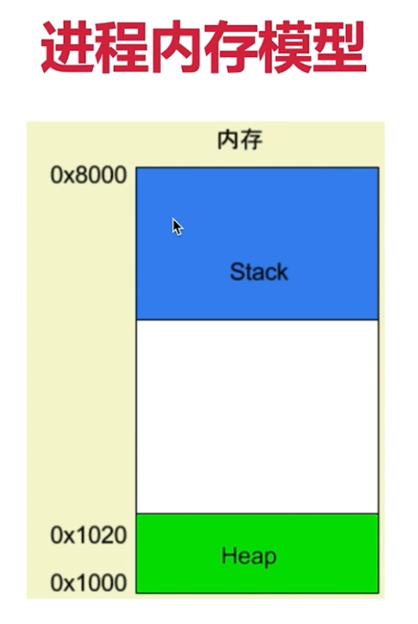

# 慕课实战：Node.js 从零开发 web server博客项目 前端晋升全栈工程师必备

Nodejs 一个js运行环境

运行在服务器，作为web server

运行在本地，作为打包、构建工具


## 困惑

Nodejs运行在服务端，不在浏览器

前端和服务端套路不同

做什么？
- nodejs入门到实战，开发个人博客系统

哪些部分？
- API、数据存储、登录、日志、安全

技术？
- http、stream、session、mysql、redis、nginx、pm2...


原生实现：
- API和数据存储
- 登录和redis
- 安全和日志

使用框架：
- express
- koa2
- 中间件和插件
- 中间件原理

线上环境：
- pm2介绍和配置
- pm2多进程模型
- 服务端运维

### 课程准备

- nodejs和js的区别
- 服务端特点，服务端和前端的区别
- 博客项目的需求分析和技术方案设计


#### 下载安装

使用nvm：brew install nvm

#### nodejs和js的区别

- ES只是一种语法规范，定义了语法。写js和nodejs都必须遵守的，包括变量定义，循环，判断，函数，原型原型链，作用域和闭包，异步。
- 但ES不能操作DOM，不能监听click事件，不能发送ajax请求；不能处理http请求，不能操作文件。

- 而JS是使用了ES的语法规范，外加 Web API，二者缺一不可，相互结合才可完成浏览器端的所有操作。
- JS = ES + Web API
- Web API：DOM操作，BOM操作，事件绑定，Ajax等。。

- 而nodejs是使用了ES的语法规范，外加 nodejs API，二者缺一不可，相互结合才可完成服务器端的所有操作。
- nodejs = ES + nodejs API
- nodejs API：处理http，处理文件等。。


#### commonjs模块化

#### nodejs debugger（vscode）


#### server开发和前端开发的区别

- 服务稳定性
    - server端可能会遭受各种恶意攻击和误操作
    - 单个客户端可以以外挂掉，但是服务端不能
    - 解决：使用pm2做进程守候

- 考虑内存和CPU（优化，扩展）
    - 客户端独占一个浏览器，内存和CPU都不是问题
    - server端要承载很多请求，CPU和内存都是稀缺资源
    - 解决：使用stream写日志（节省CPU和内存），使用redis存session

- 日志记录
    - 前端也会参与写日志，但只是日志的发起方，不关系后续
    - server端要记录日志、存储日志、分析日志，前端不关心
    - 解决：多种日志记录方式，及如何分析日志

- 安全
    - server端随时准备接收各种恶意攻击，前端则少很多
    - 如 越权操作，数据库攻击等
    - 解决：讲解登录验证，预防xss攻击和sql注入

- 集群和服务拆分
    - 产品发展速度快，流量可能会迅速增加
    - 如何通过扩展机器和服务拆分来承载大流量
    - 解决：


## 目标（不用任何框架）

- 开发一个博客系统，具有博客的基本功能
- 值开发server端，不关心前端

- 需求
    - 首页
    - 作者主页
    - 博客详情页
- 登录页
- 管理中心
    - 新建页
    - 编辑页


### 开发接口（不用任何框架）

nodejs处理http请求

搭建开发环境

开发接口（暂时不连接数据库，暂不考虑登录）


### 搭建开发环境

使用nodemon监测文件变化，自动重启node

拆分成4层：
- 1. bin/wwww.js：执行server的设置，createServer，port，listen
- 2. app.js：只是应用基本设置的聚集地，设置返回类型，获取path，解析query，处理路由，处理404，涉及不到业务代码
- 3. src/router：只处理路由，匹配相关路由返回数据格式
- 4. src/controller：只关心数据，筛选处理


接口开发（假数据）


### 数据存储（连数据库）

Q：为何用mysql而不是mogondb？
- mysql是且业内最常用的存储工具，一般都有专人运维
- mysql也是社区内最常用的存储工具
- web server中最流行的关系型数据库

#### 操作数据库

- 建库
    - 创建
    - show Databases
- 建表
    - 常用类型
        - int
        - bigint
        - varchar
        - longtext
- 表操作
    - sql实现增删改查
    ```sql
    select version(); -- 查询版本

    use myblog; -- 使用某个库

    show tables; -- 显示所有表

    insert into users (username, `password`, realname) values ('zhangsan','123','张三'); -- 减减 用来注释
    insert into users (username, `password`, realname) values ('lisi','123','李四'); -- password是sql保留字段，需要反斜杠包裹

    select * from users; -- 实际使用中，要避免全量查找
    select id, username from users;

    select * from users where username='zhangsan' and password='123'; -- 取交集
    select * from users where username='zhangsan' or password='123'; -- 取并集
    select * from users where username like '%zhang%'; -- 模糊匹配
    select * from users where password like '%1%';
    select * from users where password like '%1%' order by id; -- 升序排序
    select * from users where password like '%1%' order by id desc; -- 降序排序

    SET SQL_SAFE_UPDATES=0; -- 设置是否可安全更新，否则更新和删除操作不能成功执行

    update users set realname='李四2' where username='lisi';

    delete from users where username='lisi'; -- 实际工作中不直接使用delete删除
    update users set state='0' where username='lisi'; -- 软删除，通过增加一个state列，1代表可用，0代表不可用，设置为0即为删除

    select * from users where state <> 0 -- <>表示不等于
    ```

#### nodejs操作mysql

nodejs链接mysql，如何执行sql语句

根据NODE_ENV区分配置

封装exec函数，API使用exec操作数据库


不使用框架来做nodejs操作数据库，分为好多层：


### 登录
- 核心：登录校验 & 登录信息存储
- 为何只讲登录，不讲注册？

目录
- cookie 和 session
- session 写入 redis
- 开发登录功能，和前端联调（用nginx反向代理）

### cookie
- 什么是cookie
    - 存储在浏览器中的一段字符串（最大5kb）
    - 跨域不共享
    - 格式如 k1=v1;k2=v2;k3=v3；因此可以存储结构化数据
    - 每次发送http请求，会将请求域的cookie一起发送给server
    - server可以修改cookie并通过http response返回给浏览器
    - 浏览器中也可以通过js修改cookie（有限制）
- 浏览器中查看cookie（3种方式）
    - js查看，修改cookie（有限制）
        - http请求头和响应头
        - application中查看
        - document.cookie
- server端nodejs操作cookie，实现登录验证

```js
// 获取 cookie 的过期时间
const getCookieExpires = () => {
    const d = new Date()
    d.setTime(d.getTime() + (24 * 60 * 60 * 1000))

    return d.toGMTString()
}

// 操作cookie
// cookie生效路由要设为根路由
// cookie 要设置httpOnly，防止客户端操作更改
res.setHeader('Set-Cookie', `username=${data.username}; path=/; httpOnly; expires=${getCookieExpires()}`)
```

### session
- 上一节的问题：会暴露username，很危险
- 如何解决：cookie中存储userId，server端对应username
- 解决方案：session，即server端存储用户信息
    - 设置session方式的问题
        - 目前session直接是js变量，放在nodejs进程内存中（即放在web server中）
        - 1、进程内存有限，访问量过大，内存暴增崩掉怎么办
        - 2、正式线上运行是多进程的，进程之间内存无法共享
            - （多机器，多机房与多进程是一样的，同样内存无法共享）
        - 解决方案：redis内存数据库
            - 什么是redis
                - web server 最常用的缓存数据库，数据存放在内存中
                - 相比于mysql，访问速度快（内存和硬盘不是一个数量级的）
                - 但是成本更高，可存储的数据量更小（内存的硬伤）
            - 解决方案：
                - 将web server和redis拆分为两个单独的服务
                - 双方都是独立的，都是可扩展的（例如都可以扩展成集群）
                - （包括mysql，也是一个单独的服务，也可扩展）
            - 为何session适用redis？
                - session访问频繁，对性能要求极高
                - session可不考虑断电丢失数据的问题（内存的硬伤）
                    - 另外，redis经过特定配置后也能断电不丢失数据
                - session数据量不会太大（相比于mysql中存储的数据）
            - 为何网站数据需要存在mysql，而不适合用redis？
                - 操作频率不是太高（相比于session操作）
                - 断电不能丢失，必须保留
                - 数据量太大，内存成本太高

### Redis使用
```js
brew install redis // mac使用homebrew安装

redis-cli // 开启redis数据库命令行工具

redis-server // 启动redis服务器
```
- nodejs连接redis的demo
- 封装成工具函数，可供API使用


### 登录校验
```js
// 统一的登录验证函数
const loginCheck = (req) => {
    if (!req.session.username) {
        return Promise.resolve(new ErrorModel('尚未登录'))
    }
}

const loginCheckResult = loginCheck(req)
if (loginCheckResult) {
    // 未登录
    return loginCheckResult
}
```

### 和前端联调
- post请求，登录功能依赖cookie，所以不能用postman来联调，必须用浏览器
- cookie跨域不共享，前端和server端必须同域
    - 需要用到nginx做代理，让前后端同域
    - 后端是localhost:8000
    - 前端是localhost:8001（`$ http-server -p 8001`）
    - 使用nginx配置反向代理，localhost:8080

### nginx配置
- 高性能的web服务器，开源免费
- 一般用于做静态服务，负载均衡
- 反向代理

```js
brew install nginx // mac使用homebrew安装

// win: c:\nginx\conf\nginx.conf
// mac: /usr/local/etc/nginx/nginx.conf

// 测试配置文件格式是否正确 nginx -t
// 启动 nginx
// 重启 nginx -s reload
// 停止 nginx -s stop

// location / {
//   proxy_pass http://localhost:8001;
// }
// location /api/ {
//   proxy_pass http://localhost:8000;
//   proxy_set_header Host $host;
// }
```


## 第七章 - 日志（原生实现）

- 日志重要性及分类
    - 系统没有日志，就等于人没有眼睛 —— 抓瞎
        - qps（query per second 每秒访问量）是多少
    - 访问日志 access log（server端最重要的日志）
    - 自定义日志（包括自定义事件、错误记录等）

- 本章目录
    - 日志放在文件中，`nodejs文件操作`，nodejs stream
    - 日志内容开发和使用
    - 日志文件拆分，日志内容分析

- 问题
    - 日志要存储在文件中
        - 为什么不存储到mysql中？
            - mysql是存储表结构的，而日志只是文本，没有结构，且日志作为文件可以拷贝到任何系统中
            - mysql虽然和文件都是硬盘，但mysql使用了b树，访问很快，而日志只需要异步写到文件中即可
        - 为什么不存储到redis中？
            - redis是内存，访问最快，但因为日志很大，成本就太大了
            - 日志的访问对速度要求也并不高，虽然文件访问相对是最慢的，但没关系

### nodejs基本文件操作
```js
const fs = require('fs');
const path = require('path');

// path.resolve 拼接目录
// __dirname 当前目录
const fileName = path.resolve(__dirname, 'data.txt')

// 1. 读取文件内容
fs.readFile(fileName, (err, data) => {
    if (err) {
        console.error(err)
        return
    }
    // data 是二进制类型，需要转换为字符串
    console.log(data.toString()) // 这里的data如果很大，比如有3个G怎么办
})

// 2. 写入文件
const content = '这是新写入的内容\n'

const opt = {
    flag: 'a' // 追加写入。覆盖用 ‘w’
}

fs.writeFile(fileName, content, opt, (err) => { // 每次执行写入操作，也是很耗费内存的，而且如果content很大的话，进程的内存也会崩掉
    if (err) {
        console.error(err)
    } else {
        console.log('写入成功')
    }
})

// 3. 判断文件是否存在
fs.exists(fileName, (exists) => { // 判断操作也是 异步 的
    console.log('exists ',exists)
})
```

### Stream

IO操作的性能瓶颈
- IO包括 “网络IO” 和 “文件IO”
- 相比于CPU计算和内存读写，IO的突出特点就是 “慢”
- 如何在有限的硬件资源下提高IO的操作效率？
    - 使用 stream 提高性能
    - nodejs如何操作

```js
// 标准输入输出，pipe就是管道（符合水流管道的模型图）
// process.stdin（即source） 获取数据，直接通过管道（即pipe），传递给 process.stdout（即dest）
process.stdin.pipe(process.stdout)
```

如下的req.on中的data就是网络IO的数据stream，每传一点就触发on data接收一点，每传一点就触发on data接收一点：
```js
// 处理post请求
const http = require('http')

const server = http.createServer((req, res) => {
    if (req.method === 'POST') {
        console.log('content-type :', req.headers['content-type'])

        let postData = ''
        // 像一个水管一样，监听data的流动，每次获取一部分chunk
        req.on('data', chunk => {
            postData += chunk.toString()
        })
        // 监听data流动结束
        req.on('end', () => {
            console.log('postData :', postData)
            res.end('hello world')
        })
    }
})
```

```js
const http = require('http')
const server = http.createServer((req, res) => {
    if (req.method === 'POST') {
        req.pipe(res) // req 和 res 都具有 stream的一些特性
    }
})
server.listen(8000)
```

使用stream的方式操作文件
```js
// 实现拷贝功能
const fs = require('fs')
const path = require('path')

const fileName1 = path.resolve(__dirname, 'data.txt')
const fileName2 = path.resolve(__dirname, 'data-bak.txt')

// 读取文件的 stream 对象
const readStream = fs.createReadStream(fileName1)
// 写入文件的 stream 对象
const writeStream = fs.createWriteStream(fileName2)

// 通过 pipe 拷贝
readStream.pipe(writeStream)

// 也可以监听每次读取的内容
readStream.on('data', chunk => {
    // 比如可以找个10M的文件看一下，这里读取输出在控制台就是一点点完成的
    console.log(chunk.toString())
})

readStream.on('end', () => {
    console.log('拷贝完成')
})
```

```js
// 通过网络请求读取文件内容
const fs = require('fs')
const path = require('path')
const http = require('http')

const server = http.createServer((req, res) => {
    const method = req.method
    if (method === 'GET') {
        const fileName = path.resolve(__dirname, 'data.txt')
        const stream = fs.createReadStream(fileName) // 文件IO

        stream.pipe(res) // 将 res 作为 stream 的dest，网络IO
    }
})

server.listen(8000)
```

### 写日志
```js
const fs = require('fs');
const path = require('path');

// 写日志
function writeLog(writeStream, log) {
    writeStream.write(log + '\n');
}

// 生成 write stream
function createWriteStream(fileName) {
    const fullFileName = path.join(__dirname, '../', '../', 'logs', fileName);
    const writeStream = fs.createWriteStream(fullFileName, {
        flags: 'a'
    });

    return writeStream;
}

const accessWriteStream = createWriteStream('access.log')
function access(log) {
    writeLog(accessWriteStream, log)
}

module.exports = {
    access
}
```

```js
const serverHandle = (req, res) => {
    // 记录 access log
    access(`${req.method} -- ${req.url} -- ${req.headers['user-agent']} -- ${Date.now()}`)

    // ...
}
```

### 拆分日志 - 使用`crontab`
- 日志内容会慢慢积累，放在一个文件中不好处理
- 按时间划分日志文件，如2019-02-10.access.log
- 实现方式：linux的crontab命令，即定时任务

#### `crontab`
设置**定时任务**，格式：`*****command`，星号依次是 分钟、小时、日期、月份、星期，command是shell命令
- 比如，21*** command 每天的第1个小时的第2分钟去执行command的命令
- 将access.log 拷贝并重命名为2019-02-10.access.log
- 清空access.log文件，继续积累日志
```js
sh copy.sh
```

```js
// 命令行进入crontab任务编辑器
$ crontab -e

// 输入并保存，每天0点执行日志拆分
* 0 * * * sh /Users/johninch/workspace/Imooc/nodejs/nodejs-blog/code-demo/blog-1/src/utils/copy.sh

// 成功后通过如下查看所有的crontab任务
$ crontab -l
```

### 分析日志 - 使用`readline`
- 如针对access.log日志，分析chrome的占比
- 日志是按行存储的，一行就是一条日志
- 使用nodejs的readline（基于stream，效率高）

```js
const fs = require('fs');
const path = require('path');
const readline = require('readline')

const fileName = path.join(__dirname, '../', '../', 'logs', 'access.log');

// 创建 read stream
const readStream = fs.createReadStream(fileName)

// 创建 readline 对象
const rl = readline.createInterface({
    input: readStream
})

let chromeNum = 0
let sum = 0

// 逐行读取
rl.on('line', (lineData) => {
    if (!lineData) {
        return
    }

    sum++

    const arr = lineData.split(' -- ')
    if (arr[2] && arr[2].indexOf('Chrome') > 0) {
        chromeNum++
    }
})

// 监听读取完成
rl.on('close', () => {
    console.log('chrome 占比：' + chromeNum / sum)
})
```


## 第八章 - 安全（原生实现）

1. sql注入：窃取数据库内容
2. XSS攻击：窃取前端的cookie内容
3. 密码加密：保障用户信息安全（重要！）

- server端攻击方式非常多，预防手段也非常多
- 本课只讲解常见的、能通过web server（nodejs）层面预防的
    - 有些攻击需要硬件和服务来支持（需要OP支持），如DDOS攻击


### sql注入
- 最原始、最简单的攻击，从有了web2.0就有了sql注入攻击
- 攻击方式：输入一个sql片段，最终拼接成一段攻击代码
- 预防措施：使用mysql的`escape函数`处理输入内容即可
    - 所有会拼接成sql语句的用户输入变量，都需要使用 `mysql.escape(var1)` 转义


- 比如输入用户名时，故意输入为「zhangsan';delete from users;--」，这样在执行完查询后，会删除users表，非常危险
```sql
select username, realname from users where username='zhangsan';delete from users;' and password=123
```

- 比如输入用户名时，故意输入为「zhangsan'--」，这样之后输入的密码就被注释掉了，则绕过了密码输入
```sql
select username, realname from users where username='zhangsan'-- ' and password=123
```

- escape转义：对username和password都添加escape转义，对比上面语句发现，zhangsan后的单引号前加了反斜杠，则注释不生效
```sql
select username, realname from users where username='zhangsan\'-- ' and password=123
```

### XSS攻击

- 攻击方式：在页面展示内容中掺杂js代码，以获取网页信息
- 预防措施：转换生成js的特殊字符

比如在新建博客时，标题不输入文本而输入一段js代码：
```js
<script>alert(document.cookie)</script>
```
这样在新建成功博客后，获取博客列表时，因为要获取标题展示，而这个博客的标题是上面这段js代码，则浏览器会执行它，把cookie alert出来；并且在该显示标题文本的地方什么也不显示。


#### 安装 xss 依赖，完成转义
```js
// 安装
npm i xss -s

// 使用
const xss = require('xss')

const title = xss(blogData.title)
```

特殊字符转换：特别是尖括号需要转换
```
& -> &amp;
< -> &lt;
> -> &gt;
" -> &quot;
' -> &#x27;
/ -> &#x2F;
```


```js
<script>alert(2)</script>
```
转义后返回的内容是：
```
&lt;script&gt;alert(2)&lt;/script&gt;
```
即输入的js脚本被转成字符串，也就不会执行，并且当前新建的博客标题可以显示为`<script>alert(2)</script>`


### 密码加密

- 攻击方式：获取用户名和密码，再去尝试登录其他系统
- 预防措施：将密码加密，即便拿到密码，也不知道明文
    - 使用nodejs提供的 crypto依赖
    - md5加密

```js
const crypto = require('crypto');

// 密钥
const SECRET_KEY = 'WJiol_8776#' // 随便写的

// md5加密
function md5(content) {
    let md5 = crypto.createHash('md5')
    return md5.update(content).digest('hex')
}

// 加密函数
function genPassword(password) {
    const str = `password=${password}&key=${SECRET_KEY}`
    return md5(str)
}

// 对于每个密码，都通过密钥和md5加密生成了唯一的密文字符串
console.log(genPassword('123')) // 524ab85686df0e52ada43b11b53cce35
console.log(genPassword('abc')) // dfcab4afe9e8b25d53c113b6deb5f429
console.log(genPassword('lsdfsdfsd')) // e3e9956c79530da45415cf3db1216606

module.exports = {
    genPassword
}
```


### 不使用框架开发 server 的最后总结

- 开发了哪些功能模块，完整的流程
    - 功能模块：6部分
        - 处理http接口
        - 连接数据库
        - 实现登录
        - 日志
        - 安全
        - 上线
    - 流程


- 用到了哪些核心的知识点
    - http，nodejs处理http、处理路由，mysql
    - cookie，session，redis，nginx反向代理
    - sql注入，xss攻击，加密
    - 日志，stream，crontab，readline
    - 线上环境的知识点


- 回顾“server和前端的区别”：5个区别
    - 服务稳定性
    - 内存CPU（优化 扩展）
    - 日志记录
    - 安全（包括登录验证）
    - 集群和服务拆分（设计已支持）


## 第九章 - 使用express重构

### 目录

- express下载、安装和使用，express中间件机制
- 开发接口，连接数据库，实现登录，日志记录
- 分析express中间件原理


### 开始

- 安装（使用脚手架 express-generator）
    - npm install express-generator -g
    - express express-test // 初始化项目
        - npm i nodemon cross-env -D
    - npm install & npm start
- 初始化代码介绍，处理路由
    ```js
    tree -CI "node_modules"

    .
    ├── app.js // 应用代码
    ├── bin
    │   └── www // 执行app的服务，http.createServer(require('../app'))
    ├── package-lock.json
    ├── package.json
    ├── public // 静态文件
    │   ├── images
    │   ├── javascripts
    │   └── stylesheets
    │       └── style.css
    ├── routes // 路由
    │   ├── index.js
    │   └── users.js
    └── views // 模板
        ├── error.jade
        ├── index.jade
        └── layout.jade
    ```
    - 之所以有public和views目录，是因为初始化的代码并不只是一个web server的开发环境，而是一个全栈开发环境
- 使用中间件

#### 介绍express的入口代码（app.js）

- 各个插件的作用，思考各个插件的实现原理（结合之前学过的知识）
    - express：
        - var app = express()；本次http请求的实例
        - app.use(express.json())：处理post请求传的json数据，在路由中通过req.body拿到；
        - app.use(express.urlencoded({ extended: false }))：处理post请求传的x-www-form-urlencoded格式数据，塞到req.body中，在路由中使用；
    - http-error：处理404
    - cookie-parser：app.use(cookieParser)，可以在路由中通过req.cookies直接访问
    - morgan：app.use(logger('dev'))，自动生成日志
    - 路由
        ```js
        // 拆分路由
        // 这里设置的是根路径
        app.use('/', indexRouter);
        app.use('/users', usersRouter);
        ```
        ```js
        var express = require('express');
        var router = express.Router();

        /* GET home page. */
        // 这里设置的是子路径
        router.get('/', function(req, res, next) {
            res.render('index', { title: 'Express' });
        });

        module.exports = router;
        ```
        ```js
        var express = require('express');
        var router = express.Router();

        /* GET users listing. */
        // 这里设置的是子路径
        router.get('/', function(req, res, next) {
            res.send('respond with a resource');
        });

        module.exports = router;
        ```


#### express如何处理路由
- 处理get请求和post请求
```js
app.use('/', indexRouter);
app.use('/users', usersRouter);
app.use('/api/blog', blogRouter);
app.use('/api/user', userRouter);
```

```js
var express = require('express');
var router = express.Router();

// '/api/user/login'
router.post('/login', function(req, res, next) {
    const { username, password } = req.body
    res.json({
        errno: 0,
        data: {
            username,
            password
        }
    })
});

module.exports = router;
```

#### express中间件机制

- 所谓中间件，就是app.use、app.get、app.post中的一个个注册函数
- 有很多app.use、app.get、app.post的情况下访问的流转是怎样的？
    - 流转示例：当访问一个路由，比如get方式访问'/api/get-cookie'：
        - 会先匹配app.use没有路由的所有路径
            - 如果调用next()，则向下继续匹配执行
            - 如果没有next()，则停止
        - 之后再匹配所有app.get方法中，所有父路径匹配上的，调用next()向下继续匹配
            - 如果调用next()，则向下继续匹配执行
            - 如果没有next()，则停止
        - 最后匹配所有app.get方法中完全匹配路径的
- 代码中的next参数是什么？
    - 中间件的注册函数有3个参数：(req, res, next)
    - next函数的执行，会进入下一个中间件注册函数
    - 中间件注册函数可以有多个
        - app.get('/api/get-cookie', loginCheck, (req, res, next) => {})

```js
const express = require('express')

// 本次 http 请求的实例
const app = express()

// 所谓中间件，就是app.use、app.get、app.post中的一个个注册函数
app.use((req, res, next) => {
    console.log('请求开始...', req.method, req.url)
    next()
})

app.use((req, res, next) => {
    // 假设在处理 cookie
    req.cookie = {
        userId: 'abc123'
    }
    next()
})

app.use((req, res, next) => {
    // 假设处理 post data
    // 异步
    setTimeout(() => {
        req.body = {
            a: 100,
            b: 200
        }
        next()
    })
})

app.use('/api', (req, res, next) => {
    console.log('处理 /api 路由')
    next()
})

app.get('/api', (req, res, next) => {
    console.log('get /api 路由')
    next()
})
app.post('/api', (req, res, next) => {
    console.log('post /api 路由')
    next()
})

// 模拟登录验证
function loginCheck(req, res, next) {
    setTimeout(() => {
        console.log('模拟登陆失败')
        res.json({
            errno: -1,
            msg: '登录失败'
        })

        // console.log('模拟登陆成功')
        // next()
    })
}

// 中间件注册函数可以有多个
app.get('/api/get-cookie', loginCheck, (req, res, next) => {
    console.log('get /api/get-cookie')
    res.json({
        errno: 0,
        data: req.cookie
    })
})

app.post('/api/get-post-data', loginCheck, (req, res, next) => {
    console.log('post /api/get-post-data')
    res.json({
        errno: 0,
        data: req.body
    })
})

app.use((req, res, next) => {
    console.log('处理 404')
    res.json({
        errno: -1,
        msg: '404 not fount'
    })
})

app.listen(3000, () => {
    console.log('server is running on port 3000')
})
```

所以脚手架生成的app.js这里其实都是中间件：
```js
app.use(logger('dev'));
app.use(express.json());
app.use(express.urlencoded({ extended: false }));
app.use(cookieParser());
app.use(express.static(path.join(__dirname, 'public')));

app.use('/', indexRouter);
app.use('/users', usersRouter);
app.use('/api/blog', blogRouter);
app.use('/api/user', userRouter);
```

### express开发博客项目


#### express开发接口

初始化项目，复用之前的部分代码

开发路由，并实现登录

记录日志


初始化环境

安装插件 mysql xss
mysql controller resModel 相关代码可以复用
初始化路由

#### express处理session
- 安装 express-session
- req.session 保存登录信息，登录校验做成express中间件


#### express处理redis（session连接redis）
- 安装 redis
- 安装 connect-redis

```js
var session = require('express-session');
var RedisStore = require('connect-redis')(session);

const blogRouter = require('./routes/blog');
const userRouter = require('./routes/user');

var app = express();

app.use(logger('dev'));
app.use(express.json());
app.use(express.urlencoded({ extended: false }));
app.use(cookieParser());

const redisClient = require('./db/redis');
const sessionStore = new RedisStore({
  client: redisClient
})
app.use(session({
  secret: 'WJiol_3476#',
  cookie: {
    // path: '/', // 默认
    // httpOnly: true, // 默认
    maxAge: 24 * 60 * 60 * 1000
  },
  store: sessionStore
}))
```

#### 登录中间件

#### 开发路由

#### 日志（morgan）

```js
const ENV = process.env.NODE_ENV
if (ENV !== 'production') {
  // 开发环境
  app.use(logger('dev', {
    stream: process.stdout // 打印在控制台，其实这是默认配置
  }));
} else {
  // 线上环境
  const logFileName = path.join(__dirname, 'logs', 'access.log')
  const writeStream = fs.createWriteStream(logFileName, {
    flags: 'a'
  })
  app.use(logger('combined', {
    stream: writeStream
  }));
}
```

#### 总结

- 写法上的改变，如 req.query，res.json
- 使用 express-session，connect-redis，登录中间件
- 使用 morgan


#### express中间件原理

- 回顾中间件使用
    - app.use：用来注册中间件，先收集起来
    - 遇到http请求，根据path和method判断触发哪些
    - 实现next机制，即上一个通过next触发下一个
    - app.listen
- 分析如何实现
- 代码实现
```js
const http = require('http');
const slice = Array.prototype.slice;

class LikeExpress {
    constructor() {
        // 存放中间件列表
        this.routes = {
            all: [], // app.use(...)
            get: [], // app.get(...)
            post: [], // app.post(...)
            // put: [],
            // patch: [],
            // delete: [],
        }
    }

    register(path) {
        const info = {}
        if (typeof path === 'string') {
            info.path = path
            // 从第二个参数开始，转换为数组，存入 stack
            info.stack = slice.call(arguments, 1)
        } else {
            info.path = '/'
            // 从第一个参数开始，转换为数组，存入 stack
            info.stack = slice.call(arguments)
        }

        return info
    }

    use() {
        const info = this.register.apply(this, arguments)
        this.routes.all.push(info)
    }

    get() {
        const info = this.register.apply(this, arguments)
        this.routes.get.push(info)
    }

    post() {
        const info = this.register.apply(this, arguments)
        this.routes.post.push(info)
    }

    match(method, url) {
        let stack = []
        if (url === '/favicon.ico') {
            return stack
        }

        // 获取 routes
        let curRoutes = []
        curRoutes = curRoutes.concat(this.routes.all)
        curRoutes = curRoutes.concat(this.routes[method])

        curRoutes.forEach(routeInfo => {
            if (url.indexOf(routeInfo.path) === 0) {
                // 以下都是匹配的情况
                // url === '/api/get-cookie' 且 routeInfo.path === '/'
                // url === '/api/get-cookie' 且 routeInfo.path === '/api'
                // url === '/api/get-cookie' 且 routeInfo.path === '/api/get-cookie'
                stack = stack.concat(routeInfo.stack)
            }
        })
        return stack
    }

    // 核心的 next 机制
    handle(req, res, stack) {
        const next = () => {
            // 拿到第一个匹配的中间件
            const middleware = stack.shift()
            if (middleware) {
                // 执行中间件函数
                middleware(req, res, next)
            }
        }
        next()
    }

    callback() {
        return (req, res) => {
            // 需要定义下 res.json 函数
            res.json = (data) => {
                res.setHeader('Content-Type', 'application/json')
                res.end(
                    JSON.stringify(data)
                )
            }
            // 通过url和method来匹配中间件list
            const url = req.url
            const method = req.method.toLowerCase()

            // 中间件list
            const resultList = this.match(method, url)
            this.handle(req, res, resultList)
        }
    }

    listen(...args) {
        const server = http.createServer(this.callback())
        server.listen(...args)
    }
}

// 工厂函数
module.exports = () => {
    return new LikeExpress()
}
```


## 第十章 - 使用koa2重构

### koa2相比于express

- 相对于express中间件是异步回调，koa2原生支持 async/await
- 新开发框架和系统，都开始基于koa2，例如egg.js
- express虽然未过时，但koa2肯定是未来趋势

### 目录

- async/await 语法介绍，安装和使用koa2
- 开发接口，连接数据库，实现登录，日志记录
- 分析koa2中间件原理

### 介绍koa2

koa2是express原班人马打造的轻量级框架，之前有一版koa，是用generator语法实现的，并不好用，koa2原生支持async/await。

- npm install koa-generator -g // 安装
- Koa2 my-program // 初始化

#### 介绍koa2的入口代码（app.js）

- 各个插件的作用，思考各个插件的实现原理（结合之前学过的知识）
    - koa2：
        - const app = new Koa()；本次http请求的实例
        - const json = require('koa-json')；
            - app.use(json())：处理post请求传的json数据，在路由中通过req.body拿到；
        - const bodyparser = require('koa-bodyparser')
        - app.use(bodyparser({
                enableTypes:['json', 'form', 'text']
            }))
            - 在路由中通过ctx.request.body拿到；
    - const onerror = require('koa-onerror')
    - cookie-parser：app.use(cookieParser)，可以在路由中通过req.cookies直接访问
    - const logger = require('koa-logger')；只是使控制台输出更加好看而已
        - 生成日志还是需要使用 koa-morgan


#### koa2如何处理路由
- 处理get请求和post请求
```js
const router = require('koa-router')()

router.prefix('/api/blog')

router.get('/list', async function (ctx, next) {
    const query = ctx.query
    ctx.body = {
        errno: 0,
        query,
        data: ['获取博客列表']
    }
})

module.exports = router
```
```js
const router = require('koa-router')()

router.prefix('/api/user')

router.post('/login', async function (ctx, next) {
    const { username, password } = ctx.request.body
    const query = ctx.query
    ctx.body = {
        errno: 0,
        username,
        password
    }
})

module.exports = router
```

#### koa2中间件机制

- 所谓中间件，就是app.use、app.get、app.post中的一个个注册函数（async函数）
- 有很多app.use、app.get、app.post的情况下访问的流转是怎样的？
    - 流转示例：当访问一个路由，比如get方式访问'/api/get-cookie'：
        - 会先匹配app.use没有路由的所有路径
            - 如果调用 await next()，则向下继续匹配执行
            - 如果没有 await next()，则停止
        - 之后再匹配所有app.get方法中，所有父路径匹配上的，调用 await next() 向下继续匹配
            - 如果调用 await next()，则向下继续匹配执行
            - 如果没有 await next()，则停止
        - 最后匹配所有app.get方法中完全匹配路径的
- 代码中的next参数是什么？
    - 中间件的注册函数有2个参数：(ctx, next)
    - next函数的执行，会进入下一个中间件注册函数
    - 中间件注册函数可以有多个
        - app.get('/api/get-cookie', loginCheck, (ctx, next) => {})
```js
// logger
app.use(async (ctx, next) => {
  const start = new Date()
  await next()
  const ms = new Date() - start
  console.log(`${ctx.method} ${ctx.url} - ${ms}ms`)
})
```

#### koa2开发接口

- 实现登录
    - 和express类似，基于 koa-generic-session 和 koa-redis
        ```js
        app.keys = ['WJiol_3476#']
        app.use(session({
            // 配置cookie
            cookie: {
                // path: '/', // 默认
                // httpOnly: true, // 默认
                maxAge: 24 * 60 * 60 * 1000
            },
            // 配置redis
            store: redisStore({
                all: `${REDIS_CONF.host}:${REDIS_CONF.port}`
            })
        }))
        ```
- 开发路由
    - 复用之前代码，如mysql，登录中间件，controller，model
    - 初始化路由，并开发接口
    - 联调测试
- 记录日志
    - access log 记录，使用morgan
    - 自定义日志使用console.log和console.error


#### koa2中间件原理

*koa2中间件本身没有路由功能，只有app.use*

- 回顾中间件使用
    - 洋葱圈模型：
    ```
    第一层洋葱 - 开始
    第二层洋葱 - 开始
    第三层洋葱 - 开始
    第三层洋葱 - 结束
    第二层洋葱 - 结束
    GET / - 4ms
    第一层洋葱 - 结束
    ```
    ```js
    const Koa = require('koa');
    const app = new Koa();

    // logger
    app.use(async (ctx, next) => {
        console.log('第一层洋葱 - 开始')
        await next();
        const rt = ctx.response.get('X-Response-Time');
        console.log(`${ctx.method} ${ctx.url} - ${rt}`);
        console.log('第一层洋葱 - 结束')
    });

    // x-response-time
    app.use(async (ctx, next) => {
        console.log('第二层洋葱 - 开始')
        const start = Date.now();
        await next();
        const ms = Date.now() - start;
        ctx.set('X-Response-Time', `${ms}ms`);
        console.log('第二层洋葱 - 结束')
    });

    // response
    app.use(async ctx => {
        console.log('第三层洋葱 - 开始')
        ctx.body = 'Hello World';
        console.log('第三层洋葱 - 结束')
    });

    app.listen(8000);
    ```
- 分析如何实现
    - app.use 用来注册中间件，先收集起来
    - 实现next机制，即上一个通过next触发下一个
    - （因为koa2中间件本身没有路由功能，所以不涉及到 method 和 path 的判断）
- 代码实现
    ```js
    const http = require('http')

    // 组合中间件
    function compose(middlewareList) {
        return function(ctx) {
            // 中间件调用
            function dispatch(i) {
                const fn = middlewareList[i]
                try {
                    // 使用Promise.resolve包裹，是因为可能中间件函数fn传入的不是promise
                    return Promise.resolve(
                        fn(ctx, dispatch.bind(null, i + 1)) // next机制
                    )
                } catch (error) {
                    return Promise.reject(error)
                }
            }
            return dispatch(0)
        }
    }

    class LikeKoa2 {
        constructor() {
            this.middlewareList = []
        }

        use(fn) {
            this.middlewareList.push(fn)
            return this
        }

        createContext(req, res) {
            const ctx = {
                req,
                res
            }
            ctx.query = req.query
            return ctx
        }

        handleRequest(ctx, fn) {
            return fn(ctx)
        }

        callback() {
            const fn = compose(this.middlewareList)

            return (req, res) => {
                const ctx = this.createContext(req, res)
                return this.handleRequest(ctx, fn)
            }
        }

        listen(...args) {
            const server = http.createServer(this.callback())
        }
    }

    module.exports = LikeKoa2
    ```


## 第十一章 线上环境配置

- 服务器稳定性
- 充分利用服务器硬件资源，以便提高性能
- 线上日志记录

### PM2的核心价值

- `进程守护`，系统崩溃自动重启
- `启动多进程`，充分利用CPU和内存
- 自带`日志记录功能`

### 目录

#### PM2介绍

- 和nodemon的区别
    - pm2是后台运行监听服务的，可以把命令行的权限再交还给前台
    - nodemon是前台运行监听服务的，始终占用命令行
- 下载安装：npm i pm2 -g;
    - `pm2 --version`
- 常用命令：
    - `pm2 start <AppName>/configFile`
        - 启动之后会把控制台控制权限交还给使用者
    - `pm2 list`
    - `pm2 restart <AppName>/id`
    - `pm2 stop <AppName>/id`
    - `pm2 delete <AppName>/id`
    - `pm2 info <AppName>/id`
    - `pm2 log <AppName>/id`
    - `pm2 monit <AppName>/id` // 监控内存占用信息

#### PM2进程守护

- node app.js 和 nodemon app.js，进程崩溃则不能访问
- pm2 遇到进程崩溃，会自动重启

#### PM2配置和日志记录

- 新建 pm2配置文件（包括进程数量，日志文件目录等）
    - name：进程名称
    - script：配置文件所执行的应用入口文件
    - watch：代码改动是否监听重启
    - err_file：错误日志输出地址
    - out_file：输出日志输出地址
    ```json
    {
        "apps": {
            "name": "pm2-test-server",
            "script": "app.js",
            "watch": true,
            "ignore_watch": [
                "node_modules",
                "logs"
            ],
            "err_file": "logs/err.log",
            "out_file": "logs/out.log",
            "log_date_format": "YYYY-MM-DD HH:MM:ss",
            "instances": 4,
        }
    }
    ```
- 修改 pm2启动命令，重启
    ```json
    "scripts": {
        "test": "echo \"Error: no test specified\" && exit 1",
        "dev": "cross-env NODE_ENV=dev nodemon app.js",
        "prd": "cross-env NODE_ENV=production pm2 start pm2.conf.json"
    },
    ```
- 访问 server，检查日志文件的内容（日志记录是否生效）


#### PM2多进程

为什么使用多进程？
- 回顾之前讲session时说过，操作系统限制一个进程的内存
- 内存：无法充分利用机器全部内存
- CPU：无法充分利用多核CPU的优势


多进程和redis
- 多进程之间，内存无法共享
- 多进程访问一个redis，来实现数据共享
```json
"instances": 4,
```
配置进程数量，多个进程开启后，mode为cluster集群模式，服务器会通过负载均衡规则，将当前请求派发到空闲的服务器进程上去。


